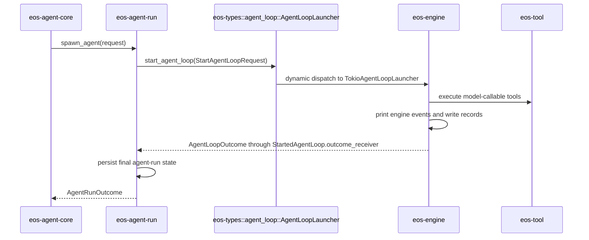

# Phase 04 - eos-engine and eos-agent-run Spec

Status: Draft
Date: 2026-06-09
Owner: eos-engine / eos-agent-run

Revision 2026-06-09 (naming convention pass): aligned the target vocabulary with
Phase 03B and the current agent-core naming rules. The loop-launch contract lives
in `eos-types::agent_loop`, not an internal `*ports` crate; record writes consume
`AgentRunRecordTarget`; run creation uses `spawn.rs` / `spawn_agent`
vocabulary; provider streaming uses `ProviderStreamSource`; event observation
uses `EngineEventSink`; printing uses `EngineEventPrinter`; and the names-to-avoid
table gives concrete replacements for stale `*Service`, callback, hook, and
dependency-bag names.

## Scope

This phase makes `eos-engine` execution-only and `eos-agent-run` lifecycle-only.

The engine keeps the agent loop, turn execution, event emission, engine event
printing, records, and background accounting. The run crate keeps
spawn/wait/poll/cancel/finalization and durable agent-run state updates.

`eos-agent-run` must not depend directly on `eos-engine`. The shared loop launch
contract lives in `eos-types::agent_loop`; `eos-engine` implements that contract
with a concrete launcher, and `eos-agent-core` wires the concrete launcher into
`AgentRunService` at runtime composition. Do not create a new internal port
crate for this contract; `eos-sandbox-port` remains the explicit port-crate
exception.

Prerequisite: Phase 03B must define and implement the durable
request/task/workflow/agent-run lineage contract before this phase moves
record writing into `eos-engine` or splits run lifecycle from loop
execution. Phase 04 consumes `AgentRunRecordIndex` and
`AgentRunRecordTarget`; it does not redesign DB materialization.

## Local Architecture

### eos-engine

`eos-engine` owns:

- full agent loop execution,
- assistant turn execution,
- provider stream consumption,
- batch tool dispatch,
- concrete `AgentLoopLauncher` implementation,
- engine events,
- engine event printing,
- record writing for loop-visible events,
- background session accounting and notifications.

`eos-engine` does not own:

- concrete tool families,
- tool registry definitions,
- loop launch contract traits or DTOs consumed by `eos-agent-run`,
- agent-run lifecycle rows,
- request runtime wiring,
- external API facades.

### eos-agent-run

`eos-agent-run` owns:

- starting an agent run,
- process-local active-run map,
- waiting for run completion,
- polling run completion,
- cancellation,
- final lifecycle handoff from engine outcome,
- agent-run persistence updates.

`eos-agent-run` does not own:

- engine turn execution,
- direct `eos-engine` imports,
- tool behavior,
- model-facing `ToolResult` rendering,
- message event interpretation,
- request runtime wiring.

## Dependency Shape

The target dependency shape for this phase is:

```text
eos-agent-run   -> eos-types
eos-engine      -> eos-types, eos-tool, eos-llm-client, eos-sandbox-port
eos-agent-core  -> eos-agent-run, eos-engine, eos-tool, eos-workflow,
                   eos-db, eos-llm-client, eos-sandbox-port
```

`eos-agent-run` consumes `dyn AgentLoopLauncher`; it does not name
`TokioAgentLoopLauncher`, `AgentLoopExecutor`, or any other concrete engine type.
`eos-agent-core` is the composition root that constructs the concrete engine
launcher and passes it into `AgentRunService`.

## Resulting File Structure

Phase 04 optimizes for the cleanest end state instead of the smallest
rename/move. This target keeps provider-stream concerns, engine events,
tool-call scheduling, records, and background lifecycle accounting as separate
ownership groups.

```text
agent-core/crates/eos-engine/
├── Cargo.toml
├── src/
│   ├── lib.rs
│   ├── error.rs
│   ├── agent_loop/
│   │   ├── mod.rs
│   │   ├── launcher.rs
│   │   ├── executor.rs
│   │   ├── state.rs
│   │   └── turn.rs
│   ├── provider_stream/
│   │   ├── mod.rs
│   │   ├── source.rs
│   │   └── messages.rs
│   ├── tool_call/
│   │   ├── mod.rs
│   │   ├── batch.rs
│   │   ├── execute.rs
│   │   └── hooks/
│   ├── event/
│   │   ├── mod.rs
│   │   ├── event.rs
│   │   ├── sink.rs
│   │   └── printer.rs
│   ├── records/
│   │   ├── mod.rs
│   │   ├── writer.rs
│   │   └── event_mapper.rs
│   └── background/
│       ├── mod.rs
│       ├── runtime.rs
│       ├── command_session.rs
│       ├── subagent_session.rs
│       ├── workflow_session.rs
│       └── notification.rs
└── tests/
    ├── agent_loop/
    ├── provider_stream/
    ├── tool_call/
    ├── event/
    ├── records/
    └── background/
```

```text
agent-core/crates/eos-agent-run/
├── Cargo.toml
├── src/
│   ├── lib.rs
│   ├── error.rs
│   ├── service.rs
│   ├── spawn.rs
│   ├── active_agent_run_handle.rs
│   ├── completion.rs
│   ├── cancellation.rs
│   ├── persistence.rs
│   └── record_target.rs
└── tests/
    ├── lifecycle/
    ├── completion/
    └── cancellation/
```

Target struct field shape:

```rust
pub struct AgentRunService {
    agent_registry: Arc<AgentRegistry>,
    agent_run_store: Arc<dyn AgentRunStore>,
    task_agent_run_store: Arc<dyn TaskAgentRunStore>,
    loop_launcher: Arc<dyn AgentLoopLauncher>,
    active_agent_runs: RwLock<HashMap<AgentRunId, ActiveAgentRunHandle>>,
    runtime_state: Option<Arc<dyn AgentRuntimeStateStore>>,
}

struct ActiveAgentRunHandle {
    agent_run_id: AgentRunId,
    loop_cancellation: AgentLoopCancellationHandle,
    outcome_tx: watch::Sender<Option<AgentRunOutcome>>,
}

pub struct TokioAgentLoopLauncher {
    provider_stream_factory: ProviderStreamSourceFactory,
    tool_registry_factory: Arc<dyn AgentLoopToolRegistryFactory>,
    metadata_reader: Arc<dyn ToolExecutionMetadataReader>,
    background_inputs: Option<BackgroundSessionInputs>,
    event_sink: Option<EngineEventSink>,
}
```

Target naming rules:

| Existing or weaker name | Target name | Reason |
| --- | --- | --- |
| `query/` for provider streaming | `provider_stream/` | names the model-stream boundary directly |
| `tool_dispatch/` | `tool_call/` | matches model-visible tool-call vocabulary |
| `events.rs` plus `printer.rs` | `event/{event,sink,printer}.rs` | keeps event data, observation, and rendering separate |
| `records.rs` in `eos-agent-run` | `record_target.rs` | run crate passes a passive target, engine writes records |
| `BackgroundManagers` | `BackgroundSessionRuntime` | aggregate root is session lifecycle accounting, not a bag of managers |
| `agent_run_service` field for `dyn AgentRunApi` | `agent_run_api` | names the trait contract rather than a concrete service |

## File Ownership Contract

The target is ownership-first, not module-count-first. Use a folder when a
concept has multiple cohesive implementation files. If a file needs another
responsibility, Phase 04 must be amended before implementation spreads that
logic.

### eos-engine files

| File | Owns | Must not own |
| --- | --- | --- |
| `lib.rs` | narrow public exports | implementation logic or compatibility re-export maze |
| `error.rs` | engine error type and conversions | lifecycle persistence or tool-family errors |
| `event/mod.rs` | event module routing and narrow exports | loop execution or record persistence |
| `event/event.rs` | engine event enum, event severity, and event sink input shape | printing, persistence, run finalization |
| `event/sink.rs` | `EngineEventSink` and event observation delivery | durable finalization or record layout |
| `event/printer.rs` | engine event printing behavior | durable record writes |
| `agent_loop/mod.rs` | loop module routing and public loop-internal exports | full loop implementation |
| `agent_loop/launcher.rs` | concrete `AgentLoopLauncher` implementation and Tokio task launch | run spawning, wait/poll/cancel, durable finalization |
| `agent_loop/executor.rs` | full loop state machine, provider stream consumption, loop exit decisions | run lifecycle persistence |
| `agent_loop/state.rs` | in-memory state for one active loop | DB writes, active-run registry |
| `agent_loop/turn.rs` | assistant turn execution and tool-call turn semantics | concrete tool families |
| `provider_stream/mod.rs` | provider-stream module routing | tool dispatch, records, or lifecycle finalization |
| `provider_stream/source.rs` | provider stream source and factory contracts | completion, wait/poll notification, or run persistence |
| `provider_stream/messages.rs` | provider request/message normalization | tool execution or record writing |
| `tool_call/mod.rs` | engine-side tool-call routing | concrete tool families, tool registry definitions |
| `tool_call/batch.rs` | batch rejection and bounded fan-out/fan-in policy | one-tool execution internals |
| `tool_call/execute.rs` | one registered-tool execution glue | tool registry construction |
| `tool_call/hooks/` | engine-owned pre-tool policy helpers | concrete tool family behavior or run lifecycle persistence |
| `records/mod.rs` | record module routing and engine-local record exports | final agent-run state transitions |
| `records/writer.rs` | loop-visible record writes against a resolved record target | DB lineage lookup or run finalization |
| `records/event_mapper.rs` | engine-event to record-row mapping | printing or persistence finalization |
| `background/mod.rs` | background module routing and aggregate exports | concrete family protocol details |
| `background/runtime.rs` | `BackgroundSessionRuntime` aggregate, cross-family counts, cancel, list, and completion polling | concrete family-specific protocol details |
| `background/command_session.rs` | command-session registration, active IDs, counts, cancel, completion polling | workflow/subagent behavior |
| `background/subagent_session.rs` | subagent registration, active IDs, counts, cancel, completion polling | command/workflow behavior |
| `background/workflow_session.rs` | workflow registration, active IDs, counts, cancel, completion polling | command/subagent behavior |
| `background/notification.rs` | background completion event rendering and enqueueing | session storage or polling |

The only background-session vocabulary in this phase is the flat
`background/{runtime,command_session,subagent_session,workflow_session}.rs`
layout above. Do not reintroduce nested `session_managers/<kind>/...` folders or
generic `lane`, `recorder`, `driver`, or internal `*_port` names.

### eos-agent-run files

| File | Owns | Must not own |
| --- | --- | --- |
| `lib.rs` | narrow lifecycle exports | engine or tool implementation exports |
| `service.rs` | `AgentRunService`, lifecycle orchestration, active-run map ownership | turn execution or concrete engine types |
| `spawn.rs` | `spawn_agent` orchestration, request validation, launch input mapping, and task-agent-run creation handoff | provider streaming |
| `active_agent_run_handle.rs` | one process-local `ActiveAgentRunHandle` value | durable DB state or map-wide orchestration |
| `persistence.rs` | durable run state transitions | engine event interpretation |
| `completion.rs` | exactly-once engine outcome handoff and final-state mapping | event-by-event loop handling |
| `cancellation.rs` | run cancellation orchestration | concrete tool or sandbox family behavior |
| `record_target.rs` | resolve/pass `AgentRunRecordTarget` for engine writes | loop-visible record interpretation |

Target `AgentRunService` field shape:

```rust
pub struct AgentRunService {
    agent_registry: Arc<AgentRegistry>,
    agent_run_store: Arc<dyn AgentRunStore>,
    task_agent_run_store: Arc<dyn TaskAgentRunStore>,
    loop_launcher: Arc<dyn AgentLoopLauncher>,
    active_agent_runs: RwLock<HashMap<AgentRunId, ActiveAgentRunHandle>>,
    runtime_state: Option<Arc<dyn AgentRuntimeStateStore>>,
}
```

Use `agent_registry` / `AgentRegistry` vocabulary, not `agent_catalog`. The
target type comes from the Phase 02 agent-definition disposition; the concrete
registry DTO now lives in `eos-types`, so Phase 04 must not recreate an
agent-definition crate edge.

Target active-run handle value:

```rust
struct ActiveAgentRunHandle {
    agent_run_id: AgentRunId,
    loop_cancellation: AgentLoopCancellationHandle,
    outcome_tx: watch::Sender<Option<AgentRunOutcome>>,
}
```

There is no target `ActiveAgentRuns` wrapper. `AgentRunService` owns the
`active_agent_runs` map directly. Keep `agent_run_id` inside
`ActiveAgentRunHandle` even though it duplicates the map key, so the handle
remains self-identifying when moved into completion or cancellation helpers.

## Loop Launch Contract and Engine Surface

`eos-types::agent_loop` owns the shared launch contract consumed by
`eos-agent-run`:

```text
AgentLoopLauncher
StartAgentLoopRequest
StartedAgentLoop
AgentLoopOutcome
AgentLoopCancellationHandle
AgentLoopCancelSignal
ToolExecutionMetadataReader
```

`eos-engine` implements this contract and exports only concrete engine
composition types. It must not re-export every internal engine helper.
There is no target `services.rs` file and no first-target `services/` folder;
execution internals stay in `agent_loop/`, `provider_stream/`, `tool_call/`,
`event/`, `records/`, and `background/`.

The loop module is named `agent_loop` (not `loop`): `loop` is a reserved Rust
keyword, so `mod loop;` does not compile.

Allowed exported surface:

```text
TokioAgentLoopLauncher
AgentLoopToolRegistryFactory
AgentLoopToolRegistryBuildInput
BackgroundSessionInputs
EngineEventSink
EngineEventPrinter
```

Contract:

| Type | Consumer | Rule |
| --- | --- | --- |
| `AgentLoopLauncher` | `eos-agent-run`, test harnesses | lives in `eos-types::agent_loop`; starts an async loop only through the lifecycle boundary |
| `StartAgentLoopRequest` | `eos-agent-run` | lives in `eos-types::agent_loop`; carries run correlation, record target, cancellation, and runtime inputs |
| `StartedAgentLoop` | `eos-agent-run` | lives in `eos-types::agent_loop`; carries the only lifecycle completion receiver and the loop cancel handle |
| `AgentLoopOutcome` | `eos-agent-run` | lives in `eos-types::agent_loop`; contains terminal status, passive submission facts, record summary, and background-session closure status |
| `TokioAgentLoopLauncher` | `eos-agent-core` runtime wiring, tests | concrete engine implementation of `AgentLoopLauncher` |
| `EngineEventSink` | `eos-agent-core` runtime wiring, tests | receives stream/tool/system events without owning finalization |

The engine may receive a run/correlation ID for records and events. It must not
own the active-run registry, spawn state, or durable lifecycle row.

Completion and event vocabulary:

| Name | Owns | Must not own |
| --- | --- | --- |
| `StartedAgentLoop::outcome_receiver` | lifecycle completion notification from engine task to run service | stream/tool event delivery |
| `ProviderStreamSource` | provider stream input for one assistant turn | lifecycle completion or run finalization |
| `ProviderStreamSourceFactory` | choosing a `ProviderStreamSource` per loop request and agent state | run persistence or wait/poll state |
| `EngineEventSink` | stream/tool/system event observation during loop execution | final run-state persistence |
| `EngineEventPrinter` | rendering engine events for users/logs | durable record writes or lifecycle finalization |

Do not use "event hook" to describe agent-run completion. Completion is the
`StartedAgentLoop::outcome_receiver` lifecycle channel. Events are stream/tool
observations inside engine execution.

Names to avoid:

```text
NotificationService       # engine-internal queue; target name is EngineNotificationQueue
BackgroundTeardownService # engine-internal finalizer; target name is BackgroundSessionTeardown
RecordService             # avoid for private internals; use AgentRecordWriter or RecordWriter
EventPrinterService       # target name is EngineEventPrinter
EventCallback             # too generic; target name is EngineEventSink
AgentLoopHooks            # remove if no-op; if needed, use AgentLoopObserver for engine-only observation
AgentLoopBackgroundDependencies # target name is BackgroundSessionInputs
AgentLoopHookDependencies # target name is WorkflowAncestryStores or ToolCallHookStores
```

## Execution Invariants

The engine is execution-only, but execution is not vague. The implementation
must preserve these behaviors:

| Behavior | Rule |
| --- | --- |
| provider stream | consumed inside `agent_loop/executor.rs`; stream deltas produce engine events before final outcome |
| foreground tool batch | dispatched with bounded fan-out/fan-in, not sequential execution by accident |
| terminal tool result | in-band terminal-tool errors stay non-terminal so the model can retry |
| terminal batch rejection | does not fabricate a successful terminal completion |
| event order | stream/tool/record/print events preserve loop order for a single run |
| cancellation | cancellation token is checked between stream consumption, tool dispatch, and background polling |
| background closure | terminal outcome reports whether command/subagent/workflow background sessions remain active |
| lock scope | no lock is held across provider stream await, tool execution await, or background polling await |

## Background Session Contract

`background/mod.rs` is the routing/export surface. The aggregate root lives in
`background/runtime.rs`. The family session modules keep implementation details
local, but the aggregate owns cross-family policy.

| Capability | Owner | Required behavior |
| --- | --- | --- |
| register active background work | family module | records typed active ID and source family |
| count active work | `background/runtime.rs` | returns command/subagent/workflow counts in one snapshot |
| list active IDs | `background/runtime.rs` | preserves family identity; no stringly mixed ID list |
| cancel by reason | `background/runtime.rs` | forwards `cancel(reason)` to every family and reports partial failures |
| poll completions | `background/runtime.rs` | drains family completions and emits engine events |
| terminal gate | `background/runtime.rs` plus hooks in `eos-tool` | terminal submission/isolated-workspace gates can prove no background sessions remain |

The background runtime is allowed to depend on sandbox, workflow, and subagent
runtime handles. It must not depend on concrete tool family modules or on
`eos-agent-run` active-run internals. If it needs to spawn/wait/poll subagent
runs, it consumes `dyn AgentRunApi` from `eos-types`, never the concrete
run crate.

## Lifecycle Handoff

Completion flow:



This is a lifecycle handoff, not an event-driven callback into the runner.

Handoff rules:

| Rule | Owner |
| --- | --- |
| engine produces exactly one terminal `AgentLoopOutcome` | `eos-engine` |
| run crate receives outcome and performs exactly one durable finalization | `eos-agent-run` |
| cancellation can win before, during, or after engine startup | `eos-agent-run` orchestrates; `eos-engine` observes token |
| failed engine startup creates a failed run outcome, not a dangling active run | `eos-agent-run` |
| background sessions are cancelled or reported before final state is persisted | `eos-engine` reports; `eos-agent-run` persists |
| final outcome is visible to waiters and pollers after persistence succeeds | `eos-agent-run` |
| `ActiveAgentRunHandle` is removed from the map before final publication | `eos-agent-run` |
| engine event sinks cannot finalize or publish run outcomes | `eos-engine` / `eos-agent-core` |

## Records and Engine Event Printing

Target ownership:

| Behavior | Owner |
| --- | --- |
| event emission during loop | `eos-engine` |
| engine event printing | `eos-engine/event/printer.rs` |
| record interpretation | `eos-engine/records/event_mapper.rs` |
| record writing | `eos-engine/records/writer.rs` |
| durable run finalization | `eos-agent-run` |
| external record contract | `eos-agent-core`, if externally exposed |

Reason: the engine sees stream events, tool calls, assistant messages, and
terminal transitions as they happen. The runner only sees the final outcome.

Record and print rules:

| Rule | Owner |
| --- | --- |
| every model-visible stream/tool event can be printed during execution | `event/printer.rs` |
| every durable loop-visible event is interpreted once into records | `records/event_mapper.rs` |
| printing failure cannot corrupt loop state | `event/printer.rs` reports non-fatal sink errors |
| record write failure is an engine error and appears in `AgentLoopOutcome` | `records/writer.rs`, `agent_loop/executor.rs` |
| externally exposed record DTOs are re-exported by `eos-agent-core` only if needed | `eos-agent-core` |

`eos-agent-run` resolves and passes a passive `AgentRunRecordTarget` into
`StartAgentLoopRequest`. `eos-engine` writes loop-visible records against that
target. It must not derive lineage from DB state or perform final run-status
transitions while writing records.

Naming rule: target API names must not combine `Message` and `Record`. The
engine/run surface receives `AgentRunRecordTarget`; record layout classification
stays behind `AgentRunRecordIndex` / `TaskAgentRunKind` and the
`eos-types::format_record_dir` formatter. Do not pass `AgentRunRecordKind`,
`AgentRunMessageRecordKind`, `MessageRecordService`, `RecordService`,
`message_records`, or `record_kind` through the target engine/run surface. The
literal file name `messages.jsonl` is unchanged.

## Progress Tracker

| Item | Status |
| --- | --- |
| Move loop launch contract target to `eos-types::agent_loop` | Not started |
| Export concrete engine launcher only from `eos-engine` | Not started |
| Add exact engine file ownership contracts | Not started |
| Add exact run file ownership contracts | Not started |
| Separate lifecycle completion channel from engine event sinks | Not started |
| Rename current `EventCallback` target to `EngineEventSink` | Not started |
| Remove no-op `AgentLoopHooks` or rename/load it as engine-only `AgentLoopObserver` | Not started |
| Replace `ActiveAgentRuns` wrapper target with `HashMap<AgentRunId, ActiveAgentRunHandle>` | Not started |
| Add execution invariants for stream/tool/terminal behavior | Not started |
| Add `BackgroundSessionRuntime` aggregate contract | Not started |
| Move records into engine internals | Not started |
| Add engine event printer/sink | Not started |
| Remove concrete tool ownership from engine | Not started |
| Rename private `*Service` internals where needed | Not started |
| Rename `eos-agent-runner` to `eos-agent-run` | Not started |
| Keep active run map in run crate | Not started |
| Keep finalization persistence in run crate | Not started |
| Add exactly-once completion handoff tests | Not started |
| Add cancellation race tests | Not started |
| Add background-session accounting tests | Not started |
| Update `eos-agent-core` runtime wiring | Not started |
| Update `index.md` Progress Tracker with Phase 04 result and exit artifact | Not started |

## Acceptance Criteria

- `eos-engine` has no `tools/` concrete tool family folder.
- `eos-engine` does not own tool registry definitions or hook contracts.
- `AgentLoopLauncher`, `StartAgentLoopRequest`, and `AgentLoopOutcome` are
  consumed from `eos-types::agent_loop`, not from `eos-engine`.
- `StartedAgentLoop::outcome_receiver` is the only engine-to-run lifecycle
  completion notification.
- `eos-engine` exports the concrete `TokioAgentLoopLauncher` and engine
  composition helpers, not a broad service facade.
- `ProviderStreamSource` is provider input only; it is not used for completion,
  finalization, or wait/poll notification.
- `EngineEventSink` is the target name for stream/tool/system events during loop
  execution;
  there is no target `EventCallback` API.
- There is no no-op target `AgentLoopHooks`; if engine-only lifecycle
  observation is needed, it is named `AgentLoopObserver` and must not be used by
  `eos-agent-run` for finalization.
- `eos-engine` has no target `services.rs` file and no first-target
  `services/` folder.
- Engine records and engine event printing work during loop execution.
- `eos-agent-run` has no normal dependency edge to `eos-engine`.
- `eos-agent-run` does not import concrete tool modules.
- `eos-agent-run` has no dependency on `eos-tool` or `ToolResult`; model-facing
  rendering happens above the lifecycle layer.
- `eos-agent-run` owns `active_agent_runs: HashMap<AgentRunId, ActiveAgentRunHandle>`
  directly; there is no target `ActiveAgentRuns` wrapper.
- `eos-agent-run` owns spawn/wait/poll/cancel/finalization.
- `eos-agent-run` does not interpret stream/tool events.
- `eos-engine/src/background` keeps concrete command, workflow, and subagent
  managers under
  `background/{runtime,command_session,subagent_session,workflow_session}.rs`;
  there are no target `background/*_sessions.rs` files and no nested
  `session_managers/<kind>/...` folders.
- Engine completion returns to run lifecycle through an outcome receiver or
  equivalent lifecycle handoff.
- Engine startup failure cannot leave an active run without a terminal state.
- Engine cancellation produces one terminal outcome and one durable finalization.
- Foreground multi-tool batches are proven to execute with bounded fan-out/fan-in.
- Terminal-tool in-band errors remain retryable by the model.
- Background session counts, list, cancel, and completion polling are tested per
  family and through the aggregate.
- Midflight printing is tested separately from durable record writing.
- `cargo tree -p eos-agent-run --edges normal --depth 1` does not show
  `eos-engine` or `eos-tool`.
- `cargo tree -p eos-engine --edges normal --depth 1` does not show
  `eos-agent-run`.
- `cargo test -p eos-engine` passes.
- `cargo test -p eos-agent-run` passes.
- Focused tests cover loop outcome handoff, cancellation races, background
  accounting, records, and engine event printing.
- Final file layout follows the resulting file structure above; there is no
  standalone module-count cap for this phase.
