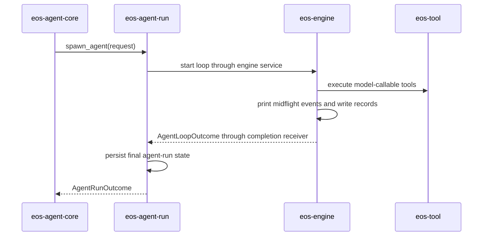

# Phase 04 - eos-engine and eos-agent-run Spec

Status: Draft
Date: 2026-06-09
Owner: eos-engine / eos-agent-run

## Scope

This phase makes `eos-engine` execution-only and `eos-agent-run` lifecycle-only.

The engine keeps the agent loop, turn execution, event emission, midflight
printing, message records, and background accounting. The run crate keeps
spawn/wait/poll/cancel/finalization and durable agent-run state updates.

Prerequisite: Phase 03B must define and implement the durable
request/task/workflow/agent-run lineage contract before this phase moves
message-record writing into `eos-engine` or splits run lifecycle from loop
execution. Phase 04 consumes `AgentRunLineage` and `AgentRunRecordContext`; it
does not redesign DB materialization.

## Local Architecture

### eos-engine

`eos-engine` owns:

- full agent loop execution,
- assistant turn execution,
- provider stream consumption,
- batch tool dispatch,
- engine events,
- midflight event printing,
- message record writing for loop-visible events,
- background session accounting and notifications.

`eos-engine` does not own:

- concrete tool families,
- tool registry definitions,
- agent-run lifecycle rows,
- request runtime wiring,
- external API facades.

### eos-agent-run

`eos-agent-run` owns:

- starting an agent run,
- active run registry,
- waiting for run completion,
- polling run completion,
- cancellation,
- final lifecycle handoff from engine outcome,
- agent-run persistence updates.

`eos-agent-run` does not own:

- engine turn execution,
- tool behavior,
- message event interpretation,
- request runtime wiring.

## Resulting File Structure

```text
agent-core/crates/eos-engine/
├── Cargo.toml
├── src/
│   ├── lib.rs
│   ├── error.rs
│   ├── model.rs
│   ├── events.rs
│   ├── services.rs
│   ├── agent_loop.rs
│   ├── agent_loop/
│   │   ├── executor.rs
│   │   ├── state.rs
│   │   └── turn.rs
│   ├── tool_call.rs
│   ├── records.rs
│   ├── printer.rs
│   ├── notifications.rs
│   ├── background.rs
│   └── background/
│       ├── notification.rs
│       └── background_session_manager/
│           ├── mod.rs
│           ├── command_session_manager.rs
│           ├── subagent_session_manager.rs
│           └── workflow_session_manager.rs
└── tests/
    ├── agent_loop/
    ├── records/
    ├── background/
    └── notifications/
```

```text
agent-core/crates/eos-agent-run/
├── Cargo.toml
├── src/
│   ├── lib.rs
│   ├── error.rs
│   ├── model.rs
│   ├── services.rs
│   ├── request.rs
│   ├── outcome.rs
│   ├── active_runs.rs
│   ├── persistence.rs
│   ├── completion.rs
│   └── cancellation.rs
└── tests/
    ├── lifecycle/
    ├── completion/
    └── cancellation/
```

## File Ownership Contract

The target stays flat, but each file has a narrow job. If a file needs another
responsibility, Phase 04 must be amended before implementation spreads that
logic.

### eos-engine files

| File | Owns | Must not own |
| --- | --- | --- |
| `lib.rs` | narrow public exports | implementation logic or compatibility re-export maze |
| `model.rs` | engine-loop request/outcome DTOs that are not global passive types | durable run state, tool family models |
| `events.rs` | engine event enum, event severity, event sink input shape | printing, persistence, run finalization |
| `services.rs` | sibling-facing loop execution surface | private helper exports, background internals |
| `agent_loop.rs` | loop module routing and public loop-internal exports | full loop implementation |
| `agent_loop/executor.rs` | full loop state machine, provider stream consumption, loop exit decisions | run lifecycle persistence |
| `agent_loop/state.rs` | in-memory state for one active loop | DB writes, active-run registry |
| `agent_loop/turn.rs` | assistant turn execution and tool-call turn semantics | concrete tool families |
| `tool_call.rs` | engine-side tool-call dispatch routing and execution glue | concrete tool families, tool registry definitions |
| `records.rs` | loop-visible message-record interpretation and write/read helpers | final agent-run state transitions |
| `printer.rs` | midflight event printing/sink behavior | durable record writes |
| `notifications.rs` | notification rule evaluation and loop-local notification sink | external notification facade or run finalization |
| `background.rs` | background module routing and aggregate exports | concrete family-specific protocols |
| `background/notification.rs` | background completion event rendering and enqueueing | session storage or polling |
| `background/background_session_manager/mod.rs` | `BackgroundSessionRuntime` aggregate, cross-family counts, cancel, list, and completion polling | concrete family-specific protocol details |
| `background/background_session_manager/command_session_manager.rs` | command-session registration, active IDs, counts, cancel, completion polling | workflow/subagent behavior |
| `background/background_session_manager/subagent_session_manager.rs` | subagent registration, active IDs, counts, cancel, completion polling | command/workflow behavior |
| `background/background_session_manager/workflow_session_manager.rs` | workflow registration, active IDs, counts, cancel, completion polling | command/subagent behavior |

The only session-manager vocabulary in this phase is the flat
`background_session_manager/*_session_manager.rs` layout above. Do not
reintroduce nested `session_managers/<kind>/...` folders or generic `lane`,
`recorder`, `driver`, or internal `*_port` names.

### eos-agent-run files

| File | Owns | Must not own |
| --- | --- | --- |
| `lib.rs` | narrow lifecycle exports | engine or tool implementation exports |
| `model.rs` | run request/outcome/status DTOs | engine events or tool result DTOs |
| `services.rs` | sibling-facing run lifecycle surface | turn execution |
| `request.rs` | run admission, request validation, launch input mapping | provider streaming |
| `outcome.rs` | `AgentRunOutcome`, terminal run status, and submission payload facts | model-facing `ToolResult` rendering |
| `active_runs.rs` | in-process active run registry | durable DB state |
| `persistence.rs` | durable run state transitions | engine event interpretation |
| `completion.rs` | exactly-once engine outcome handoff and final-state mapping | event-by-event loop handling |
| `cancellation.rs` | run cancellation orchestration | concrete tool or sandbox family behavior |

## Engine Service Surface

`eos-engine/src/services.rs` exports only sibling-facing execution surfaces.
It must not re-export every internal engine helper.
There is no first-target `services/` folder; execution internals stay in
`agent_loop/`, `records.rs`, `printer.rs`, and `background/`.

The loop module is named `agent_loop` (not `loop`): `loop` is a reserved Rust
keyword, so `mod loop;` does not compile. Keep `agent_loop.rs` + `agent_loop/`
throughout; the file shortening (`executor.rs`, `state.rs`, `turn.rs`) still
applies inside the folder.

Allowed exported surface:

```text
AgentLoopService
AgentLoopLauncher
AgentLoopExecutionRequest
AgentLoopOutcome
EngineEventSink
```

Contract:

| Type | Consumer | Rule |
| --- | --- | --- |
| `AgentLoopService` | `eos-agent-run` | executes one loop and returns one terminal `AgentLoopOutcome` |
| `AgentLoopLauncher` | `eos-agent-run`, test harnesses | starts an async loop only through the lifecycle boundary |
| `AgentLoopExecutionRequest` | `eos-agent-run` | carries prompt/run correlation, tool registry, event sink, cancellation token, and runtime inputs |
| `AgentLoopOutcome` | `eos-agent-run` | contains terminal status, final assistant/tool summary, record summary, and background-session closure status |
| `EngineEventSink` | `eos-agent-core` runtime wiring, tests | receives midflight events without owning finalization |

The engine may receive a run/correlation ID for records and events. It must not
own the active-run registry, admission state, or durable lifecycle row.

Names to avoid:

```text
NotificationService       # engine-internal queue, rename if private
BackgroundTeardownService # engine-internal finalizer, rename if private
MessageRecordService      # engine-internal records, unless sibling-consumed
EventPrinterService       # printer/sink, not service unless sibling-consumed
```

## Execution Invariants

The engine is execution-only, but execution is not vague. The implementation
must preserve these behaviors:

| Behavior | Rule |
| --- | --- |
| provider stream | consumed inside `agent_loop/executor.rs`; stream deltas produce engine events before final outcome |
| foreground tool batch | dispatched with bounded fan-out/fan-in, not sequential execution by accident |
| terminal tool result | in-band terminal-tool errors stay non-terminal so the model can retry |
| terminal batch rejection | does not fabricate a successful terminal completion |
| event order | stream/tool/record/print events preserve loop order for a single run |
| cancellation | cancellation token is checked between stream consumption, tool dispatch, and background polling |
| background closure | terminal outcome reports whether command/subagent/workflow background sessions remain active |
| lock scope | no lock is held across provider stream await, tool execution await, or background polling await |

## Background Session Contract

`background.rs` is the routing/export surface. The aggregate root lives in
`background/background_session_manager/mod.rs`. The family manager modules keep
implementation details local, but the aggregate owns cross-family policy.

| Capability | Owner | Required behavior |
| --- | --- | --- |
| register active background work | family module | records typed active ID and source family |
| count active work | `background_session_manager/mod.rs` | returns command/subagent/workflow counts in one snapshot |
| list active IDs | `background_session_manager/mod.rs` | preserves family identity; no stringly mixed ID list |
| cancel by reason | `background_session_manager/mod.rs` | forwards `cancel(reason)` to every family and reports partial failures |
| poll completions | `background_session_manager/mod.rs` | drains family completions and emits engine events |
| terminal gate | `background_session_manager/mod.rs` plus hooks in `eos-tool` | terminal submission/isolated-workspace gates can prove no background sessions remain |

The background runtime is allowed to depend on sandbox, workflow, and subagent
runtime handles. It must not depend on concrete tool family modules or on
`eos-agent-run` active-run internals.

## Lifecycle Handoff

Completion flow:



This is a lifecycle handoff, not an event-driven callback into the runner.

Handoff rules:

| Rule | Owner |
| --- | --- |
| engine produces exactly one terminal `AgentLoopOutcome` | `eos-engine` |
| run crate receives outcome and performs exactly one durable finalization | `eos-agent-run` |
| cancellation can win before, during, or after engine startup | `eos-agent-run` orchestrates; `eos-engine` observes token |
| failed engine startup creates a failed run outcome, not a dangling active run | `eos-agent-run` |
| background sessions are cancelled or reported before final state is persisted | `eos-engine` reports; `eos-agent-run` persists |
| final outcome is visible to waiters and pollers after persistence succeeds | `eos-agent-run` |

## Message Records and Midflight Printing

Target ownership:

| Behavior | Owner |
| --- | --- |
| event emission during loop | `eos-engine` |
| midflight printing | `eos-engine/printer.rs` |
| message-record interpretation | `eos-engine/records.rs` |
| durable run finalization | `eos-agent-run` |
| external message-record contract | `eos-agent-core`, if externally exposed |

Reason: the engine sees stream events, tool calls, assistant messages, and
terminal transitions as they happen. The runner only sees the final outcome.

Record and print rules:

| Rule | Owner |
| --- | --- |
| every model-visible stream/tool event can be printed midflight | `printer.rs` |
| every durable loop-visible event is interpreted once into records | `records.rs` |
| printing failure cannot corrupt loop state | `printer.rs` reports non-fatal sink errors |
| record write failure is an engine error and appears in `AgentLoopOutcome` | `records.rs`, `agent_loop/executor.rs` |
| externally exposed record DTOs are re-exported by `eos-agent-core` only if needed | `eos-agent-core` |

## Progress Tracker

| Item | Status |
| --- | --- |
| Add engine `services.rs` execution surface | Not started |
| Add exact engine file ownership contracts | Not started |
| Add exact run file ownership contracts | Not started |
| Add execution invariants for stream/tool/terminal behavior | Not started |
| Add `BackgroundSessionRuntime` aggregate contract | Not started |
| Move message records into engine internals | Not started |
| Add engine midflight printer/sink | Not started |
| Remove concrete tool ownership from engine | Not started |
| Rename private `*Service` internals where needed | Not started |
| Rename `eos-agent-runner` to `eos-agent-run` | Not started |
| Keep active run registry in run crate | Not started |
| Keep finalization persistence in run crate | Not started |
| Add exactly-once completion handoff tests | Not started |
| Add cancellation race tests | Not started |
| Add background-session accounting tests | Not started |
| Update `eos-agent-core` runtime wiring | Not started |

## Acceptance Criteria

- `eos-engine` has no `tools/` concrete tool family folder.
- `eos-engine` does not own tool registry definitions or hook contracts.
- `eos-engine/services.rs` exports only sibling-facing execution surfaces.
- `eos-engine` has no first-target `services/` folder.
- Engine message records and midflight printing work during loop execution.
- `eos-agent-run` does not import concrete tool modules.
- `eos-agent-run` has no dependency on `eos-tool`, `eos-tool-ports`, or
  `ToolResult`; model-facing rendering happens above the lifecycle layer.
- `eos-agent-run` owns spawn/wait/poll/cancel/finalization.
- `eos-agent-run` does not interpret stream/tool events.
- `eos-engine/src/background` keeps concrete command, workflow, and subagent
  managers under flat `background_session_manager/*_session_manager.rs` files;
  there are no target `background/*_sessions.rs` files and no nested
  `session_managers/<kind>/...` folders.
- Engine completion returns to run lifecycle through an outcome receiver or
  equivalent lifecycle handoff.
- Engine startup failure cannot leave an active run without a terminal state.
- Engine cancellation produces one terminal outcome and one durable finalization.
- Foreground multi-tool batches are proven to execute with bounded fan-out/fan-in.
- Terminal-tool in-band errors remain retryable by the model.
- Background session counts, list, cancel, and completion polling are tested per
  family and through the aggregate.
- Midflight printing is tested separately from durable record writing.
- `cargo test -p eos-engine` passes.
- `cargo test -p eos-agent-run` passes.
- Focused tests cover loop outcome handoff, cancellation races, background
  accounting, message records, and midflight printing.
- `eos-engine` final module count is at or below 22.
- `eos-agent-run` final module count is at or below 10.
