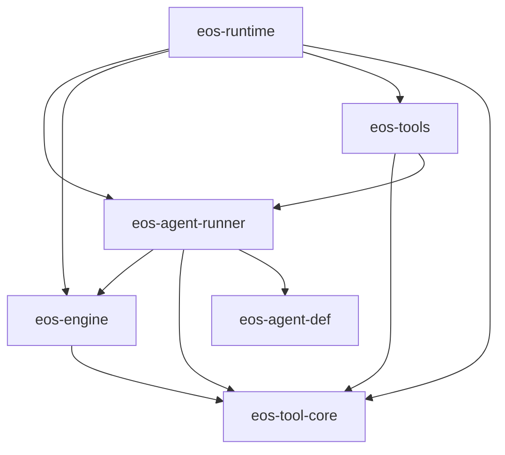

# Agent Runner / Engine Loop SRP Event Migration - SPEC

Status: Proposed
Date: 2026-06-08
Owner: agent-core runner / engine / tools

Scope:
- `agent-core/crates/eos-agent-run` renamed to `eos-agent-runner`
- `agent-core/crates/eos-engine`
- `agent-core/crates/eos-tools`
- new `agent-core/crates/eos-tool-core`
- `agent-core/crates/eos-runtime` composition wiring

Supersedes for this migration:
- the runner/engine/tool-core parts of
  `docs/plans/agent_run_ultra_architecture_simplification_SPEC.md`

## 1. Intent

Split the agent-run, engine-loop, and tool-framework responsibilities so each
crate has one clear reason to change:

- `eos-agent-runner` owns agent-run lifecycle.
- `eos-engine` owns the engine loop internals.
- `eos-tools` owns concrete model-facing tools.
- `eos-tool-core` owns shared tool contracts and framework primitives.
- `eos-runtime` owns production composition.

This is a migration and refactoring plan. It should simplify the current flow,
remove runner/engine round trips, remove engine awareness of agent profiles, and
make loop completion event-driven without making the engine depend on the
runner.

This spec only covers these engine-loop outcomes:

- terminal tool submitted successfully,
- loop failed or exited without a valid terminal submission.

Out of scope for this spec:

- user-input suspension,
- steering,
- second-turn continuation,
- generic background abstractions,
- model-facing behavior redesign.

## 2. Design Rules

- `eos-agent-runner` is a thin lifecycle wrapper over the public
  `eos-engine` loop API.
- `eos-engine` never imports `eos-agent-runner`, `eos-agent-def`, or
  `eos-tools`.
- `eos-agent-runner` may depend on `eos-engine` and `eos-tool-core`.
- `eos-agent-runner` must not depend on `eos-tools`.
- `eos-tools` may depend on `eos-agent-runner` for model-facing tools that
  spawn or wait for agent runs.
- `eos-engine` may depend on `eos-tool-core` for `ToolRegistry`,
  `ToolExecutor`, `ToolResult`, execution metadata, dispatch helpers, and
  family-specific tool session services.
- Background session managers stay in `eos-engine`. Do not create
  `BackgroundCompletionSource`, `BackgroundSessionSource`,
  `eos-tool-core/src/background.rs`, or a generic background port.
- The engine-loop request must stay thin. It contains loop inputs, not service
  bags.
- Agent-run state transitions and persistence updates happen only in
  `eos-agent-runner`.
- Engine-loop completion is delivered through a returned completion receiver.
  The engine does not call back into the runner.
- Avoid the word `token` in cancellation-related names. If cancellation is
  preserved in this migration, use `EngineLoopCancelHandle` and
  `EngineLoopCancelSignal`.

Naming rules for this migration:

- Service traits use the `*ApiService` suffix, for example
  `AgentRunApiService`.
- Concrete service implementations use `*Service`, for example
  `AgentRunService`.
- Internal lifecycle events use `<Domain>LifecycleEvent`, for example
  `AgentRunLifecycleEvent`.
- Event variants should name the lifecycle fact, for example
  `EngineLoopCompleted` and `EngineLoopCompletionDropped`.
- Avoid role-level event/command names; use `AgentRunLifecycleEvent` and
  `AgentRunCommand`.
- Values returned from `submit_*_outcome` tools use the field name `outcome`.
  Avoid payload-oriented names for this value.

## 3. Target Crate Layout

```text
agent-core/crates/
  eos-agent-runner/
    Cargo.toml
    src/
      lib.rs
      error.rs
      request.rs              # SpawnAgentRequest
      outcome.rs              # AgentRunOutcome, AgentRunStatus
      service.rs              # AgentRunApiService + AgentRunService
      active_runs.rs          # ActiveRuns, ActiveRun, waiter registration
      events.rs               # AgentRunCommand, AgentRunLifecycleEvent
      engine_request.rs       # AgentDefinition -> InitEngineLoopRequest
      persistence.rs          # create/finish agent_run rows
      run_records.rs          # optional agent-run record start/finish/final write

  eos-engine/
    Cargo.toml
    src/
      lib.rs
      engine_loop/
        mod.rs
        init.rs               # init_engine_loop(...)
        run.rs                # private run_loop_to_completion(...)
        request.rs            # InitEngineLoopRequest, EngineLoopMessage
        outcome.rs            # EngineLoopOutcome
        handle.rs             # EngineLoopRun
        registry_factory.rs   # EngineToolRegistryFactory
      query/
        mod.rs
        context.rs
        loop_.rs
        provider_messages.rs
        provider_source.rs
        request.rs
      background/
        mod.rs
        notification.rs
        background_session_manager/
          mod.rs
          subagent_session_manager.rs
          workflow_session_manager.rs
          command_session_manager.rs
      notifications/
      telemetry/
      tool_call/
      support/

  eos-tool-core/
    Cargo.toml
    src/
      lib.rs
      error.rs                # ToolError
      intent.rs               # ToolIntent
      metadata.rs             # ExecutionMetadata
      name.rs                 # ToolName, ToolKey
      result.rs               # ToolResult, OutputShape
      registry.rs             # ToolRegistry
      executor.rs             # ToolExecutor, RegisteredTool
      execution.rs            # execute_tool_once and hook execution
      dispatch.rs             # lifecycle_batch_decision, terminal batch policy
      hooks.rs                # hook contracts or closed hook framework
      session_services.rs     # Subagent/Workflow/Command session tool services

  eos-tools/
    Cargo.toml
    src/
      lib.rs
      registry/
        mod.rs
        config.rs
        spec.rs
      hooks/
      tools/
        ask_helper/
        isolated_workspace/
        sandbox/
        skills/
        subagent/
        submission/
        workflow/
        terminal.rs
      services.rs             # concrete non-shared services only, if any remain

  eos-runtime/
    src/
      runtime_services/
      tool_registry_factory.rs # implements EngineToolRegistryFactory using eos-tools
```

## 4. Target Dependency Graph



Forbidden edges after migration:

```text
eos-engine -> eos-agent-runner
eos-engine -> eos-agent-def
eos-engine -> eos-tools
eos-agent-runner -> eos-tools
```

## 5. Public Engine Loop API

The engine loop is non-blocking at the public API boundary:

```rust
pub fn init_engine_loop(request: InitEngineLoopRequest) -> EngineLoopRun;
```

`init_engine_loop` starts the loop internally and returns immediately with a
run handle:

```rust
pub struct EngineLoopRun {
    pub run_id: AgentRunId,
    pub completion: oneshot::Receiver<EngineLoopOutcome>,
}
```

The internal spawned task runs the loop to completion:

```rust
fn init_engine_loop(request: InitEngineLoopRequest) -> EngineLoopRun {
    let run_id = request.run_id.clone();
    let (completion_tx, completion) = oneshot::channel();

    tokio::spawn(async move {
        let outcome = run_loop_to_completion(request).await;
        let _ = completion_tx.send(outcome);
    });

    EngineLoopRun { run_id, completion }
}
```

The public request stays thin:

```rust
pub struct InitEngineLoopRequest {
    pub run_id: AgentRunId,
    pub initial_messages: Vec<EngineLoopMessage>,
    pub model: String,
    pub max_tokens: u32,
    pub tool_call_limit: u32,
    pub registry_factory: Arc<dyn EngineToolRegistryFactory>,
}
```

`initial_messages` are already prepared by the runner. They contain the agent
system prompt, injected runtime messages, and caller/user messages needed to
start the loop.

Use an engine-local message enum so the system prompt can be represented without
changing `eos_llm_client::Message`:

```rust
pub enum EngineLoopMessage {
    System(String),
    User(Message),
    Assistant(Message),
}
```

The outcome has only terminal and failure forms in this spec:

```rust
pub enum EngineLoopOutcome {
    Terminal {
        outcome: ToolResult,
        final_messages: Vec<EngineLoopMessage>,
        token_count: Option<i64>,
    },
    Failed {
        error: String,
        final_messages: Vec<EngineLoopMessage>,
        token_count: Option<i64>,
    },
}
```

Missing terminal submission is a failure:

```text
loop exits without terminal tool -> EngineLoopOutcome::Failed
```

## 6. Tool Registry Factory

`registry_factory` is the only composition hook on `InitEngineLoopRequest`.

```rust
pub trait EngineToolRegistryFactory: Send + Sync {
    fn build_registry(
        &self,
        context: EngineToolRegistryContext,
    ) -> Result<ToolRegistry, EngineError>;
}
```

The request does not carry service bags. The engine creates its own background
managers and passes the family-specific services to the factory through the
build context:

```rust
pub struct EngineToolRegistryContext {
    pub run_id: AgentRunId,
    pub subagent_sessions: SubagentSessionToolService,
    pub workflow_sessions: WorkflowSessionToolService,
    pub command_sessions: CommandSessionToolService,
}
```

Rules:

- `EngineToolRegistryFactory` lives in `eos-engine`.
- `ToolRegistry` and session tool service wrappers live in `eos-tool-core`.
- The production implementation lives in `eos-runtime`.
- The production implementation may call `eos_tools` registry builders.
- `eos-engine` never imports `eos-tools`.

## 7. Agent Runner API

`eos-agent-runner` owns `AgentRunApiService`:

```rust
#[async_trait]
pub trait AgentRunApiService: Send + Sync {
    async fn spawn_agent(
        &self,
        request: SpawnAgentRequest,
    ) -> Result<AgentRunId, AgentRunError>;

    async fn wait_for_agent_outcome(
        &self,
        agent_run_id: &AgentRunId,
    ) -> Result<AgentRunOutcome, AgentRunError>;

    async fn poll_for_agent_outcome(
        &self,
        agent_run_id: &AgentRunId,
        interval: Duration,
    ) -> Result<Option<AgentRunOutcome>, AgentRunError>;
}
```

### `spawn_agent`

`spawn_agent` is non-blocking with respect to the engine loop.

Flow:

1. Resolve `AgentDefinition` by name.
2. Allocate or accept `AgentRunId`.
3. Build the fully prepared `initial_messages`.
4. Build `InitEngineLoopRequest`.
5. Create the durable `agent_run` row when requested.
6. Call `eos_engine::init_engine_loop(request)`.
7. Insert an `ActiveRun` with the completion receiver's waiter channel.
8. Spawn a completion watcher that converts engine completion into a runner
   lifecycle event.
9. Return `AgentRunId` immediately.

### `wait_for_agent_outcome`

`wait_for_agent_outcome` blocks the caller asynchronously until the engine loop
finishes.

Implementation rule:

- For active in-process runs, wait on the run's `watch`/`oneshot` receiver.
- Do not sleep-poll active runs.
- If the run is no longer active in process, read the persisted terminal row
  once and convert it to `AgentRunOutcome`.

This is the efficient Rust path: the task parks until notified rather than
waking on an interval.

### `poll_for_agent_outcome`

`poll_for_agent_outcome` is the DB/read-model polling path.

Semantics:

- Wait for `interval`.
- Read the persisted agent-run row.
- Return `Ok(None)` if it is still running or not terminal.
- Return `Ok(Some(outcome))` if a terminal persisted outcome exists.

This API is for external/background consumers that need interval polling. It is
not used for active in-process runner completion.

### Agent-Run Lifecycle Event Handling

The runner receives engine completion through an internal lifecycle event:

```rust
pub enum AgentRunLifecycleEvent {
    EngineLoopCompleted {
        agent_run_id: AgentRunId,
        outcome: EngineLoopOutcome,
    },
    EngineLoopCompletionDropped {
        agent_run_id: AgentRunId,
    },
}
```

Suggested internal handler name:

```rust
async fn handle_engine_loop_completed(
    &self,
    agent_run_id: AgentRunId,
    outcome: EngineLoopOutcome,
) -> Result<(), AgentRunError>;
```

This handler is the only place that maps `EngineLoopOutcome` into durable
agent-run state and `AgentRunOutcome`.

## 8. Completion Workflow

```mermaid
sequenceDiagram
    participant Caller as caller / eos-tools
    participant Runner as eos-agent-runner
    participant Engine as eos-engine
    participant Watcher as runner completion watcher
    participant Actor as runner event handler
    participant Store as AgentRunStore

    Caller->>Runner: spawn_agent(SpawnAgentRequest)
    Runner->>Runner: resolve agent + build initial_messages
    Runner->>Store: create_run(agent_run_id)
    Runner->>Engine: init_engine_loop(InitEngineLoopRequest)
    Engine-->>Runner: EngineLoopRun { completion }
    Runner->>Runner: insert ActiveRun
    Runner->>Watcher: spawn watcher over completion receiver
    Runner-->>Caller: AgentRunId

    Engine->>Engine: run loop internally
    Engine-->>Watcher: completion receives EngineLoopOutcome
    Watcher->>Actor: AgentRunLifecycleEvent::EngineLoopCompleted
    Actor->>Store: finish_run(...)
    Actor->>Actor: publish AgentRunOutcome to waiters
    Actor->>Actor: remove ActiveRun
```

Key properties:

- No engine polling by runner.
- No engine callback into runner.
- No engine dependency on agent-runner.
- No runner dependency on engine internals.
- Only the runner mutates agent-run lifecycle state.

## 9. Outcome Mapping

| Engine outcome | Runner state update | Agent outcome |
| --- | --- | --- |
| `EngineLoopOutcome::Terminal` | finish run with outcome | `AgentRunStatus::Completed` |
| `EngineLoopOutcome::Failed` | finish run with error summary | `AgentRunStatus::Failed` |
| completion channel dropped | finish or publish internal failure | `AgentRunStatus::Failed` |

`EngineLoopOutcome::Terminal` contains a `ToolResult`, but `AgentRunOutcome`
does not expose `ToolResult`. The runner stores or projects the terminal
`submit_*_outcome` value into a JSON/factual agent-run outcome:

```rust
pub struct AgentRunOutcome {
    pub agent_run_id: AgentRunId,
    pub status: AgentRunStatus,
    pub outcome: Option<JsonObject>,
    pub message_history: Vec<Message>,
    pub token_count: Option<i64>,
    pub error: Option<String>,
}
```

`eos-tools` converts `AgentRunOutcome` into model-facing `ToolResult` at tool
boundaries such as `run_subagent` or `ask_advisor`.

## 10. File And Type Migration

### `eos-agent-run` -> `eos-agent-runner`

| Current | Action | Target |
| --- | --- | --- |
| `agent-core/crates/eos-agent-run` | rename crate/package | `agent-core/crates/eos-agent-runner` |
| `src/service.rs` | keep and expand | `AgentRunApiService`, `AgentRunService` |
| `src/request.rs` | keep | `SpawnAgentRequest` |
| `src/outcome.rs` | keep | `AgentRunOutcome`, `AgentRunStatus` |
| `src/error.rs` | keep | `AgentRunError` |
| engine `runtime/agent_run_service.rs` | move and rewrite | runner `service.rs` |
| engine `runtime/registry.rs` | move and rewrite | runner `active_runs.rs` |
| engine `runtime/persistence.rs` | move and rewrite | runner `persistence.rs` |
| engine message-record start/finish | move if retained | runner `run_records.rs` |

### `eos-engine`

| Current | Action | Target |
| --- | --- | --- |
| `runtime/agent_loop.rs` | split | engine-owned loop driver under `engine_loop/` |
| `runtime/agent_run_service.rs` | remove from engine | runner `service.rs` |
| `runtime/types.rs` | delete/split | `engine_loop/request.rs`, `outcome.rs`, runner types |
| `runtime/control.rs` | delete as bag type | narrow pieces only if still needed |
| `runtime/factory.rs` | remove from engine API | runner/runtime composition |
| `runtime/setup.rs` | split | runner builds init request; engine builds query context |
| `runtime/persistence.rs` | remove from engine | runner `persistence.rs` |
| `runtime/registry.rs` | remove from engine | runner `active_runs.rs` |
| `agent/` | remove from engine | runner `engine_request.rs` |
| `prompt/` | remove or fold | runner initial message preparation |
| `query/`, `background/`, `notifications/`, `tool_call/`, `telemetry/` | keep | engine internals |

Engine public re-exports should include:

```text
init_engine_loop
InitEngineLoopRequest
EngineLoopMessage
EngineLoopRun
EngineLoopOutcome
EngineToolRegistryFactory
EngineToolRegistryContext
EngineError
```

Engine public re-exports should not include:

```text
AgentRunService
AgentRunInput
AgentRunResult
AgentRunRegistry
EngineRunHandles
AgentToolRegistryServices
AgentRunControl
AgentRunControlFactory
```

### `eos-tool-core`

Move shared contracts and execution framework from `eos-tools`:

| Current `eos-tools` path | Target `eos-tool-core` path |
| --- | --- |
| `core/error.rs` | `error.rs` |
| `core/intent.rs` | `intent.rs` |
| `core/metadata.rs` | `metadata.rs` |
| `core/name.rs` | `name.rs` |
| `core/result.rs` | `result.rs` |
| `registry/tool_registry.rs` | `registry.rs` |
| `runtime/executor.rs` | `executor.rs` |
| `runtime/execution.rs` | `execution.rs` |
| `runtime/dispatch.rs` | `dispatch.rs` |
| concrete hook framework or hook trait | `hooks.rs` |
| family-specific session callback services | `session_services.rs` |

`eos-tool-core` must not contain:

```text
AgentRunApiService
SpawnAgentRequest
wait_for_agent_outcome
concrete model-facing tool executors
generic background source abstractions
```

### `eos-tools`

Keep concrete model-facing behavior:

```text
tools/subagent/*
tools/ask_helper/*
tools/workflow/*
tools/sandbox/*
tools/submission/*
tools/skills/*
registry/config.rs
registry/spec.rs
concrete hook implementations
```

Delete:

```text
src/.DS_Store
```

After migration, imports of core framework types should come from
`eos-tool-core`, not local `eos-tools::core`.

## 11. Field Changes

### Remove `EngineRunHandles`

Delete the engine-level bag. Its fields move to the owning crate:

| Current field | Target owner |
| --- | --- |
| `agent_run_store` | `eos-agent-runner` |
| `message_records` | `eos-agent-runner` if retained |
| `agent_registry` | `eos-agent-runner` |
| `tool_config` | `eos-runtime` registry factory |
| `sandbox_service` | `eos-runtime` / `eos-tools` construction |
| `root_submission` | `eos-runtime` / concrete tool wiring |
| `skill_service` | `eos-runtime` / concrete tool wiring |
| `tool_registry_extender` | `eos-runtime` registry factory |
| `audit` | engine telemetry input if still needed, not in runner handles |
| `workspace_root` | no top-level engine loop field |

### Replace `AgentRunInput`

Delete `AgentRunInput` from `eos-engine`.

Runner-owned spawn context:

```rust
pub struct SpawnAgentRequest {
    pub agent_name: AgentName,
    pub agent_run_id: Option<AgentRunId>,
    pub initial_messages: Vec<Message>,
    pub parent_agent_run_id: Option<AgentRunId>,
    pub request_id: Option<RequestId>,
    pub task_id: Option<TaskId>,
    pub attempt_id: Option<AttemptId>,
    pub workflow_id: Option<WorkflowId>,
    pub sandbox_id: Option<SandboxId>,
    pub workspace_root: String,
    pub is_isolated_workspace_mode: bool,
    pub persist: bool,
    pub record_kind: AgentRunRecordKind,
}
```

Engine-owned loop request:

```rust
pub struct InitEngineLoopRequest {
    pub run_id: AgentRunId,
    pub initial_messages: Vec<EngineLoopMessage>,
    pub model: String,
    pub max_tokens: u32,
    pub tool_call_limit: u32,
    pub registry_factory: Arc<dyn EngineToolRegistryFactory>,
}
```

### Shrink `QueryContext`

Keep query-loop state:

```text
tool_registry
model
max_tokens
tool_call_limit
tool call counters
terminal_tools
submission_outcome
event_source / provider source
notification rules and queue
audit/telemetry fields if engine still needs them
```

Remove runner/agent lifecycle state:

```text
message_record
run_handles
foreground
agent registry/profile references
agent-run persistence handles
```

`agent_run_id` may remain as a correlation id because it is the loop `run_id`.

## 12. Migration Phases

### Phase 1 - Extract `eos-tool-core`

- Create `agent-core/crates/eos-tool-core`.
- Move tool contracts/framework primitives.
- Update `eos-tools` to import from `eos-tool-core`.
- Keep concrete tools in `eos-tools`.

Verification:

```bash
cd agent-core
cargo check -p eos-tool-core --all-targets
cargo check -p eos-tools --all-targets
```

### Phase 2 - Add public non-blocking engine loop API

- Add `eos-engine/src/engine_loop/`.
- Add `InitEngineLoopRequest`.
- Add `EngineLoopRun`.
- Add `EngineLoopOutcome`.
- Add `init_engine_loop`.
- Keep old engine runtime API temporarily behind compatibility if needed.

Verification:

```bash
cd agent-core
cargo check -p eos-engine --all-targets
```

### Phase 3 - Rename and expand `eos-agent-runner`

- Rename `eos-agent-run` to `eos-agent-runner`.
- Move agent-run service, active-run registry, and persistence ownership from
  engine to runner.
- Implement event-driven completion watcher.
- Implement `spawn_agent`, `wait_for_agent_outcome`, and
  `poll_for_agent_outcome`.

Verification:

```bash
cd agent-core
cargo check -p eos-agent-runner --all-targets
cargo tree -p eos-agent-runner --edges normal
```

### Phase 4 - Detach engine from agent/tool concrete crates

- Remove engine dependency on `eos-agent-runner`.
- Remove engine dependency on `eos-agent-def`.
- Remove engine dependency on `eos-tools`.
- Remove or split old `runtime/*` agent-run modules.

Verification:

```bash
cd agent-core
cargo tree -p eos-engine --edges normal
cargo check -p eos-engine --all-targets
```

`cargo tree -p eos-engine --edges normal` must not show:

```text
eos-agent-runner
eos-agent-def
eos-tools
```

### Phase 5 - Runtime composition

- Implement `EngineToolRegistryFactory` in `eos-runtime`.
- Wire concrete `eos-tools` registry construction through the factory.
- Wire root requests, workflow launches, subagent tools, and advisor tools to
  `AgentRunApiService::spawn_agent`.

Verification:

```bash
cd agent-core
cargo check -p eos-runtime --all-targets
cargo check --workspace --all-targets
```

## 13. Acceptance Criteria

- `spawn_agent` returns `AgentRunId` without waiting for the engine loop to
  finish.
- Engine-loop completion reaches the runner through a completion receiver and
  internal `AgentRunLifecycleEvent::EngineLoopCompleted`.
- `wait_for_agent_outcome` waits on in-memory notification for active runs and
  does not interval-poll the engine loop.
- `poll_for_agent_outcome` is the only interval-based DB/read-model polling
  path.
- Only `eos-agent-runner` mutates persisted agent-run state.
- `eos-engine` exposes a thin public loop API and owns query/background/tool
  dispatch/notification/telemetry internals.
- `eos-engine` does not depend on `eos-agent-runner`, `eos-agent-def`, or
  `eos-tools`.
- `eos-agent-runner` does not depend on `eos-tools`.
- `eos-tools` contains concrete model-facing tools only.
- `eos-tool-core` contains shared tool contracts/framework primitives only.
- No generic background abstraction is introduced.
- `EngineLoopOutcome` only has terminal and failure outcomes in this spec.

## 14. Progress Tracker

- [ ] Phase 1 - Extract `eos-tool-core`.
- [ ] Phase 2 - Add non-blocking `eos-engine` loop API.
- [ ] Phase 3 - Rename/expand `eos-agent-runner`.
- [ ] Phase 4 - Remove engine back-edges to runner/agent/tools.
- [ ] Phase 5 - Recompose through `eos-runtime`.
- [ ] Final verification - dependency tree gates pass.
- [ ] Final verification - workspace cargo check passes or documented
      pre-existing failures are isolated.
