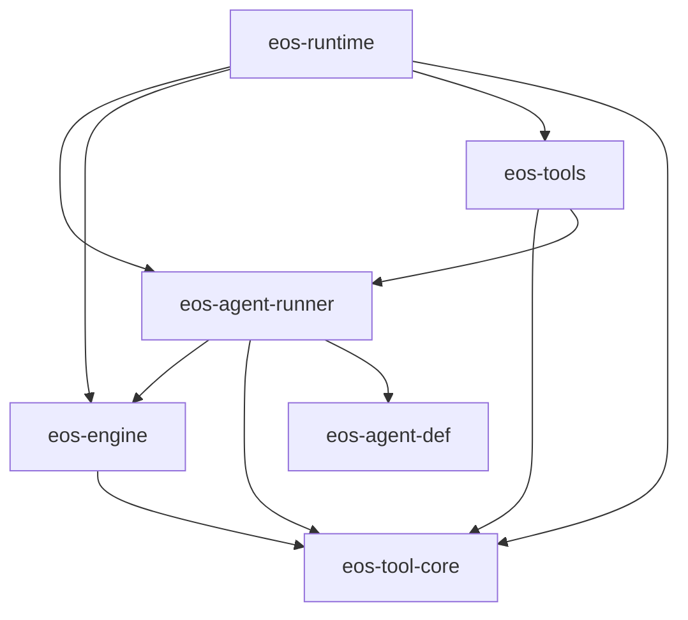
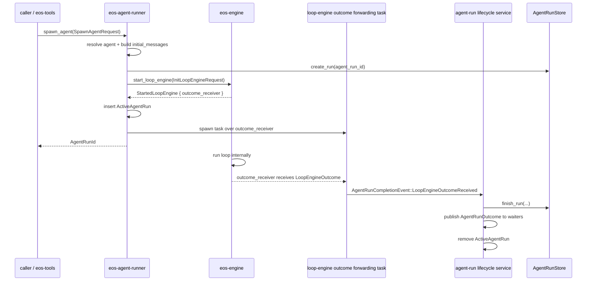

# Agent Runner / Loop Engine SRP Event Migration - SPEC

Status: Proposed
Date: 2026-06-08
Owner: agent-core runner / engine / tools

Scope:
- `agent-core/crates/eos-agent-run` renamed to `eos-agent-runner`
- `agent-core/crates/eos-engine`
- `agent-core/crates/eos-tools`
- new `agent-core/crates/eos-tool-core`
- `agent-core/crates/eos-runtime` composition wiring

Supersedes for this migration:
- the runner/engine/tool-core parts of
  `docs/plans/agent_run_ultra_architecture_simplification_SPEC.md`

## 1. Intent

Split the agent-run, loop-engine, and tool-framework responsibilities so each
crate has one clear reason to change:

- `eos-agent-runner` owns agent-run lifecycle.
- `eos-engine` owns loop engine control flow and one-step agent execution.
- `eos-tools` owns concrete model-facing tools.
- `eos-tool-core` owns shared tool contracts and framework primitives.
- `eos-runtime` owns production composition.

This is a migration and refactoring plan. It should simplify the current flow,
remove runner/engine round trips, remove engine awareness of agent profiles, and
make loop completion event-driven without making the engine depend on the
runner.

This spec only covers these loop-engine outcomes:

- terminal tool submitted successfully,
- loop failed or exited without a valid terminal submission.

Out of scope for this spec:

- user-input suspension,
- steering,
- second-turn continuation,
- generic background abstractions,
- model-facing behavior redesign.

This spec intentionally avoids an internal type named `AgentRunner` because the
crate name `eos-agent-runner` already means "agent-run lifecycle". Inside
`eos-engine`, the loop-control type is `AgentLoop` and the one-step execution
contract is `StepExecutor`.

## 2. Design Rules

- `eos-agent-runner` is a thin lifecycle wrapper over the public
  `eos-engine` loop-launcher contract.
- `AgentLoop` owns control flow, tick sequencing, async polling, lifecycle
  hooks, and conversion from step results into `LoopEngineOutcome`.
- `StepExecutor` owns exactly one agent decision step: model request assembly,
  provider streaming, tool-call dispatch, tool-call result incorporation, and
  terminal submission detection.
- `AgentLoop` depends on `StepExecutor` through an object-safe trait. The
  default production dispatch is `Arc<dyn StepExecutor>` because runtime wiring
  selects provider/tool behavior and tests need substitute step executors.
- `eos-engine` never imports `eos-agent-runner`, `eos-agent-def`, or
  `eos-tools`.
- `eos-agent-runner` may depend on `eos-engine` and `eos-tool-core`.
- `eos-agent-runner` must not depend on `eos-tools`.
- `eos-tools` may depend on `eos-agent-runner` for model-facing tools that
  spawn or wait for agent runs.
- `eos-engine` may depend on `eos-tool-core` for `ToolRegistry`,
  `ToolExecutor`, `ToolResult`, execution metadata, dispatch helpers, and
  family-specific tool session services.
- Background session trackers stay in `eos-engine`. Do not create
  `BackgroundCompletionSource`, `BackgroundSessionSource`,
  `eos-tool-core/src/background.rs`, or a generic background port.
- The loop-engine request must stay thin. It contains loop inputs, not service
  bags.
- Agent-run state transitions and persistence updates happen only in
  `eos-agent-runner`.
- Loop-engine completion is delivered through a returned outcome receiver.
  The engine does not call back into the runner.
- `eos-agent-runner` starts loops through `AgentLoopLauncher`, not through
  private `eos-engine` modules.
- Avoid the word `token` in cancellation-related names. If cancellation is
  preserved in this migration, use `LoopEngineCancelHandle` and
  `LoopEngineCancelSignal`.

Naming rules for this migration:

- Service traits use the `*ApiService` suffix, for example
  `AgentRunApiService`.
- Concrete service implementations use `*Service`, for example
  `AgentRunService`.
- Internal completion events use `<Domain>CompletionEvent`, for example
  `AgentRunCompletionEvent`.
- Event variants should name the observed completion fact, for example
  `LoopEngineOutcomeReceived` and `LoopEngineOutcomeSenderDropped`.
- Avoid role-level event names; use `AgentRunCompletionEvent`.
- Avoid `AgentManager`, `LoopHandler`, bare `Engine`, `DecisionEngine`,
  `Processor`, `Data`, and `Context` for new target code. Prefer `AgentLoop`,
  `StepExecutor`, `AgentState`, `StepResult`, and `ToolRegistry`.
- Lifecycle hooks use the same verb pattern: `on_start`, `on_step`, and
  `on_complete`.
- Values returned from `submit_*_outcome` tools use the field name `outcome`.
  Avoid transport-envelope names for this value.

## 3. Target Crate Layout

```text
agent-core/crates/
  eos-agent-runner/
    Cargo.toml
    src/
      lib.rs
      agent_run_error.rs      # AgentRunError
      spawn_agent_request.rs  # SpawnAgentRequest
      agent_run_outcome.rs    # AgentRunOutcome, AgentRunStatus
      agent_run_service.rs    # AgentRunApiService + AgentRunService
      active_agent_runs.rs    # ActiveAgentRuns, ActiveAgentRun
      completion_events.rs    # AgentRunCompletionEvent
      loop_engine_request.rs  # AgentDefinition -> InitLoopEngineRequest
      agent_run_persistence.rs # create/finish agent_run rows
      agent_run_records.rs    # optional agent-run record start/finish/final write

  eos-engine/
    Cargo.toml
    src/
      lib.rs
      loop_engine/
        mod.rs
        launcher.rs           # AgentLoopLauncher, TokioAgentLoopLauncher
        start.rs              # start_loop_engine(...) compatibility facade
        agent_loop.rs         # AgentLoop control flow
        step_executor.rs      # StepExecutor, DefaultStepExecutor
        step_result.rs        # StepResult
        agent_state.rs        # AgentState
        loop_hooks.rs         # AgentLoopHooks, NoopAgentLoopHooks
        init_request.rs       # InitLoopEngineRequest, LoopEngineMessage
        loop_outcome.rs       # LoopEngineOutcome
        started_loop.rs       # StartedLoopEngine
        tool_registry_factory.rs # LoopEngineToolRegistryFactory
      query/
        mod.rs
        state.rs              # QueryLoopState
        loop_.rs
        provider_messages.rs
        provider_source.rs
        provider_request.rs
      background/
        mod.rs
        notification.rs
        background_sessions/
          mod.rs
          subagent_sessions.rs
          workflow_sessions.rs
          command_sessions.rs
      notifications/
      telemetry/
      tool_call/
      support/

  eos-tool-core/
    Cargo.toml
    src/
      lib.rs
      tool_error.rs           # ToolError
      tool_intent.rs          # ToolIntent
      execution_metadata.rs   # ExecutionMetadata
      tool_name.rs            # ToolName, ToolKey
      tool_result.rs          # ToolResult, OutputShape
      tool_registry.rs        # ToolRegistry
      tool_executor.rs        # ToolExecutor, RegisteredTool
      tool_execution.rs       # execute_tool_once and hook execution
      tool_dispatch.rs        # lifecycle_batch_decision, terminal batch policy
      tool_hooks.rs           # hook contracts or closed hook framework
      session_tool_services.rs # Subagent/Workflow/Command session tool services

  eos-tools/
    Cargo.toml
    src/
      lib.rs
      registry/
        mod.rs
        config.rs
        spec.rs
      hooks/
      tools/
        ask_helper/
        isolated_workspace/
        sandbox/
        skills/
        subagent/
        submission/
        workflow/
        terminal.rs
      tool_dependencies.rs    # concrete non-shared tool dependencies

  eos-runtime/
    src/
      runtime_services/
      tool_registry_factory.rs # implements LoopEngineToolRegistryFactory using eos-tools
```

## 4. Target Dependency Graph



Forbidden edges after migration:

```text
eos-engine -> eos-agent-runner
eos-engine -> eos-agent-def
eos-engine -> eos-tools
eos-agent-runner -> eos-tools
```

## 5. Public Loop Engine API

The loop engine is non-blocking at the public API boundary:

```rust
pub fn start_loop_engine(request: InitLoopEngineRequest) -> StartedLoopEngine;
```

`start_loop_engine` starts the loop internally and returns immediately with a
started-loop handle:

```rust
pub struct StartedLoopEngine {
    pub agent_run_id: AgentRunId,
    pub outcome_receiver: oneshot::Receiver<LoopEngineOutcome>,
}
```

The internal spawned task runs the loop to completion:

```rust
fn start_loop_engine(request: InitLoopEngineRequest) -> StartedLoopEngine {
    let agent_run_id = request.agent_run_id.clone();
    let (outcome_sender, outcome_receiver) = oneshot::channel();

    tokio::spawn(async move {
        let outcome = drive_loop_engine_until_outcome(request).await;
        let _ = outcome_sender.send(outcome);
    });

    StartedLoopEngine {
        agent_run_id,
        outcome_receiver,
    }
}
```

The public request stays thin:

```rust
pub struct InitLoopEngineRequest {
    pub agent_run_id: AgentRunId,
    pub initial_messages: Vec<LoopEngineMessage>,
    pub model_key: String,
    pub max_completion_tokens: u32,
    pub tool_call_limit: u32,
    pub tool_registry_factory: Arc<dyn LoopEngineToolRegistryFactory>,
}
```

`initial_messages` are already prepared by the runner. They contain the agent
system prompt, injected runtime messages, and caller/user messages needed to
start the loop.

Use an engine-local message enum so the system prompt can be represented without
changing `eos_llm_client::Message`:

```rust
pub enum LoopEngineMessage {
    SystemPrompt(String),
    UserMessage(Message),
    AssistantMessage(Message),
}
```

The outcome has only terminal and failure forms in this spec:

```rust
pub enum LoopEngineOutcome {
    TerminalToolSubmitted {
        outcome: ToolResult,
        final_conversation_messages: Vec<LoopEngineMessage>,
        total_token_count: Option<i64>,
    },
    LoopFailed {
        error_summary: String,
        final_conversation_messages: Vec<LoopEngineMessage>,
        total_token_count: Option<i64>,
    },
}
```

Missing terminal submission is a failure:

```text
loop exits without terminal tool -> LoopEngineOutcome::LoopFailed
```

## 6. Tool Registry Factory

`tool_registry_factory` is the only composition hook on
`InitLoopEngineRequest`.

```rust
pub trait LoopEngineToolRegistryFactory: Send + Sync {
    fn build_tool_registry(
        &self,
        input: LoopEngineToolRegistryBuildInput,
    ) -> Result<ToolRegistry, EngineError>;
}
```

The request does not carry service bags. The engine creates its own background
session trackers and passes the family-specific services to the factory through
the build input:

```rust
pub struct LoopEngineToolRegistryBuildInput {
    pub agent_run_id: AgentRunId,
    pub subagent_sessions: SubagentSessionToolService,
    pub workflow_sessions: WorkflowSessionToolService,
    pub command_sessions: CommandSessionToolService,
}
```

Rules:

- `LoopEngineToolRegistryFactory` lives in `eos-engine`.
- `ToolRegistry` and session tool service wrappers live in `eos-tool-core`.
- The production implementation lives in `eos-runtime`.
- The production implementation may call `eos_tools` registry builders.
- `eos-engine` never imports `eos-tools`.

## 7. Agent Runner API

`eos-agent-runner` owns `AgentRunApiService`:

```rust
#[async_trait]
pub trait AgentRunApiService: Send + Sync {
    async fn spawn_agent(
        &self,
        request: SpawnAgentRequest,
    ) -> Result<AgentRunId, AgentRunError>;

    async fn wait_for_agent_outcome(
        &self,
        agent_run_id: &AgentRunId,
    ) -> Result<AgentRunOutcome, AgentRunError>;

    async fn poll_agent_outcome_after_interval(
        &self,
        agent_run_id: &AgentRunId,
        interval: Duration,
    ) -> Result<Option<AgentRunOutcome>, AgentRunError>;
}
```

### `spawn_agent`

`spawn_agent` is non-blocking with respect to the loop engine.

Flow:

1. Resolve `AgentDefinition` by name.
2. Allocate or accept `AgentRunId`.
3. Build the fully prepared `initial_messages`.
4. Build `InitLoopEngineRequest`.
5. Create the durable `agent_run` row when requested.
6. Call `eos_engine::start_loop_engine(request)`.
7. Insert an `ActiveAgentRun` with the loop-engine outcome receiver's waiter
   channel.
8. Spawn an outcome-forwarding task that converts loop-engine completion into an
   agent-run completion event.
9. Return `AgentRunId` immediately.

### `wait_for_agent_outcome`

`wait_for_agent_outcome` blocks the caller asynchronously until the loop engine
finishes.

Implementation rule:

- For active in-process runs, wait on the run's `watch`/`oneshot` receiver.
- Do not sleep-poll active runs.
- If the run is no longer active in process, read the persisted terminal row
  once and convert it to `AgentRunOutcome`.

This is the efficient Rust path: the task parks until notified rather than
waking on an interval.

### `poll_agent_outcome_after_interval`

`poll_agent_outcome_after_interval` is the DB/read-model polling path.

Semantics:

- Wait for `interval`.
- Read the persisted agent-run row.
- Return `Ok(None)` if it is still running or not terminal.
- Return `Ok(Some(outcome))` if a terminal persisted outcome exists.

This API is for external/background consumers that need interval polling. It is
not used for active in-process runner completion.

### Agent-Run Completion Event Application

The runner receives loop-engine completion through an internal completion event:

```rust
pub enum AgentRunCompletionEvent {
    LoopEngineOutcomeReceived {
        agent_run_id: AgentRunId,
        outcome: LoopEngineOutcome,
    },
    LoopEngineOutcomeSenderDropped {
        agent_run_id: AgentRunId,
    },
}
```

Suggested internal method name:

```rust
async fn finalize_agent_run_from_loop_engine_outcome(
    &self,
    agent_run_id: AgentRunId,
    outcome: LoopEngineOutcome,
) -> Result<(), AgentRunError>;
```

This method is the only place that maps `LoopEngineOutcome` into durable
agent-run state and `AgentRunOutcome`.

## 8. Completion Workflow



Key properties:

- No engine polling by runner.
- No engine callback into runner.
- No engine dependency on agent-runner.
- No runner dependency on engine internals.
- Only the runner mutates agent-run lifecycle state.

## 9. Outcome Mapping

| Loop-engine outcome | Runner state update | Agent outcome |
| --- | --- | --- |
| `LoopEngineOutcome::TerminalToolSubmitted` | finish run with outcome | `AgentRunStatus::Completed` |
| `LoopEngineOutcome::LoopFailed` | finish run with error summary | `AgentRunStatus::Failed` |
| outcome sender dropped | finish or publish internal failure | `AgentRunStatus::Failed` |

`LoopEngineOutcome::TerminalToolSubmitted` contains a `ToolResult`, but
`AgentRunOutcome` does not expose `ToolResult`. The runner stores or projects
the terminal `submit_*_outcome` value into a JSON/factual agent-run outcome:

```rust
pub struct AgentRunOutcome {
    pub agent_run_id: AgentRunId,
    pub status: AgentRunStatus,
    pub outcome: Option<JsonObject>,
    pub final_conversation_messages: Vec<Message>,
    pub total_token_count: Option<i64>,
    pub error_summary: Option<String>,
}
```

`eos-tools` converts `AgentRunOutcome` into model-facing `ToolResult` at tool
boundaries such as `run_subagent` or `ask_advisor`.

## 10. File And Type Migration

### `eos-agent-run` -> `eos-agent-runner`

| Current | Action | Target |
| --- | --- | --- |
| `agent-core/crates/eos-agent-run` | rename crate/package | `agent-core/crates/eos-agent-runner` |
| `src/service.rs` | rename and expand | runner `agent_run_service.rs` |
| `src/request.rs` | rename | runner `spawn_agent_request.rs` |
| `src/outcome.rs` | rename | runner `agent_run_outcome.rs` |
| `src/error.rs` | rename | runner `agent_run_error.rs` |
| engine `runtime/agent_run_service.rs` | move and rewrite | runner `agent_run_service.rs` |
| engine `runtime/registry.rs` | move and rewrite | runner `active_agent_runs.rs` |
| engine `runtime/persistence.rs` | move and rewrite | runner `agent_run_persistence.rs` |
| engine message-record start/finish | move if retained | runner `agent_run_records.rs` |

### `eos-engine`

| Current | Action | Target |
| --- | --- | --- |
| `runtime/agent_loop.rs` | split | engine-owned loop driver under `loop_engine/` |
| `runtime/agent_run_service.rs` | remove from engine | runner `agent_run_service.rs` |
| `runtime/types.rs` | delete/split | `loop_engine/init_request.rs`, `loop_engine/loop_outcome.rs`, runner types |
| `runtime/control.rs` | delete as bag type | narrow pieces only if still needed |
| `runtime/factory.rs` | remove from engine API | runner/runtime composition |
| `runtime/setup.rs` | split | runner builds init request; engine builds query-loop state |
| `runtime/persistence.rs` | remove from engine | runner `agent_run_persistence.rs` |
| `runtime/registry.rs` | remove from engine | runner `active_agent_runs.rs` |
| `agent/` | remove from engine | runner `loop_engine_request.rs` |
| `prompt/` | remove or fold | runner initial message preparation |
| `query/`, `background/`, `notifications/`, `tool_call/`, `telemetry/` | keep | engine internals |

Engine public re-exports should include:

```text
start_loop_engine
InitLoopEngineRequest
LoopEngineMessage
StartedLoopEngine
LoopEngineOutcome
LoopEngineToolRegistryFactory
LoopEngineToolRegistryBuildInput
EngineError
```

Engine public re-exports should not include:

```text
AgentRunService
AgentRunInput
AgentRunResult
AgentRunRegistry
EngineRunHandles
AgentToolRegistryServices
AgentRunControl
AgentRunControlFactory
```

### `eos-tool-core`

Move shared contracts and execution framework from `eos-tools`:

| Current `eos-tools` path | Target `eos-tool-core` path |
| --- | --- |
| `core/error.rs` | `tool_error.rs` |
| `core/intent.rs` | `tool_intent.rs` |
| `core/metadata.rs` | `execution_metadata.rs` |
| `core/name.rs` | `tool_name.rs` |
| `core/result.rs` | `tool_result.rs` |
| `registry/tool_registry.rs` | `tool_registry.rs` |
| `runtime/executor.rs` | `tool_executor.rs` |
| `runtime/execution.rs` | `tool_execution.rs` |
| `runtime/dispatch.rs` | `tool_dispatch.rs` |
| concrete hook framework or hook trait | `tool_hooks.rs` |
| family-specific session callback services | `session_tool_services.rs` |

`eos-tool-core` must not contain:

```text
AgentRunApiService
SpawnAgentRequest
wait_for_agent_outcome
concrete model-facing tool executors
generic background source abstractions
```

### `eos-tools`

Keep concrete model-facing behavior:

```text
tools/subagent/*
tools/ask_helper/*
tools/workflow/*
tools/sandbox/*
tools/submission/*
tools/skills/*
registry/config.rs
registry/spec.rs
concrete hook implementations
```

Delete:

```text
src/.DS_Store
```

After migration, imports of core framework types should come from
`eos-tool-core`, not local `eos-tools::core`.

## 11. Field Changes

### Remove `EngineRunHandles`

Delete the engine-level bag. Its fields move to the owning crate:

| Current field | Target owner |
| --- | --- |
| `agent_run_store` | `eos-agent-runner` |
| `message_records` | `eos-agent-runner` if retained |
| `agent_registry` | `eos-agent-runner` |
| `tool_config` | `eos-runtime` registry factory |
| `sandbox_service` | `eos-runtime` / `eos-tools` construction |
| `root_submission` | `eos-runtime` / concrete tool wiring |
| `skill_service` | `eos-runtime` / concrete tool wiring |
| `tool_registry_extender` | `eos-runtime` registry factory |
| `audit` | engine telemetry input if still needed, not in runner handles |
| `workspace_root` | no top-level loop engine field |

### Replace `AgentRunInput`

Delete `AgentRunInput` from `eos-engine`.

Runner-owned spawn context:

```rust
pub struct SpawnAgentRequest {
    pub agent_name: AgentName,
    pub requested_agent_run_id: Option<AgentRunId>,
    pub initial_messages: Vec<Message>,
    pub parent_agent_run_id: Option<AgentRunId>,
    pub request_id: Option<RequestId>,
    pub task_id: Option<TaskId>,
    pub attempt_id: Option<AttemptId>,
    pub workflow_id: Option<WorkflowId>,
    pub sandbox_id: Option<SandboxId>,
    pub workspace_root: String,
    pub is_isolated_workspace_mode: bool,
    pub persist_agent_run: bool,
    pub message_record_kind: AgentRunRecordKind,
}
```

Loop-engine init request:

```rust
pub struct InitLoopEngineRequest {
    pub agent_run_id: AgentRunId,
    pub initial_messages: Vec<LoopEngineMessage>,
    pub model_key: String,
    pub max_completion_tokens: u32,
    pub tool_call_limit: u32,
    pub tool_registry_factory: Arc<dyn LoopEngineToolRegistryFactory>,
}
```

### Rename And Shrink `QueryLoopState`

Keep query-loop state:

```text
tool_registry
model_key
max_completion_tokens
tool_call_limit
tool call counters
terminal_tools
terminal_tool_outcome
provider_stream_source
notification rules and queue
audit/telemetry fields if engine still needs them
```

Remove runner/agent lifecycle state:

```text
message_record
run_handles
foreground
agent registry/profile references
agent-run persistence handles
```

`agent_run_id` may remain as a correlation id because it is the loop-engine
run id.

## 12. Migration Phases

### Phase 1 - Extract `eos-tool-core`

- Create `agent-core/crates/eos-tool-core`.
- Move tool contracts/framework primitives.
- Update `eos-tools` to import from `eos-tool-core`.
- Keep concrete tools in `eos-tools`.

Verification:

```bash
cd agent-core
cargo check -p eos-tool-core --all-targets
cargo check -p eos-tools --all-targets
```

### Phase 2 - Add public non-blocking loop engine API

- Add `eos-engine/src/loop_engine/`.
- Add `InitLoopEngineRequest`.
- Add `StartedLoopEngine`.
- Add `LoopEngineOutcome`.
- Add `start_loop_engine`.
- Keep old engine runtime API temporarily behind compatibility if needed.

Verification:

```bash
cd agent-core
cargo check -p eos-engine --all-targets
```

### Phase 3 - Rename and expand `eos-agent-runner`

- Rename `eos-agent-run` to `eos-agent-runner`.
- Move agent-run service, active-run registry, and persistence ownership from
  engine to runner.
- Implement the event-driven outcome-forwarding task.
- Implement `spawn_agent`, `wait_for_agent_outcome`, and
  `poll_agent_outcome_after_interval`.

Verification:

```bash
cd agent-core
cargo check -p eos-agent-runner --all-targets
cargo tree -p eos-agent-runner --edges normal
```

### Phase 4 - Detach engine from agent/tool concrete crates

- Remove engine dependency on `eos-agent-runner`.
- Remove engine dependency on `eos-agent-def`.
- Remove engine dependency on `eos-tools`.
- Remove or split old `runtime/*` agent-run modules.

Verification:

```bash
cd agent-core
cargo tree -p eos-engine --edges normal
cargo check -p eos-engine --all-targets
```

`cargo tree -p eos-engine --edges normal` must not show:

```text
eos-agent-runner
eos-agent-def
eos-tools
```

### Phase 5 - Runtime composition

- Implement `LoopEngineToolRegistryFactory` in `eos-runtime`.
- Wire concrete `eos-tools` registry construction through the factory.
- Wire root requests, workflow launches, subagent tools, and advisor tools to
  `AgentRunApiService::spawn_agent`.

Verification:

```bash
cd agent-core
cargo check -p eos-runtime --all-targets
cargo check --workspace --all-targets
```

## 13. Acceptance Criteria

- `spawn_agent` returns `AgentRunId` without waiting for the loop engine to
  finish.
- Loop-engine completion reaches the runner through an outcome receiver and
  internal `AgentRunCompletionEvent::LoopEngineOutcomeReceived`.
- `wait_for_agent_outcome` waits on in-memory notification for active runs and
  does not interval-poll the loop engine.
- `poll_agent_outcome_after_interval` is the only interval-based DB/read-model
  polling path.
- Only `eos-agent-runner` mutates persisted agent-run state.
- `eos-engine` exposes a thin public loop API and owns query/background/tool
  dispatch/notification/telemetry internals.
- `eos-engine` does not depend on `eos-agent-runner`, `eos-agent-def`, or
  `eos-tools`.
- `eos-agent-runner` does not depend on `eos-tools`.
- `eos-tools` contains concrete model-facing tools only.
- `eos-tool-core` contains shared tool contracts/framework primitives only.
- No generic background abstraction is introduced.
- `LoopEngineOutcome` only has terminal and failure outcomes in this spec.

## 14. Progress Tracker

- [ ] Phase 1 - Extract `eos-tool-core`.
- [ ] Phase 2 - Add non-blocking `eos-engine` loop API.
- [ ] Phase 3 - Rename/expand `eos-agent-runner`.
- [ ] Phase 4 - Remove engine back-edges to runner/agent/tools.
- [ ] Phase 5 - Recompose through `eos-runtime`.
- [ ] Final verification - dependency tree gates pass.
- [ ] Final verification - workspace cargo check passes or documented
      pre-existing failures are isolated.
