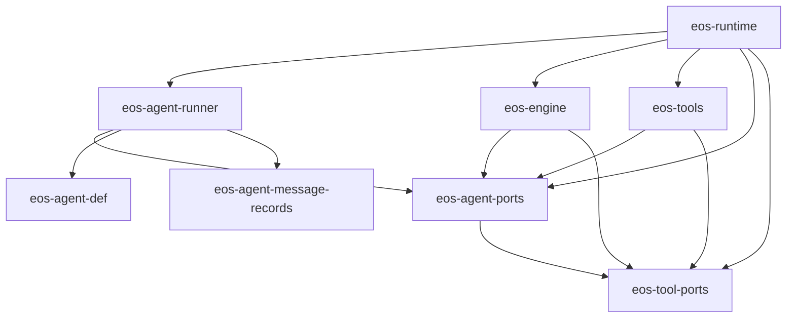
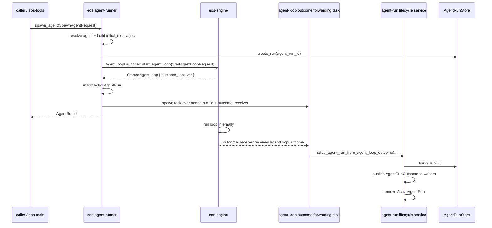
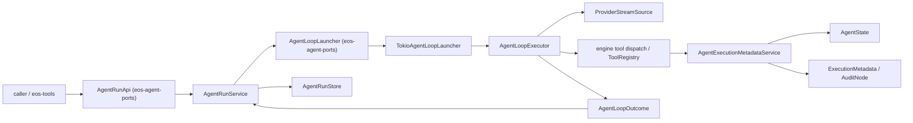

# Agent Runner / Agent Loop SRP Event Migration - SPEC

Status: Proposed
Date: 2026-06-08
Owner: agent-core runner / engine / tools

Scope:
- `agent-core/crates/eos-agent-run` renamed to `eos-agent-runner`
- `agent-core/crates/eos-engine`
- `agent-core/crates/eos-tools`
- new `agent-core/crates/eos-tool-ports`
- new `agent-core/crates/eos-agent-ports`
- `agent-core/crates/eos-runtime` composition wiring

Supersedes for this migration:
- the runner/engine/tool-port/agent-port parts of
  `docs/plans/agent_run_ultra_architecture_simplification_SPEC.md`

## 1. Intent

Split the agent-run, agent-loop, and tool-framework responsibilities so each
crate has one clear reason to change:

- `eos-agent-runner` owns agent-run lifecycle.
- `eos-engine` owns agent loop control flow and one-step agent execution.
- `eos-tools` owns concrete model-facing tools.
- `eos-tool-ports` owns tool-facing contracts.
- `eos-agent-ports` owns agent-run and agent-loop contracts.
- `eos-runtime` owns production composition.

This is a migration and refactoring plan. It should simplify the current flow,
remove runner/engine round trips, remove engine awareness of agent profiles, and
make loop completion event-driven without making the engine depend on the
runner.

This spec only covers these agent-loop outcomes:

- terminal tool submitted successfully,
- loop failed or exited without a valid terminal submission.

Out of scope for this spec:

- user-input suspension,
- steering,
- second-turn continuation,
- generic background abstractions,
- model-facing behavior redesign.

This spec intentionally avoids an internal type named `AgentRunner` because the
crate name `eos-agent-runner` already means "agent-run lifecycle". Inside
`eos-engine`, the full-loop execution type is `AgentLoopExecutor`; one
assistant/model response cycle is a private `AgentLoopExecutor` method, not a
separate executor trait.

## 2. Design Rules

- `eos-agent-runner` is a thin lifecycle wrapper over the public
  `eos-agent-ports` launcher contract.
- `AgentLoopExecutor` owns the full loop from `StartAgentLoopRequest` to
  `AgentLoopOutcome`: control flow, tick sequencing, async polling, lifecycle
  hooks, private assistant-turn execution, and conversion from turn results into
  loop outcomes.
- `AgentLoopExecutor::execute_assistant_turn` owns exactly one complete
  assistant/model response cycle: model request assembly, provider-stream
  consumption, tool-call batch dispatch, tool-call result incorporation, and
  terminal submission detection.
- Do not introduce a separate assistant-turn executor trait, file, or sibling
  executor. Tests should substitute lower-level ports such as
  `ProviderStreamSource`, `ToolRegistry` entries, and hooks.
- Do not introduce another sibling state object for assistant turns.
  `AgentLoopExecutor::execute_assistant_turn` receives `&mut AgentLoopState`,
  uses local variables for one provider response, and commits only durable loop
  changes back into `AgentLoopState`. If provider-stream parsing needs a
  helper, name it by the narrow job, for example `ProviderStreamAccumulator` or
  `ToolCallBatch`.
- `eos-engine` never imports `eos-agent-runner`, `eos-agent-def`, or
  `eos-tools`.
- `eos-agent-runner` may depend on `eos-agent-ports` and `eos-agent-def`.
- `eos-agent-runner` must not depend on `eos-engine`.
- `eos-agent-runner` must not depend on `eos-tools`.
- `eos-tools` may depend on `eos-agent-ports` for model-facing tools that
  spawn or wait for agent runs. It must not depend on `eos-agent-runner`.
- `eos-engine` may depend on `eos-agent-ports` for agent-loop DTOs and launcher
  ports.
- `eos-engine` may depend on `eos-tool-ports` for `ToolRegistry`, per-tool
  `ToolExecutor`, `ToolResult`, execution metadata, and family-specific tool
  session service ports.
- `eos-agent-ports` may depend on `eos-tool-ports` when agent-loop contracts
  carry tool-facing values such as `ToolResult` or `ExecutionMetadata`.
- `eos-tool-ports` must not depend on `eos-agent-ports`.
- Do not add a second batch-level tool executor abstraction. Per-tool
  `ToolExecutor` lives inside `RegisteredTool` / `ToolRegistry`; `eos-engine`
  owns batch fan-out, stream events, and loop-visible tool dispatch.
- Background session trackers stay in `eos-engine`. Do not create
  `BackgroundCompletionSource`, `BackgroundSessionSource`,
  `eos-tool-ports/src/background.rs`, or a generic background port.
- The agent-loop request must stay thin. It contains loop inputs, not service
  bags or registry factories. Registry factory wiring is injected into the
  launcher / executor at composition time.
- Agent-run state transitions and persistence updates happen only in
  `eos-agent-runner`.
- Agent message-record ownership is runner-only. `eos-agent-runner` is the only
  target crate that may import `eos-agent-message-records`; `eos-engine`,
  `eos-tools`, `eos-tool-ports`, `eos-agent-ports`, and `eos-runtime` must not
  depend on it directly.
- Caller-facing message-record choices use `eos-agent-ports` request DTOs. The
  mapping into `eos_agent_message_records::*` still happens inside
  `eos-agent-runner/src/agent_run_records.rs`.
- Agent-loop completion is delivered through a returned outcome receiver.
  The engine does not call back into the runner.
- `eos-agent-runner` starts loops through `AgentLoopLauncher`, not through
  private `eos-engine` modules.
- Avoid the word `token` in cancellation-related names. If cancellation is
  preserved in this migration, use `AgentLoopCancelHandle` and
  `AgentLoopCancelSignal`.

Naming rules for this migration:

- API traits keep concise domain names already used by their crate, for example
  `AgentRunApi`. Avoid a `*ApiService` suffix unless it distinguishes two real
  API surfaces in the same domain.
- Concrete service implementations use `*Service`, for example
  `AgentRunService`.
- Loop completion forwarding is an internal service method, not a separate
  event type, unless a real event bus or queue is introduced.
- Avoid `AgentManager`, `LoopHandler`, bare `Engine`, `DecisionEngine`,
  `Processor`, `Data`, and `Context` for new target code. Prefer
  `AgentLoopExecutor`, `AgentLoopState`, `AssistantTurnResult`, and
  `ToolRegistry`.
- Lifecycle hooks use the same verb pattern: `on_start`, `on_step`, and
  `on_complete`.
- Values returned from `submit_*_outcome` tools use the field name `outcome`.
  Avoid transport-envelope names for this value.

## 3. Target Crate Layout

```text
agent-core/crates/
  eos-agent-runner/
    Cargo.toml
    src/
      lib.rs
      agent_run_service.rs    # implements AgentRunApi with AgentRunService
      active_agent_runs.rs    # ActiveAgentRuns, ActiveAgentRun
      agent_loop_request.rs  # AgentDefinition -> StartAgentLoopRequest
      agent_run_persistence.rs # create/finish agent_run rows
      agent_run_records.rs    # only direct eos-agent-message-records adapter

  eos-agent-ports/
    Cargo.toml
    src/
      lib.rs
      error.rs                # AgentPortError, AgentRunError
      agent_name.rs           # AgentName lightweight identifier
      agent_run_api.rs        # AgentRunApi
      spawn_agent_request.rs  # SpawnAgentRequest
      agent_run_message_record_kind.rs # AgentRunMessageRecordKind DTO
      agent_run_outcome.rs    # AgentRunOutcome, AgentRunStatus
      agent_state.rs          # AgentState runtime snapshot
      metadata_service.rs     # AgentExecutionMetadataService
      agent_loop/
        mod.rs
        launcher.rs           # AgentLoopLauncher, StartedAgentLoop
        contracts.rs          # StartAgentLoopRequest, AgentLoopMessage, AgentLoopOutcome

  eos-engine/
    Cargo.toml
    src/
      lib.rs
      agent_loop/
        mod.rs
        launcher.rs           # TokioAgentLoopLauncher, start_agent_loop facade
        contracts.rs          # AgentLoopToolRegistryFactory and build input
        agent_loop_executor.rs # AgentLoopExecutor + private assistant-turn execution
        agent_loop_state.rs        # AgentLoopState
        loop_hooks.rs         # AgentLoopHooks, NoopAgentLoopHooks
      query/
        mod.rs
        loop_.rs
        provider_messages.rs
        provider_source.rs
        provider_request.rs
      background/
        mod.rs
        notification.rs
        background_sessions/
          mod.rs
          subagent_sessions.rs
          workflow_sessions.rs
          command_sessions.rs
      notifications/
      telemetry/
      tool_call/
      support/

  eos-tool-ports/
    Cargo.toml
    src/
      lib.rs
      core/
        error.rs              # ToolError
        intent.rs             # ToolIntent
        metadata.rs           # ExecutionMetadata
        name.rs               # ToolName, ToolKey
        result.rs             # ToolResult, OutputShape
      registry/
        tool_registry.rs      # ToolRegistry
      runtime/
        executor.rs           # ToolExecutor trait, RegisteredTool
      hooks/                  # hook contracts only, if shared
      services.rs             # family-specific tool service wrappers

  eos-tools/
    Cargo.toml
    src/
      lib.rs
      registry/
        mod.rs
        config.rs
        spec.rs
      hooks/
      tools/
        ask_helper/
        isolated_workspace/
        sandbox/
        skills/
        subagent/
        submission/
        workflow/
        terminal.rs
      tool_dependencies.rs    # concrete non-shared tool dependencies

  eos-runtime/
    src/
      runtime_services/
      tool_registry_factory.rs # implements AgentLoopToolRegistryFactory using eos-tools
```

## 4. Target Dependency Graph



Forbidden edges after migration:

```text
eos-engine -> eos-agent-runner
eos-engine -> eos-agent-def
eos-engine -> eos-tools
eos-engine -> eos-agent-message-records
eos-agent-runner -> eos-engine
eos-agent-runner -> eos-tools
eos-tools -> eos-agent-def
eos-tools -> eos-agent-runner
eos-tools -> eos-agent-message-records
eos-runtime -> eos-agent-message-records
eos-tool-ports -> eos-agent-ports
eos-tool-ports -> eos-agent-message-records
eos-agent-ports -> eos-agent-def
eos-agent-ports -> eos-agent-message-records
```

The only direct `eos-agent-message-records` edge after migration is:

```text
eos-agent-runner -> eos-agent-message-records
```

## 5. Public Agent Loop API

The public contract between `eos-agent-runner` and `eos-engine` lives in
`eos-agent-ports`. The runner depends on this trait and the loop DTOs, not on
private engine modules:

```rust
pub trait AgentLoopLauncher: Send + Sync {
    fn start_agent_loop(&self, request: StartAgentLoopRequest) -> StartedAgentLoop;
}
```

The production launcher is Tokio-backed and non-blocking. It starts the
`AgentLoopExecutor` internally and returns immediately with a started-loop
handle:

```rust
pub struct StartedAgentLoop {
    pub outcome_receiver: oneshot::Receiver<AgentLoopOutcome>,
}
```

```rust
pub struct TokioAgentLoopLauncher {
    provider_stream_source: Arc<dyn ProviderStreamSource>,
    loop_hooks: Arc<dyn AgentLoopHooks>,
    tool_registry_factory: Arc<dyn AgentLoopToolRegistryFactory>,
    metadata_service: Arc<dyn AgentExecutionMetadataService>,
}

impl AgentLoopLauncher for TokioAgentLoopLauncher {
    fn start_agent_loop(&self, request: StartAgentLoopRequest) -> StartedAgentLoop {
        let (outcome_sender, outcome_receiver) = oneshot::channel();
        let loop_executor = AgentLoopExecutor::new(
            Arc::clone(&self.provider_stream_source),
            Arc::clone(&self.loop_hooks),
            Arc::clone(&self.tool_registry_factory),
            Arc::clone(&self.metadata_service),
        );

        tokio::spawn(async move {
            let outcome = loop_executor.execute_agent_loop(request).await;
            let _ = outcome_sender.send(outcome);
        });

        StartedAgentLoop { outcome_receiver }
    }
}
```

`start_agent_loop` may remain as a compatibility facade while callers migrate
to `AgentLoopLauncher`:

```rust
pub fn start_agent_loop(request: StartAgentLoopRequest) -> StartedAgentLoop;
```

The public request stays thin:

```rust
pub struct StartAgentLoopRequest {
    pub agent_run_id: AgentRunId,
    pub initial_messages: Vec<AgentLoopMessage>,
    pub model_key: String,
    pub max_completion_tokens: u32,
    pub tool_call_limit: u32,
}
```

`initial_messages` are already prepared by the runner. They contain the agent
system prompt, injected runtime messages, and caller/user messages needed to
start the loop.

Use an engine-local message enum so the system prompt can be represented without
changing `eos_llm_client::Message`:

```rust
pub enum AgentLoopMessage {
    SystemPrompt(String),
    UserMessage(Message),
    AssistantMessage(Message),
}
```

The outcome carries one shared completion envelope and a narrow outcome kind:

```rust
pub struct AgentLoopOutcome {
    pub kind: AgentLoopOutcomeKind,
    pub final_conversation_messages: Vec<AgentLoopMessage>,
    pub total_token_count: Option<i64>,
}

pub enum AgentLoopOutcomeKind {
    TerminalToolSubmitted {
        outcome: ToolResult,
    },
    LoopFailed {
        error_summary: String,
    },
}
```

Missing terminal submission is a failure:

```text
loop exits without terminal tool -> AgentLoopOutcomeKind::LoopFailed
```

### Loop Execution And Assistant Turns

`AgentLoopExecutor` is the full-loop component. It owns lifecycle hooks, tick
sequencing, and the state-machine decision about whether the loop continues or
returns a terminal `AgentLoopOutcome`. Its input boundary is the runner-prepared
`StartAgentLoopRequest`, not raw user input or agent definition lookup:

```rust
pub(crate) struct AgentLoopExecutor {
    provider_stream_source: Arc<dyn ProviderStreamSource>,
    loop_hooks: Arc<dyn AgentLoopHooks>,
    tool_registry_factory: Arc<dyn AgentLoopToolRegistryFactory>,
    metadata_service: Arc<dyn AgentExecutionMetadataService>,
}

impl AgentLoopExecutor {
    pub(crate) fn new(
        provider_stream_source: Arc<dyn ProviderStreamSource>,
        loop_hooks: Arc<dyn AgentLoopHooks>,
        tool_registry_factory: Arc<dyn AgentLoopToolRegistryFactory>,
        metadata_service: Arc<dyn AgentExecutionMetadataService>,
    ) -> Self {
        Self {
            provider_stream_source,
            loop_hooks,
            tool_registry_factory,
            metadata_service,
        }
    }

    pub(crate) async fn execute_agent_loop(
        self,
        request: StartAgentLoopRequest,
    ) -> AgentLoopOutcome {
        let mut state = match AgentLoopState::from_request(
            request,
            &*self.tool_registry_factory,
            Arc::clone(&self.metadata_service),
        ) {
            Ok(state) => state,
            Err(error) => return AgentLoopOutcome::from_engine_error(error),
        };

        self.loop_hooks.on_start(&state).await;

        loop {
            self.loop_hooks.on_step(&state).await;

            let turn_result = match self.execute_assistant_turn(&mut state).await {
                Ok(turn_result) => turn_result,
                Err(error) => {
                    let outcome = state.loop_failed(error);
                    self.loop_hooks.on_complete(&outcome).await;
                    return outcome;
                }
            };

            match turn_result {
                AssistantTurnResult::Continue => state.advance_turn(),
                AssistantTurnResult::TerminalToolSubmitted { outcome } => {
                    let outcome = state.terminal_tool_submitted(outcome);
                    self.loop_hooks.on_complete(&outcome).await;
                    return outcome;
                }
            }
        }
    }

    async fn execute_assistant_turn(
        &self,
        state: &mut AgentLoopState,
    ) -> Result<AssistantTurnResult, EngineError> {
        let provider_request = state.build_provider_request()?;
        let model_output = self
            .provider_stream_source
            .stream_model_output(provider_request)
            .await?;

        state.record_model_output(model_output)?;

        let tool_calls = state.take_pending_tool_calls();
        if !tool_calls.is_empty() {
            let tool_batch = state.dispatch_pending_tool_calls(tool_calls).await?;
            state.record_tool_batch(tool_batch)?;
        }

        Ok(state.assistant_turn_result())
    }
}
```

An assistant turn is one complete model response cycle, not one user input, not
one tool call, and not one stream event. One user input can drive many assistant
turns before the terminal submission. One assistant turn can consume many stream
events such as thinking deltas, text deltas, and tool-call deltas, then execute
zero tools, one tool, or a tool-call batch returned by that model response.
A completed tool call is therefore work inside an assistant turn; it is not the
loop boundary unless the tool is the terminal submission that produces the final
`AgentLoopOutcome`.

`execute_assistant_turn` is private to `AgentLoopExecutor`. It does not own
persistence, active-run tracking, caller waiters, or a separate state object.

The loop state has a domain name and no generic `Context` suffix:

```rust
pub struct AgentLoopState {
    pub agent_run_id: AgentRunId,
    pub conversation_messages: Vec<AgentLoopMessage>,
    pub tool_registry: ToolRegistry,
    pub metadata_service: Arc<dyn AgentExecutionMetadataService>,
    pub total_token_count: Option<i64>,
    pub completed_turns: u32,
}

enum AssistantTurnResult {
    Continue,
    TerminalToolSubmitted {
        outcome: ToolResult,
    },
}
```

`AgentLoopState` must not duplicate metadata fields that belong to
`AgentState`. Keep `agent_run_id` as the lookup key, but do not store
`agent_name`, `request_id`, `task_id`, `workflow_id`, `iteration_id`,
`attempt_id`, `sandbox_id`, `workspace_root`, `is_isolated_workspace_mode`,
prebuilt `ExecutionMetadata`, or prebuilt `AuditNode` on the loop state.

Lifecycle hook names use one verb family:

```rust
#[async_trait]
pub trait AgentLoopHooks: Send + Sync {
    async fn on_start(&self, state: &AgentLoopState);
    async fn on_step(&self, state: &AgentLoopState);
    async fn on_complete(&self, outcome: &AgentLoopOutcome);
}
```

## 6. Tool Registry Factory

`AgentLoopToolRegistryFactory` is the only composition hook for concrete tool
registry construction. It is injected into `TokioAgentLoopLauncher` /
`AgentLoopExecutor` at runtime composition, not carried on
`StartAgentLoopRequest`.

```rust
pub trait AgentLoopToolRegistryFactory: Send + Sync {
    fn build_tool_registry(
        &self,
        input: AgentLoopToolRegistryBuildInput,
    ) -> Result<ToolRegistry, EngineError>;
}
```

The request does not carry service bags or factory handles. The engine creates
its own background session trackers and passes the family-specific services to
the factory through the build input:

```rust
pub struct AgentLoopToolRegistryBuildInput {
    pub agent_run_id: AgentRunId,
    pub subagent_sessions: SubagentSessionToolService,
    pub workflow_sessions: WorkflowSessionToolService,
    pub command_sessions: CommandSessionToolService,
}
```

Rules:

- `AgentLoopToolRegistryFactory` lives in `eos-engine`.
- `ToolRegistry`, `ToolExecutor`, `RegisteredTool`, and session tool service
  wrappers live in `eos-tool-ports`.
- The production implementation lives in `eos-runtime`.
- The production implementation may call `eos_tools` registry builders.
- `eos-engine` never imports `eos-tools`.
- Tool execution metadata is rendered by `AgentExecutionMetadataService` from
  the current `AgentState`, tool call, and per-turn conversation snapshot. The
  service loads `AgentState` by `agent_run_id` immediately before rendering so
  runtime-mutated fields are fresh.

## 7. Agent Runner API

`eos-agent-ports` owns `AgentRunApi`; `eos-agent-runner` implements it:

```rust
#[async_trait]
pub trait AgentRunApi: Send + Sync {
    async fn spawn_agent(
        &self,
        request: SpawnAgentRequest,
    ) -> Result<AgentRunId, AgentRunError>;

    async fn wait_for_agent_outcome(
        &self,
        agent_run_id: &AgentRunId,
    ) -> Result<AgentRunOutcome, AgentRunError>;

    async fn poll_agent_outcome_after_interval(
        &self,
        agent_run_id: &AgentRunId,
        interval: Duration,
    ) -> Result<Option<AgentRunOutcome>, AgentRunError>;
}
```

The concrete lifecycle service receives the loop launcher as an injected port:

```rust
pub struct AgentRunService {
    agent_loop_launcher: Arc<dyn AgentLoopLauncher>,
    active_agent_runs: ActiveAgentRuns,
    agent_run_store: Arc<dyn AgentRunStore>,
}
```

### `spawn_agent`

`spawn_agent` is non-blocking with respect to the agent loop.

Flow:

1. Resolve `AgentDefinition` by name.
2. Allocate or accept `AgentRunId`.
3. Build the fully prepared `initial_messages`.
4. Build `StartAgentLoopRequest`.
5. Create the durable `agent_run` row when requested.
6. Call `self.agent_loop_launcher.start_agent_loop(request)`.
7. Insert an `ActiveAgentRun` with the agent-loop outcome receiver's waiter
   channel.
8. Spawn an outcome-forwarding task that finalizes the agent-run from the
   agent-loop outcome receiver.
9. Return `AgentRunId` immediately.

### Execution Metadata Service

`StartAgentLoopRequest` carries only the stable loop id and loop inputs. It
does not carry workflow, iteration, attempt, workspace, or isolated-workspace
facts. Tool metadata and audit nodes are built through a narrow state-aware
service so runtime-mutated fields such as isolated-workspace mode are read at
the time of the tool call or audit event.

`AgentState` is the service-returned runtime snapshot for one agent run. It is
intentionally separate from `AgentLoopState`:

- `AgentLoopState` is engine-private mutable loop state: transcript,
  tool registry, counters, pending tool calls, and loop mechanics.
- `AgentState` is the current metadata/audit view loaded by `agent_run_id`:
  persisted run/task facts plus runtime fields that can change while the loop
  is running.

```text
agent_run_id
  -> AgentExecutionMetadataService
  -> AgentRunStore / TaskStore / current per-run runtime state
  -> AgentState
  -> ExecutionMetadata / AuditNode
```

Target service shape:

```rust
#[derive(Debug, Clone)]
pub struct AgentState {
    pub agent_run_id: AgentRunId,
    pub agent_name: String,
    pub request_id: Option<RequestId>,
    pub task_id: Option<TaskId>,
    pub workflow_id: Option<WorkflowId>,
    pub iteration_id: Option<IterationId>,
    pub attempt_id: Option<AttemptId>,
    pub sandbox_id: Option<SandboxId>,
    pub workspace_root: String,
    pub is_isolated_workspace_mode: bool,
}

pub struct ExecutionMetadataBuildInput {
    pub agent_run_id: AgentRunId,
    pub tool_name: ToolName,
    pub tool_use_id: ToolUseId,
    pub conversation: Arc<[Message]>,
}

pub struct AuditNodeBuildInput {
    pub agent_run_id: AgentRunId,
    pub tool_name: Option<ToolName>,
    pub tool_use_id: Option<ToolUseId>,
}

#[async_trait]
pub trait AgentExecutionMetadataService: Send + Sync {
    async fn agent_state(
        &self,
        agent_run_id: &AgentRunId,
    ) -> Result<AgentState, AgentPortError>;

    async fn build_execution_metadata(
        &self,
        input: ExecutionMetadataBuildInput,
    ) -> Result<ExecutionMetadata, AgentPortError>;

    async fn build_audit_node(
        &self,
        input: AuditNodeBuildInput,
    ) -> Result<AuditNode, AgentPortError>;
}
```

The concrete service may read `AgentRunStore::get(agent_run_id)` and then
`TaskStore::get(task_id)` to recover request/workflow/iteration/attempt facts.
It may also read current per-run runtime state for fields that change during the
loop, such as `workspace_root` and `is_isolated_workspace_mode`. The service
must not expose mutation methods for request/task/workflow/iteration/attempt or
agent-run lifecycle state. Mutations to runtime-only fields stay behind the
owning runtime/tool service; metadata and audit rendering only read the current
`AgentState`.

The isolated-workspace tools are the main mutation path for runtime-only state.
After a successful `enter_isolated_workspace` or `exit_isolated_workspace`, the
tool-side service must update the per-run runtime state for that
`agent_run_id`. The next metadata or audit render must reload `AgentState`
rather than reuse the `ExecutionMetadata` snapshot from the previous tool call.

Target rendering rules:

- `build_execution_metadata` loads `AgentState` by `agent_run_id` and renders
  `ExecutionMetadata` by combining that state with `tool_name`, `tool_use_id`,
  and `conversation`.
- `build_audit_node` loads `AgentState` by `agent_run_id` and renders the same
  request/workflow/iteration/attempt/task/agent/sandbox facts into `AuditNode`,
  plus the optional tool fields from `AuditNodeBuildInput`.
- Target `ExecutionMetadata` should include
  `iteration_id: Option<IterationId>` so tool metadata and audit use the same
  workflow/iteration/attempt fact set.
- `ExecutionMetadata` remains a per-tool-call DTO. It may contain copied facts
  from `AgentState`, but it must not be stored as long-lived loop/query state.

`eos-agent-message-records` remains different: it receives
`AgentRunRecordStart` and `AgentRunRecordKind` at node creation because those
facts define the file layout. Tool metadata and audit should use the service so
they can reflect current runtime state.

### `wait_for_agent_outcome`

`wait_for_agent_outcome` blocks the caller asynchronously until the agent loop
finishes.

Implementation rule:

- For active in-process runs, wait on the run's `watch`/`oneshot` receiver.
- Do not sleep-poll active runs.
- If the run is no longer active in process, read the persisted terminal row
  once and convert it to `AgentRunOutcome`.

This is the efficient Rust path: the task parks until notified rather than
waking on an interval.

### `poll_agent_outcome_after_interval`

`poll_agent_outcome_after_interval` is the DB/read-model polling path.

Semantics:

- Wait for `interval`.
- Read the persisted agent-run row.
- Return `Ok(None)` if it is still running or not terminal.
- Return `Ok(Some(outcome))` if a terminal persisted outcome exists.

This API is for external/background consumers that need interval polling. It is
not used for active in-process runner completion.

### Agent-Run Outcome Forwarding

The runner receives agent-loop completion through the returned outcome
receiver. The forwarding task captures the already-known `AgentRunId`, awaits
the receiver, and calls the lifecycle service directly:

```rust
async fn forward_agent_loop_outcome(
    service: Arc<AgentRunService>,
    agent_run_id: AgentRunId,
    outcome_receiver: oneshot::Receiver<AgentLoopOutcome>,
) -> Result<(), AgentRunError>;
```

Suggested internal finalization method names:

```rust
async fn finalize_agent_run_from_agent_loop_outcome(
    &self,
    agent_run_id: AgentRunId,
    outcome: AgentLoopOutcome,
) -> Result<(), AgentRunError>;

async fn finalize_agent_run_from_dropped_agent_loop_sender(
    &self,
    agent_run_id: AgentRunId,
) -> Result<(), AgentRunError>;
```

These methods are the only places that map loop completion or loop sender drop
into durable agent-run state and `AgentRunOutcome`.

## 8. Completion Workflow



Key properties:

- No engine polling by runner.
- No engine callback into runner.
- No engine dependency on agent-runner.
- No runner dependency on engine internals.
- Only the runner mutates agent-run lifecycle state.

## 9. Outcome Mapping

| Agent-loop outcome | Runner state update | Agent outcome |
| --- | --- | --- |
| `AgentLoopOutcomeKind::TerminalToolSubmitted` | finish run with outcome | `AgentRunStatus::Completed` |
| `AgentLoopOutcomeKind::LoopFailed` | finish run with error summary | `AgentRunStatus::Failed` |
| outcome sender dropped | finish or publish internal failure | `AgentRunStatus::Failed` |

`AgentLoopOutcomeKind::TerminalToolSubmitted` contains a `ToolResult`, but
`AgentRunOutcome` does not expose `ToolResult`. The runner stores or projects
the terminal `submit_*_outcome` value into a JSON/factual agent-run outcome:

```rust
pub struct AgentRunOutcome {
    pub agent_run_id: AgentRunId,
    pub status: AgentRunStatus,
    pub outcome: Option<JsonObject>,
    pub final_conversation_messages: Vec<Message>,
    pub total_token_count: Option<i64>,
    pub error_summary: Option<String>,
}
```

`eos-tools` converts `AgentRunOutcome` into model-facing `ToolResult` at tool
boundaries such as `run_subagent` or `ask_advisor`.

## 10. File And Type Migration

### `eos-agent-run` -> `eos-agent-runner`

| Current | Action | Target |
| --- | --- | --- |
| `agent-core/crates/eos-agent-run` | rename crate/package | `agent-core/crates/eos-agent-runner` |
| `src/service.rs` | rename and expand | runner `agent_run_service.rs` containing `AgentRunApi` + `AgentRunService` |
| `src/request.rs` | rename | runner `spawn_agent_request.rs` |
| `src/outcome.rs` | rename | runner `agent_run_outcome.rs` |
| `src/error.rs` | rename | runner `agent_run_error.rs` |
| engine `runtime/agent_run_service.rs` | move and rewrite | runner `agent_run_service.rs` |
| engine `runtime/registry.rs` | move and rewrite | runner `active_agent_runs.rs` |
| engine `runtime/persistence.rs` | move and rewrite | runner `agent_run_persistence.rs` |
| engine message-record start/finish | move if retained | runner `agent_run_records.rs` |

### `eos-engine`

| Current | Action | Target |
| --- | --- | --- |
| `runtime/agent_loop.rs` | split | `agent_loop/agent_loop_executor.rs` plus narrow helper modules only when they own a distinct engine-internal job |
| `runtime/agent_run_service.rs` | remove from engine | runner `agent_run_service.rs` |
| `runtime/types.rs` | delete/split | `agent_loop/contracts.rs`, runner types |
| `runtime/control.rs` | delete as bag type | narrow pieces only if still needed |
| `runtime/factory.rs` | remove from engine API | runner/runtime composition |
| `runtime/setup.rs` | split | runner builds `StartAgentLoopRequest`; engine builds `AgentLoopState` |
| `runtime/persistence.rs` | remove from engine | runner `agent_run_persistence.rs` |
| `runtime/registry.rs` | remove from engine | runner `active_agent_runs.rs` |
| `agent/` | remove from engine | runner `agent_loop_request.rs` |
| `prompt/` | remove or fold | runner initial message preparation |
| `query/`, `background/`, `notifications/`, `tool_call/`, `telemetry/` | keep | engine internals |

`eos-agent-ports` public re-exports should include:

```text
AgentLoopLauncher
StartAgentLoopRequest
AgentLoopMessage
StartedAgentLoop
AgentLoopOutcome
AgentLoopOutcomeKind
AgentName
AgentRunApi
SpawnAgentRequest
AgentRunOutcome
AgentRunStatus
AgentRunError
AgentRunMessageRecordKind
AgentState
AgentExecutionMetadataService
ExecutionMetadataBuildInput
AuditNodeBuildInput
AgentPortError
```

`eos-engine` public re-exports should include:

```text
TokioAgentLoopLauncher
start_agent_loop
AgentLoopToolRegistryFactory
AgentLoopToolRegistryBuildInput
EngineError
```

Engine public re-exports should not include:

```text
AgentRunService
AgentRunInput
AgentRunResult
AgentRunRegistry
EngineRunHandles
AgentToolRegistryServices
AgentRunControl
AgentRunControlFactory
```

Engine crate-internal loop-control names should include:

```text
AgentLoopExecutor
AgentLoopState
AssistantTurnResult
AgentLoopHooks
```

### `eos-agent-ports`

Move agent/run/loop contracts into a contract-only crate:

| Current owner | Target `eos-agent-ports` path |
| --- | --- |
| agent-definition name DTO | `agent_name.rs` |
| runner `AgentRunApi` | `agent_run_api.rs` |
| runner `SpawnAgentRequest` | `spawn_agent_request.rs` |
| runner message-record selection DTO | `agent_run_message_record_kind.rs` |
| runner `AgentRunOutcome`, `AgentRunStatus` | `agent_run_outcome.rs` |
| runner/engine error DTOs | `error.rs` |
| engine `AgentLoopLauncher`, `StartedAgentLoop` | `agent_loop/launcher.rs` |
| engine `StartAgentLoopRequest`, `AgentLoopMessage`, `AgentLoopOutcome` | `agent_loop/contracts.rs` |
| new runtime snapshot DTO | `agent_state.rs` |
| new metadata/audit rendering service | `metadata_service.rs` |

`eos-agent-ports` must not contain:

```text
AgentRunService
ActiveAgentRuns
AgentLoopExecutor
AgentLoopState
TokioAgentLoopLauncher
AgentDefinition
agent-definition resolution
agent-run persistence code
message-record adapters
concrete tool executors
runtime composition wiring
eos-agent-message-records imports
```

### `eos-tool-ports`

Move shared tool contracts from `eos-tools`:

| Current `eos-tools` path | Target `eos-tool-ports` path |
| --- | --- |
| `core/error.rs` | `core/error.rs` |
| `core/intent.rs` | `core/intent.rs` |
| `core/metadata.rs` | `core/metadata.rs` |
| `core/name.rs` | `core/name.rs` |
| `core/result.rs` | `core/result.rs` |
| `registry/tool_registry.rs` | `registry/tool_registry.rs` |
| `runtime/executor.rs` | `runtime/executor.rs` containing only `ToolExecutor` and `RegisteredTool` |
| hook contracts if shared | `hooks/` |
| family-specific session callback services | `services.rs` |

`eos-tool-ports` must not contain:

```text
AgentRunApi
SpawnAgentRequest
wait_for_agent_outcome
concrete model-facing tool executors
execute_tool_once
lifecycle_batch_decision
batch dispatch policy
hook execution policy
generic background source abstractions
eos-agent-message-records imports
```

### `eos-tools`

Keep concrete model-facing behavior:

```text
tools/subagent/*
tools/ask_helper/*
tools/workflow/*
tools/sandbox/*
tools/submission/*
tools/skills/*
registry/config.rs
registry/spec.rs
concrete hook implementations
```

Delete:

```text
src/.DS_Store
```

After migration, imports of tool contracts should come from `eos-tool-ports`,
not local `eos-tools::core`. Imports of agent/run/loop contracts should come
from `eos-agent-ports`, not `eos-agent-runner` or `eos-engine`.

## 11. Field Changes

### Remove `EngineRunHandles`

Delete the engine-level bag. Its fields move to the owning crate:

| Current field | Target owner |
| --- | --- |
| `agent_run_store` | `eos-agent-runner` |
| `message_records` | `eos-agent-runner` as the only direct `eos-agent-message-records` importer if retained |
| `agent_registry` | `eos-agent-runner` |
| `tool_config` | `eos-runtime` registry factory |
| `sandbox_service` | `eos-runtime` / `eos-tools` construction |
| `root_submission` | `eos-runtime` / concrete tool wiring |
| `skill_service` | `eos-runtime` / concrete tool wiring |
| `tool_registry_extender` | `eos-runtime` registry factory |
| `audit` | engine telemetry input if still needed, not in runner handles |
| `workspace_root` | no top-level agent loop field |

### Remove Duplicated Metadata Fields After `AgentState`

`AgentState` is the single service-fetched source for agent-run facts used by
tool metadata and audit. After it is introduced, remove metadata copies from
loop/query state instead of refreshing them manually.

| Current duplicate | Target owner / replacement |
| --- | --- |
| `QueryContext.tool_metadata` / `AgentRunInput.tool_metadata` / setup `tool_metadata` | `AgentExecutionMetadataService::build_execution_metadata` per tool call |
| `QueryContext.agent_name` if used only for metadata/audit | `AgentState.agent_name` |
| `QueryContext.task_id` if used only for metadata/audit | `AgentState.task_id` |
| request/workflow/iteration/attempt ids on engine loop/query state | `AgentState::{request_id, workflow_id, iteration_id, attempt_id}` |
| sandbox id on engine loop/query state | `AgentState.sandbox_id` |
| `cwd` / `workspace_root` copies used only for tools | `AgentState.workspace_root` rendered into per-call `ExecutionMetadata` |
| isolated-workspace mode copies on loop/query state | `AgentState.is_isolated_workspace_mode` loaded at call time |
| prebuilt `AuditNode` or audit correlation ids except `agent_run_id` | `AgentExecutionMetadataService::build_audit_node` per event |

Allowed loop/query fields after cleanup:

- `agent_run_id`, as the stable key used to load `AgentState`.
- `metadata_service`, as a read-only port for rendering per-call/per-event
  facts.
- `audit_sink`, if the engine still publishes audit events; the sink is an
  output port, not metadata state.
- Loop mechanics such as transcript, provider state, tool registry, counters,
  pending calls, notification queues, background session trackers, and terminal
  outcome state.

### Replace `AgentRunInput`

Delete `AgentRunInput` from `eos-engine`.

Agent-port spawn request:

```rust
pub struct SpawnAgentRequest {
    pub agent_name: AgentName,
    pub requested_agent_run_id: Option<AgentRunId>,
    pub initial_messages: Vec<Message>,
    pub parent_agent_run_id: Option<AgentRunId>,
    pub request_id: Option<RequestId>,
    pub task_id: Option<TaskId>,
    pub attempt_id: Option<AttemptId>,
    pub iteration_id: Option<IterationId>,
    pub workflow_id: Option<WorkflowId>,
    pub sandbox_id: Option<SandboxId>,
    pub workspace_root: String,
    pub is_isolated_workspace_mode: bool,
    pub persist_agent_run: bool,
    pub message_record_kind: AgentRunMessageRecordKind,
}
```

`AgentRunMessageRecordKind` is an `eos-agent-ports` DTO. It may mirror the
existing record layout variants, but it must not import
`eos-agent-message-records`. `eos-agent-runner/src/agent_run_records.rs`
performs the private conversion into
`eos_agent_message_records::AgentRunRecordKind`.

Agent-loop start request:

```rust
pub struct StartAgentLoopRequest {
    pub agent_run_id: AgentRunId,
    pub initial_messages: Vec<AgentLoopMessage>,
    pub model_key: String,
    pub max_completion_tokens: u32,
    pub tool_call_limit: u32,
}
```

### Collapse `QueryContext` Into `AgentLoopState`

Delete `QueryContext` as a separate loop-state type. Move the remaining
query-loop mechanics into `AgentLoopState` and keep the `query/` module as
provider request / provider message / stream helper code only.

Keep these fields on `AgentLoopState`:

```text
tool_registry
metadata_service
model_key
max_completion_tokens
tool_call_limit
tool call counters
terminal_tools
terminal_tool_outcome
provider_stream_source
notification rules and queue
audit_sink if engine still publishes events
```

Remove these fields instead of moving them:

```text
message_record
run_handles
foreground
agent registry/profile references
agent-run persistence handles
prebuilt tool_metadata / ExecutionMetadata
agent_name
request_id
task_id
workflow_id
iteration_id
attempt_id
sandbox_id
workspace_root / cwd when used only for tool path resolution
is_isolated_workspace_mode
prebuilt AuditNode or audit correlation facts other than agent_run_id
```

`agent_run_id` remains on `AgentLoopState` because it is the agent-loop run id
and the lookup key for `AgentState`. Do not add parallel id fields "for
convenience"; fetch the fresh snapshot through
`AgentExecutionMetadataService`.

## 12. Redundancy Cleanup And Safe Merges

Delete or avoid these target artifacts because they duplicate an existing
boundary:

| Redundant artifact | Replacement |
| --- | --- |
| `completion_events.rs` / `AgentRunCompletionEvent` | private outcome-forwarding and finalization methods on `AgentRunService` |
| `StartedAgentLoop.agent_run_id` | runner captures the already-known `AgentRunId` when spawning the forwarder |
| `StartAgentLoopRequest.tool_registry_factory` | `TokioAgentLoopLauncher` / `AgentLoopExecutor` owns the injected registry factory |
| `QueryContext.tool_metadata` / prebuilt `ExecutionMetadata` | `AgentExecutionMetadataService::build_execution_metadata` per tool call |
| duplicated metadata ids on loop/query state | `AgentExecutionMetadataService::agent_state(agent_run_id)` |
| prebuilt audit node/correlation fields | `AgentExecutionMetadataService::build_audit_node` per audit event |
| separate assistant-turn executor abstraction | private `AgentLoopExecutor::execute_assistant_turn` plus engine `tool_call` dispatch over `AgentLoopState.tool_registry` |
| `AssistantTurnResult::TurnFailed` | `Result<AssistantTurnResult, EngineError>` from private `AgentLoopExecutor::execute_assistant_turn` |

These files can be merged without breaking SRP:

| Merge | Reason |
| --- | --- |
| `start.rs` and `started_loop.rs` into `agent_loop/launcher.rs` | they are one public launch boundary |
| `start_agent_loop_request.rs`, `agent_loop_outcome.rs`, and `agent_loop_tool_registry_factory.rs` into `agent_loop/contracts.rs` | they are public agent-loop DTO/contract definitions, not execution logic |
| `assistant_turn_result.rs` into `agent_loop_executor.rs` | the result type exists only for `AgentLoopExecutor::execute_assistant_turn` |
| `completion_events.rs` into no file | direct forwarding removes the event wrapper |

Do not merge `query/`, `background/`, `notifications/`, `tool_call/`, or
`telemetry/`; each remains an engine-internal responsibility with a separate
reason to change.

## 13. Migration Phases

### Phase 1 - Extract `eos-tool-ports` and `eos-agent-ports`

- Create `agent-core/crates/eos-tool-ports`.
- Move tool contracts from `eos-tools` into `eos-tool-ports`.
- Keep tool runtime policy such as `execute_tool_once`, batch dispatch, and
  hook execution out of `eos-tool-ports`; move it into `eos-engine/tool_call`
  or keep it with concrete tools when it is tool-specific.
- Create `agent-core/crates/eos-agent-ports`.
- Move `AgentRunApi`, spawn/outcome DTOs, `AgentName`,
  `AgentRunMessageRecordKind`, `AgentState`, and
  `AgentExecutionMetadataService` into `eos-agent-ports`.
- Update `eos-tools`, `eos-engine`, and `eos-agent-runner` to import contracts
  from the ports crates.
- Keep concrete tools in `eos-tools`.

Verification:

```bash
cd agent-core
cargo check -p eos-tool-ports --all-targets
cargo check -p eos-agent-ports --all-targets
cargo check -p eos-tools --all-targets
```

### Phase 2 - Add public non-blocking agent loop API

- Add `eos-engine/src/agent_loop/`.
- Add `AgentLoopLauncher` in `eos-agent-ports`.
- Add `TokioAgentLoopLauncher` in `eos-engine`.
- Add `AgentLoopExecutor` for full-loop execution.
- Add private `AgentLoopExecutor::execute_assistant_turn` and its internal
  result type for one complete assistant/model response cycle.
- Add `AgentLoopState` as the mutable loop state.
- Add `AgentLoopHooks` with `on_start`, `on_step`, and `on_complete`.
- Add `StartAgentLoopRequest`, `StartedAgentLoop`, `AgentLoopOutcome`, and
  `AgentLoopOutcomeKind` in `eos-agent-ports`.
- Remove prebuilt `ExecutionMetadata` / `tool_metadata` from loop/query state;
  tool dispatch renders metadata from `AgentState` on demand.
- Add `start_agent_loop`.
- Keep old engine runtime API temporarily behind compatibility if needed.

Verification:

```bash
cd agent-core
cargo check -p eos-agent-ports --all-targets
cargo check -p eos-engine --all-targets
```

### Phase 3 - Rename and expand `eos-agent-runner`

- Rename `eos-agent-run` to `eos-agent-runner`.
- Move agent-run service, active-run registry, and persistence ownership from
  engine to runner.
- Implement `eos_agent_ports::AgentRunApi` for `AgentRunService`.
- Inject `Arc<dyn AgentLoopLauncher>` from `eos-agent-ports`; do not depend on
  `eos-engine`.
- Move message-record start/finish/final-write ownership into runner
  `agent_run_records.rs`.
- Remove direct `eos-agent-message-records` imports from `eos-engine`,
  `eos-tools`, `eos-runtime`, `eos-tool-ports`, and `eos-agent-ports`; callers
  use `eos-agent-ports` DTOs instead.
- Implement the outcome-forwarding/finalization task.
- Implement `spawn_agent`, `wait_for_agent_outcome`, and
  `poll_agent_outcome_after_interval`.

Verification:

```bash
cd agent-core
cargo check -p eos-agent-runner --all-targets
cargo tree -p eos-agent-runner --edges normal
```

`cargo tree -p eos-agent-runner --edges normal` must show
`eos-agent-message-records`.

### Phase 4 - Detach engine from agent/tool concrete crates

- Remove engine dependency on `eos-agent-runner`.
- Remove engine dependency on `eos-agent-def`.
- Remove engine dependency on `eos-tools`.
- Remove tools dependency on `eos-agent-runner`; tools use
  `eos-agent-ports::AgentRunApi`.
- Remove or split old `runtime/*` agent-run modules.

Verification:

```bash
cd agent-core
cargo tree -p eos-engine --edges normal
cargo check -p eos-engine --all-targets
```

`cargo tree -p eos-engine --edges normal` must not show:

```text
eos-agent-runner
eos-agent-def
eos-tools
eos-agent-message-records
```

`cargo tree -p eos-tools --edges normal` must not show `eos-agent-runner`.

`cargo tree -p eos-tools --edges normal`,
`cargo tree -p eos-tool-ports --edges normal`,
`cargo tree -p eos-agent-ports --edges normal`, and
`cargo tree -p eos-runtime --edges normal` must not show
`eos-agent-message-records`; model-facing tools and runtime composition use the
agent-port API types instead.

### Phase 5 - Runtime composition

- Implement `AgentLoopToolRegistryFactory` in `eos-runtime`.
- Wire concrete `eos-tools` registry construction through the factory.
- Wire isolated-workspace tool success paths to update the same per-run runtime
  state source read by `AgentExecutionMetadataService`.
- Construct the production `TokioAgentLoopLauncher` with
  `ProviderStreamSource`, `AgentLoopHooks`, `AgentLoopToolRegistryFactory`, and
  `AgentExecutionMetadataService`.
- Wire root requests, workflow launches, subagent tools, and advisor tools to
  `AgentRunApi::spawn_agent`.

Verification:

```bash
cd agent-core
cargo check -p eos-runtime --all-targets
cargo check --workspace --all-targets
```

## 14. Acceptance Criteria

- `spawn_agent` returns `AgentRunId` without waiting for the agent loop to
  finish.
- `AgentRunService` starts loops through `eos_agent_ports::AgentLoopLauncher`,
  not by reaching into private `eos-engine` modules or depending on
  `eos-engine`.
- `AgentLoopExecutor` owns full-loop control flow, tick sequencing, async
  polling, and lifecycle hooks.
- `AgentLoopExecutor::execute_assistant_turn` owns one complete assistant/model
  response cycle and never mutates agent-run persistence or active-run waiter
  state.
- One user input can produce many assistant turns; one assistant turn can
  consume many stream events and execute zero, one, or many tool calls from
  that model response.
- Agent-loop completion reaches the runner through an outcome receiver captured
  by a private forwarding task.
- `wait_for_agent_outcome` waits on in-memory notification for active runs and
  does not interval-poll the agent loop.
- `poll_agent_outcome_after_interval` is the only interval-based DB/read-model
  polling path.
- Only `eos-agent-runner` mutates persisted agent-run state.
- `eos-agent-ports` exposes the thin public agent-loop API; `eos-engine`
  implements it and owns query/background/tool dispatch/notification/telemetry
  internals.
- `StartAgentLoopRequest` carries `agent_run_id` and stable loop inputs only;
  workflow/iteration/attempt/workspace/isolated-workspace facts are loaded on
  demand through `AgentExecutionMetadataService`.
- `AgentExecutionMetadataService` loads the current `AgentState` by
  `agent_run_id` and renders both `ExecutionMetadata` and `AuditNode` from that
  snapshot.
- Target `ExecutionMetadata` includes `iteration_id` so tool metadata and audit
  carry the same workflow/iteration/attempt facts.
- `QueryContext` is removed as a separate loop-state type. Its remaining
  query-loop mechanics are folded into `AgentLoopState`, which retains only
  `agent_run_id` and the metadata service port for per-call/per-event metadata
  rendering.
- Successful `enter_isolated_workspace` / `exit_isolated_workspace` updates the
  per-run runtime state source, so the next tool call or audit event observes
  the current `is_isolated_workspace_mode` through `AgentState`.
- `eos-engine` does not depend on `eos-agent-runner`, `eos-agent-def`, or
  `eos-tools`.
- `eos-engine` does not depend on `eos-agent-message-records`; message-record
  start/finish/final-write behavior is runner-owned.
- `eos-agent-runner` does not depend on `eos-engine`.
- `eos-agent-runner` does not depend on `eos-tools`.
- `eos-tools` does not depend on `eos-agent-runner`; model-facing tools use
  `eos-agent-ports::AgentRunApi`.
- `eos-agent-runner` is the only target crate with a direct
  `eos-agent-message-records` dependency.
- `eos-tools`, `eos-tool-ports`, `eos-agent-ports`, and `eos-runtime` do not
  directly import `eos-agent-message-records`.
- `eos-tools` contains concrete model-facing tools only.
- `eos-tool-ports` contains tool-facing contracts only.
- `eos-agent-ports` contains agent-run and agent-loop contracts only.
- `execute_tool_once`, batch dispatch policy, and hook execution policy do not
  live in either ports crate.
- No generic background abstraction is introduced.
- `AgentLoopOutcomeKind` only has terminal and failure outcomes in this spec.

## 15. Progress Tracker

- [x] Phase 1 - Extract `eos-tool-ports` and `eos-agent-ports`.
      Completed 2026-06-08: `eos-tool-ports` and `eos-agent-ports` crates
      exist; `AgentName`, agent-run API DTOs, agent-loop DTOs,
      `AgentExecutionMetadataService`, tool core values, `ToolRegistry`,
      `RegisteredTool`, `ToolExecutor`, hook declarations, session service
      wrappers, and tool port contracts are owned by the ports crates;
      `eos-tools` keeps concrete tool construction with compatibility
      re-exports. Verified with `cargo check -p eos-tool-ports --all-targets`,
      `cargo check -p eos-agent-ports --all-targets`, and
      `cargo check -p eos-tools --all-targets`.
- [ ] Phase 2 - Add non-blocking agent-loop API and engine implementation.
      In progress: `eos-agent-ports` owns the loop launcher/outcome DTOs and
      `eos-engine::agent_loop` exposes `TokioAgentLoopLauncher`,
      `AgentLoopExecutor` with private assistant-turn execution, and loop
      hooks; private `AgentLoopExecutor::execute_assistant_turn` now assembles
      provider requests, consumes provider completion events, dispatches tool
      batches through engine-owned policy, renders per-call metadata through
      `AgentExecutionMetadataService`, and detects terminal submissions.
      Legacy `QueryContext.tool_metadata` cleanup and production wiring are
      pending.
- [ ] Phase 3 - Rename/expand `eos-agent-runner`.
      In progress: crate/package/import rename from `eos-agent-run` to
      `eos-agent-runner` is complete; runner-owned `AgentRunService`,
      `ActiveAgentRuns`, loop-request, persistence, and message-record adapter
      modules exist; runtime root/workflow agent launches now use the runner
      service through the injected loop launcher. Runner-owned message-record
      write integration remains pending.
- [x] Phase 4 - Remove engine back-edges to runner/agent/tools.
      Completed 2026-06-08: `eos-engine` no longer has normal dependency edges
      to `eos-agent-runner`, `eos-agent-def`, `eos-tools`, or
      `eos-agent-message-records`; old engine `runtime/*` agent-run modules,
      agent-definition context builder, prompt helper, runtime integration test,
      and message-record query handle were removed. `eos-tools`,
      `eos-tool-ports`, and `eos-agent-ports` do not show
      `eos-agent-message-records`; `eos-runtime` shows it only transitively
      through the target `eos-agent-runner -> eos-agent-message-records` edge.
      Verified with `cargo tree -p eos-engine --edges normal`,
      `cargo check -p eos-engine --all-targets`, and
      `cargo test -p workspace-guard -- --nocapture`.
- [ ] Phase 5 - Recompose through `eos-runtime`.
      In progress: runtime now provides `AgentLoopToolRegistryFactory` and
      `AgentExecutionMetadataService` implementations, builds
      `TokioAgentLoopLauncher`, and launches root/workflow agents through the
      runner-owned `eos_agent_runner::AgentRunService`. Compatibility
      cancellation registry cleanup, event callback forwarding, production
      background-session manager wiring into the new loop path, and
      runner-owned message-record writer integration are pending; old engine
      runtime exports have been removed.
- [ ] Final verification - dependency tree gates pass.
- [ ] Final verification - workspace cargo check passes or documented
      pre-existing failures are isolated.

## 16. Architecture Explanation



| Boundary | Owns | Must not own |
| --- | --- | --- |
| `AgentRunService` | spawn/wait/poll API, durable agent-run state, active-run waiters, outcome forwarding | model streaming, tool dispatch, loop ticks |
| `AgentRunApi` | agent-run spawn/wait/poll port in `eos-agent-ports` | concrete persistence, message records, model streaming |
| `AgentLoopLauncher` | public agent-loop launch port in `eos-agent-ports` | agent definition lookup, persistence, tool construction |
| `TokioAgentLoopLauncher` | engine implementation of `AgentLoopLauncher`, Tokio task spawn, returned outcome receiver | agent definition lookup, persistence, concrete tools |
| `AgentLoopExecutor` | full-loop control flow, state-machine ticks, async polling, lifecycle hooks, private assistant-turn execution, outcome conversion | spawning runs, parking waiters, finalizing durable agent-run rows |
| `AgentLoopToolRegistryFactory` | runtime-provided concrete tool registry creation through a narrow engine-owned input | service bags, agent lifecycle state, engine back-edges to `eos-tools` |
| `AgentExecutionMetadataService` | load current `AgentState` by `agent_run_id`; render `ExecutionMetadata` and `AuditNode` from that state | loop control flow, durable run finalization, message-record layout |

The core flow is: `spawn_agent` creates the durable run and starts the loop;
`AgentLoopExecutor` executes ticks until a terminal or failure outcome; each
tick calls private `AgentLoopExecutor::execute_assistant_turn` for one
assistant/model response cycle;
the returned `AgentLoopOutcome` is forwarded back to `AgentRunService`, which
finalizes the durable run and wakes waiters.

## 17. Naming Changelog

- `EngineLoop*` / `LoopEngine*` -> `AgentLoop*`: uses one agent-centric noun
  phrase for the public engine boundary.
- `init_engine_loop` / `start_loop_engine` -> `start_agent_loop`: names the
  non-blocking action that starts work and returns a handle.
- `InitLoopEngineRequest` -> `StartAgentLoopRequest`: keeps the request DTO
  aligned with the `start_agent_loop` API verb.
- `EngineLoopRun` / `StartedLoopEngine` -> `StartedAgentLoop`: describes the
  returned value as the already-started loop handle.
- `completion` / `completion_tx` -> `outcome_receiver` / `outcome_sender`: names
  the channel by the value it carries.
- `EngineToolRegistryContext` -> `AgentLoopToolRegistryBuildInput`: avoids a
  generic `Context` suffix and describes the factory input.
- `QueryContext` -> folded into `AgentLoopState`: removes the second loop-state
  object instead of renaming the old generic bag.
- `AgentRunInput` -> `SpawnAgentRequest` + `StartAgentLoopRequest`: separates
  runner-owned spawn facts from engine-owned loop inputs.
- `ActiveRun` -> `ActiveAgentRun`: states that the in-process record is for an
  agent run, not any run-like concept.
- `AgentRunLifecycleEvent` -> direct outcome forwarding: removes the wrapper
  event type when there is no event bus.
- `EngineLoopCompleted` -> `finalize_agent_run_from_agent_loop_outcome`: names
  the service action triggered by receiver success.
- `EngineLoopCompletionDropped` -> `finalize_agent_run_from_dropped_agent_loop_sender`:
  names the sender-drop failure path directly.
- `poll_for_agent_outcome` -> `poll_agent_outcome_after_interval`: makes the
  interval wait explicit and keeps it separate from in-memory waiter behavior.
- `AgentLoop` -> `AgentLoopExecutor`: names the full-loop component as the
  executor for the complete engine loop from `StartAgentLoopRequest` to
  `AgentLoopOutcome`.
- `AgentState`: new runtime snapshot object loaded by `agent_run_id` for
  execution metadata and audit rendering; it is not the engine's mutable loop
  state.
- `AgentState` for metadata/audit and `AgentLoopState` for engine control flow:
  prevents the service-fetched runtime facts from being confused with the
  loop-private transcript/tool/counter state.
- separate assistant-turn executor type/file -> private
  `AgentLoopExecutor::execute_assistant_turn`: merges the one-response-cycle
  implementation into the full-loop executor instead of adding a sibling
  executor.
- `AssistantTurnResult`: internal return value used by
  `AgentLoopExecutor::execute_assistant_turn` to decide whether to continue or
  finish; failures use the `Result` error channel.
