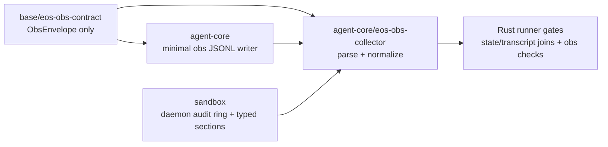
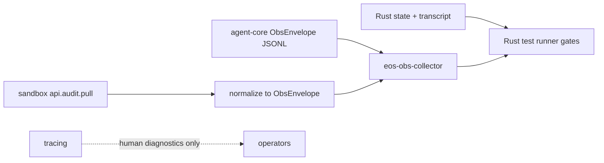
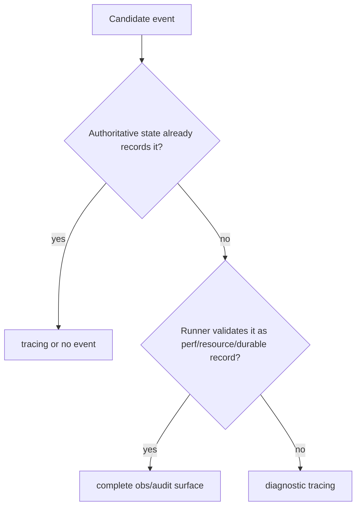

# Rust audit / observability consumption plan

## Goal

Build a Rust-only audit/observability contract for `agent-core/`, `sandbox/`, and
the Rust test runner gates.

Python under `backend/src` is legacy migration context only and will be dropped.
This plan does not add new Python audit code, does not preserve Python-specific
report shapes as a target, and must not introduce Python compatibility shims.
The target consumer is a Rust collector/test runner that validates:

- tool use
- performance stats
- resource usage
- message correctness

The design goal is a small, coherent consumption path, not a richer audit
framework.

## Rust-Only Boundary

This plan assumes the Python backend will be dropped later. All new audit,
observability, normalization, and runner/report behavior must therefore land in
Rust.

Allowed implementation targets:

- `base/crates/eos-obs-contract` for the shared row contract only.
- `agent-core/crates/*` for agent-control-plane producers, state/transcript
  joins, and future Rust runner logic.
- `sandbox/crates/*` for daemon audit pull/snapshot records and sandbox-local
  typed sections.

Disallowed targets:

- no new `backend/src` audit code
- no Python collector
- no Python report builder as a target contract
- no compatibility shim whose only purpose is preserving old Python event/report
  shapes
- no producer dependency on tracing output for runner pass/fail checks

Historical Python code can be read to understand old behavior, but it is not a
target, migration contract, or compatibility surface. The implementation source
of truth is the Rust checkout plus this plan.

## Current Direction

The shared layer now lives in:

- `base/crates/eos-obs-contract`

That crate is the only shared audit/observability module. It owns the normalized
contract row used by Rust collectors:

- `ObsEnvelope`
- `ObsIds`
- `ObsSource`
- `SCHEMA = "eos.obs.v1"`
- canonical event constants and aliases
- JSONL parse/serialize helpers

It must stay contract-only. It must not own sinks, daemon rings, tracing setup,
producer policy, plugin wrappers, report rendering, or test-runner orchestration.

## Target Module Shape



The shared module is intentionally narrower than an audit framework. `agent-core`
and `sandbox` keep their own local producer mechanics; only the normalized row is
shared.

## Architecture



| Surface | Owner | Guarantee | Consumer | Carries |
|---|---|---|---|---|
| Authoritative state and transcript | `agent-core` | complete by construction | Rust runner | tool use, terminal outcomes, message correctness |
| Agent-core obs JSONL | `agent-core` | complete or counted-loss in test mode | Rust runner | agent/tool durations, process resource samples |
| Sandbox audit ring | `sandbox` | bounded ring with seq/lane/loss counters | Rust runner through normalizer | sandbox timings, OCC, layer stack, overlay, background command, plugin/resource records |
| Tracing | owning Rust crate | best effort | humans only | reconstructable lifecycle shadows and diagnostics |

No row in this table is produced by Python, consumed by a Python runner, or
specified by a Python report shape.

## Event Routing Rule



Consequences:

- Tool use and message correctness come from Rust state/transcript, not audit
  shadows.
- Performance and resource data are event-only signals, so they must be emitted
  on a complete/counted-loss obs surface, never only through tracing.
- Reconstructable lifecycle rows such as `workflow.task.*`, agent-core
  `background_tool.*`, and dead `engine.tool.*` projections move to tracing or
  are deleted.

## Shared Contract

`base/crates/eos-obs-contract` is the normalized collector contract:

```json
{
  "schema": "eos.obs.v1",
  "source": "agent_core",
  "type": "tool_call.completed",
  "ids": {
    "request_id": "req-1",
    "task_id": "task-1",
    "agent_run_id": "ar-1",
    "tool_use_id": "toolu-1",
    "sandbox_id": "sbx-1"
  },
  "payload": {
    "tool_call": {
      "tool_name": "exec_command",
      "duration_ms": 42.0,
      "status": "ok"
    }
  }
}
```

Rules:

- `ids` contains ids only. Labels such as `tool_name` stay in `payload`.
- `payload` preserves native sections such as `tool_call`, `occ`,
  `layer_stack`, `overlay_workspace`, `background_tool`, `plugin`, and
  `os_resource`.
- Event categories are reader-side only. Do not add `category` to producer wire
  shapes.
- Canonical event names live in the contract. Legacy aliases can be normalized
  by the collector, but producers should emit canonical names.

## Producer Contracts

### Agent-core

Agent-core emits normalized `ObsEnvelope` JSONL directly.

Transition rule: until the remaining shadow producers are moved to tracing,
existing `eos-audit::AuditEvent` producers may be adapted at the sink boundary
with `AuditEvent::to_obs_envelope`. Do not add new old-shape JSONL producers.

Minimum event set:

| Event | Payload section | Purpose |
|---|---|---|
| `agent_run.completed` | `agent_run` | agent-run duration, status, exit reason |
| `tool_call.completed` | `tool_call` | per-tool duration, status, terminal flag, optional timings |
| `os_resource.sampled` | `os_resource` | process RSS/CPU/IO sample |

Do not emit audit rows for tool correctness or message correctness. The runner
reads those from state/transcript.

### Sandbox

Sandbox keeps `api.audit.pull` / `api.audit.snapshot` as the daemon-owned read
surface. The ring keeps its own native mechanics:

- seq
- lane
- bounded retention
- pressure/loss counters
- pull/snapshot RPCs

The Rust collector converts pulled daemon events into `ObsEnvelope` rows.

Required sandbox cleanup:

- Replace ad hoc dispatcher `json!` payload construction with typed
  `eos-protocol::audit::*Section` values.
- Canonicalize event names, especially `tool_call.finished` vs
  `tool_call.completed`.
- Wire `OsResourceSection` emission on a sample lane.
- Keep sandbox-native sections local to `sandbox`; do not force agent-core to use
  sandbox section structs.

### Rust Collector

`agent-core/crates/eos-obs-collector` is the reader-side Rust component. Its job
is to normalize inputs into `ObsEnvelope` rows and hand them to the Rust runner.

Inputs:

- agent-core `ObsEnvelope` JSONL
- sandbox `api.audit.pull` / `api.audit.snapshot` records
- Rust state/transcript stores for correctness joins

Responsibilities:

- parse agent-core JSONL rows with `eos-obs-contract`
- convert sandbox-native records to `ObsEnvelope`
- canonicalize aliases such as `tool_call.finished` to `tool_call.completed`
- attach/join stable ids such as `request_id`, `task_id`, `agent_run_id`,
  `tool_use_id`, and `sandbox_id`
- report counted loss from bounded audit surfaces

Non-responsibilities:

- no producer framework
- no sink abstraction shared with producers
- no tracing ingestion for pass/fail gates
- no Python report compatibility layer

### Tracing

Tracing is for human diagnostics only. It may carry:

- workflow task ready/launched/failed shadows
- subagent/background lifecycle shadows
- engine stream progress diagnostics
- publish failures and unexpected states

The Rust runner must not validate pass/fail criteria from tracing.

## Cleanup Plan

1. **Keep `base/eos-obs-contract` small.**
   - No internal EphemeralOS crate dependencies.
   - No runtime sinks.
   - No daemon ring logic.
   - No report builder.

2. **Shrink `agent-core/crates/eos-audit`.**
   - Delete `AuditEventBus`.
   - Delete dead `engine_stream` projection if no production caller exists.
   - Remove plugin audit wrappers unless they are wired to a real Rust execution
     path.
   - Remove redaction helpers if they become unused after deleting the engine
     projection.
   - Keep only the local agent-core obs writer/adapter needed to emit
     `ObsEnvelope` JSONL.

3. **Move reconstructable shadows to tracing.**
   - `workflow.task.*`
   - agent-core `background_tool.*`
   - dead `engine.tool.*` audit rows

4. **Reduce dependency edges.**
   - `eos-workflow` should not depend on audit after workflow shadows move to
     tracing.
   - `eos-engine` should depend on the minimal obs writer only where it emits
     real perf/resource rows.
   - `eos-tools` should not depend on audit unless a real tool-level emission
     site remains.

5. **Type sandbox emitters.**
   - Keep behavior and wire shape stable where possible.
   - Use canonical event names for new/changed emissions.
   - Add tests that pulled events normalize to valid `ObsEnvelope` rows.

6. **Keep the Rust collector narrow.**
   - Read agent-core obs JSONL.
   - Normalize sandbox daemon audit pull/snapshot events into `ObsEnvelope`.
   - Canonicalize aliases and extract join ids.
   - Report bounded-ring cursor/loss metadata.
   - Do not depend on Python code, Python reports, or legacy Python event
     schemas.

7. **Add Rust runner gates.**
   - Join normalized obs rows with Rust state/transcript evidence.
   - Fail on counted sandbox audit loss in strict test mode.
   - Require every expected `tool_use_id` from state/transcript to have a
     canonical `tool_call.completed` obs row.
   - Require tool duration/status payloads to be valid when a tool row exists.
   - Require at least one real `os_resource.sampled` metric row when resource
     gates are enabled.
   - Treat tool correctness and message correctness as external
     state/transcript assertions, not audit rows.
   - Do not render or preserve a Python report shape.

## Staged Execution

| Stage | Work | Verification |
|---|---|---|
| 0 | `base/crates/eos-obs-contract` contract crate | `cargo test --manifest-path base/Cargo.toml -p eos-obs-contract`; clippy |
| 1 | Update plan/docs to Rust-only contract direction | markdown review; no Python target paths or compatibility steps |
| 2 | Agent-core audit deletion pass | `cargo test -p eos-audit`; affected agent-core crates |
| 3 | Agent-core obs JSONL using `ObsEnvelope` | `cargo test -p eos-audit`; `cargo check -p eos-runtime`; JSONL smoke test |
| 4 | Shadow events to tracing + dependency edge cleanup | affected crate tests; dependency guard updates if still present |
| 5 | Sandbox typed emitters + resource samples | `cargo test -p eos-protocol -p eos-daemon`; pull smoke test |
| 6 | Rust collector normalizer in `agent-core/crates/eos-obs-collector` | normalization tests from agent-core row + sandbox pull event; no Python runner dependency |
| 7 | Rust runner gate API | state/transcript correctness evidence + obs perf/resource gates; no Python report contract |

Stages 2-4 and 5 can proceed in parallel if the only shared dependency is the
stable `base/eos-obs-contract` crate.

## Current Implementation Status

As of 2026-06-04, the Rust-only producer and normalizer path has moved forward
in the current checkout:

| Stage | Current status | Evidence |
|---|---|---|
| 0 | implemented | `base/crates/eos-obs-contract` owns `ObsEnvelope`, ids, source enum, canonical event aliases, and JSONL helpers |
| 1 | implemented | this plan has an explicit Rust-only boundary and no Python implementation target |
| 2 | implemented for agent-core writer scope | `agent-core/crates/eos-audit` is a small sink/event/jsonl crate with no downstream EphemeralOS deps |
| 3 | implemented for minimum agent-core events | `eos-engine` emits `agent_run.completed`, `tool_call.completed`, and `os_resource.sampled`; `eos-audit` JSONL serializes `ObsEnvelope` rows |
| 4 | implemented for the named shadows | `workflow.task.*` and agent-core `background_tool.*` are tracing diagnostics; `eos-workflow` has no audit dependency |
| 5 | first daemon dispatch slice implemented | `sandbox/crates/eos-daemon/src/audit_events.rs` emits typed `eos-protocol::audit::*Section` payloads and sample-lane `os_resource.sampled` rows |
| 6 | implemented for normalizer | `agent-core/crates/eos-obs-collector` parses agent-core JSONL, normalizes sandbox pull events to `ObsEnvelope`, canonicalizes aliases, extracts join ids, and reports pull loss metadata |
| 7 | first source/gate API implemented | `eos-obs-collector::evaluate_runner_gate_sources` accepts agent-core JSONL text, raw sandbox pull/snapshot response values, typed `ExpectedToolUse` records, typed external state/transcript correctness evidence, and strict/resource gate settings; the collector parses, normalizes, merges sandbox loss, and returns a self-contained Rust `RunnerGateReport` JSON artifact with pass/fail, failures, metrics, expected tool uses, settings, correctness evidence, and sandbox loss |

### Verification sweep (2026-06-04)

The claimed status above was re-verified green in the current churned checkout:

- Stage 0: `cargo test --manifest-path base/Cargo.toml -p eos-obs-contract` (3 pass) and its clippy gate are clean.
- Stage 1: the Rust-only doc guard matches only the boundary section and explicit non-goals.
- Stage 2: `cargo test -p eos-audit` passes `eos_audit_internal_deps_are_base_contracts_only`, and the `workspace-guard` `dependency_dag` test confirms the expected edge set; `eos-audit` depends only on `eos-obs-contract` + `eos-types`.
- Stage 3: `cargo test -p eos-engine` (43 pass) covers the `tool_call.completed` emission; `eos-engine` emits `agent_run.completed` / `os_resource.sampled` from `agent_loop.rs` and `tool_call.completed` from `tool_call/dispatch.rs`; `eos-runtime` builds.
- Stage 4: `eos-workflow` has zero `eos-audit` references.
- Stage 5: `cargo test -p eos-daemon audit` (7 pass, incl. `dispatch_audit_emits_typed_tool_call_and_resource_sample` and `audit_pull_reads_shared_daemon_ring`) and `cargo test -p eos-protocol audit` (4 pass).
- Stages 6–7: `cargo test -p eos-obs-collector` (14 pass) and its clippy gate are clean.

Coherence note (outside the obs/audit scope): `sandbox/crates/eos-daemon` did not compile in this checkout because the parallel `RunnerVerb` enum migration (commit `d65517f7f`, `eos-runner::request`) left three call sites passing raw `String`/`&str` verbs — `plugin/overlay.rs:287`, `workspace_ops.rs:429`, `workspace_ops.rs:492`. These were unblocked in the working tree with `.into()` (the existing `From<&str>`/`From<String>` impls map known verbs to typed variants; the compiler's `Unknown(...)` suggestion would mislabel `plugin_service`). This belongs to the `RunnerVerb` refactor owner, not the obs/audit work, and is intentionally not folded into any obs commit.

## Next Rust Implementation Step

The Stage 7 source and gate APIs live in
`agent-core/crates/eos-obs-collector/src/gates.rs`. The narrow runner handoff is
`evaluate_runner_gate_sources`: a future runner supplies agent-core JSONL text,
raw sandbox pull/snapshot response values, typed `ExpectedToolUse` records,
typed `RunnerCorrectnessEvidence`, and gate settings. The collector parses and
normalizes the source artifacts, merges sandbox loss metadata, and returns a
typed `RunnerGateReport` with pass/fail, failure kinds, and basic metrics.

`RunnerGateReport`, `RunnerGateFailure`, `RunnerGateMetrics`,
`RunnerGateSettings`, `RunnerCorrectnessEvidence`, `ExpectedToolUse`,
`RunnerGateSourceInput`, `SandboxPullBatch`, and `SandboxAuditLoss` are Rust
artifact types. They intentionally do not ingest tracing, call Python, render a
Python-shaped report, or invent audit rows for state facts that are already
authoritative.

The report artifact carries enough context to explain a gate result without
replaying the evaluator: gate settings, supplied state/transcript correctness
evidence, optional sandbox loss metadata, aggregate metrics, and typed failure
kinds are serialized together. `RunnerCorrectnessEvidence` records both the
boolean gate evidence and the checked counts for tool-use and message/transcript
assertions; the gate fails when tool-use evidence covers fewer checks than the
expected tool-use set or when message correctness evidence reports zero checked
assertions.

For callers that already normalized sources, `evaluate_runner_gate_batches`
still accepts agent-core rows plus one or more `SandboxPullBatch` values,
flattens all normalized rows, merges sandbox loss with
`SandboxAuditLoss::merge`, and then uses the same gate evaluator. This keeps
row parsing, row flattening, and loss-summary logic in the collector instead of
making every runner duplicate it.

Remaining Stage 7 integration work is to wire the future runner so it supplies:

- agent-core obs JSONL source text
- sandbox pull/snapshot response values from `api.audit.pull` /
  `api.audit.snapshot`
- typed `ExpectedToolUse` records from Rust state/transcript
- typed evidence that Rust state/transcript checks already verified tool
  correctness and message correctness, including checked counts

Current resource sampling cadence:

- agent-core samples once at agent-run completion when the audit sink is enabled
- sandbox samples per audited daemon dispatch when cgroup CPU/IO timings are
  present, on the sample lane

## Verification Gates

- `base`: `cargo test --manifest-path base/Cargo.toml -p eos-obs-contract`
- `base`: `cargo clippy --manifest-path base/Cargo.toml -p eos-obs-contract --all-targets -- -D warnings`
- `agent-core`: targeted crate tests from the owning workspace.
- `agent-core`: `cargo test -p eos-obs-collector`; `cargo clippy -p eos-obs-collector --all-targets -- -D warnings`
- `sandbox`: targeted crate tests from the owning workspace.
- Rust-only doc guard: `rg -n "backend/src|Python collector|Python report|compatibility shim" docs/plans/audit_observability_test_consumption_PLAN.md`
  should only match the Rust-only boundary and explicit non-goals.
- Normalization smoke:
  - one agent-core `ObsEnvelope` JSONL row parses
  - one sandbox `api.audit.pull` event normalizes to `ObsEnvelope`
  - `tool_call.finished` aliases to `tool_call.completed`
  - `tool_use_id` joins agent-core and sandbox rows for the same tool call
- Runner gate smoke:
  - strict audit loss fails
  - missing expected `tool_use_id` fails
  - missing external state/transcript correctness evidence fails
  - invalid tool duration/status payloads fail
  - resource gate requires a real metric-bearing `os_resource.sampled` row
  - `RunnerGateReport` round-trips through stable JSON with snake_case failure
    kinds, expected tool uses, settings, correctness evidence, metrics, and
    sandbox loss metadata
  - correctness evidence round-trips with tool/message checked counts
  - correctness count coverage is enforced for expected tool uses and message
    assertions
  - sandbox pull losses merge across multiple batches before strict loss gates
  - batch evaluator flattens agent-core rows plus sandbox batch rows
  - source evaluator parses agent-core JSONL plus sandbox pull responses before
    running the same gates

## Open Decisions

- Whether agent-core keeps the crate name `eos-audit` for its local writer or
  renames to an obs-focused name.
- Whether resource sampling needs additional cadence beyond the current
  agent-run-completion and audited-dispatch samples.
- Whether isolated-workspace JSONL remains a separate sandbox source or is
  mirrored into the daemon audit ring.
- Where the future full Rust test runner crate should live. The audit/obs source
  and gate helper stays in `eos-obs-collector`; a future harness should call
  `evaluate_runner_gate_sources` rather than owning a separate audit report
  shape.
- How the future runner derives state/transcript correctness evidence and
  checked counts from Rust stores without relying on audit rows.

## Risks

- Do not let `base/` become a junk drawer. If a type needs runtime state, sinks,
  locks, async tasks, daemon lanes, or report rendering, it does not belong in
  `base/`.
- Do not validate runner pass/fail criteria from tracing.
- Do not create a shared producer framework across `agent-core` and `sandbox`.
  Share only the normalized contract.
- Verify correlation wiring explicitly. The join depends on the provider
  `tool_use_id` flowing into sandbox invocation metadata or an explicit mapping
  row.
- Keep edits scoped around concurrent work in `agent-core/` and `sandbox/`; this
  repo often has parallel agent edits in progress.
