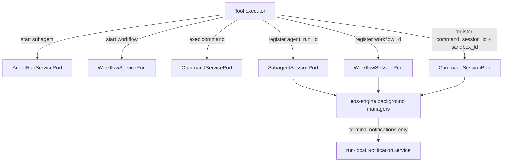

# Background Session and Runtime Service Cleanup - SPEC

Status: Implemented
Date: 2026-06-08
Owner: agent-core engine / tools / runtime
Scope: `agent-core/crates/eos-ports`, `agent-core/crates/eos-tools`,
`agent-core/crates/eos-engine`, `agent-core/crates/eos-runtime`
Supersedes: the earlier implemented
`docs/plans/background_session_manager_refactor_SPEC.md` target shape.
Related:
- `docs/plans/agent_run_local_background_supervisor_SPEC.md`
- `docs/plans/uniform_recursive_cancellation_SPEC.md`
- `docs/plans/runtime_services_tool_metadata_split_SPEC.md`
- `docs/plans/daemon_workspace_run_registry_SPEC.md`

## 1. Problem

The current Rust background session path still mixes these responsibilities:

- model-facing tool orchestration,
- subagent launch through `run_agent`,
- workflow lifecycle control through `WorkflowControlPort`,
- sandbox command execution and command-result replay policy,
- background session registration,
- background terminal polling,
- notification delivery,
- parent-run teardown.

That makes `eos-engine/src/background` broader than its intended ownership.
Background should not start a subagent, start a workflow, start a command, render
progress, or own command replay policy. It should only track background sessions
owned by one agent run, detect terminal completion, push completion
notifications, count running sessions, and cancel all running sessions for that
agent run.

The tool layer should remain the orchestrator: parse input, validate arguments,
call the resource service, decide whether to register a background session, and
render the `ToolResult`. Runtime services should expose backend capabilities
across crate boundaries. Background session managers should remain passive
registries plus terminal pollers.

## 2. Goals

- Add an `eos-ports` crate for narrow trait contracts and DTOs shared across
  `eos-tools` and `eos-engine`.
- Move resource service contracts into `eos-ports/src/{agent_run,workflow,command}.rs`.
- Put each background session port beside its resource service port:
  `SubagentSessionPort` in `agent_run.rs`, `WorkflowSessionPort` in
  `workflow.rs`, and `CommandSessionPort` in `command.rs`.
- Add concrete runtime service implementations under
  `eos-engine/src/services/{agent_run,workflow,command}.rs`.
- Keep `workflow.rs` service implementation in `eos-engine/src/services/`, even
  if it wraps `eos-workflow` internals.
- Remove `eos-engine/src/background/factory.rs`.
- Remove `WorkflowControlPort` / `workflow_control` from the background and tool
  wiring path; replace it with `WorkflowServicePort`.
- Remove subagent launch from the background module; `run_subagent` should use
  `AgentRunServicePort`, then register the returned agent run with
  `SubagentSessionPort`.
- Remove command-result replay APIs from background session management:
  `command_session_result`, `mark_command_session_reported`, and
  `command_session_already_reported`.
- Remove model-facing progress and cancellation-result rendering from background
  ports and managers.
- Assign every per-kind background session manager the owning `agent_run_id` at
  construction. No manager method should accept an owner/caller id per
  operation.
- Keep `ExecutionMetadata` facts-only. Do not add service ports or managers to
  `ToolExecutionData`, `ExecutionMetadata`, or any equivalent service bag.
- Register tools through constructors that capture only the services each tool
  needs.

## 3. Non-Goals

- No broad `eos-services` crate in this pass.
- No generic public `BackgroundPollKey`.
- No shared public background-session interface.
- No `background.rs` file in `eos-ports`; each session port lives in the
  corresponding kind file.
- No `RegisterSubagentSession`, `RegisterWorkflowSession`, or
  `RegisterCommandSession` DTO just to wrap one registration call.
- No port method that accepts model-facing tool input structs.
- No port method that renders `ToolResult`.
- No direct `eos-tools -> eos-engine` dependency.
- No inheritance-style trait hierarchy or abstract-base-style module.
- No progress polling in background terminal polling.
- No command "already reported" state in background.

## 4. Ownership Model



| Layer | Owns |
| --- | --- |
| `eos-tools` tool executors | parsing, validation, call ordering, registration decision, model-facing rendering |
| `eos-ports` | trait contracts and typed request/response DTOs only |
| `eos-engine/src/services` | concrete backend capabilities for agent runs, workflows, and commands |
| `eos-engine/src/background` | per-agent-run session maps, terminal polling, counts, cancel-all, notifications |
| `eos-runtime` | composition of concrete services, run controls, registries, and tool constructors |

Per-run background invariant:

```text
Every BackgroundSessionRuntime is owned by exactly one agent_run_id.
Every SubagentSessionManager, WorkflowSessionManager, and CommandSessionManager
inside that runtime is constructed with the same owning agent_run_id.
No background session manager accepts an owner/caller id in register, count,
cancel, or poll methods.
```

## 5. Target File and Folder Structure

```text
agent-core/crates/
  eos-ports/
    Cargo.toml
    src/
      lib.rs
      agent_run.rs
      workflow.rs
      command.rs

  eos-tools/src/
    ports/
      mod.rs                 # removed or reduced to re-export eos-ports during migration
    tools/
      services.rs            # constructor helpers only, no service bag for execution data
      subagent/
        mod.rs
        run_subagent.rs
        check_subagent_progress.rs
        cancel_subagent.rs
      workflow/
        mod.rs
        delegate_workflow.rs
        check_workflow_status.rs
        cancel_workflow.rs
      sandbox/
        exec_command.rs
        write_stdin.rs
        read_command_progress.rs

  eos-engine/src/
    services/
      mod.rs
      agent_run.rs            # impl AgentRunServicePort
      workflow.rs             # impl WorkflowServicePort; wraps eos-workflow
      command.rs              # impl CommandServicePort; wraps eos-sandbox-port
    background/
      mod.rs
      notification.rs
      session_runtime.rs      # aggregate over the three managers; no launching
      session_managers/
        mod.rs
        subagent/
          mod.rs
          manager.rs          # impl SubagentSessionPort
          monitor.rs
          session.rs
        workflow/
          mod.rs
          manager.rs          # impl WorkflowSessionPort
          monitor.rs
          session.rs
        command/
          mod.rs
          manager.rs          # impl CommandSessionPort
          monitor.rs
          session.rs
      # factory.rs deleted

  eos-runtime/src/
    entry.rs                  # composes concrete services and session managers
    agent_runner.rs           # passes constructor-captured services to workflow agents
```

Workspace changes:

```toml
# agent-core/Cargo.toml
[workspace]
members = [
  "crates/eos-ports",
  # existing crates...
]

[workspace.dependencies]
eos-ports = { path = "crates/eos-ports" }
```

Dependency direction:

```text
eos-tools   -> eos-ports
eos-engine  -> eos-ports, eos-tools, eos-workflow, eos-sandbox-port
eos-runtime -> eos-engine, eos-ports
```

## 6. Port Contracts

### 6.1 `eos-ports/src/agent_run.rs`

`AgentRunServicePort` is the resource service used by `run_subagent` and by the
subagent background poller. It does not parse tool input or render tool output.

```rust
#[async_trait::async_trait]
pub trait AgentRunServicePort: Sealed + Send + Sync {
    async fn start_subagent_run(
        &self,
        request: StartSubagentRunRequest,
    ) -> Result<StartedSubagentRun, ToolError>;

    async fn poll_terminal_agent_run(
        &self,
        agent_run_id: &AgentRunId,
    ) -> Result<Option<TerminalAgentRun>, ToolError>;

    async fn cancel_agent_run(
        &self,
        agent_run_id: &AgentRunId,
        reason: &str,
    ) -> Result<(), ToolError>;
}
```

`SubagentSessionPort` is the background-session port implemented by
`SubagentSessionManager`.

```rust
#[async_trait::async_trait]
pub trait SubagentSessionPort: Sealed + Send + Sync {
    async fn register_background_session(&self, agent_run_id: &AgentRunId);
    async fn cancel_all_background_sessions(&self, reason: &str);
    async fn poll_complete_background_sessions(&self) -> usize;
}
```

Registration uses `agent_run_id` because the agent run row is the authoritative
resource the background poller checks.

### 6.2 `eos-ports/src/workflow.rs`

`WorkflowServicePort` replaces the old tool/background use of
`WorkflowControlPort`.

```rust
#[async_trait::async_trait]
pub trait WorkflowServicePort: Sealed + Send + Sync {
    async fn start_workflow(
        &self,
        request: StartWorkflowRequest,
    ) -> Result<StartedWorkflow, ToolError>;

    async fn poll_terminal_workflow(
        &self,
        workflow_id: &WorkflowId,
    ) -> Result<Option<TerminalWorkflow>, ToolError>;

    async fn cancel_workflow(
        &self,
        workflow_id: &WorkflowId,
        reason: &str,
    ) -> Result<(), ToolError>;

    async fn find_outstanding_workflows(
        &self,
        parent_task_id: &TaskId,
        agent_run_id: &AgentRunId,
    ) -> Result<Vec<OutstandingWorkflow>, ToolError>;

    async fn workflow_depth(&self, workflow_id: &WorkflowId) -> Result<u32, ToolError>;
}
```

`WorkflowSessionPort` is the background-session port implemented by
`WorkflowSessionManager`.

```rust
#[async_trait::async_trait]
pub trait WorkflowSessionPort: Sealed + Send + Sync {
    async fn register_background_session(&self, workflow_id: &WorkflowId);
    async fn cancel_all_background_sessions(&self, reason: &str);
    async fn poll_complete_background_sessions(&self) -> usize;
}
```

Registration uses `workflow_id` because workflow state is the authoritative
resource the background poller checks. If `workflow_task_id` remains needed for
workflow cancellation during migration, that mapping belongs inside
`WorkflowService`, not in the background registration API.

### 6.3 `eos-ports/src/command.rs`

`CommandServicePort` wraps sandbox command operations. It is a resource service,
not background bookkeeping.

```rust
#[async_trait::async_trait]
pub trait CommandServicePort: Sealed + Send + Sync {
    async fn exec_command(
        &self,
        request: StartCommandRequest,
    ) -> Result<CommandStartResult, ToolError>;

    async fn write_stdin(
        &self,
        request: WriteCommandStdinRequest,
    ) -> Result<CommandUpdateResult, ToolError>;

    async fn read_command_progress(
        &self,
        request: ReadCommandProgressRequest,
    ) -> Result<CommandUpdateResult, ToolError>;

    async fn collect_completed_commands(
        &self,
        sandbox_id: &SandboxId,
        caller_id: &AgentRunId,
        command_session_ids: &[CommandSessionId],
    ) -> Result<Vec<CompletedCommand>, ToolError>;

    async fn cancel_commands_for_run(
        &self,
        sandbox_id: &SandboxId,
        caller_id: &AgentRunId,
        reason: &str,
    ) -> Result<(), ToolError>;
}
```

`CommandSessionPort` is the background-session port implemented by
`CommandSessionManager`.

```rust
#[async_trait::async_trait]
pub trait CommandSessionPort: Sealed + Send + Sync {
    async fn register_background_session(
        &self,
        command_session_id: &CommandSessionId,
        sandbox_id: &SandboxId,
    );

    async fn cancel_all_background_sessions(&self, reason: &str);
    async fn poll_complete_background_sessions(&self) -> usize;
}
```

Registration uses `command_session_id` and `sandbox_id`. The caller id is the
owning `agent_run_id` already stored by the per-run `CommandSessionManager`.

## 7. Tool Constructor Wiring

No services should be added to `ExecutionMetadata`, `ToolExecutionData`, or any
equivalent per-call fact object.

Tools should capture the services they need in their constructors:

```rust
RunSubagent::new(agent_run_service, subagent_sessions)
DelegateWorkflow::new(workflow_service, workflow_sessions)
CheckWorkflowStatus::new(workflow_service)
CancelWorkflow::new(workflow_service)
ExecCommand::new(command_service, command_sessions)
WriteStdin::new(command_service)
ReadCommandProgress::new(command_service)
```

The tool remains responsible for orchestration. Example target flow:

```rust
let started = agent_run_service.start_subagent_run(request).await?;
subagent_sessions
    .register_background_session(&started.agent_run_id)
    .await;
Ok(render_subagent_launched(started))
```

```rust
let started = workflow_service.start_workflow(request).await?;
workflow_sessions
    .register_background_session(&started.workflow_id)
    .await;
Ok(render_workflow_started(started))
```

```rust
let result = command_service.exec_command(request).await?;
if result.is_running() {
    if let Some(command_session_id) = result.command_session_id() {
        command_sessions
            .register_background_session(command_session_id, sandbox_id)
            .await;
    }
}
Ok(render_command_result(result))
```

## 8. Engine Services

### 8.1 `services/agent_run.rs`

`AgentRunService` owns the concrete engine-side capability to start, poll, and
cancel agent runs. It may use:

- `run_agent`,
- `AgentRunControlFactory`,
- `AgentRunRegistry`,
- `EngineRunHandles`,
- `AgentRunStore`,
- agent registry validation.

The service must not render `run_subagent` model-facing text. It returns typed
facts such as `StartedSubagentRun` and `TerminalAgentRun`.

### 8.2 `services/workflow.rs`

`WorkflowService` owns the concrete workflow lifecycle adapter. It may use:

- `eos-workflow` starter/control logic,
- workflow, iteration, attempt, and task stores,
- cancellation recursion through the runtime cancel port,
- workflow-depth and outstanding-workflow queries required by hooks and tools.

The old `WorkflowControlPort` name and `workflow_control` field should disappear
from tool and background wiring. Migration may keep a compatibility shim
internally for a short period, but public code should move to
`WorkflowServicePort`.

### 8.3 `services/command.rs`

`CommandService` owns the concrete sandbox command adapter. It may use:

- `eos-sandbox-port::exec_command`,
- `eos-sandbox-port::write_stdin`,
- `eos-sandbox-port::read_command_progress`,
- `eos-sandbox-port::collect_command_completions`,
- `eos-sandbox-port::cancel_workspace_runs_by_caller_id`,
- the sandbox transport.

It should return typed command results for tool rendering. It should not store
background state.

## 9. Background Managers

Each manager implements its corresponding session port directly in its
`manager.rs` file.

```text
session_managers/subagent/manager.rs
  impl SubagentSessionPort for SubagentSessionManager

session_managers/workflow/manager.rs
  impl WorkflowSessionPort for WorkflowSessionManager

session_managers/command/manager.rs
  impl CommandSessionPort for CommandSessionManager
```

Every manager is constructed with the owning `agent_run_id` and its kind-specific
resource service:

```rust
SubagentSessionManager::new(
    agent_run_id.clone(),
    agent_run_service.clone(),
    notification.clone(),
)

WorkflowSessionManager::new(
    agent_run_id.clone(),
    workflow_service.clone(),
    notification.clone(),
)

CommandSessionManager::new(
    agent_run_id.clone(),
    command_service.clone(),
    notification,
)
```

Target fields:

```rust
pub(super) struct SubagentSessionManager {
    agent_run_id: AgentRunId,
    sessions: Arc<Mutex<HashMap<AgentRunId, SubagentSession>>>,
    agent_run_service: Arc<dyn AgentRunServicePort>,
    notification: BackgroundNotificationEmitter,
}

pub(super) struct WorkflowSessionManager {
    agent_run_id: AgentRunId,
    sessions: Arc<Mutex<HashMap<WorkflowId, WorkflowSession>>>,
    workflow_service: Arc<dyn WorkflowServicePort>,
    notification: BackgroundNotificationEmitter,
}

pub(super) struct CommandSessionManager {
    agent_run_id: AgentRunId,
    sessions: Arc<Mutex<HashMap<CommandSessionId, CommandSession>>>,
    command_service: Arc<dyn CommandServicePort>,
    notification: BackgroundNotificationEmitter,
}
```

Each manager exposes these concrete methods:

```rust
register_background_session(...)
count_background_sessions() -> usize
cancel_all_background_sessions(reason)
poll_complete_background_sessions() -> usize
push_notification_on_background_session_completion(...)
```

`poll_complete_background_sessions` is terminal-only. It does not report
progress.

### 9.1 Subagent Polling

`SubagentSessionManager::poll_complete_background_sessions`:

1. Snapshot running `agent_run_id`s.
2. For each `agent_run_id`, call
   `AgentRunServicePort::poll_terminal_agent_run(agent_run_id)`.
3. If the run is not terminal, continue.
4. If terminal, settle the local session.
5. Push one background completion notification.
6. Return the number of delivered completions.

Terminal source: `AgentRun.finished_at`.
Notification data source: terminal tool result or run error.

### 9.2 Workflow Polling

`WorkflowSessionManager::poll_complete_background_sessions`:

1. Snapshot running `workflow_id`s.
2. For each `workflow_id`, call
   `WorkflowServicePort::poll_terminal_workflow(workflow_id)`.
3. If the workflow is not terminal, continue.
4. If terminal, settle the local session.
5. Push one background completion notification.
6. Return the number of delivered completions.

Terminal source: typed workflow lifecycle state. Do not parse rendered
`check_workflow_status` text.

### 9.3 Command Polling

`CommandSessionManager::poll_complete_background_sessions`:

1. Snapshot running command sessions grouped by `sandbox_id`.
2. For each group, call
   `CommandServicePort::collect_completed_commands(sandbox_id, self.agent_run_id, ids)`.
3. If no completion is returned for an id, it remains running.
4. For each returned completion, settle the local session.
5. Push one background completion notification.
6. Return the number of delivered completions.

Terminal source: sandbox daemon `api.v1.command.collect_completed`.

## 10. Background Runtime

`BackgroundSessionRuntime` is an aggregate root only. It owns three managers and
their monitors:

```rust
pub(super) struct BackgroundSessionRuntime {
    agent_run_id: AgentRunId,
    subagent_session_manager: Arc<SubagentSessionManager>,
    workflow_session_manager: Arc<WorkflowSessionManager>,
    command_session_manager: Arc<CommandSessionManager>,
    _subagent_monitor: SubagentSessionMonitor,
    _workflow_monitor: WorkflowSessionMonitor,
    _command_monitor: CommandSessionMonitor,
}
```

`BackgroundSessionRuntime::new` must pass the same `agent_run_id` into all three
managers:

```rust
let subagent_session_manager = Arc::new(SubagentSessionManager::new(
    agent_run_id.clone(),
    agent_run_service,
    notification.clone(),
));
let workflow_session_manager = Arc::new(WorkflowSessionManager::new(
    agent_run_id.clone(),
    workflow_service,
    notification.clone(),
));
let command_session_manager = Arc::new(CommandSessionManager::new(
    agent_run_id.clone(),
    command_service,
    notification,
));
```

It should expose:

```rust
fn subagent_sessions(&self) -> Arc<dyn SubagentSessionPort>;
fn workflow_sessions(&self) -> Arc<dyn WorkflowSessionPort>;
fn command_sessions(&self) -> Arc<dyn CommandSessionPort>;

async fn count_background_sessions(&self) -> BackgroundSessionCounts;
async fn cancel_all_background_sessions(&self, reason: &str) -> BackgroundSessionCounts;
async fn teardown(&self, reason: &str) -> BackgroundSessionCounts;
```

It should not expose `spawn`, `progress`, `mark_workflow_cancelled`,
`command_session_result`, `mark_command_session_reported`, or
`command_session_already_reported`.

`BackgroundSessionFinalizer` should call `teardown(reason)` without
`workflow_control`.

## 11. Removal and Cleanup Inventory

This is a cleanup plan, not only an additive migration. Remove or replace these
items and any equivalents found during implementation:

| Remove / replace | Target |
| --- | --- |
| `eos_tools::ports::WorkflowControlPort` | `eos_ports::workflow::WorkflowServicePort` |
| fields/args named `workflow_control` | `workflow_service` where a workflow service is actually needed |
| `WorkflowControlCell` / `OnceLock<Arc<dyn WorkflowControlPort>>` in background | direct `WorkflowServicePort` dependency in `WorkflowSessionManager` |
| `BackgroundSessionPort::spawn` | `AgentRunServicePort::start_subagent_run` plus `SubagentSessionPort::register_background_session` |
| `SubagentLaunch`, `SpawnedSubagent`, `SubagentLaunchRejection` in background port | tool-owned input/validation plus service DTOs |
| `BackgroundSessionPort::progress` | tool-specific status/progress path outside background |
| `BackgroundSessionPort::mark_workflow_cancelled` | workflow cancellation through `WorkflowServicePort` |
| `BackgroundSessionPort::teardown(workflow_control, reason)` | `teardown(reason)` |
| `CommandSessionPort::command_session_result` | command tool/service result path |
| `CommandSessionPort::mark_command_session_reported` | remove from background; command replay policy cannot live in session manager |
| `CommandSessionPort::command_session_already_reported` | remove from background |
| `BackgroundSessionFactory` / `background/factory.rs` | direct construction in `AgentRunControlFactory` or runtime setup |
| service fields in `ExecutionMetadata` or `ToolExecutionData` | constructor-captured tool services |
| broad `BackgroundSessionPort` | per-kind `SubagentSessionPort`, `WorkflowSessionPort`, `CommandSessionPort` |
| `background.rs` in `eos-ports` | kind-local session ports in `agent_run.rs`, `workflow.rs`, `command.rs` |

Implementation should search for equivalent legacy names, including:

- `workflow_control`
- `WorkflowControlPort`
- `BackgroundSessionPort`
- `SubagentLaunch`
- `SpawnedSubagent`
- `mark_workflow_cancelled`
- `command_session_result`
- `mark_command_session_reported`
- `command_session_already_reported`
- `BackgroundSessionFactory`

## 12. Migration Plan

| Phase | Work |
| --- | --- |
| 1 | Add `eos-ports` crate and move/redefine port contracts without changing behavior. |
| 2 | Add `eos-engine/src/services/{agent_run,workflow,command}.rs` concrete service implementations. |
| 3 | Refactor tool constructors to capture resource services and per-kind session ports directly. |
| 4 | Move subagent launch out of background into `AgentRunService`; `run_subagent` starts then registers by `agent_run_id`. |
| 5 | Replace `WorkflowControlPort` usage with `WorkflowServicePort`; remove `workflow_control` from background runtime/finalizer. |
| 6 | Replace command background replay APIs with command service/tool behavior; keep background command manager terminal-only. |
| 7 | Delete `background/factory.rs`; construct per-run background services/managers directly from runtime/control factory. |
| 8 | Remove broad `BackgroundSessionPort` and old compatibility shims once all call sites use per-kind ports. |
| 9 | Run focused checks and update tests/fakes to the new service/session port split. |

## 13. Acceptance Criteria

- `agent-core/crates/eos-ports` exists and is included in the workspace.
- `eos-ports` has only `agent_run.rs`, `workflow.rs`, `command.rs`, and
  `lib.rs` for this feature; no `background.rs`.
- `eos-tools` depends on `eos-ports`, not `eos-engine`.
- `eos-engine/src/services/{agent_run,workflow,command}.rs` provide concrete
  implementations of the resource service ports.
- `workflow.rs` service implementation lives under `eos-engine/src/services/`.
- `SubagentSessionManager`, `WorkflowSessionManager`, and
  `CommandSessionManager` each implement their corresponding session port in
  their own `manager.rs`.
- `SubagentSessionManager`, `WorkflowSessionManager`, and
  `CommandSessionManager` are each constructed with the owning `agent_run_id`.
- All three managers inside one `BackgroundSessionRuntime` carry the same
  `agent_run_id`.
- No background session manager method accepts an owner/caller id per operation.
- `register_background_session` signatures use direct authoritative backend
  handles:
  - subagent: `agent_run_id`,
  - workflow: `workflow_id`,
  - command: `command_session_id` and `sandbox_id`.
- Each manager has:
  - `register_background_session`,
  - `count_background_sessions`,
  - `cancel_all_background_sessions`,
  - `poll_complete_background_sessions`,
  - `push_notification_on_background_session_completion`.
- `poll_complete_background_sessions` is terminal-only and never reports
  progress.
- No background manager starts an agent run, starts a workflow, or starts a
  command.
- No background API contains `progress`, `mark_workflow_cancelled`,
  `command_session_result`, `mark_command_session_reported`, or
  `command_session_already_reported`.
- No `workflow_control` field or argument remains in the background module.
- `ExecutionMetadata` remains service-free.
- No service ports are added to `ToolExecutionData` or equivalent per-call
  execution-data structs.
- `BackgroundSessionFactory` is removed.
- Focused verification passes:
  - `cd agent-core && cargo check -p eos-ports --all-targets`
  - `cd agent-core && cargo check -p eos-tools --all-targets`
  - `cd agent-core && cargo check -p eos-engine --all-targets`
  - targeted unit tests for subagent, workflow, and command manager polling and
    cancellation.

## 14. Progress Tracker

| Phase | Status | Work |
| --- | --- | --- |
| 1 | Completed | Add `eos-ports` crate and workspace dependency entries. |
| 2 | Completed | Add resource service implementations under `eos-engine/src/services`. |
| 3 | Completed | Split tool constructors by resource service and session port. |
| 4 | Completed | Move subagent launching out of background. |
| 5 | Completed | Replace tool/background `WorkflowControlPort` / `workflow_control` wiring with `WorkflowServicePort`; keep the compatibility trait only in `eos-ports` plus runtime/workflow adapter internals. |
| 6 | Completed | Remove command replay APIs from background session management. |
| 7 | Completed | Delete `background/factory.rs` and simplify background runtime construction. |
| 8 | Completed | Remove broad `BackgroundSessionPort` and compatibility fakes/tests. |
| 9 | Completed | Run focused cargo checks and targeted manager/tool tests. |
