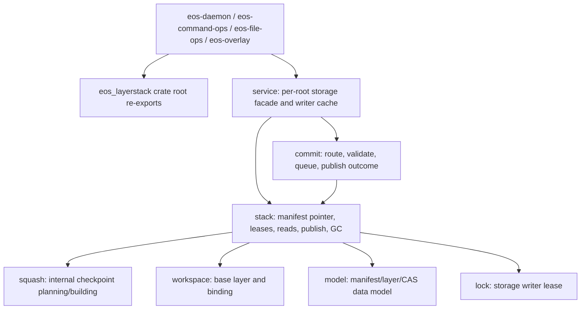

# eos-layerstack Source Consolidation SPEC

Status: Proposed
Date: 2026-06-11
Owner: sandbox/crates
Scope: `sandbox/crates/eos-layerstack/src` and the crate-local
`sandbox/crates/eos-layerstack/tests` files needed to keep coverage after
private API cleanup.

## 1. Goal

Aggressively reduce the `eos-layerstack` source footprint while preserving its
current ownership boundary: pure durable layer-stack storage plus the per-root
single-writer commit front door.

This is a source-structure cleanup, not a behavior migration. The refactor
should make the crate easier to scan by collapsing test-shaped and
public-surface-shaped splits into real ownership files, deleting junk files, and
removing duplicate helper code. The LOC budget in Section 6 and the final tree
in Section 7 are acceptance criteria.

## 2. Baseline

Measured on 2026-06-11:

```sh
find sandbox/crates/eos-layerstack/src -name '*.rs' -type f | sort | wc -l
wc -l $(find sandbox/crates/eos-layerstack/src -name '*.rs' -type f | sort)
```

Baseline:

- Rust source files under `src`: 23
- Rust source LOC under `src`: 5,538
- Junk source-tree files: `sandbox/crates/eos-layerstack/src/.DS_Store`

Largest current implementation files:

| File | LOC | Ownership smell |
| --- | ---: | --- |
| `stack.rs` | 747 | Correct core owner, but split awkwardly beside `stack/`. |
| `workspace_base.rs` | 542 | Should be one workspace-binding/base owner, not two public modules. |
| `commit/transaction.rs` | 471 | One implementation of a test-shaped port. |
| `commit/queue.rs` | 460 | Generic queue exposed beyond the crate need. |
| `service.rs` | 438 | Correct facade, but depends on over-public commit internals. |
| `squash.rs` | 372 | Internal checkpoint planner exposed as public API mostly for tests. |

Public API diagnosis:

- Production consumers mostly use crate-root re-exports plus
  `eos_layerstack::service`.
- `lib.rs` currently exposes implementation modules (`model`, `squash`,
  `stack`, `storage_lock`, `workspace_base`, `workspace_binding`) that are not
  required as module paths by production consumers.
- `commit/mod.rs` says the queue/transaction machinery is internal, but
  `commit::{error,outcome,prepare,queue,transaction}` are all public modules.
- `tests/squash_lease_segmentation.rs` is the only important non-production
  pressure keeping squash plan types externally public.

## 3. Non-Goals

- Do not merge `eos-layerstack` into `eos-occ`, `eos-daemon`, or any workspace
  crate.
- Do not move daemon-side publish policy, plugin callback handling, checkpoint
  git behavior, or workspace lifecycle code into this crate.
- Do not add storage dependencies to `eos-isolated-workspace`.
- Do not change wire response shapes, timing key names, manifest JSON format,
  CAS byte identity, layer id formats, workspace binding file format, or
  public root-level data type names.
- Do not reintroduce a runtime overlay-depth guard such as
  `OVL_MAX_STACK_GUARD`; `AUTO_SQUASH_MAX_DEPTH = 100` stays the operational
  squash target and the kernel remains the hard overlayfs ceiling.
- Do not keep compatibility modules solely for old internal paths. Preserve
  needed crate-root re-exports instead.

## 4. Target Ownership



| Owner | Keeps | Must not expose as a module path |
| --- | --- | --- |
| crate root | Stable data types and root-level functions used by other crates. | Internal implementation modules. |
| `service` | The only public module path above root: snapshot, release, active manifest, direct commit, captured publish, cache diagnostics. | Generic queue or transaction implementation details. |
| `commit` | Commit outcomes, routing, base-hash helpers, validation, concrete single-writer worker. | `CommitQueue`, `CommitService<T>`, `CommitTransactionPort`, `PreparedChangeset`, `PublishConflict` as public API. |
| `stack` | Manifest pointer, leases, merged reads, publish layer, squash invocation, commit-to-workspace. | Storage lock, checkpoint plan, manifest IO helper modules. |
| `workspace` | Workspace base construction plus binding read/require/path translation. | Separate `workspace_base` and `workspace_binding` public modules. |
| `squash` | Internal checkpoint planning/building. | `LayerCheckpointSquasher`, `SquashPlan`, `SquashPlanEntry`, `CheckpointSegment` public root exports. |

## 5. Required API Shape

The following public crate-root symbols remain available:

- `aggregate_layer_changes`
- `build_workspace_base`
- `ChangesetResult`
- `CommitError`
- `CommitStatus`
- `configure_auto_squash_max_depth`
- `FileResult`
- `hash_current`
- `LayerChange`
- `LayerPath`
- `LayerRef`
- `LayerStack`
- `LayerStackError`
- `Lease`
- `Manifest`
- `manifest_root_hash`
- `MergedView`
- `read_workspace_binding`
- `require_workspace_binding`
- `Route`
- `WorkspaceBinding`
- `ACTIVE_MANIFEST_FILE`
- `MANIFEST_SCHEMA_VERSION`
- `WORKSPACE_BINDING_FILE`

The following are not public after the refactor:

- `CommitQueue`
- `CommitService`
- `CommitTransaction`
- `CommitTransactionPort`
- `LayerCheckpointSquasher`
- `PreparedChangeset`
- `PublishConflict`
- `RouteProvider`
- `SquashPlan`
- `SquashPlanEntry`
- `CheckpointSegment`
- `StorageWriterLockLease`

Only this implementation module path may stay public:

```rust
pub mod service;
```

All other modules are private, with crate-root re-exports for the stable
contract.

## 6. LOC Budget

The acceptance command is:

```sh
find sandbox/crates/eos-layerstack/src -name '*.rs' -type f | sort | wc -l
wc -l $(find sandbox/crates/eos-layerstack/src -name '*.rs' -type f | sort)
```

Hard acceptance target:

- Rust source files under `src`: **14 or fewer**
- Rust source LOC under `src`: **4,650 or fewer**
- Required net reduction from baseline: **at least 888 LOC** (`16.0%`)
- No non-Rust files under `sandbox/crates/eos-layerstack/src`

Stretch target:

- Rust source LOC under `src`: **4,400 or fewer**
- Required net reduction from baseline: **at least 1,138 LOC** (`20.5%`)

This is a final-code target, not a net-diff target. Moving code without
deleting duplicated helpers, generic test seams, and public-module ceremony does
not satisfy the spec.

## 7. Target File Structure

Acceptance requires this exact source tree shape, except that `tests` stay under
the crate's existing `tests/` directory:

```text
sandbox/crates/eos-layerstack/src/
  lib.rs
  commit/
    mod.rs
    worker.rs
  error.rs
  fs.rs
  lock.rs
  model.rs
  service.rs
  squash.rs
  stack/
    mod.rs
    projection.rs
    whiteout.rs
  workspace.rs
```

Required deletions or moves:

| Current path | Target |
| --- | --- |
| `src/.DS_Store` | delete |
| `src/fsutil.rs` | `src/fs.rs` |
| `src/storage_lock.rs` | `src/lock.rs` |
| `src/workspace_base.rs` | `src/workspace.rs` |
| `src/workspace_binding.rs` | `src/workspace.rs` |
| `src/stack.rs` | `src/stack/mod.rs` |
| `src/stack/fs.rs` | `src/fs.rs` or `src/stack/mod.rs` |
| `src/stack/manifest_io.rs` | `src/fs.rs` or `src/stack/mod.rs` |
| `src/commit/error.rs` | `src/commit/mod.rs` |
| `src/commit/outcome.rs` | `src/commit/mod.rs` |
| `src/commit/prepare.rs` | `src/commit/mod.rs` |
| `src/commit/queue.rs` | `src/commit/worker.rs` |
| `src/commit/transaction.rs` | `src/commit/worker.rs` |
| `src/route.rs` | `src/commit/mod.rs` |
| `src/lease.rs` | `src/stack/mod.rs` |
| `src/metrics.rs` | `src/stack/mod.rs` |

If an implementation discovers that one of these moves would create a file
over 1,000 LOC, it must reduce the code first rather than add another permanent
source file. Temporary files during the refactor are allowed, but the final
tree must match the structure above.

## 8. Reduction Requirements

### 8.1 Commit gate

Collapse the current generic commit stack into a concrete per-root writer.
`service.rs` should construct and cache one concrete writer per root. The
generic `CommitService<T>`, `CommitQueue<T>`, and `CommitTransactionPort`
pattern is removed because this crate has one production implementation and
unit tests can exercise the concrete worker directly.

Expected deletions:

- generic type plumbing
- public `prepare`/`queue`/`transaction` modules
- public `RouteProvider`
- public `PreparedChangeset` and `PublishConflict`
- duplicate public documentation that explains internal-only module paths

The public outcome vocabulary (`Route`, `CommitStatus`, `FileResult`,
`ChangesetResult`, `CommitError`) remains stable.

### 8.2 Squash internals

Move segmentation tests from external integration-test shape into an internal
unit test that can see private squash types. Remove root re-exports of squash
planner/building types.

`LayerStack::{can_squash,squash}` remains public and behavior-stable.

### 8.3 Workspace base and binding

Merge workspace base construction and workspace binding handling into
`workspace.rs`. Keep the root-level functions and `WorkspaceBinding` type, but
remove the public module split.

### 8.4 Stack layout

Move `stack.rs` to `stack/mod.rs` so the stack facade and its helper modules
live under one folder. Keep projection and whiteout separate because their
filesystem rules are cohesive and platform-sensitive.

### 8.5 Shared helpers

Centralize:

- lowercase hex digest formatting
- saturating integer-to-`f64` timing conversion
- atomic write / fsync helpers
- layer-path join and validation helpers

At least the three current hex implementations must collapse to one helper.

## 9. Acceptance Criteria

The implementation is accepted only when all of the following are true:

1. Final source tree matches Section 7 exactly.
2. `sandbox/crates/eos-layerstack/src/.DS_Store` is gone and no non-Rust files
   remain under `src`.
3. Rust source file count under `src` is 14 or fewer.
4. Rust source LOC under `src` is 4,650 or fewer.
5. `lib.rs` exposes only `pub mod service;` as a public module path.
6. Public crate-root symbols listed in Section 5 still compile for downstream
   consumers.
7. Public internals listed as forbidden in Section 5 are no longer reachable
   from outside the crate.
8. `eos_layerstack::service::{acquire_snapshot, release_lease,
   active_manifest, commit_direct, publish_capture, cache_snapshot}` still
   compile and preserve behavior.
9. `LayerStack::{open, read_active_manifest, acquire_snapshot, release_lease,
   can_squash, squash, leased_layers, lease_head_layers, active_lease_count,
   commit_to_workspace, read_bytes, read_text, publish_layer, storage_metrics}`
   still compile through the crate-root `LayerStack` export.
10. No runtime overlay-depth guard is introduced.
11. `cargo machete --with-metadata` from `sandbox/` reports no unused
    dependencies.
12. `cargo check -p eos-layerstack --all-targets` passes.
13. `cargo test -p eos-layerstack` passes.
14. Downstream compile checks pass for crates that import `eos-layerstack`:
    `cargo check -p eos-overlay -p eos-file-ops -p eos-command-ops -p eos-daemon
    --all-targets`.

## 10. Implementation Phases

### Phase 1: Public-surface clamp

- Delete `.DS_Store`.
- Convert implementation modules to private modules.
- Preserve root re-exports for stable types/functions.
- Move external squash segmentation tests to private unit tests.

Verification:

```sh
cargo check -p eos-layerstack --all-targets
cargo test -p eos-layerstack
```

### Phase 2: Folder consolidation

- Move `stack.rs` to `stack/mod.rs`.
- Rename `storage_lock.rs` to `lock.rs`.
- Merge workspace base and binding into `workspace.rs`.
- Move `fsutil.rs`, manifest IO, and stack fs helpers into `fs.rs` or
  `stack/mod.rs` according to Section 7.

Verification:

```sh
cargo check -p eos-layerstack --all-targets
cargo test -p eos-layerstack
```

### Phase 3: Commit gate collapse

- Replace the generic commit service/queue/transaction port with a concrete
  per-root writer.
- Absorb route preparation into `commit/mod.rs`.
- Keep the worker thread and batching behavior, but make the internal types
  private.
- Remove all public `commit::*` module paths.

Verification:

```sh
cargo test -p eos-layerstack
cargo check -p eos-overlay -p eos-file-ops -p eos-command-ops -p eos-daemon --all-targets
```

### Phase 4: LOC pass and final gate

- Collapse duplicate helpers.
- Remove stale comments that document deleted modules.
- Re-run the LOC command in Section 6.
- Run dependency and downstream checks.

Verification:

```sh
find sandbox/crates/eos-layerstack/src -name '*.rs' -type f | sort | wc -l
wc -l $(find sandbox/crates/eos-layerstack/src -name '*.rs' -type f | sort)
cargo machete --with-metadata
cargo check -p eos-layerstack --all-targets
cargo test -p eos-layerstack
cargo check -p eos-overlay -p eos-file-ops -p eos-command-ops -p eos-daemon --all-targets
```

## 11. Rollback Boundary

If the concrete commit writer becomes too large or obscures correctness, the
fallback is not to restore the old five-file generic split. The fallback is a
two-file private split under `commit/`:

- `commit/mod.rs`: public outcome vocabulary, routing, preparation, hash
  helpers.
- `commit/worker.rs`: worker thread, batching, validation, publish, auto-squash.

This fallback is already the target structure and still satisfies the LOC/file
criteria. No compatibility modules are restored.
