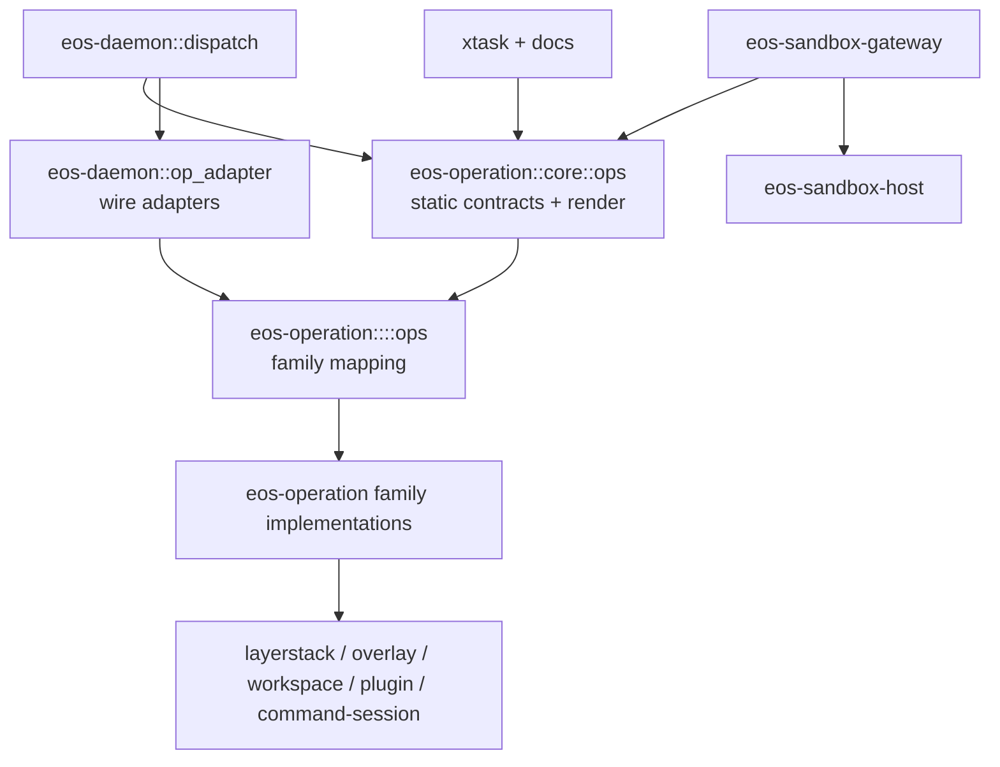

# eos-operation Migration SPEC

Status: Implemented
Date: 2026-06-12
Owner: sandbox/crates
Scope: `sandbox/crates/eos-operation`, `sandbox/crates/eos-daemon`,
`sandbox/crates/eos-sandbox-gateway`, `sandbox/crates/eosd`, `sandbox/xtask`,
and sandbox contract/docs references.

## 1. Goal

Make `eos-operation` the single source of truth for sandbox operation
contracts and daemon-independent operation implementations.

After this migration:

- `sandbox/crates/eos-operation/ops.json` is the reviewed static operation
  catalog artifact.
- `eos_operation::core::ops` records all static operation contracts:
  canonical name, family, serving side, visibility, mutability, summary, and
  typed identity.
- Each operation family has its own `ops.rs` that maps the family contract to
  typed operation vocabulary and methods.
- `eos-daemon` no longer owns operation contracts or catalog rendering.
- `eos-daemon` keeps only wire-facing operation adapters under
  `src/op_adapter/`.
- `eos-sandbox-gateway`, `eosd dump-ops`, `xtask check-contract`, and generated
  docs read or render the catalog through `eos-operation`.

The migration must preserve all protocol-visible behavior: op names,
`ops.json` ordering, `protocol_version`, visibility, `served_by`, response
shapes, error envelopes, timing fields, and dynamic `plugin.*` dispatch.

## 2. Baseline

The live tree is already mid-migration:

- `sandbox/Cargo.toml` contains a root `eos-operation` workspace package.
- `sandbox/crates/eos-operation/src` currently contains `checkpoint`,
  `command`, `core`, `file`, and `plugin` modules.
- `eos-daemon` imports implementation types from `eos-operation`, but still
  owns the operation catalog in `sandbox/crates/eos-daemon/src/wire/ops.rs`.
- `sandbox/contract/ops.json` remains the committed reviewed artifact.
- `eos-sandbox-gateway` embeds `../../../contract/ops.json`.
- `xtask` reads `contract/ops.json` in `gen-docs`, `check-contract`, and
  package metadata generation.
- `eos-daemon/src/ops/*` still contains the wire adapter modules.

Current static catalog inventory:

| Family | Count | Members |
| --- | ---: | --- |
| `Sandbox` | 4 | `sandbox.acquire`, `sandbox.release`, `sandbox.status`, `sandbox.list` |
| `Control` | 4 | `sandbox.runtime.ready`, `sandbox.call.heartbeat`, `sandbox.call.cancel`, `sandbox.call.count` |
| `Checkpoint` | 6 | `sandbox.checkpoint.layer_metrics`, `sandbox.checkpoint.ensure_base`, `sandbox.checkpoint.build_base`, `sandbox.checkpoint.commit_to_workspace`, `sandbox.checkpoint.commit_to_git`, `sandbox.checkpoint.binding` |
| `Files` | 3 | `sandbox.file.read`, `sandbox.file.write`, `sandbox.file.edit` |
| `Plugins` | 2 | `sandbox.plugin.ensure`, `sandbox.plugin.status` |
| `IsolatedWorkspace` | 5 | `sandbox.isolation.enter`, `sandbox.isolation.exit`, `sandbox.isolation.status`, `sandbox.isolation.list_open`, `sandbox.isolation.test_reset` |
| `CommandSession` | 6 | `sandbox.command.exec`, `sandbox.command.write_stdin`, `sandbox.command.poll`, `sandbox.command.cancel`, `sandbox.command.collect_completed`, `sandbox.command.count` |
| `WorkspaceRun` | 2 | `sandbox.run.end`, `sandbox.run.cancel_all` |

Dynamic plugin operations are not static catalog members. They keep the
`plugin.<id>.<op>` grammar and remain runtime-discovered from plugin manifests.

## 3. Non-Goals

- No wire protocol changes.
- No op rename, family rename, visibility change, mutability change, or
  `served_by` change.
- No response-shape rewrite.
- No attempt to move `DispatchContext`, `DaemonError`, request parsing, timing
  envelope finalization, or daemon process telemetry into `eos-operation`.
- No dependency from `eos-operation` to `eos-daemon`.
- No movement of substrate crates into `eos-operation` just because they are
  operation-adjacent. `eos-layerstack`, `eos-overlay`, `eos-namespace`,
  `eos-command-session`, `eos-workspace`, `eos-plugin`, `eos-sandbox-host`,
  and `eos-sandbox-gateway` remain separate owners.
- No compatibility modules for retired crate names such as `eos-command-ops`,
  `eos-file-ops`, `eos-plugin-ops`, `eos-operation-core`, or `eos-checkpoint`
  unless a downstream package outside the sandbox workspace requires a
  temporary bridge.

## 4. Target Ownership



| Owner | Owns | Must not own |
| --- | --- | --- |
| `eos-operation::core::ops` | Static operation contracts, typed op identity enums, catalog ordering, `ops.json` render DTOs, `protocol_version` catalog output. | `DispatchContext`, daemon error envelopes, host/gateway socket policy, dynamic plugin registry state. |
| `eos-operation::<family>::ops` | Family-specific op enum/constants and mapping from static contract to typed method or port. | Wire `serde_json::Value` parsing and response JSON shaping. |
| `eos-operation::<family>` implementation files | Daemon-independent behavior, DTOs, ports, service/runtime types, backend implementations. | Daemon adapter ABI or request-envelope details. |
| `eos-daemon::op_adapter` | Parse `Value` args, read `DispatchContext`, call `eos-operation`, map typed outcomes to exact wire responses. | Static op catalog definitions. |
| `eos-daemon::dispatch` | Handler table, envelope validation, timing/error envelope finalization, dynamic plugin fallback. | Contract metadata ownership. |
| `eos-sandbox-gateway` | Client/operator socket visibility enforcement and host/daemon routing. | Static catalog artifact storage. |
| `eosd` | CLI command surface, including `dump-ops`. | Catalog implementation. |
| `xtask` | Drift checks and generated docs/package metadata. | Independent catalog parsing assumptions that disagree with `eos-operation`. |

## 5. Target File Tree

Use one `eos-operation` crate with family folders. Keep Rust module names
snake_case. The daemon adapter folder is `op_adapter`, not `op-adapter`.

```text
sandbox/crates/eos-operation/
|-- Cargo.toml
|-- ops.json
|-- src/
|   |-- lib.rs
|   |-- core/
|   |   |-- lib.rs
|   |   |-- ops.rs
|   |   `-- outcome.rs
|   |-- sandbox/
|   |   |-- lib.rs
|   |   `-- ops.rs
|   |-- control/
|   |   |-- lib.rs
|   |   `-- ops.rs
|   |-- checkpoint/
|   |   |-- lib.rs
|   |   |-- ops.rs
|   |   `-- commit.rs
|   |-- file/
|   |   |-- lib.rs
|   |   |-- ops.rs
|   |   |-- port.rs
|   |   |-- direct.rs
|   |   |-- isolated.rs
|   |   `-- tests.rs
|   |-- plugin/
|   |   |-- lib.rs
|   |   |-- ops.rs
|   |   |-- callbacks.rs
|   |   |-- dispatch.rs
|   |   |-- ensure.rs
|   |   |-- overlay.rs
|   |   |-- package.rs
|   |   |-- process.rs
|   |   |-- refresh.rs
|   |   |-- route.rs
|   |   |-- service.rs
|   |   |-- state.rs
|   |   |-- transport.rs
|   |   `-- tests/
|   |-- isolation/
|   |   |-- lib.rs
|   |   `-- ops.rs
|   |-- command/
|   |   |-- lib.rs
|   |   |-- ops.rs
|   |   |-- service.rs
|   |   |-- outcome.rs
|   |   |-- prepare.rs
|   |   |-- registry.rs
|   |   |-- runtime.rs
|   |   |-- settle.rs
|   |   `-- tests/
|   `-- workspace_run/
|       |-- lib.rs
|       `-- ops.rs
`-- tests/
    |-- checkpoint/
    `-- plugin/

sandbox/crates/eos-daemon/src/
|-- dispatch/
|   |-- dispatcher.rs
|   `-- builtin_handlers.rs
|-- op_adapter/
|   |-- mod.rs
|   |-- checkpoint.rs
|   |-- command.rs
|   |-- control.rs
|   |-- files.rs
|   |-- isolation.rs
|   |-- plugin.rs
|   `-- workspace_run.rs
`-- wire/
    |-- envelope.rs
    `-- mod.rs
```

### 5.1 `core::ops` Contract Shape

`eos_operation::core::ops` is the only static contract table.

```rust
pub const PROTOCOL_VERSION: i64 = 1;

#[derive(Debug, Clone, Copy, PartialEq, Eq, Hash, PartialOrd, Ord)]
pub enum OpFamily {
    Sandbox,
    Control,
    Checkpoint,
    Files,
    Plugins,
    IsolatedWorkspace,
    CommandSession,
    WorkspaceRun,
}

#[derive(Debug, Clone, Copy, PartialEq, Eq, Hash, PartialOrd, Ord)]
pub enum ServedBy {
    Host,
    Daemon,
}

#[derive(Debug, Clone, Copy, PartialEq, Eq, Hash, PartialOrd, Ord)]
pub enum OpVisibility {
    Public,
    Operator,
    Internal,
    Test,
}

#[derive(Debug, Clone, Copy, PartialEq, Eq, Hash, PartialOrd, Ord)]
pub enum BuiltinOp {
    SandboxAcquire,
    SandboxRelease,
    SandboxStatus,
    SandboxList,
    RuntimeReady,
    InvocationHeartbeat,
    InvocationCancel,
    InflightCount,
    LayerMetrics,
    EnsureWorkspaceBase,
    BuildWorkspaceBase,
    CommitToWorkspace,
    CommitToGit,
    WorkspaceBinding,
    ReadFile,
    WriteFile,
    EditFile,
    PluginEnsure,
    PluginStatus,
    IsolatedWorkspaceEnter,
    IsolatedWorkspaceExit,
    IsolatedWorkspaceStatus,
    IsolatedWorkspaceListOpen,
    IsolatedWorkspaceTestReset,
    ExecCommand,
    WriteStdin,
    CommandReadProgress,
    CommandCancel,
    CommandCollectCompleted,
    CommandSessionCount,
    CancelWorkspaceRunsByCaller,
    CancelWorkspaceRuns,
}

pub struct OpContract {
    pub op: BuiltinOp,
    pub name: &'static str,
    pub served_by: ServedBy,
    pub visibility: OpVisibility,
    pub family: OpFamily,
    pub mutates_state: bool,
    pub summary: &'static str,
}

pub const BUILTIN_OPS: &[OpContract] = &[/* all 32 ops in ops.json order */];

pub fn ops_json_document() -> String;
```

The rendered JSON must remain byte-for-byte compatible with the current
`eosd dump-ops` output except for the committed file path changing from
`contract/ops.json` to `crates/eos-operation/ops.json`.

### 5.2 Family `ops.rs` Shape

Each family `ops.rs` maps contract identity to typed execution vocabulary.

Example shape:

```rust
use crate::core::ops::{BuiltinOp, OpContract};

pub const FAMILY_OPS: &[BuiltinOp] = &[
    BuiltinOp::ReadFile,
    BuiltinOp::WriteFile,
    BuiltinOp::EditFile,
];

pub enum FileOp {
    Read,
    Write,
    Edit,
}

impl FileOp {
    pub const fn contract(self) -> &'static OpContract;
}
```

Rules:

- `ops.rs` never parses a wire envelope.
- `ops.rs` never imports `eos_daemon`.
- `ops.rs` can expose a method enum, per-op constants, and family-local helper
  functions that use `BuiltinOp`.
- `port.rs` exists only when the family needs a trait boundary to reach
  resources owned elsewhere.
- Implementation files keep behavior names (`commit.rs`, `direct.rs`,
  `isolated.rs`, `runtime.rs`, `dispatch.rs`, etc.).
- The current `command/ops.rs` implementation should move to
  `command/service.rs` so `ops.rs` has the same contract-mapping meaning in
  every family.

## 6. Operation Family Migration Targets

| Family | Target under `eos-operation` | Port needed? | Notes |
| --- | --- | --- | --- |
| `Sandbox` | `sandbox/ops.rs` | No | Host methods stay implemented by `eos-sandbox-host`; the shared operation crate owns only the static family vocabulary until a real host trait boundary is needed. |
| `Control` | `control/ops.rs` | No | Invocation registry and readiness probes remain daemon/runtime resources; no shared port exists until implementation moves out of the daemon. |
| `Checkpoint` | `checkpoint/ops.rs`, `checkpoint/commit.rs` | No new port | `commit_to_git` already lives in `eos-operation`; layer metrics/base/binding stay daemon-shaped until typed requests are moved without pulling response shaping. |
| `Files` | `file/ops.rs`, `file/port.rs`, `file/direct.rs`, `file/isolated.rs` | Maybe | Existing `FileBackend` is already the core port. `file/port.rs` may be a re-export or rename if no extra resource boundary is needed. |
| `Plugins` | `plugin/ops.rs`, existing runtime modules | No new port | Runtime is already mostly under `eos-operation`; daemon still owns response shape and policy gates. |
| `IsolatedWorkspace` | `isolation/ops.rs` | No | Keep namespace mechanics in `eos-workspace`; only the static family vocabulary moved in this migration. |
| `CommandSession` | `command/ops.rs`, `command/service.rs`, existing command modules | No new port initially | Existing command runtime owns the operation behavior; adapter stays in daemon. |
| `WorkspaceRun` | `workspace_run/ops.rs` | No | Daemon `WorkspaceRuntime` coordination stays in `eos-daemon`; this migration adds only the catalog family mapping. |

## 7. Daemon Refactor Target

Rename the daemon adapter folder from `ops` to `op_adapter` after the catalog
source of truth has moved.

Current:

```text
sandbox/crates/eos-daemon/src/ops/
|-- cancel.rs
|-- checkpoint.rs
|-- command.rs
|-- control.rs
|-- files.rs
|-- isolation.rs
|-- mod.rs
`-- plugin.rs
```

Target:

```text
sandbox/crates/eos-daemon/src/op_adapter/
|-- mod.rs
|-- checkpoint.rs
|-- command.rs
|-- control.rs
|-- files.rs
|-- isolation.rs
|-- plugin.rs
`-- workspace_run.rs
```

`cancel.rs` becomes `workspace_run.rs` because the family name in the catalog
is `WorkspaceRun`.

`dispatch/builtin_handlers.rs` owns the mapping from
`eos_operation::core::ops::BuiltinOp` to adapter functions:

```rust
pub(crate) fn builtin_handler(op: BuiltinOp) -> Handler {
    match op {
        BuiltinOp::RuntimeReady => op_adapter::control::op_runtime_ready,
        BuiltinOp::ReadFile => op_adapter::files::op_read_file,
        // ...
    }
}
```

The dispatcher builds its table from `eos_operation::core::ops::BUILTIN_OPS`,
filtering or matching daemon-served static ops. It must not define catalog
metadata itself.

## 8. `ops.json` Artifact Move

Move the reviewed artifact:

```text
sandbox/contract/ops.json
```

to:

```text
sandbox/crates/eos-operation/ops.json
```

Absolute path requirement: move
`/Users/yifanxu/machine_learning/LoVC/EphemeralOS/sandbox/contract/ops.json`
to
`/Users/yifanxu/machine_learning/LoVC/EphemeralOS/sandbox/crates/eos-operation/ops.json`.

Required path updates:

- `eos-sandbox-gateway` embed path.
- `xtask gen-docs`, `xtask check-contract`, name-integrity check, and
  protocol-version packaging.
- `eosd dump-ops` to call `eos_operation::core::ops::ops_json_document()`.
- `sandbox/docs/API.md` generated header.
- `sandbox/README.md`, `sandbox/CONTRACT.md`, `sandbox/contract/PROTOCOL.md`,
  `sandbox/docs/SPEC.md`, `sandbox/docs/README.md`, and
  `sandbox/docs/RUST-GUIDANCE.md`.
- Class inventory generated docs after source moves.

`sandbox/contract/PROTOCOL.md` and `sandbox/contract/fixtures/` may remain in
`sandbox/contract/`. Only the op catalog artifact moves. If a future plan
wants all contract artifacts under `eos-operation`, that should be a separate
contract-layout migration.

## 9. Migration Phases

### Phase 1 - Stabilize the Root Crate

- Keep only one operation package: `eos-operation`.
- Remove workspace dependency entries for old operation packages.
- Ensure `eos-operation` exports current command, file, plugin, checkpoint, and
  core symbols through deliberate public APIs.
- Delete stale child package directories after confirming no active
  Rust/TOML/docs references remain.

Verification:

```sh
cargo metadata --manifest-path sandbox/Cargo.toml --no-deps
cargo check --manifest-path sandbox/Cargo.toml -p eos-operation
cargo check --manifest-path sandbox/Cargo.toml -p eos-daemon
```

### Phase 2 - Move Static Contracts to `eos-operation`

- Add `sandbox/crates/eos-operation/src/core/ops.rs`.
- Move `OpFamily`, `OpVisibility`, host op specs, daemon op specs,
  `BuiltinDaemonOp` replacement, and JSON rendering out of
  `eos-daemon/src/wire/ops.rs`.
- Rename the typed identity to `BuiltinOp`, because the catalog includes
  host-served `Sandbox` ops as well as daemon-served ops.
- Keep `ops_json_document()` byte-stable.
- Update `eosd dump-ops` to call `eos_operation::core::ops`.

Verification:

```sh
cargo run --manifest-path sandbox/Cargo.toml -p eosd -- dump-ops > /tmp/eos-operation-ops.json
diff -u sandbox/contract/ops.json /tmp/eos-operation-ops.json
cargo test --manifest-path sandbox/Cargo.toml -p eos-daemon ops_json_document
```

### Phase 3 - Move `ops.json`

- Move `sandbox/contract/ops.json` to `sandbox/crates/eos-operation/ops.json`.
- Update all include/read paths and help text.
- Change the stale-catalog message to:

```text
crates/eos-operation/ops.json is stale: regenerate with
`cargo run -p eosd -- dump-ops > crates/eos-operation/ops.json`
```

- Regenerate `sandbox/docs/API.md`.

Verification:

```sh
cargo run --manifest-path sandbox/Cargo.toml -p eosd -- dump-ops > sandbox/crates/eos-operation/ops.json
cargo run --manifest-path sandbox/Cargo.toml -p xtask -- gen-docs
cargo run --manifest-path sandbox/Cargo.toml -p xtask -- check-contract
```

### Phase 4 - Add Family `ops.rs` Files

- Add `ops.rs` to every family folder listed in Section 5.
- Move family-local method enums/constants out of daemon code where they exist.
- Rename current `command/ops.rs` implementation to `command/service.rs`.
- Update family `lib.rs` files to expose `pub mod ops`.
- Keep behavior files named by implementation responsibility.

Verification:

```sh
cargo check --manifest-path sandbox/Cargo.toml -p eos-operation
cargo test --manifest-path sandbox/Cargo.toml -p eos-operation
```

### Phase 5 - Rename Daemon `ops` to `op_adapter`

- Rename `eos-daemon/src/ops` to `eos-daemon/src/op_adapter`.
- Rename `cancel.rs` to `workspace_run.rs`.
- Move `builtin_handler` from `dispatch/dispatcher.rs` to
  `dispatch/builtin_handlers.rs`.
- Update imports from `crate::ops::*` to `crate::op_adapter::*`.
- Keep adapter function names stable unless a local rename clearly improves the
  family mapping.

Verification:

```sh
cargo check --manifest-path sandbox/Cargo.toml -p eos-daemon
cargo test --manifest-path sandbox/Cargo.toml -p eos-daemon
```

### Phase 6 - Extract Remaining Family Logic

Extract behavior only where it can be done without importing daemon types:

- `Checkpoint`: move typed requests/outcomes for layer metrics, base ensure,
  base build, workspace commit, and binding inspection.
- `Control`: introduce typed ports for runtime readiness and in-flight
  invocation registry operations.
- `Isolation`: introduce typed requests/outcomes over `eos-workspace` and the
  workspace runtime boundary.
- `WorkspaceRun`: move the current daemon `WorkspaceRuntime` coordination into
  `eos-operation::workspace_run` if the resulting crate dependency graph stays
  acyclic.
- `Sandbox`: expose host lifecycle contracts and ports; leave concrete Docker
  host behavior in `eos-sandbox-host`.

Verification:

```sh
cargo metadata --manifest-path sandbox/Cargo.toml --no-deps
cargo tree --manifest-path sandbox/Cargo.toml -p eos-operation --edges normal
cargo tree --manifest-path sandbox/Cargo.toml -p eos-daemon --edges normal
cargo test --manifest-path sandbox/Cargo.toml -p eos-daemon
cargo test --manifest-path sandbox/Cargo.toml -p eos-sandbox-gateway --test contract
cargo run --manifest-path sandbox/Cargo.toml -p xtask -- check-contract
```

### Phase 7 - Documentation and Generated Inventory

- Update sandbox README and contract docs for the new catalog path.
- Update `sandbox/docs/SPEC.md` tree diagrams and invariants.
- Update `sandbox/docs/RUST-GUIDANCE.md` for the new operation boundary.
- Regenerate class inventory after source moves.
- Run whitespace checks.

Verification:

```sh
cargo run --manifest-path sandbox/scripts/class-inventory/Cargo.toml
git diff --check
```

## 10. Acceptance Criteria

The migration is complete only when all of the following are true:

- `sandbox/crates/eos-operation/ops.json` exists and is the committed static
  operation catalog.
- `sandbox/contract/ops.json` no longer exists and no executable code reads it.
- `eos_operation::core::ops::BUILTIN_OPS` records all 32 static contracts in
  the same order as the committed `ops.json`.
- `eos_operation::core::ops::ops_json_document()` renders byte-for-byte the
  committed `sandbox/crates/eos-operation/ops.json`.
- Every operation family has an `ops.rs`.
- `eos-daemon/src/wire/ops.rs` is deleted or reduced to a non-contract
  compatibility-free module; no static catalog metadata remains in
  `eos-daemon`.
- `eos-daemon/src/ops/` no longer exists.
- `eos-daemon/src/op_adapter/` exists and contains the wire adapters.
- `eos-daemon` does not expose or own `BuiltinDaemonOp`,
  `BUILTIN_DAEMON_OP_SPECS`, `OpFamily`, or `OpVisibility`.
- No crate depends on retired package names:
  `eos-command-ops`, `eos-file-ops`, `eos-plugin-ops`,
  `eos-operation-core`, or `eos-checkpoint`.
- Dynamic `plugin.*` dispatch still works through the dispatcher miss path and
  is not added to the static catalog.
- The dependency graph has no `eos-operation -> eos-daemon` edge.

Required final gates:

```sh
cargo metadata --manifest-path sandbox/Cargo.toml --no-deps
cargo check --manifest-path sandbox/Cargo.toml -p eos-operation
cargo check --manifest-path sandbox/Cargo.toml -p eos-daemon
cargo test --manifest-path sandbox/Cargo.toml -p eos-operation
cargo test --manifest-path sandbox/Cargo.toml -p eos-daemon
cargo test --manifest-path sandbox/Cargo.toml -p eos-sandbox-gateway --test contract
cargo run --manifest-path sandbox/Cargo.toml -p xtask -- check-contract
git diff --check
```

## 11. Stale-Surface Sweep

Before closeout, run:

```sh
rg -n "contract/ops\\.json|wire::ops|BuiltinDaemonOp|BUILTIN_DAEMON_OP_SPECS|eos-command-ops|eos-file-ops|eos-plugin-ops|eos-operation-core|eos-checkpoint" sandbox docs
rg -n "crate::ops|src/ops|ops/" sandbox/crates/eos-daemon
```

Expected remaining references:

- Historical planning docs may mention old names only when explicitly marked
  historical.
- Generated class inventory should be refreshed rather than manually edited.
- Runtime dynamic plugin op strings (`plugin.<id>.<op>`) remain valid.

## 12. Risk Register

| Risk | Failure mode | Mitigation |
| --- | --- | --- |
| Daemon dependency cycle | `eos-operation` imports `eos-daemon` adapter types. | Keep all `DispatchContext`, `DaemonError`, and response shaping in `op_adapter`. Gate with `cargo tree -p eos-operation --edges normal`. |
| Catalog drift | `ops.json`, `eosd dump-ops`, and docs disagree. | Make `core::ops` the only renderer and keep `xtask check-contract` as the drift gate. |
| Host ops lost during daemon extraction | `Sandbox` ops are not daemon-served, so daemon-only tables omit them. | Rename identity from `BuiltinDaemonOp` to `BuiltinOp` and include host ops in `BUILTIN_OPS`. |
| Dynamic plugin ops accidentally frozen | Runtime plugin routes get added to static `ops.json`. | Keep dynamic `plugin.*` documented but outside `BUILTIN_OPS`. |
| `ops.rs` ambiguity | Some families use `ops.rs` for implementation while others use it for contract mapping. | Rename implementation-heavy `command/ops.rs` to `command/service.rs`; define `ops.rs` uniformly as family contract/method mapping. |
| Over-broad crate absorption | Storage/namespace/workspace crates move under `eos-operation` and blur ownership. | Keep substrate crates separate; only operation contracts and daemon-independent operation behavior move. |
