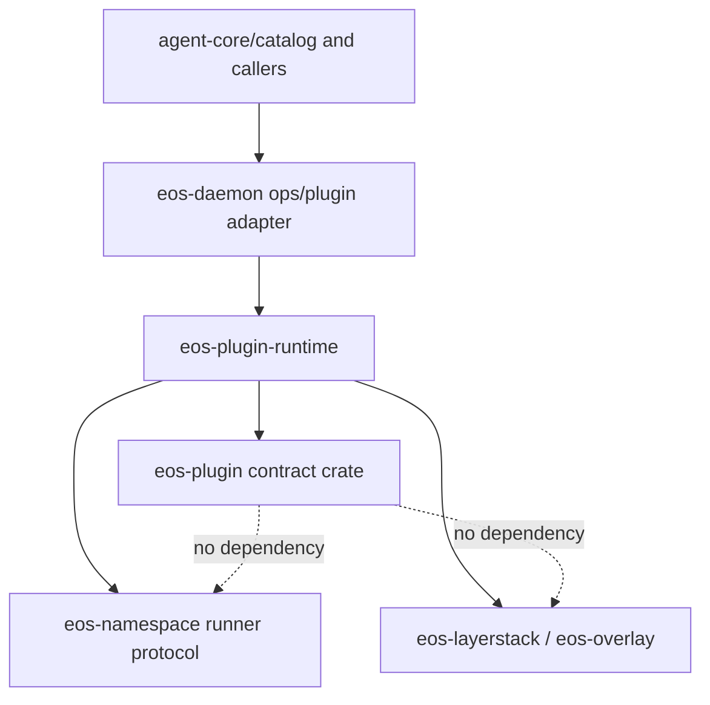

# eos-plugin Source Consolidation SPEC

Status: Proposed
Date: 2026-06-11
Owner: sandbox/crates
Scope: `sandbox/crates/eos-plugin/src`, with required paired import/test moves
under `sandbox/crates/eos-plugin-runtime` and the daemon plugin adapter/tests.
Companion: `docs/plans/sandbox-daemon-runtime-crate-extraction_SPEC.md`.

## 1. Goal

Aggressively reduce `eos-plugin` into a small, storage-free plugin contract
crate. The current tree mixes pure manifest/PPC contracts with daemon-only host
glue: `api.plugin.ensure` parsing, package publish/setup, service process launch
specs, Unix-socket PPC client code, and route DTOs. That shape creates nested
folders and public module paths that do not match the actual ownership boundary.

After this refactor, `eos-plugin` owns only portable plugin contracts:

- manifest, service identity/status, refresh protocol, and plugin intent DTOs
- PPC frame DTOs plus byte-stable encode/decode helpers
- plugin error types

Runtime setup, package, route, process, and transport code moves to
`eos-plugin-runtime`. The daemon keeps JSON wire shaping, cross-domain policy
gates, service construction, and the `NsRunnerLauncher` implementation described
in the companion runtime-extraction spec. The final `eos-plugin/src` file/LOC
budget in Section 6 is an acceptance criterion.

## 2. Baseline

Measured on 2026-06-11:

```sh
find sandbox/crates/eos-plugin/src -type f | sort
find sandbox/crates/eos-plugin/src -type f -name '*.rs' -print0 | xargs -0 wc -l | sort -n
cargo tree -p eos-plugin --edges normal --invert eos-layerstack
```

Baseline:

- Rust source files under `src`: 15
- Rust source LOC under `src`: 2,558
- Unit/integration test LOC under `sandbox/crates/eos-plugin/tests`: 904
- Junk source-tree files:
  - `sandbox/crates/eos-plugin/src/.DS_Store`
  - `sandbox/crates/eos-plugin/src/host/.DS_Store`

Largest current source files:

| File | LOC | Diagnosis |
| --- | ---: | --- |
| `host/package.rs` | 517 | Daemon package publish/setup implementation, not plugin contract. |
| `host/ensure_args.rs` | 376 | Daemon `api.plugin.ensure` parser and route/spec builder. |
| `manifest.rs` | 296 | Correct contract owner, but depends on `eos-namespace` for only `Intent`. |
| `host/ppc_client.rs` | 209 | Daemon Unix-socket transport object. |
| `service.rs` | 203 | Correct contract data, but split away from manifest/status/refresh data. |
| `host/route.rs` | 160 | Daemon route/process spec DTOs and env construction. |
| `host/ppc_client/pending.rs` | 160 | Private implementation detail of one transport object. |
| `ppc.rs` | 140 | Correct PPC envelope owner, but split from framing helper. |

Dependency diagnosis:

- `eos-plugin` depends on `eos-namespace` only for `eos_namespace::protocol::Intent`.
- `eos-namespace` depends on `eos-overlay`, which depends on `eos-layerstack`.
- This contradicts `eos-plugin/src/lib.rs`, which states that the crate does
  not depend on storage/overlay crates.

## 3. Non-Goals

- Do not merge `eos-plugin` into `eos-daemon`.
- Do not move OCC commit callbacks, overlay execution, service process
  lifecycle, package publish/setup, namespace runner calls, or daemon registry
  state into `eos-plugin`.
- Do not keep compatibility modules for old `eos_plugin::host::*` paths. Update
  daemon/runtime imports directly.
- Do not widen private daemon or runtime APIs just to preserve old crate paths.
- Do not change public wire JSON field names for manifests, service status,
  refresh messages, PPC frames, package status responses, or registered route
  status responses.
- Do not introduce a new shared protocol crate unless a separate broader plan
  requires it. This spec only removes the current accidental dependency edge.

## 4. Target Ownership



| Owner | Keeps | Must not own |
| --- | --- | --- |
| `eos-plugin` | `PluginManifest`, package/setup manifest DTOs, service key/status DTOs, refresh DTOs, `PluginIntent`, `PpcEnvelope`, plugin errors. | Package publish/setup, daemon route table entries, Unix socket client, service process launch lifecycle, namespace runner types, overlay/storage APIs. |
| `eos-plugin-runtime` | Manifest-to-runtime spec construction, package roots and publish/setup, route/spec construction, PPC client, service process lifecycle, refresh, callbacks, oneshot overlay execution, and typed outcomes. | Wire `Value` shaping, isolated-caller policy gate, daemon binary identity, portable plugin manifest schema, or PPC envelope serialization rules. |
| `eos-daemon` | `ops/plugin` adapter: parse wire args, enforce cross-domain policy gates, shape responses, construct services, and implement `NsRunnerLauncher`. | Plugin runtime behavior or contract schema. |
| `eos-namespace` | Namespace runner protocol and runner intent for process execution. | Plugin manifest contract details. |
| `eos-layerstack` / `eos-overlay` | Storage, overlay, leases, commits. | Plugin contract DTOs. |

## 5. Required Public API Shape

`eos-plugin` crate-root re-exports remain the preferred public API.

The following crate-root symbols remain available:

- `PluginDependencyScope`
- `PluginError`
- `PluginIntent`
- `PluginManifest`
- `PluginOperationManifest`
- `PluginPackageManifest`
- `PluginServiceKey`
- `PluginServiceKeyParts`
- `PluginServiceManifest`
- `PluginServiceState`
- `PluginServiceStatus`
- `PluginSetupManifest`
- `PpcDirection`
- `PpcEnvelope`
- `RefreshAck`
- `RefreshRequest`
- `RefreshStrategy`
- `Result`
- `ServiceMode`
- `PACKAGE_SHA256_MARKER`
- `SETUP_SHA256_MARKER`

The following module paths are removed from `eos-plugin`:

- `eos_plugin::framing`
- `eos_plugin::host`
- `eos_plugin::host::ensure_args`
- `eos_plugin::host::route`
- `eos_plugin::manifest`
- `eos_plugin::refresh`
- `eos_plugin::service`
- `eos_plugin::service_registry`

If a test needs private helpers, keep it as an internal unit test through
`#[cfg(test)] mod tests;`; do not make helpers public.

## 6. LOC Budget

Acceptance commands:

```sh
find sandbox/crates/eos-plugin/src -type f | sort
find sandbox/crates/eos-plugin/src -type f -name '*.rs' -print0 | xargs -0 wc -l | sort -n
cargo tree -p eos-plugin --edges normal
```

Hard acceptance target for `sandbox/crates/eos-plugin/src`:

- Rust source files under `src`: **4 or fewer**
- Rust source LOC under `src`: **1,000 or fewer**
- Required source-tree reduction from baseline: **at least 1,558 LOC** (`60.9%`)
- No nested folders under `sandbox/crates/eos-plugin/src`
- No non-Rust files under `sandbox/crates/eos-plugin/src`
- `cargo tree -p eos-plugin --edges normal` must not contain:
  - `eos-namespace`
  - `eos-overlay`
  - `eos-layerstack`
  - `tokio`
  - `nix`

Stretch target:

- Rust source LOC under `src`: **900 or fewer**
- Required source-tree reduction from baseline: **at least 1,658 LOC** (`64.8%`)

This is a final-code target for `eos-plugin/src`, not a net-diff target. Moving
runtime code out of `eos-plugin` is required even if some code continues to
exist under `eos-plugin-runtime`.

### 6.1 LOC Accounting

The hard target drops LOC from `eos-plugin/src`, not necessarily from the whole
repository. Most of the reduction comes from moving runtime-owned code to
`eos-plugin-runtime`.

| Current source | Current LOC | Destination | Counts as repo-wide deletion? |
| --- | ---: | --- | --- |
| `host/package.rs` | 517 | `eos-plugin-runtime/src/package.rs` | No, except cleanup while moving. |
| `host/ensure_args.rs` | 376 | split: caller-field validation stays contract/adapter; runtime spec builder -> `eos-plugin-runtime/src/ensure.rs` | Partly. |
| `host/ppc_client.rs` | 209 | `eos-plugin-runtime/src/transport.rs` | No, except cleanup while moving. |
| `host/route.rs` | 160 | `eos-plugin-runtime/src/route.rs` | No, except cleanup while moving. |
| `host/ppc_client/pending.rs` | 160 | `eos-plugin-runtime/src/transport.rs` | No, except merge cleanup. |
| `host/ppc_client/frame_io.rs` | 80 | `eos-plugin-runtime/src/transport.rs` | No, except merge cleanup. |
| `host/mod.rs` | 54 | delete or replace with runtime-local error/imports | Partly. |
| `manifest.rs`, `service.rs`, `service_registry.rs`, `refresh.rs` | 677 | merge into `contract.rs` | Only boilerplate/doc/import cleanup. |
| `framing.rs`, `ppc.rs` | 221 | merge into `ppc.rs` | Only boilerplate/doc/import cleanup. |
| `error.rs`, `lib.rs` | 104 | keep | Only minor re-export/module cleanup. |

So the hard budget is reached by removing at least **1,558 LOC from
`eos-plugin/src`**:

- **1,502 LOC** move from `eos-plugin/src/host/**` into
  `eos-plugin-runtime`.
- **54 LOC** from `host/mod.rs` should mostly disappear as public module
  wrapper/error-mapping ceremony, or become runtime-local code.
- **at least 2 LOC** must be trimmed from the retained contract/PPC files to
  get from 1,002 retained LOC to the 1,000 LOC hard cap.

The stretch target requires about **102 more retained-contract LOC** to be
removed through module-declaration, import, duplicated validation, doc, and
test-wiring cleanup. If the desired target is whole-repo net LOC reduction, this
spec should be tightened separately; the present acceptance target is explicitly
`eos-plugin/src` ownership reduction.

## 7. Target File Structure

Acceptance requires this exact `eos-plugin/src` source shape:

```text
sandbox/crates/eos-plugin/src/
  contract.rs
  error.rs
  lib.rs
  ppc.rs
```

Paired runtime target shape:

```text
sandbox/crates/eos-plugin-runtime/src/
  ensure.rs       # former host/ensure_args.rs runtime-spec builder
  package.rs      # former host/package.rs publish/setup
  route.rs        # former host/route.rs route/spec DTOs
  transport.rs    # former host/ppc_client*.rs Unix-socket PPC client
```

The runtime crate may choose different file names only if the names are more
precise than the above and the final tree still avoids nested one-off folders.

## 8. File Mapping

| Current path | Target |
| --- | --- |
| `src/.DS_Store` | delete |
| `src/host/.DS_Store` | delete |
| `src/error.rs` | keep |
| `src/framing.rs` | merge into `src/ppc.rs` as private framing code |
| `src/ppc.rs` | keep |
| `src/manifest.rs` | merge into `src/contract.rs` |
| `src/service.rs` | merge into `src/contract.rs` |
| `src/service_registry.rs` | merge into `src/contract.rs` |
| `src/refresh.rs` | merge into `src/contract.rs` |
| `src/host/mod.rs` | delete |
| `src/host/ensure_args.rs` | split: `validate_plugin_caller_fields` stays contract/adapter; `ParsedEnsure`-style runtime spec building moves to `eos-plugin-runtime/src/ensure.rs` |
| `src/host/package.rs` | move to `eos-plugin-runtime/src/package.rs` |
| `src/host/route.rs` | move to `eos-plugin-runtime/src/route.rs` |
| `src/host/ppc_client.rs` | move to `eos-plugin-runtime/src/transport.rs` |
| `src/host/ppc_client/frame_io.rs` | merge into runtime `transport.rs` |
| `src/host/ppc_client/pending.rs` | merge into runtime `transport.rs` |

## 9. Behavioral Requirements

### 9.1 Intent ownership

Add `PluginIntent` to `eos-plugin`:

```rust
#[derive(Debug, Clone, Copy, PartialEq, Eq, Serialize, Deserialize)]
#[serde(rename_all = "snake_case")]
pub enum PluginIntent {
    ReadOnly,
    WriteAllowed,
    Lifecycle,
}
```

Use it in `PluginOperationManifest` and runtime plugin routes. Convert between
`PluginIntent` and `eos_namespace::protocol::Intent` only at the runtime's
namespace-runner request boundary.

### 9.2 Package/setup execution

Move package publish/setup execution into `eos-plugin-runtime` ownership. While
moving it, resolve the current `setup.timeout_ms` mismatch:

- Either enforce the manifest timeout around setup command execution.
- Or delete `setup.timeout_ms` from the contract and all manifests/tests if the
  setup command is intentionally controlled by daemon config instead.

The preferred implementation is to enforce the manifest timeout because live
plugin manifests already provide it.

### 9.3 Route/process specs

`PluginOperationRoute` and `PluginProcessSpec` are runtime planning objects.
They should move out of `eos-plugin` and into `eos-plugin-runtime`. Keep any
wire/status JSON shaping daemon-side.

### 9.4 PPC transport

`PpcEnvelope` and frame byte encoding remain in `eos-plugin`. `PpcClient`,
`read_frame`, pending callback routing, reader threads, and Unix stream I/O move
to `eos-plugin-runtime/src/transport.rs`.

The existing callback semantics must remain:

- concurrent in-flight operation requests are allowed
- replies match by `message_id`
- stray replies do not fail healthy in-flight requests
- callback requests route by `parent_message_id` when present
- callback replies must use `PpcDirection::Reply` and match the callback
  `message_id`

## 10. Test Moves

Keep in `eos-plugin`:

- manifest/contract serialization and validation tests
- service key/status validation tests
- refresh DTO tests
- PPC envelope/framing byte-stability tests

Move to `eos-plugin-runtime` tests:

- `tests/host_ppc_client.rs`
- `tests/unit/host/package.rs`
- `tests/unit/host/ensure_args.rs`

Remove `#[path = "../tests/unit/..."]` boilerplate from every `eos-plugin`
module that no longer needs private helper access. If private contract tests
still need crate-private helper functions, put them inline under
`#[cfg(test)] mod tests` in `contract.rs` or `ppc.rs`.

## 11. Implementation Phases

### Phase 1 - Contract isolation

1. Create `contract.rs`.
2. Move manifest/service/status/refresh data into it.
3. Introduce `PluginIntent`.
4. Remove `eos-namespace` from `eos-plugin/Cargo.toml`.
5. Update runtime/daemon plugin code to compare/use `PluginIntent`.
6. Verify `cargo tree -p eos-plugin --edges normal` has no storage edge.

### Phase 2 - PPC simplification

1. Merge `framing.rs` into `ppc.rs`.
2. Keep byte-stable request key order and trailing newline behavior.
3. Remove public `framing` module.
4. Keep focused PPC envelope tests in `eos-plugin`.

### Phase 3 - Runtime ownership move

1. Create or use `eos-plugin-runtime` from the companion runtime extraction spec.
2. Move `host/package.rs` into runtime package ownership.
3. Split `host/ensure_args.rs`: caller-field validation stays at the
   contract/adapter boundary; runtime spec construction moves to runtime ensure
   ownership.
4. Move `host/route.rs` into runtime route ownership.
5. Move `host/ppc_client*` into one runtime transport file.
6. Update daemon/runtime imports directly.
7. Delete `eos_plugin::host` instead of adding compatibility shims.

### Phase 4 - Timeout and test cleanup

1. Enforce or delete `setup.timeout_ms`; prefer enforcement.
2. Move runtime-only tests to `eos-plugin-runtime` test locations.
3. Inline or relocate remaining `eos-plugin` unit tests.
4. Delete empty test folders and stale path attributes.

### Phase 5 - Final source pruning

1. Delete `.DS_Store` files under `eos-plugin/src`.
2. Ensure `eos-plugin/src` has exactly the target tree.
3. Run LOC budget commands.
4. Run verification ladder.
5. Regenerate/prune generated inventory docs if this checkout expects them
   after source moves.

## 12. Verification

Run from `sandbox/` unless noted:

```sh
cargo fmt --check
cargo tree -p eos-plugin --edges normal
cargo check -p eos-plugin --all-targets
cargo test -p eos-plugin --all-targets
cargo metadata --format-version=1 --no-deps
cargo check -p eos-plugin-runtime --all-targets
cargo test -p eos-plugin-runtime --all-targets
cargo check -p eos-daemon --all-targets
cargo test -p eos-daemon plugin
cargo test -p eos-daemon --test unit plugin_process
```

If broad daemon plugin tests fail on macOS with filesystem Unix-socket
`Operation not permitted`, isolate the first failing socket bind test before
changing code. Treat the broad failure as environment-limited only if the
focused package and daemon compile/tests above pass or the bind probe confirms
the environment denial.

If `cargo check -p eos-plugin --all-targets` fails because another dirty
workspace crate does not compile, report the unrelated crate/error and rerun
after that parallel work lands. Do not weaken this spec to route around a dirty
worktree failure.

## 13. Acceptance Checklist

- [ ] `eos-plugin/src` contains only `contract.rs`, `error.rs`, `lib.rs`, and
      `ppc.rs`.
- [ ] `eos-plugin/src` contains no `.DS_Store` or nested folders.
- [ ] `eos-plugin/src` is 1,000 LOC or fewer.
- [ ] `eos-plugin` no longer depends on `eos-namespace`, `eos-overlay`, or
      `eos-layerstack`.
- [ ] `eos_plugin::host::*` paths are gone, with runtime/daemon imports updated
      directly.
- [ ] `PluginIntent` is the plugin manifest/route intent type.
- [ ] Conversion to namespace-runner `Intent` happens only in runtime-owned code.
- [ ] `setup.timeout_ms` is enforced or removed consistently.
- [ ] PPC envelope byte-stability tests still cover compact JSON plus trailing
      newline behavior.
- [ ] Daemon PPC transport tests still cover concurrent callbacks and
      out-of-order replies.
- [ ] Verification commands in Section 12 pass or have a documented external
      dirty-worktree/environment blocker.
