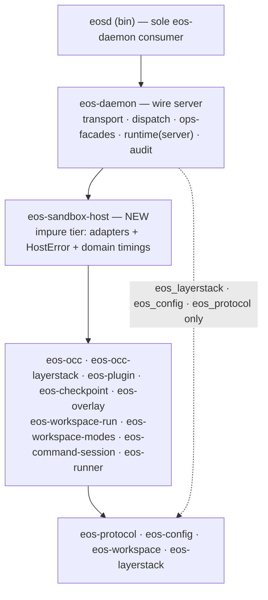

# eos-daemon → eos-sandbox-host Extraction SPEC

Status: Proposed (Draft 2026-06-09). This is the **optional Phase 8 follow-on** to
`docs/plans/eos_daemon_srp_optimization_PLAN.md` (Phases 0–7 Done). That plan
*deliberately* kept the impure adapters inside the daemon as the composition root,
gating on **dependency direction, not LOC**, with SRP defined as "responsibility
cohesion, not consumer count." This spec re-opens that decision to take one stricter
step: lift the `adapters/` tier into its own crate so the direction invariant becomes
**compiler-enforced** instead of review-enforced. Do not start without an explicit
decision to adopt the stricter posture — the current design is not a bug.
Owner: sandbox (daemon substrate)
Scope: `sandbox/crates/eos-daemon`, new `sandbox/crates/eos-sandbox-host`, `eosd`.
Related:
- `docs/plans/eos_daemon_srp_optimization_PLAN.md` — the executed SRP relocation this builds on.
- `docs/plans/daemon_workspace_run_registry_SPEC.md` — the run-tier ownership this preserves.

## 0. Status, rules, and how to verify

### What is being proposed (the one-line model)

`eos-daemon` is split along the seam the prior plan already drew but did not enforce
at crate granularity:

- **`eos-daemon`** keeps the *wire server*: transport/listeners, the op-dispatch table,
  thin `ops/` facades, server-local runtime state (invocation registry, audit ring),
  and the wire-error envelope.
- **`eos-sandbox-host` (NEW)** owns the *impure resource tier*: every `adapters/`
  module — the single-writer OCC cache, the plugin live-process registry, the overlay
  publish port, the isolated-namespace plumbing, OCC-backed file ports, the checkpoint
  facade — plus the domain handler bodies and the domain timing/error types they need.

`eos-daemon → eos-sandbox-host → {domain crates} → {leaf crates}`. Nothing crosses
the seam but error *types*; the OCC single-writer, cancel-never-publishes, leaf-purity,
and no-back-edge invariants all carry over unchanged (§6).

### Acceptance is dependency-direction, not LOC (unchanged from the plan)

Counts in §4 are informational. The gates in §9 are dependency-direction and
behavior-preservation. The ~62% LOC drop in `eos-daemon` is a *consequence* of the
cut, not its justification — the justification is in §1.

### Test environment (REQUIRED — same as the workspace-run spec)

All **behavioral** verification runs the real `eosd` daemon inside the Docker
`sweevo-dask__dask-10042:latest` (`linux/amd64`) container via
`sandbox/crates/eos-e2e-test` (`--features e2e`). Rebuild `eosd` before every E2E run
(`cargo run -p xtask -- package --target x86_64-unknown-linux-musl`). macOS-local
`cargo check`/`clippy` and `--target x86_64-unknown-linux-musl` only *compile* the
Linux paths — they are the structural floor, not behavioral proof. Because this spec
is a **pure relocation + error split** (no behavioral path changes), the §8 floor is
the primary gate; the existing daemon E2E set is the regression backstop.

### Progress tracker

| Phase | Status | Notes |
|---|---|---|
| 0 — Scaffold `eos-sandbox-host` crate + members wiring | Not started | |
| 1 — Split `DaemonError` → `HostError` + slim `DaemonError(#[from] HostError)` | Not started | the only non-mechanical step |
| 2 — Move `runtime/` shared helpers down (`response_timings`, `request_args` split) + add `ProcessGroupSink` port (`InFlightRegistry` **stays**) | Not started | |
| 3 — Relocate `adapters/**` into the host crate; drop the `_context` param from handlers | Not started | |
| 4 — Convert `ops/*.rs` shims into wire facades; re-export host symbols from `lib.rs` | Not started | |
| 5 — Repoint dispatcher `#[cfg(test)]` imports + `#[path]` test depths; doc fixes | Not started | |

## 1. Why this extraction

The SRP plan moved lifecycle into sibling crates and **kept `adapters/` in the
daemon** because the daemon is the composition root and the only `eos-occ` consumer;
the gate it chose — dependency direction — is already met. So the case here is *not*
"the adapters are misplaced." It is narrower and must be made on the plan's own terms:

1. **Turn a convention into a compile-enforced contract.** Today "the wire core never
   depends on an adapter type" holds by review discipline — the `ops/*.rs` shims, the
   `_context`-ignored handler signatures, the `#[cfg(test)]`-only adapter imports in
   the dispatcher. A crate boundary makes a core→domain back-edge a **compile error**.
   The plan got the direction right; this makes it un-violable.
2. **Shed 8 domain crates from `eos-daemon`'s build closure.** After the cut the wire
   server stops transitively recompiling on OCC / plugin / overlay / checkpoint /
   workspace-run / workspace-modes / command-session / runner churn.
3. **A genuinely cohesive impurity seam.** `adapters/` is exactly the side-effecting,
   process-global tier (OCC single-writer cache, plugin child-process registry,
   overlay mount/publish, isolated namespace, OCC-backed file ports). Every
   process-global `static` lives in `adapters/`, so the impurity relocates as one unit
   and the residual daemon is pure framing + routing + audit.

**Cost (honest):** one forced `DaemonError`/`HostError` split (§3.2); a few `runtime/`
helpers migrate because adapters consume them (§3.3); a new crate + `pub use`
re-exports so `eosd` (the sole consumer) keeps compiling; and it re-opens a decision
the team consciously closed. The cut is unusually clean only because the prior plan
already did the hard prep (shims, `_context` discipline, statics localized in
`adapters/`).

## 2. Current state (verified)

`eos-daemon/src` is **9,363 LOC across 50 modules**; `adapters/**` is **5,797 LOC /
25 modules** (~62%) and holds the clear majority of types, fields, and methods (§4).
The wire core and the adapter tier are already cleanly separated in *production* code:

| Coupling | Direction | Evidence | Disposition |
|---|---|---|---|
| `ops/*.rs` → `adapters::*::op_*` | core → adapter (call down) | `ops/plugins.rs:8-10`, `ops/command_sessions.rs:8-47`, `ops/isolated_workspace.rs:8-31`, `ops/workspace_run.rs:8-19`, `ops/checkpoint.rs:7` | becomes `daemon → host` (kept; §3.4) |
| `transport/server.rs` → `adapters::*::{configure_*, *_sweep, recover_*}` | core → adapter (call down) | `server.rs:112-117,172,188,197` | becomes `daemon → host` (kept) |
| `dispatcher.rs` → `adapters::occ::*` | core → adapter | **`#[cfg(test)]` only** (`dispatcher.rs:26-45`) | repoint test imports to `eos_sandbox_host::` (§ Phase 5) |
| `adapters/**` → `crate::error::DaemonError` | adapter → core (up) | 107 uses; `runtime/error.rs:15` | **split** — adapters return `HostError` (§3.2) |
| `adapters/**` → `crate::dispatcher::DispatchContext` | adapter → core (up) | 4 signatures, all `_context` (ignored); `grep "context\." adapters/` = ∅ | **drop the param** — handlers become `fn(&Value) -> Result<Value, HostError>` (§3.4) |
| `adapters/overlay/mod.rs` → `crate::invocation_registry::InFlightRegistry` | adapter → core (up) | `overlay/mod.rs:140-165` (registers the ns-runner child pgid; already `Option<&_>`, `None` at `plugins/overlay.rs:167`) | **port, not move:** host `ProcessGroupSink`, impl'd by the daemon's `InFlightRegistry` (§3.3) |
| `adapters/**` → `crate::response_timings::*` | adapter → core (up) | 6 importers; core uses it only `#[cfg(test)]` | **move `response_timings.rs` down** (§3.3) |
| `adapters/checkpoint.rs` → `crate::request_args::*` | adapter → core (up) | `checkpoint.rs:22` (`binding_to_value`, `timings_to_value_map`); core also uses `require_string` (`ops/control.rs:11`, `ops/files.rs:18`) | **split `request_args`** (§3.3) |
| `adapters/**` → `crate::config::*` | adapter → `eos-config` re-export | `runtime/mod.rs:8-10` re-exports `eos_config::configs::daemon::*` | **no move** — host imports `eos_config` directly |

Confirmed clean: `runtime/invocation_registry` aside, `runtime/` and `audit/` have
**zero** adapter references; `DaemonServer`/`ServerConfig` store no adapter type
(`server.rs:54-82`); `BuiltinOp.handler` is a plain `Handler` fn-pointer
(`ops/registry.rs:5,14`), not generic over adapters; and **no sibling crate the
adapters consume has an `eos-daemon` edge** — `eosd` (`crates/eosd/Cargo.toml:14`) is
the *sole* `eos-daemon` consumer. So `eos-sandbox-host → {domain crates}` is acyclic
(§7).

## 3. Target model

### 3.1 Target crate family



```text
eos-daemon        -> eos-sandbox-host, eos-protocol, eos-config, eos-layerstack
eos-sandbox-host  -> eos-occ, eos-occ-layerstack, eos-plugin, eos-checkpoint,
                     eos-overlay, eos-workspace-run, eos-workspace-modes,
                     eos-command-session, eos-runner, eos-workspace,
                     eos-protocol, eos-config, eos-layerstack
```

`eos-daemon` retains `eos-layerstack` (the `api.runtime.ready` readiness probe,
`ops/control.rs:142-145`), `eos-config` (`AuditConfig`/`FileLimitsConfig` and the
`configure_*` argument structs), and `eos-protocol` (wire envelope). It drops the
other **8 domain crates**. No new edge points at `eos-daemon`; `eosd → eos-daemon`
is unchanged.

### 3.2 The `DaemonError` → `HostError` split (the one real design step)

Moving the whole enum down is **backwards**: the daemon's own pure wire layer
(`transport/server.rs`, which stays) produces `Io`/`Protocol`/`Unauthorized`/
`RequestTooLarge`/`UnknownOp`/`InvalidEnvelope`, so a wholesale move makes the wire
layer depend on the impure host for its framing errors. The split is also *forced*:
relocated handlers cannot return `DaemonError` once in the host without a
host→daemon cycle. Therefore:

**`eos-sandbox-host::HostError`** owns the domain variants and folds (bodies move
verbatim from `runtime/error.rs`):

```rust
#[derive(Debug, thiserror::Error)]
#[non_exhaustive]
pub enum HostError {
    #[error(transparent)] LayerStack(#[from] eos_layerstack::LayerStackError),
    #[error(transparent)] Occ(#[from] eos_occ::OccError),
    #[error(transparent)] Plugin(#[from] eos_plugin::PluginError),
    #[error(transparent)] Isolated(#[from] eos_workspace_modes::isolated::IsolatedError),
    #[error("forbidden: {0}")] Forbidden(String),
    #[error("invalid envelope: {0}")] InvalidEnvelope(String),
    #[error("overlay pipeline failure: {0}")] OverlayPipeline(String),
    #[error("daemon state lock poisoned: {0}")] StateLockPoisoned(&'static str),
}
// moves from runtime/error.rs:96-129 verbatim:
impl From<eos_plugin::host::PpcError>  for HostError { /* … */ }
impl From<eos_checkpoint::CheckpointError> for HostError { /* … */ }
// the ForbiddenInIsolatedWorkspace classification (error.rs:88-90) moves here too:
impl HostError { pub const fn wire_kind(&self) -> eos_protocol::ErrorKind { /* … */ } }
```

**`eos-daemon::DaemonError`** shrinks to the wire/transport variants plus a single
`Host` fold; `wire_kind()` delegates:

```rust
#[derive(Debug, thiserror::Error)]
#[non_exhaustive]
pub enum DaemonError {
    #[error(transparent)] Protocol(#[from] eos_protocol::ProtocolError),
    #[error("daemon io error: {0}")] Io(#[from] std::io::Error),
    #[error("unknown op: {0}")] UnknownOp(String),
    #[error("invalid envelope: {0}")] InvalidEnvelope(String),
    #[error("request exceeds {limit} byte limit")] RequestTooLarge { limit: usize },
    #[error("daemon request authentication failed")] Unauthorized,
    #[error(transparent)] Host(#[from] HostError),
}
impl DaemonError {
    pub const fn wire_kind(&self) -> eos_protocol::ErrorKind {
        match self {
            Self::Host(h) => h.wire_kind(),
            /* wire variants map as today (error.rs:79-93) */
        }
    }
}
```

Because `DaemonError: From<HostError>`, the `?` in each `ops/` facade auto-converts.
`OpTable`, the `Handler` alias, `ops/registry.rs`, and the dispatcher are
**untouched**. `eos-daemon::{DaemonError, HostError}` are re-exported from `lib.rs`
so `eosd` and existing callers keep compiling.

### 3.3 `DispatchContext` stays daemon-internal; three `runtime/` helpers move down

**Do not invent a `HostContext`.** `grep "context\." adapters/` is empty — every
adapter handler ignores its `_context`. The four `DispatchContext` fields are read
only by daemon `ops/`: `invocation_registry()` → `ops/control.rs`, `audit_config()` →
`ops/audit.rs`, `file_limits()` → `ops/files.rs` (already threaded into the
`Read/WriteFileRequest` DTOs, `files.rs:91-110`), `read_request_s` → dispatcher/server.
So `DispatchContext`, the audit ring, and the file-limit plumbing **stay in the
daemon**. The handlers lose the param entirely (§3.4).

Three `runtime/` helpers are consumed by adapters and so migrate (or split) to keep
the direction clean:

| Helper | Today | Why it moves | Disposition |
|---|---|---|---|
| `response_timings.rs` (316 LOC) | `runtime/response_timings.rs` | consumed **only by adapters** in production (`plugins/overlay`, `workspace/file_ports`, `occ/service_cache`, `workspace_run/{host_ports,commands}`); core uses it `#[cfg(test)]` only; deps are `eos_occ`/`eos_protocol`/`eos_runner`/`eos_workspace` (all domain) | **move wholesale** to `eos-sandbox-host` |
| `InFlightRegistry` / `InFlightInvocation` (354 LOC) | `runtime/invocation_registry.rs` | **invocation-keyed** server state (TTL reaper, tokio abort handles, `api.v1.invocation.*`); its docstring (`invocation_registry.rs:1-6`) forbids fusing it with session/isolated records. The host overlay only registers/clears the ns-runner child's pgid against an invocation (`overlay/mod.rs:153-165`, already `Option<&_>`, `None` at `plugins/overlay.rs:167`). | **stays in `eos-daemon`** (the most server-owned runtime state). The host defines an object-safe `ProcessGroupSink { fn register_process_group(&self, invocation_id: &str, pgid: i32); fn clear_process_group(&self, invocation_id: &str); }`; `InFlightRegistry` impls it daemon-side; the overlay takes `Option<&dyn ProcessGroupSink>`. No whole-registry move, no cycle. |
| `request_args.rs` (44 LOC) | `runtime/request_args.rs` | `binding_to_value`/`timings_to_value_map` used by `adapters/checkpoint.rs`; `require_string`/`require_raw_string` used by core `ops/{control,files}` | **split**: arg-coercion primitives (`require_string`, `require_raw_string`) stay in daemon; `binding_to_value`/`timings_to_value_map` (which pull `eos_layerstack::WorkspaceBinding` + the timing map) move to host |

### 3.3a `inflight` occurrence ledger (the seam stays auditable)

The plan does **not** remove `inflight` from the system — `InFlightRegistry` and the
`api.v1.inflight_count` op family are server-owned and stay in `eos-daemon`. The
guarantee is narrower and checkable: **`eos-sandbox-host` ends with zero
`InFlightRegistry` / `invocation_registry` / `inflight` identifiers.** Of the 45
current occurrences in `eos-daemon/src`, **41 are in the wire core (untouched)** and
**4 are in `adapters/overlay/mod.rs`** (the only adapter touchpoint) and convert to
the `ProcessGroupSink` port:

| `adapters/overlay/mod.rs` (today → host) | becomes |
|---|---|
| `use crate::invocation_registry::InFlightRegistry;` | `use crate::ports::ProcessGroupSink;` |
| `invocation_registry: Option<&InFlightRegistry>` (`:140`) | `process_groups: Option<&dyn ProcessGroupSink>` |
| `if let Some(registry) = invocation_registry {` (`:153,164`) | `if let Some(sink) = process_groups {` |
| `registry.register_process_group(&req…invocation_id, pgid)` (`:155`) | `sink.register_process_group(&req…invocation_id, pgid)` |
| `registry.clear_process_group(&req…invocation_id)` (`:165`) | `sink.clear_process_group(&req…invocation_id)` |

The `invocation_id: &str` argument persists (it is the wire invocation key passed to
the port, not the registry type). Net new `inflight` identifiers introduced: **0**;
net converted: **4**.

Stays in `eos-daemon`, unchanged (the 41 core occurrences): the type/tests
(`runtime/invocation_registry.rs`, incl. `register_process_group` /
`clear_process_group`), `DaemonServer.invocation_registry` + the TTL reaper
(`transport/server.rs`), `DispatchContext.invocation_registry` (`dispatch/dispatcher.rs`),
`op_inflight_count` + heartbeat/cancel (`ops/control.rs`, `ops/registry.rs`), the wire
string `"api.v1.inflight_count"` (`audit/events.rs`, `transport/tool_call_events.rs`),
and the `lib.rs` re-exports. The daemon gains exactly one new item:
`impl eos_sandbox_host::ProcessGroupSink for InFlightRegistry` (delegating to the two
existing methods). `eos-protocol`'s `BuiltinDaemonOp::InflightCount` is out of scope.

**Acceptance check:** `rg -i 'inflight|invocation_registry' sandbox/crates/eos-sandbox-host`
returns nothing.

### 3.4 Handlers move down; `ops/*.rs` become wire facades

The op handlers currently *live in* the adapters (`adapters/plugins/mod.rs:107`
`op_ensure`, `adapters/workspace_run/isolated/mod.rs:60` `op_enter`,
`adapters/workspace_run/commands.rs:53` `op_exec_command`, …). They move into
`eos-sandbox-host` and shed the ignored context param:

```rust
// before (in adapters): fn op_ensure(args: &Value, _context: DispatchContext<'_>) -> Result<Value, DaemonError>
// after  (in host):     pub fn op_ensure(args: &Value) -> Result<Value, HostError>
```

The existing `ops/*.rs` one-line shims become the **wire facades** that keep the
`Handler` ABI and map the host error onto the envelope via `?`:

```rust
// eos-daemon ops/plugins.rs
pub(crate) fn op_ensure(args: &Value, _ctx: DispatchContext<'_>) -> Result<Value, DaemonError> {
    Ok(eos_sandbox_host::op_ensure(args)?)   // HostError -> DaemonError via #[from]
}
```

`ops/{control,audit,files}.rs` keep reading `DispatchContext` (they own the
invocation-registry / audit-config / file-limit concerns that stay daemon-side). The
dynamic plugin path (`dispatcher.rs:202-210` → `plugins::dispatch_registered_op` →
`err.wire_kind()`) routes identically: host returns `HostError`, the daemon facade
maps it.

### 3.5 Resulting file / folder structure

```text
sandbox/crates/
├── eos-sandbox-host/                 NEW  (was eos-daemon/src/adapters/ + domain runtime helpers)
│   ├── Cargo.toml                    # the 8 domain deps + eos-workspace/-protocol/-config/-layerstack
│   └── src/
│       ├── lib.rs                    # pub use HostError + the op_* handler surface + configure_*/sweeps
│       ├── error.rs                  # HostError + From<PpcError>/From<CheckpointError> + wire_kind   (from runtime/error.rs)
│       ├── ports.rs                  # ProcessGroupSink (impl'd by the daemon's InFlightRegistry)
│       ├── response_timings.rs       # (from runtime/response_timings.rs)
│       ├── request_args.rs           # binding_to_value, timings_to_value_map (split from runtime/)
│       ├── checkpoint.rs             # thin commit_to_git facade
│       ├── occ/        { mod.rs, service_cache.rs }              # single-writer OCC cache (global static)
│       ├── overlay/    { mod.rs }                                # DaemonPublisherPort
│       ├── workspace/  { file_ports.rs, mod.rs }                 # OCC-backed Ephemeral/IsolatedFilePorts
│       ├── workspace_run/
│       │   ├── mod.rs commands.rs cancel.rs wire.rs config.rs host_ports.rs
│       │   └── isolated/ { mod.rs, ns_runner.rs, runtime.rs }    # DaemonIsolatedState + ns plumbing
│       └── plugins/
│           ├── mod.rs state.rs connected.rs dispatch.rs
│           ├── occ_callbacks.rs overlay.rs refresh.rs service.rs
│           └── process.rs                                        # live PluginServiceProcess (Drop=killpg)
│
└── eos-daemon/src/                   residual wire server (~25 modules)
    ├── lib.rs                        # + pub use eos_sandbox_host::{HostError, ...}
    ├── transport/ { framing.rs, server.rs, tool_call_events.rs, mod.rs }
    ├── dispatch/  { dispatcher.rs, mod.rs }      # OpTable, Handler, DispatchContext, error_envelope
    ├── runtime/   { error.rs (slim DaemonError),
    │                invocation_registry.rs (InFlightRegistry + impl eos_sandbox_host::ProcessGroupSink),
    │                request_args.rs (require_string/require_raw_string only), mod.rs }
    ├── audit/     { buffer.rs, events.rs, mod.rs }
    └── ops/       { audit, checkpoint, command_sessions, control, files,
                     isolated_workspace, plugins, registry, workspace_run, mod }.rs   # WIRE FACADES
```

> Test trees move with their owning source: the `#[path = "../../tests/..."]`
> attributes on relocated modules (`adapters/plugins/mod.rs:369`,
> `plugins/process.rs:444`, `workspace_run/isolated/mod.rs:483`, the dispatcher's
> `#[cfg(test)] #[path]` at `dispatcher.rs:326-328`) re-point to the new crate's
> `tests/` and their depths are fixed. This is the only `#[path]` churn (Phase 5).

## 4. Reduction reality (informational; gate is §9)

Adapters-floor counts are **AST-exact**, partitioned against the graphify generator
(`sandbox/scripts/class-inventory/src/main.rs`) and reconciled to the crate totals
(50 / 447 / 171 / 83). The three `runtime/` helpers (§3.3) are a smaller second
tranche on top of the `adapters/` floor.

| unit | current `eos-daemon` | stays (wire core) | → `eos-sandbox-host` (adapters floor) | % moved |
|---|---:|---:|---:|---:|
| modules | 50 | 25 | 25 | 50.0% |
| items | 447 | 163 | 284 | 63.5% |
| fields | 171 | 82 | 89 | 52.0% |
| methods | 83 | 46 | 37 | 44.6% |
| src LOC | 9,363 | 3,566 | 5,797 | 61.9% |

Second tranche from `runtime/` (moves to host on top of the floor):
`response_timings.rs` ≈ 316 LOC, the `binding_to_value`/`timings_to_value_map`
slice of `request_args.rs`, and the domain half of `error.rs` (≈ 90 of 132 LOC).
`InFlightRegistry` (354 LOC) **stays in the daemon** — only a 2-method
`ProcessGroupSink` port crosses the seam. Net residual daemon ≈ **3,500–3,750 LOC**
of framing + routing + invocation tracking + audit; `eos-sandbox-host` ≈
**5,800–6,050 LOC**.

`runtime/response_timings.rs` and `audit/events.rs` were flagged in the SRP plan as
mixed-concern. This spec resolves the first one — it follows its only production
consumers (the adapters) into the host. `audit/events.rs` **stays** in the daemon
(the audit ring is server-local; `emit_dispatch_audit` is called by the dispatcher).

## 5. Changes by area

### 5.1 Create

| Item | Home | Purpose |
|---|---|---|
| `eos-sandbox-host` crate | `sandbox/crates/eos-sandbox-host` | the impure resource tier + domain handlers |
| `HostError` (+ `From<PpcError>`/`From<CheckpointError>` + `wire_kind`) | `eos-sandbox-host/error.rs` | domain error algebra (from `runtime/error.rs` domain half) |
| `ProcessGroupSink` (object-safe port) | `eos-sandbox-host/ports.rs` | lets the host overlay register/clear an invocation's pgid without owning `InFlightRegistry` |
| `pub use eos_sandbox_host::{HostError, …}` | `eos-daemon/lib.rs` | keep the daemon public surface stable for `eosd` |

### 5.2 Re-home / change

| Current | Becomes |
|---|---|
| `eos-daemon/src/adapters/**` (25 modules) | `eos-sandbox-host/src/**` |
| `DaemonError` (11 domain+wire variants) | slim `DaemonError` (wire) `+ Host(#[from] HostError)`; domain variants → `HostError` |
| adapter `fn op_x(args, _context: DispatchContext) -> Result<_, DaemonError>` | host `pub fn op_x(args) -> Result<_, HostError>` (context dropped) |
| `ops/*.rs` 1-line shims `crate::adapters::X::op_y(args, ctx)` | wire facades `Ok(eos_sandbox_host::op_y(args)?)` |
| `transport/server.rs` `crate::adapters::*::{configure_*,*_sweep,recover_*}` | `eos_sandbox_host::{configure_*,*_sweep,recover_*}` |
| `runtime/response_timings.rs` | `eos-sandbox-host/response_timings.rs` |
| `run_ns_runner_child(_, Option<&InFlightRegistry>)` | `run_ns_runner_child(_, Option<&dyn ProcessGroupSink>)`; `InFlightRegistry` **stays in the daemon** and `impl`s the host port |
| `runtime/request_args.rs` (`binding_to_value`,`timings_to_value_map`) | `eos-sandbox-host/request_args.rs`; `require_string`/`require_raw_string` stay in daemon |
| `dispatcher.rs` `#[cfg(test)] use crate::adapters::occ::*` | `use eos_sandbox_host::*` |
| 8 domain deps in `eos-daemon/Cargo.toml:13-21` | move to `eos-sandbox-host/Cargo.toml` |

### 5.3 Drop

| Item | Why |
|---|---|
| `eos-daemon`'s 8 domain crate deps (`eos-occ`, `eos-occ-layerstack`, `eos-plugin`, `eos-checkpoint`, `eos-overlay`, `eos-workspace-run`, `eos-workspace-modes`, `eos-command-session`, `eos-runner`) | consumed only by `adapters/`, which left |
| `pub mod adapters;` in `eos-daemon/lib.rs` | the tier is now a crate |

### 5.4 Wire-op impact (shapes preserved)

**None.** Every op string, request shape, response shape, and the dynamic-plugin
dispatch path are byte-stable. The change is purely where the handler body lives and
which error type it returns before the facade maps it to the same envelope.

## 6. Invariants to preserve

- **Single-writer OCC** — the per-root `OccService` cache (`occ/service_cache.rs`)
  remains one process-global owner; it simply lives in `eos-sandbox-host`. Plugin OCC
  callbacks still route through the one writer (`plugins/occ_callbacks.rs`).
- **Cancel never OCC-publishes** — the run/cancel discard structure
  (`workspace_run/`) is moved verbatim; no branch changes.
- **Leaf purity / no back-edge** — `eos-workspace` and `eos-command-session` stay
  leaf-pure; **no crate gains an `eos-daemon` edge** (§7); `eos-sandbox-host` stays
  `eos-daemon`-free.
- **`eos-workspace-run` stays `eos-occ`-free** — unchanged; the OCC writer is in the
  host, not the run tier.
- **Daemon stays multi-threaded / never enters a namespace** — namespace work is
  still delegated to `eosd ns-holder`/`ns-runner`; that plumbing moves to the host
  crate but keeps the same re-exec contract.

## 7. Cycle / guard safety (the proof)

- **`eos-sandbox-host → {domain crates}` is acyclic.** `eosd`
  (`crates/eosd/Cargo.toml:14`) is the sole `eos-daemon` consumer; `cargo tree -p
  <crate> -i eos-daemon` matches no package for all 8 domain crates and their
  transitive deps, which bottom out at `eos-protocol`/`eos-config`/`eos-workspace`/
  `eos-layerstack`. So a host→domain edge can never reach back to the daemon.
- **`eos-daemon → eos-sandbox-host` is the only new edge** and points *down*. Every
  symbol the adapters needed from the daemon (`DaemonError`, `DispatchContext`,
  `InFlightRegistry`, `response_timings`, `request_args`) either splits (`DaemonError`,
  `request_args`), moves down (`response_timings`, `InFlightRegistry`), or is dropped
  (`DispatchContext`, via the context-param removal) — none forces a host→daemon edge.
- **No reverse forcing edge.** The daemon core stores/exports no adapter type
  (`server.rs:54-82`, `ops/registry.rs:5,14`); its only references are *calls down*
  into the host, which the new edge permits.
- **Dev-dependency note.** The dispatcher's `#[cfg(test)]` host imports are a
  daemon-test → host edge (the normal direction); Cargo permits dev-dependency cycles
  regardless, but none is even introduced here.

## 8. Migration phases & verification

Land content moves with names stable; keep each phase independently green. The error
split (Phase 1) is the only step that is not a mechanical move — do it first and test
it in isolation.

0. **Scaffold.** Create `eos-sandbox-host` (empty lib), add to `[workspace] members`,
   add the path-dep to `eos-daemon/Cargo.toml`. Verify: `cargo check -p
   eos-sandbox-host -p eos-daemon`.
1. **Error split.** Add `HostError` to the host (domain variants + both manual `From`
   impls + `wire_kind`, moved from `runtime/error.rs:96-129` / `:88-90`); shrink
   `DaemonError` to wire variants `+ Host(#[from] HostError)` with delegating
   `wire_kind`; `pub use` both from `lib.rs`. Verify: `cargo check -p eos-daemon
   --all-targets`; `cargo test -p eos-daemon` (error mapping tests).
2. **Move `runtime/` helpers** (§3.3): `response_timings.rs` to the host; split
   `request_args.rs`. Define `ProcessGroupSink` in `eos-sandbox-host/ports.rs` and
   `impl` it for the daemon's `InFlightRegistry` (which **stays**); change
   `run_ns_runner_child`'s param to `Option<&dyn ProcessGroupSink>`.
   Verify: `cargo check -p eos-sandbox-host -p eos-daemon --all-targets`.
3. **Relocate `adapters/**`** into the host (statics included), drop the `_context`
   param from every handler, move the 8 domain deps to the host `Cargo.toml`. Verify:
   `cargo check -p eos-sandbox-host --all-targets`;
   `cargo tree -p eos-sandbox-host -i eos-daemon` empty.
4. **Convert `ops/*.rs` to wire facades** (`Ok(eos_sandbox_host::op_y(args)?)`); keep
   `ops/{control,audit,files}.rs` as-is. Verify: `cargo check -p eos-daemon
   --all-targets`; `cargo test -p eos-daemon ops::registry`.
5. **Repoint test imports + `#[path]` depths** (`dispatcher.rs:26-45,326-328` and the
   relocated module tests); update ownership doc prose (`lib.rs:19-31`, `error.rs`
   doc comments — the OCC cache is now host-owned, not "dispatcher-owned"). Verify:
   `cargo clippy -p eos-daemon -p eos-sandbox-host --all-targets -- -D warnings`;
   full daemon + host test suites; the standing daemon E2E set against a rebuilt
   `eosd` (regression backstop — no wire change expected).

## 9. Acceptance criteria

Dependency-direction and behavior-preservation first; counts are informational.

- **No back-edge:** `cargo tree -p eos-sandbox-host -i eos-daemon` is empty;
  `cargo tree -p eos-occ -p eos-plugin -p eos-checkpoint -p eos-overlay
  -p eos-workspace-run -p eos-workspace-modes -p eos-command-session -p eos-runner
  -i eos-daemon` is empty for each.
- **Daemon shed the domain tier:** `cargo tree -p eos-daemon | rg
  'eos-occ|eos-plugin|eos-checkpoint|eos-overlay|eos-workspace-run|eos-workspace-modes|eos-command-session|eos-runner'`
  is empty (only `eos-layerstack`, `eos-config`, `eos-protocol`, `eos-sandbox-host`
  remain among internal deps).
- **`eos-daemon` owns only:** transport/server, dispatcher/op registry + facades,
  server-local runtime state (`DispatchContext`, the `InFlightRegistry` invocation
  tracker + TTL reaper, audit ring, file-limit threading, `require_string`), and the
  wire-error envelope (`DaemonError` wire variants + `Host` fold). It `impl`s the
  host's `ProcessGroupSink` for `InFlightRegistry`.
- **`eos-sandbox-host` owns:** every former `adapters/` module, the process-global
  statics (OCC cache, plugin state, plugin runtime config), `HostError`,
  `response_timings`, the `ProcessGroupSink` port, and the `eos_layerstack`-touching
  `request_args` slice. It is `eos-daemon`-free.
- **No `inflight` leak (§3.3a):** `rg -i 'inflight|invocation_registry'
  sandbox/crates/eos-sandbox-host` returns nothing — the registry stays daemon-side;
  the host names only `ProcessGroupSink`.
- **Leaf/run guards still hold:** `cargo tree -p eos-command-session | rg
  'eos-overlay|eos-protocol'` empty; `cargo tree -p eos-workspace-run | rg 'eos-occ'`
  empty; `cargo tree -p eos-workspace | rg 'modes|run|occ|daemon|overlay|protocol'`
  empty.
- **Wire surface unchanged:** `ops/registry.rs` still equals
  `eos_protocol::ops::BUILTIN_DAEMON_OPS`; all op/request/response shapes byte-stable;
  daemon E2E regression set green against a rebuilt `eosd`.
- **`[workspace] members`** gains exactly one crate (`eos-sandbox-host`); `eosd`
  builds unchanged via the daemon's `pub use` re-exports.
- **Lint floor:** `cargo clippy -p eos-daemon -p eos-sandbox-host --all-targets
  -- -D warnings` clean; no daemon implementation file exceeds ~800 LOC.

## 10. Risks & open questions

- **`InFlightRegistry` placement — RESOLVED (stays in the daemon).** It owns tokio
  `AbortHandle`s + the TTL reaper the serve loop spawns and backs
  `api.v1.invocation.*` — the most server-owned of all runtime state. The host
  overlay gets a narrow object-safe `ProcessGroupSink` port (2 methods) instead of
  the whole registry; `InFlightRegistry` implements it. This is a genuine cross-crate
  capability boundary — exactly where a `dyn` port is warranted — not a speculative
  abstraction. **Do not rename it to `CommandSessionRegistry`:** it is
  *invocation*-keyed, not session-keyed; its docstring (`invocation_registry.rs:1-6`)
  explicitly forbids fusing it with command-session records; and `CommandSessionRegistry`
  is a *retired* name — the PTY/session registry is now `WorkspaceRunManager`
  (`adapters/workspace_run/commands.rs:42`). The two back different op families
  (`invocation.heartbeat`/`cancel`/`inflight_count` vs
  `exec_command`/`command_*`/`cancel_workspace_runs`); conflating them is a naming
  regression.
- **Public-surface re-exports.** `eos_daemon::{DaemonError, InFlightRegistry,
  ServerConfig, …}` are part of the crate's public API (`lib.rs:42-51`) and stay
  **native** to the daemon (neither moves). The only `pub use` bridge added is for the
  moved type `HostError` (so `eosd` and any caller that matched a domain
  `DaemonError` variant keep compiling); confirm no external consumer imports a
  *moved* symbol by a path that bridge does not cover.
- **`request_args` split friction.** `require_string`/`require_raw_string` are
  5-line coercion helpers used on both sides; if the split reads awkwardly, the
  fallback is to keep all of `request_args` in the daemon and have the host define its
  own `binding_to_value`/`timings_to_value_map` (they only need `eos_layerstack` +
  serde, both available to the host). Low stakes; decide in Phase 2.
- **Concurrent-edit churn.** `eos-daemon` is edited across agent sessions; land the
  phases as small atomic commits (error split, then helper move, then the bulk
  `git mv` of `adapters/`) to minimize merge conflict, mirroring the SRP plan's
  late-structural-rename discipline.
- **Re-opening a locked decision.** This spec is explicitly a *stricter posture*, not
  a correctness fix. If the team prefers the SRP plan's "composition-root-in-daemon"
  framing, this stays a Proposed/parked spec and nothing regresses.
