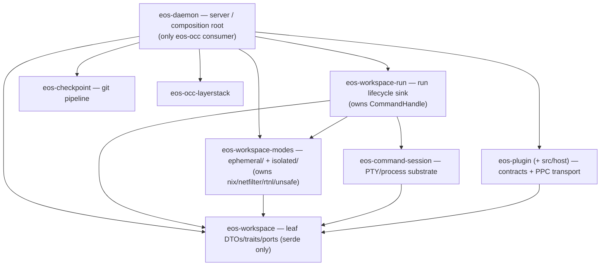

# eos-daemon SRP Optimization Plan

Drafted: 2026-06-09
Revised: 2026-06-09 (ultra-aggressive cleanup pass — see "What This Revision Changes")

## Problem Statement

`sandbox/crates/eos-daemon` should be the live server deployed inside the
sandbox: it accepts command/operation execution requests, validates the wire
envelope, dispatches the operation, owns server-local runtime state, and injects
host resources into narrower crates.

It should not continue to be the main home for command-run lifecycle logic,
plugin runtime mechanics, isolated namespace plumbing, and workspace mutation
adapters. Those are different responsibilities from "run the daemon server."
"SRP" here means the single responsibility principle: **responsibility cohesion,
not consumer count.** A crate consumed only by the daemon can still be a correct
boundary when it isolates one responsibility and enforces a dependency
direction.

This pass goes as aggressive as *correctness* allows: maximal real deletion,
crate consolidation up to the structural floor, honest names, and host-neutral
extraction — while refusing any change that introduces a Cargo cycle, leaks a
guarded dependency edge, or produces an oversized multi-concept file.

## What This Revision Changes

Corrections from the earlier draft and from review, all verified against source:

| Earlier draft said | Reality | This revision |
|---|---|---|
| Move `CommandHandle` up into the leaf | No mode crate references it; it is daemon/run-tier plumbing, in **no** seam signature; it is a raw-fd OS handle, not a pure DTO. Nothing forces the move. | **`CommandHandle` stays in `eos-workspace-run`.** Drop the move entirely. |
| Rename run tier → `eos-workspace-runtime` | Collides with `eos-daemon/src/runtime/` (server runtime state) at the prose/doc level. | Rename run tier → **`eos-workspace-run`**. |
| Flatten daemon adapters into one file per seam | `adapters/plugin.rs` would be 1,220–1,920 LOC and `adapters/isolated_runtime.rs` ~1,003 LOC — both breach the repo's own 800–1000 split smell — and the collapse triggers duplicate `mod tests;` (E0428) plus stale `#[path]` depths. | **Keep right-sized module trees.** Split oversized files *toward* 300–600 LOC; never collapse cohesive trees into mega-files. |
| Phase 5 plugin extraction = −1,300 to −2,000 LOC | The honest host-neutral surface is ~580–840 LOC; most of `adapters/plugins` (3,220 LOC) is live-process / OCC / overlay that the plan's own rules keep daemon-side. | Right-size the extraction to **~500–700 LOC**; move DTO *data* + parse/spec, keep wire-shaping daemon-side. |
| Keep `eos-ephemeral-workspace` and `eos-isolated-workspace` as separate crates | No crate depends on ephemeral-without-nix today (only the daemon and the run tier consume ephemeral, and both already carry the nix surface transitively). The separate-crate boundary protects no current consumer. | **Merge both into `eos-workspace-modes`** (modules `ephemeral/` + `isolated/`). The leaf stays pure; `command-session` keeps a thin leaf-only dep. |
| Target daemon ~6,800–7,700 LOC | Inflated: the only true deletion is the 574-LOC dead file; the rest is relocation, and Phase-5 was 2–3× over-claimed. | Drop the LOC target as an acceptance gate. Realistic daemon lands **~8,000–8,400 LOC**; gate on **dependency direction**, not counts. |

## Observed Baseline (verified)

Live source under `sandbox/crates/eos-daemon/src`: **54 Rust files, 10,471 LOC**.
The generated inventory at `sandbox/docs/class_inventory/html` is stale (renders
`src/services/*`; the live tree uses `src/adapters/*`). Regenerate it in Phase 0
before trusting any count.

| Area | Live LOC | Disposition |
|---|---:|---|
| `adapters/plugins` | 3,220 | ~2,350 daemon-owned (live process registry, OCC callback body, overlay exec) **stays**; ~500–700 host-neutral (DTO data + parse/spec) **moves** to `eos-plugin/src/host`. |
| `adapters/workspace_run` | 2,402 | Delete dead `manager.rs` (Phase 1, 574 LOC). Keep RPC facade + injected ports; lifecycle lives in `eos-workspace-run`. |
| `eos-plugin-host` (crate) | 1,100 | Dissolve into `eos-plugin/src/host`. |
| `eos-workspace-run-host` (crate) | 1,002 | Rename → `eos-workspace-run`. Keeps `CommandHandle`. |
| `eos-checkpoint-host` (crate) | 473 | Rename → `eos-checkpoint`. |
| `audit` / `runtime` / `ops` / `transport` | 920 / 856 / 841 / 567 | Keep. Server-local infra + the wire op registry/facade. |

`manager.rs` is provably dead: it is **not** declared in
`adapters/workspace_run/mod.rs`, it references a `super::registry` sibling that
does not exist as a module, and the live `WorkspaceRunManager` is imported from
the run-tier crate (`commands.rs`). It compiles into nothing today.

## Target Crate Family



Dependency direction is strictly `daemon → {run, modes, plugin, checkpoint,
occ-layerstack} → workspace(leaf)`. The leaf references **zero** internal crates,
so it stays the anchor everything points into — no cycle, no daemon back-edge.
`command-session` depends on the leaf **only**, so it never inherits the
overlay/protocol/nix surface.

| Crate | Owns | Must not own |
|---|---|---|
| `eos-daemon` | RPC transport, op registry, server-local runtime state, audit ring, the daemon-owned **single-writer** OCC cache, thin op facades, daemon-only port **impls** + injection. | Run lifecycle state machine, plugin package/PPC mechanics, git-commit pipeline body, namespace process supervision body. |
| `eos-workspace` (leaf, was `eos-workspace-api`) | Workspace mode enum, command/file DTOs, read/mutation contracts (`WorkspaceReadView` / `WorkspaceMutationSink` / `WorkspaceFileOps`), path resolution, `SnapshotLease`, response helpers. Deps: `serde, serde_json, thiserror` only. | Any mode implementation, OCC writer, daemon globals, run lifecycle, plugin state, `CommandHandle`. |
| `eos-workspace-modes` (NEW = `eos-ephemeral-workspace` + `eos-isolated-workspace`) | `ephemeral/`: snapshot, fresh overlay dirs, capture/finalize/discard policy. `isolated/`: session lifecycle, namespace/caps/network policy, audit collection, the `nix`/netfilter/rtnl surface. | OCC writer ownership, daemon RPC facade, run lifecycle orchestration. |
| `eos-workspace-run` (was `eos-workspace-run-host`) | `WorkspaceRunManager`, `WorkspaceRunRegistry`, `StartTarget`, `WorkspaceRunHostPorts` (daemon-injected seam), and **`CommandHandle`**. The both-modes composition sink. `eos-occ`-free by construction. | OCC writer, daemon `DispatchContext` / `DaemonError`, RPC facade. |
| `eos-command-session` | PTY/process/session substrate. | Workspace-mode policy, daemon op parsing. |
| `eos-checkpoint` (was `eos-checkpoint-host`) | `commit_to_git` git/worktree pipeline, `CommitRequest` / `CommitOutcome` / `CheckpointError`. | Daemon runtime state, OCC writer. |
| `eos-plugin` (+ `src/host`) | Plugin contracts plus host-neutral package/PPC support and the moved plugin DTO *data* + parse/spec under `src/host`. | Daemon runtime state, OCC writer, live process registry, LayerStack/overlay/`eos-occ`/`tokio` edges, daemon wire-response shaping. |

### Resulting workspace members

`9` affected members → `7`: `eos-plugin-host` dissolves into `eos-plugin`;
`eos-ephemeral-workspace` + `eos-isolated-workspace` merge into
`eos-workspace-modes`. Total `[workspace] members`: **20 → 17**.

| Today | After | Change |
|---|---|---|
| `eos-workspace-api` | `eos-workspace` | rename (leaf stays pure; no `CommandHandle`) |
| `eos-ephemeral-workspace` + `eos-isolated-workspace` | `eos-workspace-modes` | **merge** (modules `ephemeral/` + `isolated/`) |
| `eos-workspace-run-host` | `eos-workspace-run` | rename (keeps `CommandHandle`) |
| `eos-checkpoint-host` | `eos-checkpoint` | rename |
| `eos-plugin` + `eos-plugin-host` | `eos-plugin` (with `src/host/`) | merge; gains `sha2` + `uuid` |
| `eos-daemon` | `eos-daemon` | −574 dead LOC; ~500–700 LOC host-neutral extracted; deps swapped |
| `eos-command-session` / `eos-occ-layerstack` | unchanged | retarget the leaf rename only |

## Cycle / Guard Safety (the constraints that bound the aggression)

- **No cycle.** `eos-workspace-modes → eos-workspace` (leaf has zero internal
  deps, never points back). The run tier depends on modes; nothing the modes
  crate imports depends on the run tier. One-line proof: leaf out-edges = ∅;
  modes out-edges = {leaf, overlay, protocol, config, nix}; run out-edges =
  {modes, command-session, leaf, layerstack, overlay}; daemon → all → DAG.
- **Leaf↔run merge is forbidden** (would cycle): the run tier *depends on*
  isolated while the leaf is *depended on by* isolated, so one crate cannot hold
  both. This is why `eos-workspace-run` stays its own crate.
- **No nix leak past intended consumers.** `eos-workspace-modes` carries the
  `nix`/netfilter/rtnl surface, but its only consumers are `eos-daemon`,
  `eos-workspace-run`, and `eos-e2e-test` — all of which already pull that
  surface transitively. `eos-command-session` and any future leaf-only consumer
  stay clean because they depend on the leaf, not on modes. (Accepted tradeoff of
  Option 3: the unsafe/syscall surface is no longer in a single dedicated crate;
  it is contained to the `isolated/` module of `eos-workspace-modes` and must
  keep its tight safety invariants + safe wrappers there.)
- **No-publish guard.** `eos-workspace-run` stays `eos-occ`-free by
  construction; the OCC writer lives only in the daemon.
- **Single-writer OCC.** The per-root OCC cache and `handle_callback_for_root`
  body stay daemon-owned; plugin callbacks still route through the one writer.

## Resulting File/Folder Structure

### `eos-workspace` (leaf — pure, unchanged internals)

```text
src/
  lib.rs  mode.rs  command_session.rs  file_ops.rs
  lease.rs  mutation.rs  read_view.rs  response.rs
```
Deps: `{ serde, serde_json, thiserror }`. No `command_handle.rs` (stays in the run tier).

### `eos-workspace-modes` (NEW — ephemeral + isolated, relocated under subdirs)

```text
src/
  lib.rs                 # pub mod ephemeral; pub mod isolated;
  ephemeral/             # was crates/eos-ephemeral-workspace/src/*
    mod.rs               # was ephemeral/lib.rs
    capture.rs  command.rs  dirs.rs  error.rs
    finalize.rs  ops.rs  ports.rs  timings.rs  types.rs
  isolated/              # was crates/eos-isolated-workspace/src/*
    mod.rs               # was isolated/lib.rs
    audit.rs  caps.rs  command.rs  error.rs  network.rs  ops.rs  session.rs
    network/netfilter/{exprs.rs, mod.rs, wire.rs}
    network/rtnl.rs
    session/{capacity.rs, gc.rs, lifecycle.rs, persistence.rs, ports.rs, support.rs, types.rs}
```
Deps: union of both crates — `{ eos-workspace, eos-overlay, eos-protocol,
eos-config, nix, serde, serde_json, thiserror }`. `ephemeral/command.rs` and
`isolated/command.rs` coexist (distinct module paths). Consumers rewrite
`eos_ephemeral_workspace::X` → `eos_workspace_modes::ephemeral::X` and
`eos_isolated_workspace::Y` → `eos_workspace_modes::isolated::Y`.

### `eos-workspace-run` (run tier — keeps CommandHandle)

```text
src/
  lib.rs  manager.rs  ports.rs  registry.rs
  command_handle.rs      # STAYS (lifecycle plumbing; fd alias-semantics documented)
```
Deps: previous set, with the two mode deps collapsed to `eos-workspace-modes`.
Stays `eos-occ`-free.

### `eos-checkpoint`

```text
src/
  lib.rs  commit.rs
```
Deps: `{ eos-layerstack, eos-overlay, uuid, thiserror }` — no daemon edge.

### `eos-plugin` (+ `src/host/`)

```text
src/
  lib.rs error.rs manifest.rs ppc.rs refresh.rs registry.rs service.rs service_registry.rs
  host/                       # absorbed from eos-plugin-host + extracted plugin DTO data/parse
    mod.rs                    # was eos-plugin-host/src/lib.rs; pub enum PpcError; host re-exports
    package.rs                # ensure_package, needs_upload_response, PackageEnsureReport, PackageRoots
    ppc_client.rs             # PpcClient, read_frame (was ppc_router.rs)
    ppc_client/
      frame_io.rs             # FrameWriter (pub(super))
      pending.rs              # PendingCalls, CallbackHandler, PendingRequest
    route.rs                  # PluginOperationRoute (data only — NO to_json), PluginProcessSpec (data)
    ensure_args.rs            # ParsedEnsure::from_args, route/spec construction, validation
```
Deps: `{ eos-protocol, eos-workspace, serde, serde_json, thiserror, sha2, uuid }`
— none of `eos-daemon` / `eos-occ` / `eos-layerstack` / `eos-overlay` / `tokio`.
The `test-root-override` feature migrates onto `eos-plugin`. Wire-shaping
(`to_json`, `route_values`, `loaded_plugin_values`) stays **daemon-side**,
operating on these moved data types.

### `eos-daemon/src` (slimmer; module trees preserved — no mega-files)

```text
src/
  lib.rs
  transport/  { framing.rs, mod.rs, server.rs, tool_call_events.rs }      # unchanged
  dispatch/   { dispatcher.rs, mod.rs }                                   # unchanged
  runtime/    { error.rs, invocation_registry.rs, mod.rs,                 # unchanged
                request_args.rs, response_timings.rs }
  audit/      { buffer.rs, events.rs, mod.rs }                            # unchanged
  ops/        { audit, checkpoint, command_sessions, control, files,      # KEEP — the Handler-ABI
                isolated_workspace, mod, plugins, registry, workspace_run }.rs  #  seam stays
  adapters/
    mod.rs
    checkpoint/  { base.rs, commit.rs, mod.rs }      # keep tree (~190 LOC; optional → 1 file)
    occ/         { mod.rs, service_cache.rs }        # single-writer OCC cache — unchanged
    overlay/     { mod.rs }                          # DaemonPublisherPort — unchanged
    workspace/   { file_ports.rs, mod.rs }           # OCC-backed file ports — daemon-owned
    workspace_run/
      mod.rs  commands.rs  cancel.rs  wire.rs  config.rs  host_ports.rs
      # manager.rs                                   # DELETED (Phase 1, 574 LOC dead)
      isolated/  { mod.rs, ns_runner.rs, runtime.rs } # keep tree (do NOT merge to one file)
    plugins/                                          # keep tree; slimmer after extraction
      mod.rs  state.rs  connected.rs  dispatch.rs
      occ_callbacks.rs  overlay.rs  refresh.rs  service.rs
      process.rs                                      # live PluginServiceProcess only (spec half → eos-plugin/host)
      # PluginOperationRoute/PluginProcessSpec data + ensure_args parse  -> eos-plugin/src/host
      # to_json / route_values / loaded_plugin_values stay here (wire shaping)
```

The two-tier `ops/<domain>.rs` (uniform `Handler = fn(&Value, DispatchContext)
-> Result<Value, DaemonError>`) over `adapters/<domain>` is **kept** — `ops/` is
the dispatch-table signature-normalization seam, not duplication, and
`ops/{files,audit,control}` carry real logic with no adapter sibling.

## Class–Field Contract (the seams ARE the architecture)

Four trait/DTO seams carry every cross-crate call; the daemon supplies the
implementations, never a back-edge.

| Seam | Defined in | Daemon impl / injection | Notes |
|---|---|---|---|
| `WorkspaceRunHostPorts` (object-safe trait) | `eos-workspace-run/ports.rs` | `DaemonRunHostPorts` in `adapters/workspace.rs` | `base_timings`, `finalize_ephemeral`, `record_tool_call`. |
| `WorkspaceReadView` + `WorkspaceMutationSink` | `eos-workspace` (leaf) | `EphemeralFilePorts`, `IsolatedFilePorts` in `adapters/workspace.rs` | `resolve_path` / `read_bytes`; `commit_or_record`. |
| `PpcClient::round_trip_with_callbacks<F>` | `eos-plugin/host` | closure over `handle_callback_for_root` in `adapters/plugins` | writer stays daemon-side. |
| `commit_to_git(&CommitRequest)` | `eos-checkpoint` | thin `adapters/checkpoint` facade | concrete request, no `dyn`. |

`CommandHandle` (`eos-workspace-run/command_handle.rs`) stays put. It holds
`ns_fds: HashMap<String,i32>` raw-fd **aliases** (not owners); `Clone` mirrors the
documented alias semantics of `eos-workspace-modes::isolated::session::types`
(`WorkspaceHandle` is itself `Clone` with no `Drop`; fds close exactly once in
`close_handle_fds`). Derives `Debug + Clone`, **no serde**. It appears in no seam
signature — only in run-tier registry/manager fields and daemon adapter bodies.

Daemon-owned singletons that **stay** (the impure resource owners):

| Type | File | Role |
|---|---|---|
| `OccServiceCache`, `DaemonPublisherPort` | `adapters/occ`, `adapters/overlay` | per-root single-writer OCC cache + publish port |
| `DaemonPluginState`, `PluginServiceProcess` (Drop=killpg), `LoadedPluginRuntime` | `adapters/plugins/state.rs`, `process.rs` | live plugin child-process + service registry |
| `handle_callback_for_root` | `adapters/plugins/occ_callbacks.rs` | the OCC callback body injected into `PpcClient` |
| `DaemonNamespaceRuntime`, `DaemonIsolatedState` | `adapters/workspace_run/isolated/` | isolated singleton + ns child plumbing |

## Reduction Reality

Counts are informational and only after the inventory is regenerated; the
acceptance gate is **dependency direction**, not LOC. The only code that leaves
the system entirely is the 574-LOC dead file; everything else is **relocation**
into the owning crate.

| Phase | Main change | Daemon LOC delta | Kind |
|---|---|---:|---|
| 0 | Regenerate inventory; lock true baseline | 0 | — |
| 1 | Delete dead `adapters/workspace_run/manager.rs` | −574 | true deletion |
| 2 | Dissolve `eos-plugin-host` → `eos-plugin/src/host` | ~0 | crate merge |
| 3 | Extract host-neutral plugin DTO data + parse/spec → `eos-plugin/host`; split `process.rs` | −500 to −700 | relocation |
| 4 | Move mode-neutral file/run helpers into the leaf; keep OCC-backed adapters daemon-side | −300 to −500 | relocation |
| 5 | Merge `ephemeral` + `isolated` → `eos-workspace-modes`; retarget consumers | ~0 | crate merge |
| 6 | Batch renames: leaf, run tier, checkpoint | ~0 | rename |
| 7 | Right-size daemon adapter modules (no mega-files); fix moved `#[path]` only | small | reorg |

Realistic daemon `src` after: **~8,000–8,400 LOC** (not the earlier 6,800–7,700).

## Phase Plan

Content moves run first with names stable; structural renames/merges land late in
atomic commits to minimize cross-agent merge conflict in this concurrently-edited
repo.

### Phase 0 — Measurement and Guardrails
- Regenerate: `cd sandbox && cargo run --manifest-path scripts/class-inventory/Cargo.toml`.
- Confirm `eos-daemon` is the only server/composition root and the only `eos-occ` consumer.
- Confirm no workspace-family back-edge onto `eos-daemon`.

### Phase 1 — Delete Dead Code (ship standalone first)
- Delete `sandbox/crates/eos-daemon/src/adapters/workspace_run/manager.rs` (574 LOC, orphaned).
- Verify: `cargo check -p eos-daemon --all-targets`; `cargo test -p eos-daemon command -- --nocapture`.

### Phase 2 — Dissolve `eos-plugin-host` into `eos-plugin`
- Merge `crates/eos-plugin-host/src/*` into `crates/eos-plugin/src/host/`
  (`lib.rs`→`host/mod.rs`, `package.rs`, `ppc_router*`→`ppc_client*`). Delete `eos-plugin-host`.
- Internal rewrites: `use eos_plugin::{…}` → `use crate::{…}`; `crate::PpcError` →
  `crate::host::PpcError`. Add `pub mod host;` to `eos-plugin/lib.rs`. Add `sha2`+`uuid`;
  migrate `test-root-override` onto `eos-plugin`.
- Keep forbidden deps out: no `eos-daemon`/`eos-occ`/`eos-layerstack`/`eos-overlay`/`tokio`.
- Verify: `cargo test -p eos-plugin`; `cargo test -p eos-daemon plugin -- --nocapture`;
  `cargo tree -p eos-plugin | rg 'eos-daemon|eos-occ|eos-layerstack|eos-overlay|tokio'` empty.

### Phase 3 — Host-Neutral Plugin Extraction (right-sized)
- Move `PluginOperationRoute` / `PluginProcessSpec` **data** (fields, ctors,
  `dispatch_mode`) and the parse/spec/validation in `ensure_args.rs` into
  `eos-plugin/src/host/{route.rs, ensure_args.rs}`. Split `adapters/plugins/process.rs`
  so the spec/env half moves and the live `PluginServiceProcess` (Drop=killpg) stays.
- **Keep daemon-side:** `to_json`/`route_values`/`loaded_plugin_values` (wire shaping),
  `DaemonPluginState`, OCC callback body, per-op overlay execution, `DispatchContext`
  mapping, and any helper that reads the `plugin_runtime_config` global.
- Verify: `cargo test -p eos-plugin`; `cargo test -p eos-daemon plugin -- --nocapture`;
  live plugin E2E if service launch changes.

### Phase 4 — Workspace Adapter Slimming (modest)
- Move only genuinely mode-neutral file/run helpers into `eos-workspace`. Do not add
  new host crates. Keep OCC-backed `EphemeralFilePorts` / `IsolatedFilePorts` daemon-side.
  Keep `ops/{files,command_sessions,isolated_workspace}.rs` as thin shims.
- Verify: `cargo check -p eos-workspace -p eos-daemon --all-targets`;
  `cargo test -p eos-daemon phase2_read_paths phase3_write_paths -- --nocapture`.

### Phase 5 — Merge `ephemeral` + `isolated` → `eos-workspace-modes`
- `git mv crates/eos-ephemeral-workspace/src` → `crates/eos-workspace-modes/src/ephemeral`,
  `git mv crates/eos-isolated-workspace/src` → `.../src/isolated`; each `lib.rs` → `mod.rs`.
  New `lib.rs`: `pub mod ephemeral; pub mod isolated;`. Union the two `Cargo.toml` dep sets.
- Update workspace `members` + path-deps; delete the two old members.
- Rewrite consumers (`eos-daemon`, `eos-workspace-run-host`, `eos-e2e-test`):
  `eos_ephemeral_workspace::X` → `eos_workspace_modes::ephemeral::X`;
  `eos_isolated_workspace::Y` → `eos_workspace_modes::isolated::Y`.
- Verify: `cargo check --workspace --all-targets`;
  `cargo tree -p eos-workspace-modes | rg 'eos-occ'` empty;
  `cargo tree -p eos-command-session | rg 'eos-overlay|eos-protocol'` **empty** (leaf stays pure).

### Phase 6 — Honest Renames (atomic, late)
- `git mv crates/eos-workspace-api crates/eos-workspace`;
  `git mv crates/eos-workspace-run-host crates/eos-workspace-run`;
  `git mv crates/eos-checkpoint-host crates/eos-checkpoint`. Set each `[package] name`,
  update `members` + path-deps, and rewrite `eos_workspace_api::`→`eos_workspace::`,
  `eos_workspace_run_host::`→`eos_workspace_run::`, `eos_checkpoint_host::`→`eos_checkpoint::`
  across consumers. **Do not move `CommandHandle`.**
- Verify: `cargo check --workspace --all-targets`;
  `cargo tree --workspace -i eos-workspace-api` fails (old names gone).

### Phase 7 — Right-Size Daemon Adapter Modules
- Reorganize remaining daemon adapters into cohesive 300–600 LOC modules; **do not**
  collapse `plugins/` or `isolated/` into single files. Optional: fold
  `adapters/checkpoint/{base,commit,mod}` (~190 LOC) into one file.
- Fix `#[path]` test depths and any duplicate `mod tests;` **only** for files that
  actually move. Keep `ops/registry.rs` aligned with `eos_protocol::ops::BUILTIN_DAEMON_OPS`.
- Verify: `cargo check -p eos-daemon --all-targets`; `cargo test -p eos-daemon ops::registry`;
  `cargo clippy -p eos-daemon --all-targets -- -D warnings`.

## Acceptance Criteria

Dependency-direction and cohesion gates come first; raw counts are informational.

- **No back-edge:** `cargo tree -p eos-workspace -p eos-workspace-modes
  -p eos-workspace-run -p eos-plugin -p eos-checkpoint -i eos-daemon` empty for each.
- **No cycle anchor:** `cargo tree -p eos-workspace | rg 'modes|run|occ|daemon|overlay|protocol'` empty.
- **Leaf stays pure:** `cargo tree -p eos-command-session | rg 'eos-overlay|eos-protocol'` empty.
- **No-publish guard:** `cargo tree -p eos-workspace-run | rg 'eos-occ'` empty.
- **Plugin isolation:** `cargo tree -p eos-plugin | rg 'eos-daemon|eos-occ|eos-layerstack|eos-overlay|tokio'` empty.
- `eos-daemon` owns only: transport/server, dispatcher/op registry, server-local
  runtime state, audit ring, the single-writer OCC cache, thin op facades, and
  injected host port impls.
- Run lifecycle in `eos-workspace-run`; both mode implementations in
  `eos-workspace-modes`; git pipeline in `eos-checkpoint`; PPC transport + plugin
  DTO data/parse in `eos-plugin/host`. None re-homed into the daemon.
- No `*-host` / `*-api` survivors in `members`; `eos-plugin-host`,
  `eos-ephemeral-workspace`, `eos-isolated-workspace` gone. `[workspace] members` = 17.
- No daemon implementation file exceeds ~800 LOC.
- Cancellation still never publishes; plugin callbacks still route through the one OCC writer.

## Progress Tracker

| Phase | Status | Notes |
|---|---|---|
| 0 — Measurement and guardrails | Done | Baseline confirmed: daemon sole `eos-occ` root, no back-edge. Linux typecheck gate established (`--target x86_64-unknown-linux-musl`). |
| 1 — Delete dead `manager.rs` | Done | 574 LOC orphan deleted; daemon all-targets green on macOS + Linux. |
| 2 — Dissolve `eos-plugin-host` | Done | Moved to `eos-plugin/src/host` (`ppc_router`→`ppc_client`); crate deleted; `members` −1; plugin isolation acceptance clean. |
| 3 — Host-neutral plugin extraction | Done | `route.rs`+`ensure_args.rs` → `eos-plugin/src/host` (data+parse, returns `PpcError`); `route_to_json`/`process_spec_to_json`/live `PluginServiceProcess`/`ppc_socket_root` stay daemon. plugins adapter 3220→2704; daemon src 10471→9381. clippy+isolation clean. |
| 4 — Workspace adapter slimming | Done (already satisfied) | Boundary already correct: leaf owns neutral file ops/DTOs/traits + path resolution (deps = serde/serde_json/thiserror, zero internal crates); daemon `file_ports.rs` holds only OCC-/`CommandHandle`-backed trait impls, which the plan mandates stay daemon-side. No mode-neutral helper is movable without breaching leaf purity, so no relocation (LOC estimate did not hold against source — gate is dependency direction). |
| 5 — Merge ephemeral + isolated | Done | → `eos-workspace-modes` (`ephemeral/`+`isolated/`, Linux dep table preserved; `crate::`→`crate::{ephemeral,isolated}::`; `#[path]` depths fixed). Consumers retargeted. Gates: modes has no `eos-occ`; command-session leaf-pure; no daemon back-edge. members: 17 crates (+xtask). e2e-test needed no change (raw envelopes). |
| 6 — Honest renames (atomic) | Done | `eos-workspace-api`→`eos-workspace`, `eos-workspace-run-host`→`eos-workspace-run`, `eos-checkpoint-host`→`eos-checkpoint` (dirs+pkg+deps+code+`as _`+doc prose). `CommandHandle` stayed in run tier. All 6 old names unresolvable; zero daemon back-edges. Behavior: full `cargo test -p eos-plugin`/`-p eos-daemon` green (32+113 tests). |
| 7 — Right-size daemon adapters | Done | Already right-sized — largest daemon file `audit/events.rs` 531 LOC (none > 800); no daemon file changed directory so no `#[path]` fixes. Optional fold applied: `adapters/checkpoint/{base,commit,mod}` (3 files/190) → `adapters/checkpoint.rs` (172). `ops::registry` aligned (3 tests pass); clippy `-D warnings` clean. |
