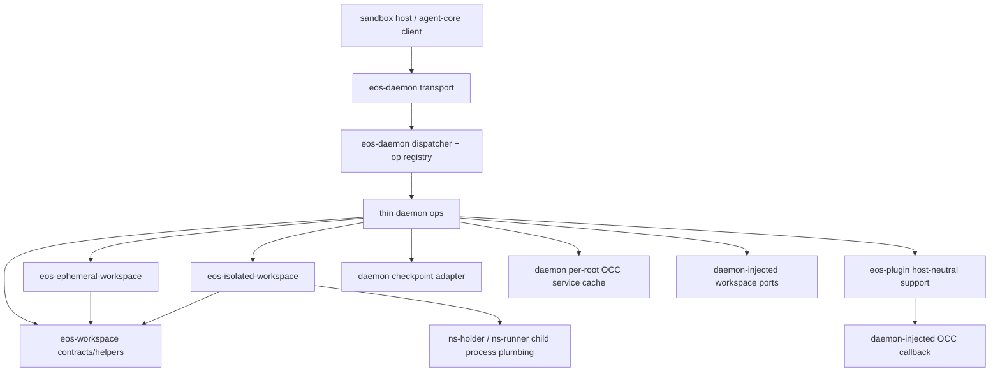

# eos-daemon SRP Optimization Plan

Drafted: 2026-06-09

## Problem Statement

`sandbox/crates/eos-daemon` should be the live server deployed inside the
sandbox: it accepts command/operation execution requests, validates the wire
envelope, dispatches the operation, owns server-local runtime state, and injects
host resources into narrower crates.

It should not continue to be the main home for command-run lifecycle logic,
plugin runtime lifecycle logic, isolated namespace runtime plumbing, and
workspace mutation adapters. Those are different responsibilities from "run the
daemon server". This plan assumes "single rsp rule" means the single
responsibility principle.

## Observed Baseline

The local class inventory at
`http://127.0.0.1:8790/sandbox/crates/eos-daemon.html` reports:

| Metric | Reported |
|---|---:|
| Modules | 53 |
| Items | 472 |
| Fields | 205 |
| Methods | 120 |

Important caveat: that generated inventory is stale against the live checkout.
It still renders `src/services/*`, while the live source tree uses
`src/adapters/*`. The live source under `sandbox/crates/eos-daemon/src` currently
has 54 Rust files and 10,471 LOC. Prior host-crate extraction already introduced
`eos-checkpoint-host`, `eos-occ-layerstack`, `eos-plugin-host`, and
`eos-workspace-run-host`; this plan keeps `eos-occ-layerstack`, removes the
single-consumer `eos-checkpoint-host`, and absorbs `eos-plugin-host` into
`eos-plugin`.

Current largest relevant areas by live LOC:

| Area | Live LOC | Keep / Move |
|---|---:|---|
| `adapters/plugins` | 3,220 | Move reusable plugin package/PPC/service mechanics into `eos-plugin::host`; keep daemon op facade, live process registry, and OCC callback body. |
| `adapters/workspace_run` | 2,402 | Do not add another host crate. Delete completed-extraction debris and consolidate mode-neutral pieces into a single `eos-workspace` crate. |
| `eos-checkpoint-host` | 473 | Remove crate; fold `commit_to_git` request-specific host logic back under daemon checkpoint adapters. |
| `eos-plugin-host` | 1,573 | Remove crate; move host-neutral plugin support under `eos-plugin/src/host`. |
| `audit` | 920 | Keep. Server-local audit ring is daemon runtime state. |
| `runtime` | 856 | Keep. Server errors, invocation registry, timings, request helpers. |
| `ops` | 841 | Keep thin. This is the wire op registry/facade. |
| `transport` | 567 | Keep. This is the live server. |

## Target Ownership



The daemon remains the composition root. The workspace split should be by domain
meaning, not by "host" mechanics:

| Crate / module | Owns | Must not own |
|---|---|---|
| `eos-daemon` | RPC transport, op registry, server-local runtime state, audit ring, daemon-owned single-writer OCC cache, daemon-only port implementations. | Mode-neutral workspace contracts, plugin package/PPC mechanics, broad lifecycle state machines. |
| `eos-workspace` | Shared workspace types, mode enum, command/file DTOs, path resolution contracts, mutation/read response contracts, common run scaffolding that does not know daemon globals. | OCC writer ownership, daemon `DispatchContext`, daemon `DaemonError`, plugin state, namespace process supervision. |
| `eos-ephemeral-workspace` | Ephemeral snapshot, fresh overlay dirs, capture/finalize/discard policy. | Isolated namespace/session policy, daemon runtime state. |
| `eos-isolated-workspace` | Isolated session lifecycle, namespace/session policy, network/caps/audit collection. | Ephemeral publish policy, daemon RPC facade, OCC publish path. |
| `eos-command-session` | PTY/process/session substrate. | Workspace-mode policy and daemon op parsing. |
| `eos-plugin` | Plugin contracts plus host-neutral package/PPC support under `src/host`. | Daemon runtime state, OCC writer ownership, LayerStack/overlay publish paths, tokio services. |

`eos-workspace` should be a rename/expansion of `eos-workspace-api`, not an
extra crate. The existing `eos-workspace-run-host` should either be absorbed into
`eos-workspace` where its code is mode-neutral, or retired where it duplicates
daemon/server-only responsibilities. This avoids adding
`eos-workspace-file-host` and `eos-isolated-runtime-host`. Similarly,
`eos-plugin-host` should not remain as a permanent crate: its host-neutral
package and PPC transport code belongs under `eos-plugin/src/host`, while
daemon-only plugin state stays in `eos-daemon`.

## Resulting File Shape

Target `eos-daemon` source tree:

```text
sandbox/crates/eos-daemon/src/
  lib.rs
  audit/
    buffer.rs
    events.rs
    mod.rs
  dispatch/
    dispatcher.rs
    mod.rs
  runtime/
    error.rs
    invocation_registry.rs
    mod.rs
    request_args.rs
    response_timings.rs
  transport/
    framing.rs
    mod.rs
    server.rs
    tool_call_events.rs
  ops/
    audit.rs
    checkpoint.rs
    command_sessions.rs
    control.rs
    files.rs
    isolated_workspace.rs
    mod.rs
    plugins.rs
    registry.rs
    workspace_run.rs
  adapters/
    mod.rs
    checkpoint.rs          # checkpoint op facade + commit_to_git host logic
    occ_cache.rs           # daemon-owned single-writer cache only
    plugin.rs              # op facade + daemon OCC callback injection
    workspace.rs           # singleton config + daemon workspace ports
    workspace_run.rs       # RPC facade + target selection only
    isolated_runtime.rs    # daemon singleton over eos-isolated-workspace runtime
```

Target crate family:

```text
sandbox/crates/
  eos-workspace/             # rename/expand eos-workspace-api; shared workspace substrate
  eos-ephemeral-workspace/   # ephemeral-specific policy
  eos-isolated-workspace/    # isolated-specific policy
  eos-command-session/       # command/session substrate
  eos-occ-layerstack/        # already exists; keep layerstack-bound OCC impls here
  eos-plugin/                # plugin contracts + host-neutral support
```

No new workspace host crates are part of this target. If the implementation
needs a transition period, `eos-workspace-run-host` may exist temporarily, but
the end-state should not keep it as a permanent boundary.

`eos-checkpoint-host` and `eos-plugin-host` are also removed from the end-state:
the former folds into daemon checkpoint adapters, and the latter folds into
`eos-plugin/src/host`.

Target plugin support shape:

```text
sandbox/crates/eos-plugin/src/
  lib.rs
  error.rs
  manifest.rs
  ppc.rs
  refresh.rs
  registry.rs
  service.rs
  service_registry.rs
  host/
    mod.rs
    package.rs
    ppc_client.rs
    ppc_client/
      frame_io.rs
      pending.rs
```

## Diff Comparison

Boundary diff:

| Area | Current / Problem | Target / Result | Net Effect |
|---|---|---|---|
| Workspace shared layer | `eos-workspace-api` is contract-only, while `eos-workspace-run-host` carries shared run lifecycle mechanics as a separate host-style crate. | Rename/expand `eos-workspace-api` to `eos-workspace`; absorb mode-neutral run/file contracts and helpers there. | One shared workspace substrate instead of split API/host concepts. |
| Workspace mode crates | `eos-ephemeral-workspace` and `eos-isolated-workspace` both depend on shared APIs, but the shared ownership boundary is not explicit enough. | Both depend on `eos-workspace`; each owns only its mode-specific policy. | Clear shared-vs-mode split. |
| Daemon workspace run | `eos-daemon/adapters/workspace_run/*` still contains duplicate/debris lifecycle code. | Daemon keeps only RPC facade, target selection, singleton wiring, and daemon-owned ports. | Daemon returns to live-server composition. |
| Workspace run host | `eos-workspace-run-host` exists as an intermediate crate. | Retire as end-state; absorb neutral code into `eos-workspace`. | Removes one permanent crate boundary. |
| Workspace file host | Not present, but first draft proposed it. | Do not create it. | Avoids an unnecessary crate. |
| Isolated runtime host | Not present, but first draft proposed it. | Do not create it. Keep isolated policy in `eos-isolated-workspace` and daemon singleton wiring in daemon. | Avoids another host-style split. |
| Checkpoint host | `eos-checkpoint-host` is a single-consumer crate used only by daemon `commit_to_git`. | Fold it into daemon checkpoint adapters. | Removes a crate without dropping a boundary used by other crates. |
| Plugin host | `eos-plugin-host` is a single-consumer crate, but its code is plugin-domain support rather than daemon server logic. | Move package/PPC support into `eos-plugin/src/host`; daemon imports it from `eos-plugin`. | Removes a crate while keeping plugin mechanics out of daemon. |
| Plugin runtime | Plugin lifecycle state still lives heavily under `eos-daemon/adapters/plugins`. | Move reusable package/PPC/service support into `eos-plugin::host`; daemon keeps op facade, live process registry, and OCC callback body. | Large daemon reduction without new workspace crates. |
| OCC writer | Daemon owns the per-root single-writer cache. | Still daemon-owned. | Preserves the no-second-writer invariant. |
| Command sessions | `eos-command-session` owns PTY/process substrate, but daemon still carries workspace-run glue. | Keep substrate in `eos-command-session`; move shared workspace run DTOs/helpers to `eos-workspace`; daemon wires the live path. | Cleaner substrate/shared-policy/server split. |

Metric diff:

| Metric | Current Baseline | Target | Reduction |
|---|---:|---:|---:|
| Modules | 53 | 36-41 | 12-17 fewer |
| Items | 472 | 335-375 | 97-137 fewer |
| Fields | 205 | 135-165 | 40-70 fewer |
| Methods | 120 | 78-96 | 24-42 fewer |
| Daemon LOC | 10,471 | 6,800-7,700 | 2,700-3,700 fewer |

Crate diff:

| Crate | Current | Target |
|---|---|---|
| `eos-workspace-api` | Present as shared contract crate. | Rename/expand to `eos-workspace`. |
| `eos-workspace-run-host` | Present as an intermediate host-style crate. | Absorb/retire as end-state. |
| `eos-workspace-file-host` | Not present. | Do not create. |
| `eos-isolated-runtime-host` | Not present. | Do not create. |
| `eos-ephemeral-workspace` | Present. | Keep as ephemeral-mode policy crate. |
| `eos-isolated-workspace` | Present. | Keep as isolated-mode policy crate. |
| `eos-command-session` | Present. | Keep as command/session substrate crate. |
| `eos-checkpoint-host` | Present as a single-consumer host crate. | Remove; fold into daemon checkpoint adapters. |
| `eos-plugin-host` | Present as a single-consumer host crate. | Remove; move host-neutral support into `eos-plugin/src/host`. |
| `eos-plugin` | Contract-only plugin crate today. | Expand to plugin contracts plus host-neutral package/PPC support. |
| `eos-daemon` | Server plus too much adapter/lifecycle logic. | Server plus thin op/adapters and daemon-owned runtime state. |

## Reduction Target

These are planning targets, not a promise of exact inventory output. Exact
numbers should be remeasured by regenerating `sandbox/docs/class_inventory/html`
after each phase.

| Metric | Reported Baseline | Target | Reduction |
|---|---:|---:|---:|
| Modules | 53 | 36-41 | 12-17 fewer |
| Items | 472 | 335-375 | 97-137 fewer |
| Fields | 205 | 135-165 | 40-70 fewer |
| Methods | 120 | 78-96 | 24-42 fewer |
| Daemon `src` LOC | 10,471 live | 6,800-7,700 | 2,700-3,700 fewer |

Expected reduction by phase:

| Phase | Main change | Module delta | Item delta | Field delta | Method delta | LOC delta |
|---|---|---:|---:|---:|---:|---:|
| 0 | Refresh inventory and lock true baseline | 0 | 0 | 0 | 0 | 0 |
| 1 | Delete orphan duplicate `adapters/workspace_run/manager.rs` | -1 | about -12 | about -2 | about -20 | -574 |
| 2 | Rename/expand `eos-workspace-api` into `eos-workspace`; absorb mode-neutral `eos-workspace-run-host` pieces | 0 to -1 | -5 to -15 | 0 to -4 | 0 to -4 | -100 to -300 |
| 3 | Remove `eos-checkpoint-host`; fold `commit_to_git` into daemon checkpoint adapter | +1 to +2 | +20 to +30 | +20 to +25 | +2 to +4 | +350 to +500 |
| 4 | Remove `eos-plugin-host`; move host-neutral support into `eos-plugin/src/host` | 0 daemon delta | 0 daemon delta | 0 daemon delta | 0 daemon delta | 0 daemon delta |
| 5 | Move plugin service/runtime support out of daemon adapters and into `eos-plugin::host` where host-neutral | -4 to -7 | -60 to -85 | -35 to -55 | -10 to -18 | -1,300 to -2,000 |
| 6 | Move only mode-neutral workspace file/run helpers to `eos-workspace`; keep daemon-only OCC/ports in daemon | -2 to -4 | -20 to -40 | -8 to -15 | -5 to -10 | -600 to -900 |
| 7 | Flatten remaining daemon adapters into single seam files | -4 to -6 | -15 to -25 | -4 to -7 | -4 to -8 | -300 to -600 |

## Phase Plan

### Phase 0 - Measurement and Guardrails

- Regenerate the inventory from the live source:
  `cd sandbox && cargo run --manifest-path scripts/class-inventory/Cargo.toml`.
- Record the refreshed `eos-daemon` module/item/field/method counts before code
  changes.
- Confirm `eos-daemon` remains the only server/composition root.
- Confirm the workspace family has no daemon back-edge:
  `eos-workspace`, `eos-ephemeral-workspace`, and `eos-isolated-workspace` must
  not depend on `eos-daemon`.
- Treat the existing `sandbox/crates/eos-daemon/REFACTOR_PLAN.md` as historical
  unless it is refreshed; it still describes the older `services/*` layout.

### Phase 1 - Remove Completed Extraction Debris

- Delete `sandbox/crates/eos-daemon/src/adapters/workspace_run/manager.rs`.
- Verify it is not declared by `adapters/workspace_run/mod.rs`; the live
  command path already imports `eos_workspace_run_host::WorkspaceRunManager`.
- Keep `host_ports.rs`, `commands.rs`, `cancel.rs`, `config.rs`, and `wire.rs`
  in daemon for now because they are the RPC facade and injected daemon seams.

Verification:

- `cd sandbox && cargo check -p eos-daemon --all-targets`
- `cd sandbox && cargo test -p eos-daemon command -- --nocapture`
- Regenerate inventory and confirm the immediate count drop.

### Phase 2 - Workspace Crate Consolidation

- Rename or replace `eos-workspace-api` with `eos-workspace`.
- Move shared workspace contracts and helpers into `eos-workspace`:
  - workspace mode and typed IDs
  - command request/response DTOs
  - read/mutation request and outcome DTOs
  - path resolution contracts
  - shared timing/resource response helpers that do not touch daemon globals
- Absorb the mode-neutral parts of `eos-workspace-run-host` into
  `eos-workspace`.
- Retire `eos-workspace-run-host` as an end-state crate. During migration it may
  remain as a compatibility shell, but the plan should drive it to zero.
- Keep mode-specific policy in `eos-ephemeral-workspace` and
  `eos-isolated-workspace`.

Dispatch strategy:

- Prefer concrete types and closed enums for the ephemeral-vs-isolated runtime
  set.
- Use trait ports only where the shared `eos-workspace` code must call a
  daemon-owned resource, such as publish/record hooks.

Verification:

- `cd sandbox && cargo check -p eos-workspace -p eos-ephemeral-workspace -p eos-isolated-workspace -p eos-daemon --all-targets`
- `cd sandbox && cargo tree -p eos-workspace --invert` to confirm consumers.
- `cd sandbox && cargo tree -p eos-workspace | rg 'eos-daemon|eos-occ'` should
  stay empty unless an explicit feature-gated adapter is later approved.

### Phase 3 - Remove Checkpoint Host Crate

- Delete `eos-checkpoint-host` as an end-state crate.
- Move its typed `CommitRequest`, `CommitOutcome`, `CheckpointError`, and
  `commit_to_git` pipeline into daemon checkpoint adapters.
- Keep `commit_to_git` separate from the op handler inside daemon, for example:
  `adapters/checkpoint.rs` plus a private `adapters/checkpoint/git.rs` if the
  single file gets too large.
- Keep `eos-occ-layerstack` unchanged; it remains the reusable layer-stack-bound
  OCC implementation crate.

Dispatch strategy:

- Concrete structs for `CommitRequest` and `CommitOutcome`.
- No trait or `dyn` boundary; `commit_to_git` is request-specific daemon host
  logic, not runtime-selected behavior.

Verification:

- `cd sandbox && cargo test -p eos-daemon checkpoint -- --nocapture`
- `cd sandbox && cargo check -p eos-daemon --all-targets`
- `cd sandbox && cargo tree --workspace -i eos-checkpoint-host` should fail
  after the crate is removed from the workspace.

### Phase 4 - Absorb Plugin Host Into eos-plugin

- Delete `eos-plugin-host` as an end-state crate.
- Move its host-neutral support into `eos-plugin/src/host`:
  - `package.rs`
  - `ppc_client.rs`
  - `ppc_client/frame_io.rs`
  - `ppc_client/pending.rs`
- Re-export only the small public surface daemon needs from `eos-plugin`:
  `host::ensure_package`, `host::needs_upload_response`,
  `host::package_roots`, `host::PpcClient`, and `host::PpcError`.
- Keep forbidden dependencies out of `eos-plugin`: no `eos-daemon`, no
  `eos-occ`, no `eos-layerstack`, no `eos-overlay`, and no `tokio`.
- Preserve the existing `test-root-override` behavior as a feature on
  `eos-plugin` if tests still need package-root redirection.

Dispatch strategy:

- Concrete `PpcClient` for the connected service socket.
- Callback injection remains a closure/port from daemon into the PPC client so
  plugin-originated OCC callbacks still route through daemon's single writer.

Verification:

- `cd sandbox && cargo test -p eos-plugin`
- `cd sandbox && cargo test -p eos-daemon plugin -- --nocapture`
- `cd sandbox && cargo tree -p eos-plugin | rg 'eos-daemon|eos-occ|eos-layerstack|eos-overlay|tokio'` should stay empty.

### Phase 5 - Plugin Adapter Slimming

- Move reusable plugin service/runtime support out of daemon adapters only when
  it remains host-neutral after the move.
- Candidate moves into `eos-plugin/src/host`:
  - service process specs and validated environment construction
  - package-root resolution
  - connected PPC client helpers
  - service health response shaping that does not touch daemon global state
- Keep in daemon:
  - operation handler functions
  - `DispatchContext` mapping
  - live plugin process registry if it owns child process lifetime
  - per-op overlay execution if it touches LayerStack/overlay/OCC
  - OCC callback body and per-root single-writer access

Dispatch strategy:

- Closed plugin runtime state as concrete structs.
- Callback injection as `dyn` or closure only where runtime callback bodies are
  heterogeneous or test-substituted.

Verification:

- `cd sandbox && cargo test -p eos-plugin`
- `cd sandbox && cargo test -p eos-daemon plugin -- --nocapture`
- Live plugin E2E if service process launch behavior changes.

### Phase 6 - Workspace Adapter Slimming

- Do not add `eos-workspace-file-host`.
- Move only mode-neutral file/run helpers into `eos-workspace`.
- Keep direct OCC-backed write/read adapters in daemon unless they can be
  expressed through existing `eos-occ-layerstack` APIs without creating a second
  writer.
- Keep namespace child process supervision with `eos-isolated-workspace` plus
  the daemon singleton; do not add `eos-isolated-runtime-host`.
- Keep daemon op handlers in `ops/files.rs`, `ops/command_sessions.rs`, and
  `ops/isolated_workspace.rs` as thin request/response shims.

Verification:

- `cd sandbox && cargo check -p eos-workspace -p eos-daemon --all-targets`
- `cd sandbox && cargo test -p eos-daemon phase2_read_paths phase3_write_paths -- --nocapture`

### Phase 7 - Flatten Remaining Daemon Adapters

- Collapse the daemon adapter tree after the extractions:
  - `adapters/checkpoint/{base,commit,mod}.rs` -> `adapters/checkpoint.rs`
    or `adapters/checkpoint/{mod,git}.rs` if the git pipeline needs a private
    submodule
  - `adapters/occ/{mod,service_cache}.rs` -> `adapters/occ_cache.rs`
  - remaining plugin/workspace-run facades -> one file per seam where practical
- Keep `ops/registry.rs` stable and aligned with
  `eos_protocol::ops::BUILTIN_DAEMON_OPS`.

Verification:

- `cd sandbox && cargo check -p eos-daemon --all-targets`
- `cd sandbox && cargo test -p eos-daemon ops::registry`
- `cd sandbox && cargo clippy -p eos-daemon --all-targets -- -D warnings`

## Acceptance Criteria

- Refreshed inventory shows `eos-daemon` at or below:
  - 41 modules
  - 375 items
  - 165 fields
  - 96 methods
- `eos-daemon/src` stays near 7,700 LOC or lower.
- `eos-daemon` owns only:
  - transport/server
  - dispatcher/op registry
  - server-local runtime state
  - audit ring
  - daemon-owned single-writer OCC cache
  - thin op facades and injected host ports
- Non-daemon crates own lifecycle/domain mechanics and have no dependency on
  `eos-daemon`.
- No new workspace host crates are introduced.
- End-state workspace sharing is under `eos-workspace`, not
  `eos-workspace-run-host`, `eos-workspace-file-host`, or
  `eos-isolated-runtime-host`.
- `eos-checkpoint-host` and `eos-plugin-host` are removed from the workspace.
- `eos-plugin` owns host-neutral plugin support under `src/host`, while keeping
  daemon/OCC/LayerStack/overlay/tokio edges absent.
- Cancellation still never publishes workspace changes.
- Plugin callbacks still route through the daemon-owned single OCC writer.
- Live command/session and isolated-workspace behavior remains covered by
  daemon tests and Docker-backed E2E when runtime paths move.

## Progress Tracker

| Phase | Status | Notes |
|---|---|---|
| 0 - Measurement and guardrails | Not started | Regenerate inventory before code changes. |
| 1 - Remove completed extraction debris | Not started | `adapters/workspace_run/manager.rs` appears orphaned in live source. |
| 2 - Workspace crate consolidation | Not started | Rename/expand `eos-workspace-api`; retire `eos-workspace-run-host` end-state. |
| 3 - Remove checkpoint host crate | Not started | Fold `commit_to_git` into daemon checkpoint adapters. |
| 4 - Absorb plugin host into eos-plugin | Not started | Move package/PPC support to `eos-plugin/src/host`. |
| 5 - Plugin adapter slimming | Not started | Move only host-neutral support; keep OCC callback body daemon-owned. |
| 6 - Workspace adapter slimming | Not started | No new workspace host crates; preserve daemon single-writer ownership. |
| 7 - Flatten daemon adapters | Not started | Do only after extractions compile and tests pass. |
