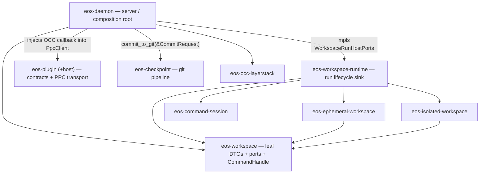

# eos-daemon SRP Optimization Plan

Drafted: 2026-06-09
Revised: 2026-06-09 (corrected Phase 2/3 — see "Correction Note")

## Problem Statement

`sandbox/crates/eos-daemon` should be the live server deployed inside the
sandbox: it accepts command/operation execution requests, validates the wire
envelope, dispatches the operation, owns server-local runtime state, and injects
host resources into narrower crates.

It should not continue to be the main home for command-run lifecycle logic,
plugin runtime lifecycle logic, isolated namespace runtime plumbing, and
workspace mutation adapters. Those are different responsibilities from "run the
daemon server". This plan assumes "single rsp rule" means the single
responsibility principle (SRP).

**SRP is responsibility cohesion, not consumer count.** A crate consumed only by
the daemon can still be a correct boundary: it isolates one responsibility,
enforces a dependency direction, and (for `eos-workspace-run-host`) provides the
build-time `eos-occ`-free no-publish guard. This revision therefore *renames*
single-consumer crates to honest names instead of dissolving them into the
daemon — dissolving a crate into the daemon re-centralizes responsibility into
the very crate we are slimming.

## Correction Note (what changed from the first draft)

The first draft aimed to (a) rename `eos-workspace-api` → `eos-workspace` and
**absorb `eos-workspace-run-host` into it**, and (b) **fold `eos-checkpoint-host`
into the daemon**. Both are unreachable / counterproductive:

| First-draft step | Why it fails | Corrected step |
|---|---|---|
| `eos-workspace` (= renamed leaf) absorbs the run tier | **Hard Cargo cycle.** Both mode crates depend on the leaf; the run tier (`WorkspaceRunManager`/`registry`) references concrete types from both mode crates, so the leaf would depend back on them: `eos-workspace → eos-ephemeral-workspace → eos-workspace`. | Rename the **run tier** to `eos-workspace-runtime` and keep it. Rename the **leaf** to `eos-workspace`. Move only the mode-neutral `CommandHandle` up into the leaf. |
| Fold `commit_to_git` into daemon adapters | It is the **only** step that *grows* the daemon (+350–500 LOC) — anti-SRP for the crate being slimmed. `commit_to_git` is a layerstack/overlay-bound git pipeline, a distinct responsibility. | Rename `eos-checkpoint-host` → `eos-checkpoint` and keep it. Daemon keeps only the thin op facade. |

The run tier is also forbidden from living in the daemon (C5: "no broad lifecycle
state machines") or in either mode crate (per-mode ownership rules). With the
leaf, the daemon, and both mode crates all excluded, the run tier has **no legal
home except its own crate** — so it must stay a crate. The corrected plan keeps
it, renamed.

## Observed Baseline

Live source under `sandbox/crates/eos-daemon/src`: **54 Rust files, 10,471 LOC**.
The generated inventory at `sandbox/docs/class_inventory/html` is **stale** (it
still renders `src/services/*`; the live tree uses `src/adapters/*`). Regenerate
it in Phase 0 before trusting any count.

Largest relevant live areas:

| Area | Live LOC | Disposition |
|---|---:|---|
| `adapters/plugins` | 3,220 | Move host-neutral package/PPC/service mechanics into `eos-plugin::host`; keep daemon op facade, live process registry, OCC callback body. |
| `adapters/workspace_run` | 2,402 | Delete orphan `manager.rs` (Phase 1). Keep RPC facade + daemon-injected ports; the run lifecycle stays in the renamed `eos-workspace-runtime`. |
| `eos-checkpoint-host` | 473 | Rename → `eos-checkpoint`. Keep as a crate; do not fold into daemon. |
| `eos-plugin-host` | 1,100 | Remove crate; move host-neutral support under `eos-plugin/src/host`. |
| `eos-workspace-run-host` | 1,002 | Rename → `eos-workspace-runtime`. Keep as the both-modes composition sink. |
| `audit` | 920 | Keep. Server-local audit ring. |
| `runtime` | 856 | Keep. Server errors, invocation registry, timings, request helpers. |
| `ops` | 841 | Keep thin. Wire op registry/facade. |
| `transport` | 567 | Keep. The live server. |

## Target Ownership



Dependency direction is strictly `daemon → {runtime, plugin, checkpoint, modes,
occ-layerstack} → workspace(leaf)`. `eos-workspace` references **zero** mode-crate
types, so it stays the anchor everything points into — no cycle, no daemon
back-edge.

| Crate | Owns | Must not own |
|---|---|---|
| `eos-daemon` | RPC transport, op registry, server-local runtime state, audit ring, daemon-owned single-writer OCC cache, daemon-only port **impls** + injection. | Run lifecycle state machine, plugin package/PPC mechanics, git-commit pipeline body, namespace process supervision logic. |
| `eos-workspace` (leaf, was `eos-workspace-api`) | Workspace mode enum, command/file DTOs, read/mutation contracts (`WorkspaceReadView`/`WorkspaceMutationSink`/`WorkspaceFileOps` traits), path resolution, `SnapshotLease`, response helpers, and the mode-neutral `CommandHandle`. | Any mode-crate type, OCC writer, daemon globals, run lifecycle, plugin state. |
| `eos-workspace-runtime` (was `eos-workspace-run-host`) | `WorkspaceRunManager`, `WorkspaceRunRegistry`, `StartTarget`, `WorkspaceRunHostPorts` (daemon-injected seam). The both-modes composition sink. `eos-occ`-free by construction. | OCC writer ownership, daemon `DispatchContext`/`DaemonError`, RPC facade. |
| `eos-ephemeral-workspace` | Ephemeral snapshot, fresh overlay dirs, capture/finalize/discard policy. | Isolated namespace/session policy, daemon runtime state. |
| `eos-isolated-workspace` | Isolated session lifecycle, namespace/caps/network policy, audit collection. (Owns the `nix`/netfilter/rtnl surface — stays separate so that surface never leaks to other workspace consumers.) | Ephemeral publish policy, daemon RPC facade, OCC publish path. |
| `eos-command-session` | PTY/process/session substrate. | Workspace-mode policy, daemon op parsing. |
| `eos-checkpoint` (was `eos-checkpoint-host`) | `commit_to_git` git/worktree pipeline, `CommitRequest`/`CommitOutcome`/`CheckpointError`. | Daemon runtime state, OCC writer. |
| `eos-plugin` | Plugin contracts plus host-neutral package/PPC support under `src/host`. | Daemon runtime state, OCC writer, LayerStack/overlay/`eos-occ`/`tokio` edges. |

## Resulting Crate Family

| Today | After | Change |
|---|---|---|
| `eos-workspace-api` | `eos-workspace` | rename; gains `CommandHandle` |
| `eos-workspace-run-host` | `eos-workspace-runtime` | rename; loses `CommandHandle`; gains path-dep on `eos-workspace` |
| `eos-checkpoint-host` | `eos-checkpoint` | pure rename (no symbol movement) |
| `eos-plugin` + `eos-plugin-host` | `eos-plugin` (with `src/host/`) | merge; gains `sha2` + `uuid` |
| `eos-daemon` | `eos-daemon` | slims (manager/PPC/git bodies leave); deps swap host crates for the renamed ones |
| `eos-ephemeral` / `eos-isolated` / `eos-command-session` / `eos-occ-layerstack` | unchanged | retarget the leaf rename only |

9 workspace members → 8 (`eos-plugin-host` dissolves; nothing folds into the daemon).

## Resulting File Shape

### `eos-workspace` (leaf)

```text
src/
  lib.rs
  mode.rs             # WorkspaceMode
  command_session.rs  # PrepareCommandRequest, PreparedCommandWorkspace, FinalizeCommandRequest, WorkspaceCommandOutcome
  file_ops.rs         # Read/Write/EditFileRequest+Outcome, SearchReplaceEdit, WorkspaceFileOps (trait)
  read_view.rs        # ResolvedWorkspacePath, WorkspaceReadView (trait)
  mutation.rs         # WorkspaceMutationRequest/Outcome/Kind, WorkspaceMutationSink (trait)
  lease.rs            # SnapshotLease
  response.rs         # WorkspaceTimings, ChangedPathKinds, WorkspaceConflict, WorkspaceApiError
  command_handle.rs   # CommandHandle  <- moved IN from run-host
```
Deps: `{ serde, serde_json, thiserror }` — no internal crate deps (the no-cycle anchor).

### `eos-workspace-runtime` (composition sink)

```text
src/
  lib.rs       # pub use manager::{StartTarget, WorkspaceRunManager}; pub use ports::WorkspaceRunHostPorts
  manager.rs   # WorkspaceRunManager, StartTarget   (#[cfg(target_os = "linux")])
  ports.rs     # WorkspaceRunHostPorts (trait)
  registry.rs  # WorkspaceRun, EphemeralRun, IsolatedRun, WorkspaceRunRegistry  (pub(crate))
```
Deps: previous set **+ `eos-workspace`** (for `CommandHandle`). Stays `eos-occ`-free.

### `eos-checkpoint`

```text
src/
  lib.rs     # CommitRequest<'a>, CommitOutcome, CheckpointError + pub use commit::commit_to_git
  commit.rs  # commit_to_git + private helpers (PreparedWorktree, normalize/git/worktree fns)
```
Deps: `{ eos-layerstack, eos-overlay, uuid, thiserror }` — no daemon edge.

### `eos-plugin` (+ `src/host/`)

```text
src/
  lib.rs error.rs manifest.rs ppc.rs refresh.rs registry.rs service.rs service_registry.rs
  host/                       # moved IN (was eos-plugin-host)
    mod.rs                    # pub enum PpcError; host re-exports
    package.rs                # ensure_package, needs_upload_response, package_roots, PackageEnsureReport, PackageRoots
    ppc_client.rs             # PpcClient, read_frame   (was ppc_router.rs)
    ppc_client/
      frame_io.rs             # FrameWriter (pub(super))
      pending.rs              # PendingCalls, CallbackHandler, PendingRequest
```
Deps: `{ eos-protocol, serde, serde_json, thiserror, sha2, uuid }` — none of
`eos-daemon`/`eos-occ`/`eos-layerstack`/`eos-overlay`/`tokio`. The
`test-root-override` feature migrates onto `eos-plugin`.

### `eos-daemon` (server, slimmer)

```text
src/
  lib.rs
  audit/      { buffer.rs, events.rs, mod.rs }
  dispatch/   { dispatcher.rs, mod.rs }
  runtime/    { error.rs, invocation_registry.rs, mod.rs, request_args.rs, response_timings.rs }
  transport/  { framing.rs, mod.rs, server.rs, tool_call_events.rs }
  ops/        { audit, checkpoint, command_sessions, control, files, isolated_workspace, mod, plugins, registry, workspace_run }.rs
  adapters/
    mod.rs
    checkpoint.rs        # thin op facade only (collapses checkpoint/{mod,base,commit}.rs)
    occ_cache.rs         # OccServiceCache (single writer) + DaemonPublisherPort (was occ/* + overlay publisher)
    plugin.rs            # live process registry + OCC callback body (collapses plugins/*)
    workspace.rs         # daemon port IMPLs (was workspace/* + workspace_run/{host_ports,config})
    workspace_run.rs     # RPC facade + target selection + cancel only (was workspace_run/{commands,cancel,wire})
    isolated_runtime.rs  # isolated singleton + ns child plumbing + run_ns_runner_child
```

## Class–Field Contract (the seams ARE the architecture)

Four trait/DTO seams carry every cross-crate call; daemon supplies the
implementations, never a back-edge.

| Seam | Defined in | Daemon impl / injection | Signature |
|---|---|---|---|
| `WorkspaceRunHostPorts` (object-safe trait) | `eos-workspace-runtime/ports.rs` | `DaemonRunHostPorts` (zero-sized) in `adapters/workspace.rs` | `base_timings(&self,&Path)->Result<WorkspaceTimings,WorkspaceApiError>`; `finalize_ephemeral(&self,&Path,EphemeralWorkspace,WorkspaceTimings,FinalizeCommandRequest)->Result<WorkspaceCommandOutcome,_>`; `record_tool_call(&self,&str,Value)` |
| `WorkspaceReadView` + `WorkspaceMutationSink` | `eos-workspace` | `EphemeralFilePorts`, `IsolatedFilePorts` in `adapters/workspace.rs` | `resolve_path`/`read_bytes`; `commit_or_record(&self,WorkspaceMutationRequest)->Result<WorkspaceMutationOutcome,_>` |
| `PpcClient::round_trip_with_callbacks<F>` | `eos-plugin/host` | closure over `handle_callback_for_root` in `adapters/plugin.rs` | `F: FnMut(PpcEnvelope)->Result<PpcEnvelope,PpcError> + Send + 'static` |
| `commit_to_git(&CommitRequest)` | `eos-checkpoint` | thin `adapters/checkpoint.rs` facade | `fn commit_to_git(&CommitRequest<'_>)->Result<CommitOutcome,CheckpointError>` |

Key relocated types (verbatim fields):

- `CommandHandle` → `eos-workspace/command_handle.rs`: `caller_id: String`,
  `workspace_handle_id: String`, `layer_stack_root: PathBuf`,
  `manifest_version: i64`, `manifest_root_hash: String`, `workspace_root: PathBuf`,
  `scratch_dir: PathBuf`, `upperdir: PathBuf`, `workdir: PathBuf`,
  `layer_paths: Vec<PathBuf>`, `ns_fds: HashMap<String,i32>`,
  `cgroup_path: Option<PathBuf>`. Derives **only `Debug + Clone` (no serde — do
  not add it)**. Verified mode-neutral (std types only). Its doc-link
  `[crate::registry]` goes stale after the move; fix the doc, the type is
  unchanged.
- `StartTarget` (stays in runtime): `Ephemeral { root, workspace_root,
  scratch_root: PathBuf }`, `Isolated { handle: Box<CommandHandle> }` — the
  `Isolated` arm becomes a cross-crate reference (`use eos_workspace::CommandHandle`).

Daemon-owned singletons that **stay** (the impure resource owners):

| Type | File | Role |
|---|---|---|
| `OccServiceCache` (+ `OccServiceLookup`, `OccServiceCacheStats`) | `occ_cache.rs` | per-root **single-writer** OCC cache (no-second-writer invariant) |
| `DaemonPublisherPort` | `occ_cache.rs` | impls `eos_ephemeral_workspace::WorkspacePublisherPort` (publish side) |
| `DaemonPluginState`, `PluginServiceProcess` (Drop=killpg), `PluginProcessSpec`, `LoadedPluginRuntime`, `PluginOperationRoute` | `plugin.rs` | live plugin child-process + service registry |
| `handle_callback_for_root` | `plugin.rs` | the OCC callback **body** injected into `PpcClient` |
| `DaemonLayerStackPort`, `DaemonNamespaceRuntime`, `DaemonIsolatedState` | `isolated_runtime.rs` | impl isolated `LayerStackSnapshotPort` / `NamespaceRuntimePort`; isolated singleton |

## Cargo Diffs

`sandbox/Cargo.toml` — `[workspace] members`:

```diff
-    "crates/eos-checkpoint-host",
+    "crates/eos-checkpoint",
     "crates/eos-occ-layerstack",
-    "crates/eos-plugin-host",
-    "crates/eos-workspace-run-host",
+    "crates/eos-workspace-runtime",
 ...
-    "crates/eos-workspace-api",
+    "crates/eos-workspace",
```

`sandbox/Cargo.toml` — `[workspace.dependencies]` internal path deps:

```diff
-eos-workspace-api = { path = "crates/eos-workspace-api" }
+eos-workspace = { path = "crates/eos-workspace" }
 ...
-eos-checkpoint-host = { path = "crates/eos-checkpoint-host" }
+eos-checkpoint = { path = "crates/eos-checkpoint" }
 eos-occ-layerstack = { path = "crates/eos-occ-layerstack" }
-eos-plugin-host = { path = "crates/eos-plugin-host" }
-eos-workspace-run-host = { path = "crates/eos-workspace-run-host" }
+eos-workspace-runtime = { path = "crates/eos-workspace-runtime" }
```

Directory renames: `git mv crates/eos-workspace-api crates/eos-workspace`;
`git mv crates/eos-checkpoint-host crates/eos-checkpoint`;
`git mv crates/eos-workspace-run-host crates/eos-workspace-runtime`; merge
`crates/eos-plugin-host/src/*` into `crates/eos-plugin/src/host/` (renaming
`ppc_router*` → `ppc_client*`) and delete `crates/eos-plugin-host`.

Consumer `[package] name` + each renamed crate's own `Cargo.toml`:

```diff
# crates/eos-workspace/Cargo.toml
-name = "eos-workspace-api"
+name = "eos-workspace"

# crates/eos-checkpoint/Cargo.toml
-name = "eos-checkpoint-host"
+name = "eos-checkpoint"

# crates/eos-workspace-runtime/Cargo.toml
-name = "eos-workspace-run-host"
+name = "eos-workspace-runtime"
+# add: eos-workspace.workspace = true   (CommandHandle now lives in the leaf)
```

Consumers that import the renamed crates (rename `eos-workspace-api` →
`eos-workspace` and `eos_workspace_api::` → `eos_workspace::`):
`eos-command-session`, `eos-ephemeral-workspace`, `eos-isolated-workspace`,
`eos-workspace-runtime`, `eos-daemon`.

`eos-daemon/Cargo.toml`:

```diff
-eos-workspace-api.workspace = true
+eos-workspace.workspace = true
-eos-plugin-host.workspace = true
-eos-checkpoint-host.workspace = true
-eos-workspace-run-host.workspace = true
+eos-checkpoint.workspace = true
+eos-workspace-runtime.workspace = true
 # eos-plugin already present; host symbols now reached via eos_plugin::host::*

 [dev-dependencies]
-eos-plugin-host = { workspace = true, features = ["test-root-override"] }
+eos-plugin = { workspace = true, features = ["test-root-override"] }
```

`eos-plugin/Cargo.toml`:

```diff
 [dependencies]
 eos-protocol.workspace = true
 serde.workspace = true
 thiserror.workspace = true
 serde_json.workspace = true
+sha2.workspace = true
+uuid.workspace = true
+
+[features]
+test-root-override = []   # migrated from eos-plugin-host; gates package.rs root override
```

## Reduction Targets

Planning estimates only; remeasure by regenerating
`sandbox/docs/class_inventory/html` after each phase. Note the corrected
**Phase 3 no longer grows the daemon** — that was the first draft's regression.

| Metric | Baseline | Target | Reduction |
|---|---:|---:|---:|
| Daemon `src` LOC | 10,471 | 6,800–7,700 | 2,700–3,700 fewer |
| Modules | 53 (regen first) | 36–41 | 12–17 fewer |
| Items | 472 | 335–375 | 97–137 fewer |
| Fields | 205 | 135–165 | 40–70 fewer |
| Methods | 120 | 78–96 | 24–42 fewer |

| Phase | Main change | Daemon LOC delta |
|---|---|---:|
| 0 | Regenerate inventory; lock true baseline | 0 |
| 1 | Delete orphan `adapters/workspace_run/manager.rs` | -574 |
| 2 | Rename `eos-workspace-api`→`eos-workspace`; move `CommandHandle` up; rename run-host→`eos-workspace-runtime` | ~0 (rename) |
| 3 | Rename `eos-checkpoint-host`→`eos-checkpoint`; daemon keeps thin facade | ~0 (rename) |
| 4 | Remove `eos-plugin-host`; move host-neutral support into `eos-plugin/src/host` | ~0 daemon (crate-level) |
| 5 | Move host-neutral plugin service/runtime support out of `adapters/plugins` into `eos-plugin::host` | -1,300 to -2,000 |
| 6 | Move mode-neutral workspace file/run helpers into `eos-workspace`; keep daemon-only OCC/ports | -600 to -900 |
| 7 | Flatten remaining daemon adapters into single seam files | -300 to -600 |

## Phase Plan

### Phase 0 — Measurement and Guardrails

- Regenerate the inventory: `cd sandbox && cargo run --manifest-path scripts/class-inventory/Cargo.toml`.
- Record refreshed `eos-daemon` counts before code changes.
- Confirm `eos-daemon` is the only server/composition root.
- Confirm no workspace-family back-edge: `eos-workspace`, `eos-ephemeral-workspace`,
  `eos-isolated-workspace`, `eos-workspace-runtime` must not depend on `eos-daemon`.

### Phase 1 — Remove Completed Extraction Debris

- Delete `sandbox/crates/eos-daemon/src/adapters/workspace_run/manager.rs`
  (574 LOC, orphaned). Verified: `commands.rs` imports
  `eos_workspace_run_host::WorkspaceRunManager`; the local `manager.rs` is **not**
  declared in `mod.rs`.
- Keep `host_ports.rs`, `commands.rs`, `cancel.rs`, `config.rs`, `wire.rs` (RPC
  facade + injected daemon seams).

Verify: `cargo check -p eos-daemon --all-targets`;
`cargo test -p eos-daemon command -- --nocapture`.

### Phase 2 — Workspace Crate Rename + CommandHandle Relocation

- `git mv crates/eos-workspace-api crates/eos-workspace`; set `name = "eos-workspace"`;
  update the workspace `members` + path-dep; rename `eos_workspace_api::` →
  `eos_workspace::` across the five consumers.
- `git mv crates/eos-workspace-run-host crates/eos-workspace-runtime`; set
  `name = "eos-workspace-runtime"`; add `eos-workspace.workspace = true`.
- Move `command_handle.rs` from the runtime crate into `eos-workspace`; delete its
  `mod command_handle;` / `pub use` from the runtime `lib.rs`; rewrite
  `use crate::CommandHandle` → `use eos_workspace::CommandHandle` in `manager.rs`
  and `registry.rs`. Do **not** add serde to `CommandHandle`.
- Do **not** absorb the run tier into the leaf (cycle). `WorkspaceRunManager`,
  `WorkspaceRunRegistry`, `StartTarget`, `WorkspaceRunHostPorts` stay in
  `eos-workspace-runtime`.

Dispatch strategy: concrete types + the closed `StartTarget`/`WorkspaceRun` enums
for the ephemeral-vs-isolated set; `WorkspaceRunHostPorts` stays object-safe
(`Arc<dyn WorkspaceRunHostPorts>`) for the daemon-injected resources.

Verify:
- `cargo check -p eos-workspace -p eos-workspace-runtime -p eos-ephemeral-workspace -p eos-isolated-workspace -p eos-daemon --all-targets`
- `cargo tree -p eos-workspace | rg 'ephemeral|isolated|daemon|occ'` stays **empty** (no cycle).
- `cargo tree -p eos-workspace-runtime | rg 'eos-occ'` stays empty (no-publish guard).

### Phase 3 — Rename Checkpoint Crate (do not fold into daemon)

- `git mv crates/eos-checkpoint-host crates/eos-checkpoint`; set
  `name = "eos-checkpoint"`; update `members`, path-dep, and the daemon dep.
- Rewrite `eos_checkpoint_host::` → `eos_checkpoint::` in daemon checkpoint adapters.
- `CommitRequest`/`CommitOutcome`/`CheckpointError`/`commit_to_git` stay in the crate.
  Daemon `adapters/checkpoint.rs` stays a thin facade: parse envelope →
  `eos_checkpoint::commit_to_git` → map `CommitOutcome`/`CheckpointError` onto wire/`DaemonError`.

Dispatch strategy: concrete `CommitRequest<'a>`/`CommitOutcome`; no trait/`dyn`
boundary (request-specific, not runtime-selected).

Verify: `cargo test -p eos-daemon checkpoint -- --nocapture`;
`cargo tree --workspace -i eos-checkpoint-host` fails (old name gone).

### Phase 4 — Absorb Plugin Host Into eos-plugin

- Merge `crates/eos-plugin-host/src/*` into `crates/eos-plugin/src/host/`:
  `lib.rs`→`host/mod.rs`, `package.rs`, `ppc_router.rs`→`ppc_client.rs`,
  `ppc_router/{frame_io,pending}.rs`→`ppc_client/{frame_io,pending}.rs`. Delete
  `eos-plugin-host`.
- Internal rewrites in moved files: `use eos_plugin::{…}` → `use crate::{…}`;
  `use crate::PpcError` → `use crate::host::PpcError`; `#[from] eos_plugin::PluginError`
  → `#[from] crate::PluginError`. Add `pub mod host;` to `eos-plugin/lib.rs`.
- Re-export the small surface daemon needs: `host::{ensure_package,
  needs_upload_response, package_roots, PackageEnsureReport, PackageRoots,
  PpcClient, PpcError, read_frame}`.
- Add `sha2` + `uuid` to `eos-plugin`; migrate `test-root-override` onto `eos-plugin`.
- Keep forbidden deps out: no `eos-daemon`/`eos-occ`/`eos-layerstack`/`eos-overlay`/`tokio`.

Dispatch strategy: concrete `PpcClient`; the daemon OCC callback stays a closure
injected into `round_trip_with_callbacks` (the writer stays daemon-side).

Verify: `cargo test -p eos-plugin`;
`cargo test -p eos-daemon plugin -- --nocapture`;
`cargo tree -p eos-plugin | rg 'eos-daemon|eos-occ|eos-layerstack|eos-overlay|tokio'` stays empty.

### Phase 5 — Plugin Adapter Slimming

- Move host-neutral plugin support out of `adapters/plugins` into
  `eos-plugin/src/host` only when it stays host-neutral: service process specs +
  validated environment construction, package-root resolution, connected PPC
  helpers, health-response shaping that does not touch daemon globals.
- Keep in daemon: op handlers, `DispatchContext` mapping, `DaemonPluginState` +
  the live `PluginServiceProcess` child lifetime, per-op overlay execution that
  touches LayerStack/overlay/OCC, and `handle_callback_for_root` + single-writer access.

Dispatch strategy: closed concrete plugin runtime state; callback injection as
`dyn`/closure only where runtime callback bodies are heterogeneous/test-substituted.

Verify: `cargo test -p eos-plugin`;
`cargo test -p eos-daemon plugin -- --nocapture`; live plugin E2E if service launch changes.

### Phase 6 — Workspace Adapter Slimming

- Move only mode-neutral file/run helpers into `eos-workspace`. Do not add
  `eos-workspace-file-host` or `eos-isolated-runtime-host`.
- Keep direct OCC-backed read/write adapters (`EphemeralFilePorts`,
  `IsolatedFilePorts`) in daemon unless expressible through existing
  `eos-occ-layerstack` APIs without a second writer.
- Keep namespace child supervision with `eos-isolated-workspace` + the daemon
  singleton (`DaemonNamespaceRuntime`).
- Keep `ops/files.rs`, `ops/command_sessions.rs`, `ops/isolated_workspace.rs` as
  thin request/response shims.

Verify: `cargo check -p eos-workspace -p eos-daemon --all-targets`;
`cargo test -p eos-daemon phase2_read_paths phase3_write_paths -- --nocapture`.

### Phase 7 — Flatten Remaining Daemon Adapters

- `adapters/checkpoint/{base,commit,mod}.rs` → `adapters/checkpoint.rs`.
- `adapters/occ/{mod,service_cache}.rs` → `adapters/occ_cache.rs`; relocate the
  overlay publisher (`DaemonPublisherPort`) here and `run_ns_runner_child` into
  `adapters/isolated_runtime.rs`.
- Remaining plugin/workspace-run facades → one file per seam where practical.
- Keep `ops/registry.rs` aligned with `eos_protocol::ops::BUILTIN_DAEMON_OPS`.

Verify: `cargo check -p eos-daemon --all-targets`;
`cargo test -p eos-daemon ops::registry`;
`cargo clippy -p eos-daemon --all-targets -- -D warnings`.

## Acceptance Criteria

Dependency-direction and cohesion gates come first; raw counts are informational
(and only after the inventory is regenerated):

- **No back-edge:** `cargo tree -p eos-workspace -p eos-workspace-runtime
  -p eos-ephemeral-workspace -p eos-isolated-workspace -p eos-plugin
  -p eos-checkpoint -i eos-daemon` is empty for each.
- **No cycle anchor:** `cargo tree -p eos-workspace | rg 'ephemeral|isolated|occ|daemon'` empty.
- **No-publish guard:** `cargo tree -p eos-workspace-runtime | rg 'eos-occ'` empty.
- **Plugin isolation:** `cargo tree -p eos-plugin | rg 'eos-daemon|eos-occ|eos-layerstack|eos-overlay|tokio'` empty.
- `eos-daemon` owns only: transport/server, dispatcher/op registry, server-local
  runtime state, audit ring, the daemon-owned single-writer OCC cache, thin op
  facades, and injected host port impls.
- The run lifecycle lives in `eos-workspace-runtime`; the git pipeline in
  `eos-checkpoint`; PPC transport in `eos-plugin/host`. None re-homed into the daemon.
- `eos-plugin-host` removed; `eos-checkpoint-host`/`eos-workspace-run-host`/`eos-workspace-api`
  renamed (no `*-host`/`*-api` survivors in `members`).
- Cancellation still never publishes; plugin callbacks still route through the one OCC writer.
- Inventory remeasured at or below 41 modules / 375 items / 165 fields / 96 methods;
  `eos-daemon/src` near 7,700 LOC or lower.

## Progress Tracker

| Phase | Status | Notes |
|---|---|---|
| 0 — Measurement and guardrails | Not started | Regenerate inventory before code changes. |
| 1 — Remove completed extraction debris | Not started | Delete orphan `adapters/workspace_run/manager.rs`. |
| 2 — Workspace rename + CommandHandle move | Not started | Rename leaf→`eos-workspace`, run-host→`eos-workspace-runtime`; move `CommandHandle` up; no cycle. |
| 3 — Rename checkpoint crate | Not started | `eos-checkpoint-host`→`eos-checkpoint`; keep crate, thin daemon facade. |
| 4 — Absorb plugin host into eos-plugin | Not started | Move package/PPC support to `eos-plugin/src/host`. |
| 5 — Plugin adapter slimming | Not started | Move only host-neutral support; keep OCC callback body daemon-owned. |
| 6 — Workspace adapter slimming | Not started | No new host crates; preserve daemon single-writer ownership. |
| 7 — Flatten daemon adapters | Not started | After extractions compile and tests pass. |
