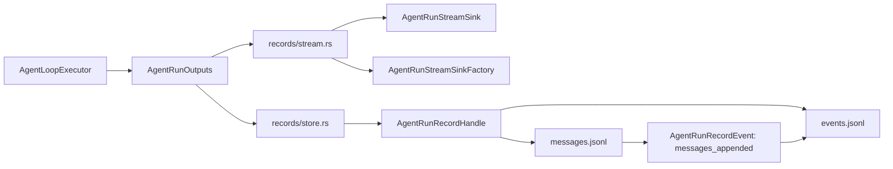

# eos-engine Agent-Run Records and Stream Output Merge - SPEC

Status: Implemented (2026-06-09 — records/event merge landed and verified)
Date: 2026-06-09
Owner: `eos-engine`

Scope:
- `agent-core/crates/eos-engine/src/event.rs` (single file with inline
  `event`/`outputs`/`printer`/`sink` modules; there is no `event/` directory)
- `agent-core/crates/eos-engine/src/records.rs`
- `agent-core/crates/eos-engine/src/records/`
- `agent-core/crates/eos-engine/src/provider_stream.rs` (the renamed
  `AgentRunStreamEvent` producer and `EngineStream` owner)
- `agent-core/crates/eos-engine/src/agent_loop/{executor,launcher}.rs`
- `agent-core/crates/eos-engine/tests/message_records.rs`
- `agent-core/crates/eos-engine/tests/agent_loop/{executor,launcher}/mod.rs`
- `agent-core/crates/eos-testkit/src/{llm,engine}.rs` and
  `agent-core/crates/eos-testkit/tests/fixtures.rs` (public testkit API keyed on
  `AgentRunStreamEvent`)
- `agent-core/crates/eos-types` record-dir formatting tests (relocation target
  for path-layout coverage)
- `agent-core/workspace-guard/tests/public_surface.rs`
- `backend-server/crates/eos-backend-runtime/{src/event_bus.rs,tests/event_bus/mod.rs}`
- `backend-server/crates/eos-backend-api` record handlers, router, and support
  (`AgentRunRecordWriter`, `NodeEvent`, `read_events_at`)

Related:
- `docs/plans/agent-core-workspace-architecture-rules/phase-04-eos-engine-agent-run_SPEC.md`
- `docs/plans/agent-core-workspace-architecture-rules/phase-03b-execution-lineage-materialization_SPEC.md`

## 1. Intent

Merge the current `eos-engine` `event` module into `records` and simplify the
record implementation at the same time. The engine should have one local owner
for agent-run output surfaces:

- durable `messages.jsonl`,
- durable `events.jsonl`,
- live stream observations,
- live stream sinks,
- the output fan-out object passed into the agent loop.

After this refactor, `records` is the umbrella module, `stream` names live
observation, and `record` names durable disk state. The file layout should get
smaller, not just move the current split under a new folder.

This deliberately widens `records` from "durable disk state" to "agent-run
output" (live stream plus durable record). The canonical producer of the live
stream is still `provider_stream.rs`, so in-crate producers and the `eos-testkit`
helpers import the stream types through the engine root facade (`crate::` /
`eos_engine::` re-exports) rather than reaching into `records::stream`.

## 2. Problem

The live tree has two adjacent owners with overlapping vocabulary:

```text
crates/eos-engine/src/
  event.rs            # single file; inline `event`/`outputs`/`printer`/`sink` mods
  records.rs
  records/
    error.rs
    handle.rs
    io.rs
    kind.rs
    layout.rs
    record.rs
    writer.rs
```

`event/` is not a directory today; it was already collapsed into one `event.rs`.
The simplification below is a consolidation of `records/` plus a fold of
`event.rs`, not an un-nesting of an `event/` tree.

That creates three naming problems:

- the `event` module is not the `events.jsonl` owner; `records/` is.
- `NodeEvent` is a durable `events.jsonl` row, not a live stream event.
- `EngineEventOutputs` carries an `AgentRunRecordWriter`, so live output and
  durable output are already coupled but named as if only event streaming is
  involved.

The durable file pair is one aggregate today:

- `AgentRunRecordHandle` carries both `messages_path` and `events_path`.
- `append_messages` writes `messages.jsonl` and then appends a
  `messages_appended` row to `events.jsonl`.
- `start_agent_run` writes `node_started`, initial message rows, and
  `messages_initialized`.
- `finish` appends the terminal record event.
- the `node_started` payload shape (the `type` string plus the workflow/parent
  fields) is produced solely by `AgentRunRecordKind::node_type` /
  `extend_payload` in `records/kind.rs`. That classification is **not** duplicated
  in `eos-types`, so the merge must relocate it, not delete it (see §3, §11).

The previous larger merge target split this aggregate into `messages.rs`,
`events.rs`, `handle.rs`, and `store.rs`. That is more file structure than the
behavior needs. The simpler target keeps the aggregate cohesive in one store
module until there is a real reason to split it.

## 3. Goals

- Remove the top-level `event` module from `eos-engine`.
- Move live stream event types, stream sink, sink factory, and output fan-out
  under `records/stream.rs`.
- Drop the printer type **and its rendering entirely**. The printer is unwired
  and the live sink self-formats via serde (`backend-runtime` `event_bus.rs`
  calls `serde_json::to_value(event)`), so no production code renders. Do not
  introduce a `render_stream_event` export with zero callers; if a printing
  consumer is added later, reintroduce a renderer then.
- Collapse durable record internals into `records/store.rs`.
- Keep `records/error.rs` and a small `records/layout.rs`.
- Remove the engine-local `AgentRunRecordKind` and `AgentRunRecordStart`; use
  `StartAgentLoopRequest.record_target.task_agent_run_kind` and the pre-resolved
  `record_target.record_dir`. `AgentRunRecordKind` is structurally a duplicate of
  `TaskAgentRunKind`, **but it also uniquely owns the `node_started` payload
  writers** (`node_type()` → the `type` string, `extend_payload()` → the
  workflow/parent fields). Relocate those as free fns over `&TaskAgentRunKind`
  inside `records/store.rs` (keep them in `eos-engine`; do not add them to
  `eos-types`). Deleting them silently breaks the §4 Non-Goal on `node_started`
  payload shape.
- Route the in-crate `StreamEvent` producers (`provider_stream.rs`) and the
  `eos-testkit` helpers through the engine root facade (`crate::` /
  `eos_engine::` re-exports), not `crate::records::stream::…`, so the physical
  module location stays behind the public facade.
- Rename types and fields so:
  - `record` means durable agent-run record state,
  - `stream` means live observation,
  - bare `event` is avoided unless the type says `StreamEvent` or
    `RecordEvent`.
- Keep `messages.jsonl` and `events.jsonl` literal file names unchanged.
- Keep `eos-engine` as the owner. Do not move these files into
  `eos-agent-run`, `eos-types`, or a new crate.
- Preserve the public root exports that callers need, but route them through
  `records`.

## 4. Non-Goals

- No disk format change for `messages.jsonl`.
- No disk format change for `events.jsonl`.
- No rename of persisted `events.jsonl` `kind` strings such as
  `node_started`, `messages_initialized`, `messages_appended`, or
  `node_finished`.
- No DB materialization redesign.
- No change to `AgentRunRecordTarget`, `AgentRunRecordDir`, or Phase 03B
  lineage path derivation.
- No new port crate or shared service crate.
- No trait abstraction around output fan-out. The output set is closed and can
  stay a concrete struct.
- No compatibility module named `event` in the final state.
- No broad agent-loop behavior changes beyond imports, field names, and record
  output wiring.

## 5. Simplification Plan

The simplification is not only a rename. It deliberately deletes file boundaries
that no longer carry independent ownership.

| Area | Current | Larger Merge Draft | Simplified Target |
| --- | --- | --- | --- |
| Live stream module | `event.rs` (one file, inline `event`/`outputs`/`printer`/`sink` mods) | `records/{stream,outputs,printer,sink}.rs` | `records/stream.rs` owns stream event, sink, sink factory, and outputs (no renderer) |
| Durable records | `records/{handle,io,record,writer}.rs` | `records/{messages,events,handle,store}.rs` | `records/store.rs` owns store, handle, row DTOs, append/read helpers |
| Layout facts | engine-local `AgentRunRecordKind` can derive paths and writes `node_started` payload | keep `kind.rs` | delete `AgentRunRecordKind`; relocate `node_type`/`extend_payload` as free fns over `&TaskAgentRunKind` in `store.rs`; consume `AgentRunRecordTarget` |
| Path helper | `records/layout.rs` can format from kind | keep layout module | shrink to root-join and safe segment validation; delete `node_dir` + the `AgentRunRecordKind→TaskAgentRunKind→format_record_dir` round-trip |
| Output aggregate | `EngineEventOutputs` | `AgentRunOutputs` | `AgentRunOutputs` in `records/stream.rs` |
| Live sink factory | recently added root/event export | missing from larger draft | keep as `AgentRunStreamSinkFactory` |
| Stream rendering | `EngineEventPrinter` + `render_engine_event` (unwired) | keep `render_stream_event` free fn | delete both; the live sink self-formats via serde, so no renderer has a caller |
| Public module | `pub mod event` and `pub mod records` | `pub mod records` only | `pub mod records` only |
| Downstream callers | import `AgentRunRecordWriter`, `NodeEvent`, root stream types across `eos-testkit`, `backend-runtime`, `backend-api` | scoped only to backend | migrate `eos-testkit` (public API), `backend-runtime`, `backend-api`; method renames (`read_events_at` → `read_record_events_at`); no compatibility aliases retained |
| Workspace guard | expects `mod:event` / `use:event`; has no `use:records` | optional update | required: drop `mod:event`/`use:event`, **add `use:records`** |

Expected impact in `agent-core/crates/eos-engine/src/{event,records}`:

| Measure | Estimate |
| --- | ---: |
| Current relevant LOC | about 1,300 |
| Raw deleted/moved LOC | about 1,100 |
| Replacement LOC | about 850-950 |
| Net final-code reduction | about 200-350 LOC |

The net reduction is intentionally modest because stream events and JSONL
recording still exist. The win is removing duplicated classification, nested
micro-modules, and the misleading `event` owner.

## 6. Target File Structure

```text
agent-core/crates/eos-engine/
|-- src/
|   |-- lib.rs
|   |-- agent_loop.rs
|   |-- agent_loop/
|   |   |-- contracts.rs
|   |   |-- executor.rs
|   |   |-- launcher.rs
|   |   `-- state.rs
|   |-- records.rs
|   |-- records/
|   |   |-- error.rs       # AgentRunRecordError and Result
|   |   |-- layout.rs      # root join + safe record_dir segment validation
|   |   |-- store.rs       # durable JSONL store, handle, row DTOs, helpers
|   |   `-- stream.rs      # live stream event, sink, sink factory, outputs (no renderer)
|   |-- provider_stream.rs
|   |-- provider_stream/
|   |   |-- messages.rs
|   |   `-- source.rs
|   |-- tool_call.rs
|   |-- tool_call/
|   |-- background.rs
|   `-- background/
`-- tests/
    |-- message_records.rs
    `-- notifications/
```

Deleted final paths:

```text
agent-core/crates/eos-engine/src/event.rs   # single file; no `event/` directory exists
agent-core/crates/eos-engine/src/records/handle.rs
agent-core/crates/eos-engine/src/records/io.rs
agent-core/crates/eos-engine/src/records/kind.rs
agent-core/crates/eos-engine/src/records/record.rs
agent-core/crates/eos-engine/src/records/writer.rs
```

Do not replace those deleted paths with `records/messages.rs`,
`records/events.rs`, `records/outputs.rs`, `records/printer.rs`, or
`records/sink.rs` in this phase. If `store.rs` or `stream.rs` later grows
because of a real ownership split, make that a separate follow-up with a
specific reason.

## 7. Naming Rules

Use these rules consistently in the moved code:

| Rule | Applies To | Example |
| --- | --- | --- |
| `record` means durable disk state | store, handle, identity, finish status | `AgentRunRecordHandle` |
| `stream` means live observation | live event enum, sink, sink factory | `AgentRunStreamEvent` |
| `messages` means `messages.jsonl` | file path, byte reads, append range | `messages_path`, `MessageAppendRange` |
| `events` means `events.jsonl` | file path, sequence reads, row append | `events_path`, `AgentRunRecordEvent` |
| avoid `node` in Rust type/field names | record dirs and handles | `record_dir`, not `node_dir` |
| preserve `node_*` wire values | durable event `kind` strings | `node_started` remains unchanged |
| avoid bare `event_*` fields | every event-like name must say stream or record | `stream`, `record`, `read_record_events` |

The final code should not introduce `Service`, `Manager`, `Port`, or
inheritance-style trait names for this refactor.

## 8. Type and Field Rename Map

| Current | Target | Reason |
| --- | --- | --- |
| `EngineEventOutputs` | `AgentRunOutputs` | output aggregate covers stream and durable records |
| `live_event_sink` (field) | `stream` | aggregate field; the type `AgentRunStreamSink` carries the sink role |
| `with_live_event_sink` | `with_stream` | builder attaches the stream sink |
| `EngineEventSink` | `AgentRunStreamSink` | stream surface, not durable event rows |
| `EngineEventSinkFactory` | `AgentRunStreamSinkFactory` | per-run stream sink factory must survive the merge |
| `event_printer` (field) | (removed) | printer is unwired in production; no aggregate field |
| `EngineEventPrinter` | (removed) | no production constructor and no renderer caller; drop the printer and its rendering entirely (do not add a `render_stream_event` export) |
| `render_engine_event` (private fn) | (removed) | only the printer called it; the live sink self-formats via serde |
| `StreamEvent` | `AgentRunStreamEvent` | names the owner and live-stream role |
| `AssistantMessageComplete` | `AssistantMessageComplete` | keep; payload name is already precise |
| `event_outputs` | `run_outputs` | aggregate is per agent run |
| `with_event_outputs` | `with_run_outputs` | constructor attaches all run outputs |
| `with_live_event_sink_factory` | `with_stream_sink_factory` | factory returns stream sinks |
| `run_record_writer` (field) | `record` | aggregate field; the type `AgentRunRecordStore` carries the store role |
| `with_run_record_writer` | `with_record` | builder attaches the record store |
| `AgentRunRecordWriter` | `AgentRunRecordStore` | durable store over record dirs |
| `AgentRunRecordHandle::node_dir` | `record_dir` | avoid node vocabulary in Rust API |
| `NodeEvent` | `AgentRunRecordEvent` | durable `events.jsonl` row; also a serialized API DTO (`Json<Vec<_>>`, SSE), so keep field names identical — the rename must not change the JSON/SSE shape |
| `NodeFinishStatus` | `AgentRunRecordFinishStatus` | durable finish record status |
| `RecordIdentity` | `AgentRunRecordIdentity` | durable row identity columns |
| `RecordBytes` | `MessageBytes` | raw bytes are from `messages.jsonl` |
| `append_event` | `append_record_event` | durable event row append |
| `read_events` | `read_record_events` | durable events, not stream events |
| `read_events_at` | `read_record_events_at` | durable events, not stream events; backend `agent_runs.rs` call sites rename too (not just imports). `read_messages_at` keeps its name |

Compatibility aliases may exist during one mechanical step if they keep the
patch reviewable or downstream backend compilation green. The final checked-in
target should use the target names in production code and tests unless backend
API stability requires an explicit alias.

## 9. Resulting Types and Fields

### 9.1 Agent-loop fields

| Type | Fields |
| --- | --- |
| `TokioAgentLoopLauncher` | `provider_stream_source: AgentLoopProviderStream`; `tool_registry_factory: Arc<dyn AgentLoopToolRegistryFactory>`; `execution_metadata_reader: Arc<dyn ToolExecutionMetadataReader>`; `background_sessions: Option<BackgroundSessionRuntimeFactory>`; `hook_stores: Option<ToolCallHookStores>`; `run_outputs: AgentRunOutputs`; `stream_sink_factory: Option<AgentRunStreamSinkFactory>` |
| `AgentLoopExecutorInput` | `provider_stream_source: AgentLoopProviderStream`; `tool_registry_factory: Arc<dyn AgentLoopToolRegistryFactory>`; `execution_metadata_reader: Arc<dyn ToolExecutionMetadataReader>`; `cancel_signal: AgentLoopCancelSignal`; `background_sessions: Option<BackgroundSessionRuntimeFactory>`; `hook_stores: Option<ToolCallHookStores>`; `run_outputs: AgentRunOutputs`; `agent_run_api: Arc<dyn AgentRunApi>` |
| `AgentLoopExecutor` | same owned fields as `AgentLoopExecutorInput` |

### 9.2 `records/stream.rs`

| Type | Fields |
| --- | --- |
| `AgentRunOutputs` | `stream: Option<AgentRunStreamSink>`; `record: Option<AgentRunRecordStore>` |
| `AgentRunStreamEvent` | same variants and JSON shape as today's `StreamEvent`: `ReasoningDelta`, `AssistantTextDelta`, `AssistantMessageComplete`, `ToolUseDelta`, `ToolExecutionStarted`, `ToolExecutionCompleted`, `ToolExecutionProgress`, `ToolExecutionCancelled`, `SystemNotification` |
| `AssistantMessageComplete` | `message: Message`; `usage: UsageSnapshot`; `stop_reason: Option<StopReason>` |
| `AgentRunStreamSink` | type alias: `Arc<dyn Fn(&AgentRunStreamEvent) + Send + Sync>` |
| `AgentRunStreamSinkFactory` | type alias: `Arc<dyn Fn(&StartAgentLoopRequest) -> Option<AgentRunStreamSink> + Send + Sync>` |

`AgentRunOutputs` methods:

```rust
impl AgentRunOutputs {
    pub fn new() -> Self;
    pub fn with_stream(self, sink: Option<AgentRunStreamSink>) -> Self;
    pub fn with_record(self, store: Option<AgentRunRecordStore>) -> Self;

    pub(crate) fn observe(&self, event: &AgentRunStreamEvent);
    pub(crate) fn record_store(&self) -> Option<&AgentRunRecordStore>;
}
```

The aggregate fields are named by the §7 domain axis (`stream`, `record`), not by
a role suffix. The field type already carries the structural role
(`AgentRunStreamSink` is a push sink; `AgentRunRecordStore` is a read/write store),
so `outputs.stream` / `outputs.record` read as two members of one set without
stutter, while a forced shared suffix (`*_sink` or `*_store`) would misname one
side. The accessor stays `record_store()` so the field `record` and the method do
not collide. This two-field shape is only clean because the printer is collapsed;
a surviving `stream_printer` field would make the bare `stream` field ambiguous.

### 9.3 `records/store.rs`

| Type | Fields |
| --- | --- |
| `AgentRunRecordStore` | `root: PathBuf` |
| `AgentRunRecordHandle` | `record_dir: PathBuf`; `messages_path: PathBuf`; `events_path: PathBuf`; `identity: AgentRunRecordIdentity`; `initial_message_count: usize` |
| `AgentRunRecordIdentity` | `request_id: String`; `task_id: String`; `agent_run_id: String` |
| `AgentRunRecordEvent` | `request_id: String`; `task_id: String`; `agent_run_id: String`; `seq: u64`; `kind: String`; `payload: JsonObject`; `created_at: UtcDateTime` |
| `AgentRunRecordFinishStatus` | enum variants: `Completed`, `Failed` |
| `MessageAppendRange` | `count: usize`; `start_byte: u64`; `end_byte: u64` |
| `MessageBytes` | `bytes: Vec<u8>`; `next_byte_offset: u64` |

Store methods:

```rust
impl AgentRunRecordStore {
    pub fn new(root: impl Into<PathBuf>) -> Self;
    pub async fn start_agent_run_at(
        &self,
        record_target: &AgentRunRecordTarget,
        agent_name: &str,
        system_prompt: &str,
        initial_messages: &[Message],
    ) -> Result<AgentRunRecordHandle>;
    pub async fn read_messages_at(
        &self,
        record_dir: &AgentRunRecordDir,
        after_byte: u64,
    ) -> Result<MessageBytes>;
    pub async fn read_record_events_at(
        &self,
        record_dir: &AgentRunRecordDir,
        after_seq: u64,
    ) -> Result<Vec<AgentRunRecordEvent>>;
}
```

Handle methods:

```rust
impl AgentRunRecordHandle {
    pub fn record_dir(&self) -> &Path;
    pub fn initial_message_count(&self) -> usize;
    pub async fn append_messages(&self, messages: &[Message])
        -> Result<MessageAppendRange>;
    pub async fn read_messages(&self, after_byte: u64) -> Result<MessageBytes>;
    pub async fn read_record_events(
        &self,
        after_seq: u64,
    ) -> Result<Vec<AgentRunRecordEvent>>;
    pub async fn finish(&self, status: AgentRunRecordFinishStatus) -> Result<()>;

    pub(crate) async fn append_record_event(
        &self,
        kind: impl Into<String>,
        payload: JsonObject,
    ) -> Result<()>;
}
```

Do not keep a target `AgentRunRecordKind` or `AgentRunRecordStart` in
`eos-engine`. If tests still need hand-built records, they should construct an
`AgentRunRecordTarget` with a closed `TaskAgentRunKind` from `eos-types`.

`store.rs` owns the `node_started` payload vocabulary that previously lived on
`AgentRunRecordKind`. Port it as two free fns over the closed `eos-types` enum —
keep them in `eos-engine`, do not add them to `eos-types`:

```rust
// records/store.rs
fn node_type(kind: &TaskAgentRunKind) -> &'static str;  // "root_agent", "workflow_planner", "subagent", ...
fn extend_payload(kind: &TaskAgentRunKind, payload: &mut JsonObject);
```

Simplifications that fall out of taking `&AgentRunRecordTarget` directly:

- `AgentRunRecordTarget.task_id: TaskId` is non-optional, so the current
  `task_id.ok_or_else(unsafe_segment(...))` branch and all `Option<&TaskId>`
  plumbing are deleted (no defensive branch for an impossible state).
- The pre-resolved `record_dir` is validated per segment by the root-join, and
  target id/kind fields are validated before writing the `node_started` payload,
  so the separate kind-to-path `validate_start_segments` pass is removed.
- Only `start_agent_run_at` survives; `start_agent_run` and `layout::node_dir`
  (the kind→path derivation) are deleted.
- Because the handle now carries `initial_message_count`, the executor's
  `LoopRecordHandle` wrapper struct is deleted and the executor holds the
  `AgentRunRecordHandle` directly.

## 10. Public Export Target

`records.rs` becomes the single local export surface for record and stream
outputs:

```rust
mod error;
mod layout;
mod store;
mod stream;

pub use error::{AgentRunRecordError, Result};
pub use store::{
    AgentRunRecordEvent, AgentRunRecordFinishStatus, AgentRunRecordHandle,
    AgentRunRecordIdentity, AgentRunRecordStore, MessageAppendRange, MessageBytes,
};
pub use stream::{
    stamp_identity, AgentRunOutputs, AgentRunStreamEvent, AgentRunStreamSink,
    AgentRunStreamSinkFactory, AssistantMessageComplete,
};
```

`lib.rs` should re-export from `records`, not from `event`:

```rust
pub mod records;

pub use records::{
    stamp_identity, AgentRunOutputs, AgentRunRecordStore, AgentRunStreamEvent,
    AgentRunStreamSink, AgentRunStreamSinkFactory, AssistantMessageComplete,
};
```

Do not keep `pub mod event` in the final state.

The in-crate `StreamEvent` producer (`provider_stream.rs`) and the `eos-testkit`
helpers import these stream types via the crate root / `eos_engine::` facade,
not `crate::records::stream`, so the physical module location stays hidden.

The new root `pub use records::{…}` line introduces a `use:records` public-surface
token. The current `workspace-guard` allowlist has `mod:records` but no
`use:records`, so the guard update must **add** `use:records` (and drop
`mod:event` / `use:event`), not only remove the event tokens.

## 11. Migration Plan

### Step 1: Collapse durable records into `records/store.rs`

- Move `AgentRunRecordWriter`, `AgentRunRecordHandle`, row DTOs, byte-range DTOs,
  and JSONL append/read helpers into `records/store.rs`.
- Rename `AgentRunRecordWriter` to `AgentRunRecordStore`.
- Rename `NodeEvent` to `AgentRunRecordEvent`.
- Rename `RecordBytes` to `MessageBytes`.
- Keep persisted row JSON shape and event `kind` strings unchanged.
- Relocate `node_type` / `extend_payload` as free fns over `&TaskAgentRunKind`
  in `store.rs`, then assert a `node_started` row built from each
  `TaskAgentRunKind` variant still carries the same `type` plus workflow/parent
  fields. This guards the §4 Non-Goal; deleting `kind.rs` without this step
  changes the `node_started` payload.
- Replace target call sites with `AgentRunRecordTarget` instead of
  `AgentRunRecordStart` / `AgentRunRecordKind`. Make `start_agent_run_at` the
  only entry point (drop `start_agent_run`, `layout::node_dir`, the
  `Option<&TaskId>` branch, and `validate_start_segments`).
- Rewrite `tests/message_records.rs` to build `AgentRunRecordTarget` values and
  call `start_agent_run_at`. **Relocate** the `format_record_dir` path-layout
  assertions (the workflow / subagent / advisor directory shapes currently
  proven only here via the deleted `node_dir` derivation) into an `eos-types`
  test so that coverage is not silently dropped — today `format_record_dir` has
  no test in `eos-types` and `message_records.rs` is its only exercise.
- Run:
  - `cargo fmt -p eos-engine`
  - `cargo check -p eos-engine --all-targets`
  - `cargo test -p eos-types` (the relocated path-layout test)
  - `cargo test -p eos-engine message_records --test message_records`

### Step 2: Move stream outputs into `records/stream.rs`

- Move live stream event, sink, sink factory, and output fan-out into
  `records/stream.rs`.
- Rename `EngineEventOutputs` to `AgentRunOutputs` and name its fields `stream`
  and `record` (the field types carry the sink/store role); builders become
  `with_stream` / `with_record`.
- Rename `EngineEventSink` to `AgentRunStreamSink`.
- Rename `EngineEventSinkFactory` to `AgentRunStreamSinkFactory`.
- Delete `EngineEventPrinter` and its rendering entirely (no production caller;
  the live sink self-formats via serde). Do not add a `render_stream_event`
  export.
- Rename `StreamEvent` to `AgentRunStreamEvent`.
- Update the in-crate producer `provider_stream.rs` (`StreamEvent`,
  `AssistantMessageComplete`, `EngineStream`) and the engine tests
  `tests/agent_loop/{executor,launcher}/mod.rs` (`EngineEventOutputs`, the
  `event_outputs` field, `StreamEvent`). Point producers at the crate root
  facade (`crate::AgentRunStreamEvent`), not `crate::records::stream`.
- Collapse the executor's `LoopRecordHandle` wrapper into the handle's new
  `initial_message_count`.
- Update remaining engine imports from `crate::event::*` to `crate::records::*`
  / the crate root.
- Remove `event.rs` (there is no `event/` directory).
- Because `StreamEvent` / `EngineEventSink` / `EngineEventSinkFactory` are also
  consumed by `eos-testkit` (public API) and `backend-runtime`, migrate those
  consumers in the same implementation window. Do not retain root aliases in the
  final checked-in state.
- Run:
  - `cargo fmt -p eos-engine`
  - `cargo check -p eos-engine --all-targets`
  - `cargo test -p eos-engine --lib`

### Step 3: Migrate public consumers

- Update `eos-testkit` (`src/llm.rs`, `src/engine.rs`, `tests/fixtures.rs`).
  Its public API signatures (`Vec<Vec<StreamEvent>>`, `AssistantMessageComplete`,
  `EngineStream`) move to the new names — this is the widest consumer, so budget
  for cascading test updates across the workspace or migrate behind the Step 2
  root alias.
- Update backend runtime event-bus imports (`src/event_bus.rs`,
  `tests/event_bus/mod.rs`) from root `EngineEvent*` / `StreamEvent` names to the
  new root exports or `eos_engine::records::*`.
- Update backend API record imports from `AgentRunRecordWriter` / `NodeEvent`
  to `AgentRunRecordStore` / `AgentRunRecordEvent`, unless an explicit
  compatibility alias is required for API stability. Also rename the
  `read_events_at` call sites to `read_record_events_at` in `agent_runs.rs`
  (4 calls) — these are method renames, not just imports; `read_messages_at` is
  unchanged.
- Update backend API tests and support helpers.
- Update `workspace-guard/tests/public_surface.rs` for `eos-engine`: remove
  `mod:event` and `use:event`, **and add `use:records`** (the new root
  `pub use records::{…}` introduces that surface token; the guard asserts exact
  set equality, so a missing `use:records` fails the test).
- Run:
  - `cargo check -p eos-engine --all-targets`
  - `cargo check -p eos-testkit --all-targets`
  - `cargo check -p eos-backend-runtime --all-targets`
  - `cargo check -p eos-backend-api --all-targets`
  - `cargo test -p workspace-guard public_surface_matches_target_allowlist`

### Step 4: Final cleanup

- Confirm no temporary compatibility aliases remain.
- Confirm there are no production imports of `crate::event`,
  `EngineEventOutputs`, `EngineEventSink`, `EngineEventSinkFactory`,
  `StreamEvent`, `AgentRunRecordWriter`, `NodeEvent`, or `RecordBytes`, and that
  nothing imports or exports `render_stream_event` / a printer type.
- Run:
  - `cargo test -p eos-engine`
  - `cargo test -p eos-testkit`
  - `cargo test -p eos-backend-api`
  - `cargo clippy -p eos-engine --all-targets -- -D warnings`
  - `git diff --check`

## 12. Verification Ladder

Narrow checks:

```bash
cd agent-core
cargo fmt -p eos-engine
cargo check -p eos-engine --all-targets
cargo test -p eos-engine --test message_records
```

Broader checks after public export or backend import changes:

```bash
cd agent-core
cargo test -p eos-types          # relocated format_record_dir path-layout coverage
cargo test -p eos-engine
cargo check -p eos-testkit --all-targets   # public testkit API keyed on AgentRunStreamEvent
cargo clippy -p eos-engine --all-targets -- -D warnings
cargo test -p workspace-guard public_surface_matches_target_allowlist
git diff --check
```

Backend checks when downstream imports change:

```bash
cd backend-server
cargo check -p eos-backend-runtime --all-targets
cargo check -p eos-backend-api --all-targets
cargo test -p eos-backend-api
```

Broaden to `cargo check --workspace --all-targets` only if imports in other
downstream crates change or workspace guard failures show that public exports
are consumed outside the scoped crates.

Implementation closeout evidence (2026-06-09):

- `cd agent-core && cargo check -p eos-engine --all-targets`
- `cd agent-core && cargo test -p eos-engine --test message_records`
- `cd agent-core && cargo test -p eos-types`
- `cd agent-core && cargo check -p eos-testkit --all-targets`
- `cd agent-core && cargo test -p workspace-guard public_surface_matches_target_allowlist`
- `cd agent-core && cargo clippy -p eos-engine --all-targets -- -D warnings`
- `cd backend-server && cargo check -p eos-backend-runtime --all-targets`
- `cd backend-server && cargo check -p eos-backend-api --all-targets`
- `cd backend-server && cargo test -p eos-backend-runtime`
- `cd backend-server && cargo test -p eos-backend-api`
- `git diff --check`

## 13. Acceptance Criteria

- `agent-core/crates/eos-engine/src/event.rs` does not exist.
- `agent-core/crates/eos-engine/src/event/` does not exist.
- `records/` contains exactly the target files from section 6 unless the
  implementation updates this spec with a concrete ownership reason.
- `records/store.rs` owns durable JSONL store, handle, row DTOs, and append/read
  helpers for both `messages.jsonl` and `events.jsonl`.
- `records/stream.rs` owns live stream event, sink, sink factory, and output
  fan-out (no renderer).
- `AgentRunOutputs` is the only output aggregate passed through launcher and
  executor.
- `AgentRunOutputs` exposes exactly two fields, named `stream` and `record`, with
  builders `with_stream` / `with_record`.
- No printer type and no `render_stream_event` export exist in the final state;
  the live sink self-formats (no production renderer).
- `AgentRunStreamSinkFactory` remains available for backend runtime to bind a
  request-scoped live sink per loop.
- Production code uses `stream_*` for live observations and `record_*` for
  durable record state.
- No target production code imports or exports `AgentRunRecordKind` or
  `AgentRunRecordStart` from `eos-engine`.
- `node_type` / `extend_payload` are relocated as `eos-engine` free fns over
  `&TaskAgentRunKind`; a `node_started` row from every `TaskAgentRunKind` variant
  is byte-identical (same `type` and workflow/parent fields) to the pre-merge
  output.
- `messages.jsonl` and `events.jsonl` file names and row JSON shapes remain
  unchanged.
- Persisted record event `kind` values remain unchanged.
- Backend API and backend runtime imports are migrated without compatibility
  aliases.
- `eos-testkit`, `eos-backend-runtime`, `eos-backend-api`, and the in-crate
  `provider_stream.rs` compile against the renamed stream/record surface (the
  rename blast radius spans these, not only backend imports).
- `format_record_dir` path-layout coverage (workflow / subagent / advisor dir
  shapes) lives in an `eos-types` test, not only in `tests/message_records.rs`.
- `workspace-guard/tests/public_surface.rs` for `eos-engine` drops `mod:event`
  and `use:event` and adds `use:records`.
- `cargo check -p eos-engine --all-targets` passes.
- `cargo test -p eos-engine --test message_records` passes.
- `cargo test -p eos-types` passes (relocated path-layout coverage).
- `cargo test -p workspace-guard public_surface_matches_target_allowlist` passes
  or the remaining failure is documented as unrelated concurrent work.

## 14. Final Shape Summary



The conceptual boundary is:

| Surface | Module | Primary Names |
| --- | --- | --- |
| live model/tool/system observations | `records/stream.rs` | `AgentRunStreamEvent`, `AgentRunStreamSink`, `AgentRunStreamSinkFactory` |
| output fan-out for one run | `records/stream.rs` | `AgentRunOutputs` |
| durable message rows | `records/store.rs` | `MessageAppendRange`, `MessageBytes` |
| durable event rows | `records/store.rs` | `AgentRunRecordEvent` |
| durable record lifecycle | `records/store.rs` | `AgentRunRecordStore`, `AgentRunRecordHandle` |
| path safety | `records/layout.rs` | root join and safe segment validation only |
