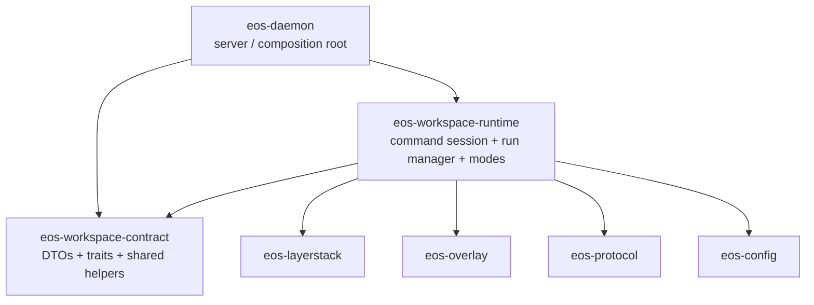

# eos-workspace Runtime Consolidation - SPEC

Status: Implemented
Owner: sandbox workspace architecture
Drafted: 2026-06-09
Review-updated: 2026-06-09

Related:

- `docs/plans/eos_daemon_srp_optimization_PLAN.md` - earlier sandbox SRP pass
  that kept `eos-command-session`, `eos-workspace-modes`, and
  `eos-workspace-run` separate after merging the old ephemeral/isolated crates.
- `docs/plans/sandbox_structure_reduction_SPEC.md` - structure/reduction pass;
  this spec treats complexity reduction as a secondary outcome, not the main
  acceptance gate.

Supersession note: this spec intentionally supersedes the narrow naming and
run-tier decision in `eos_daemon_srp_optimization_PLAN.md` for the workspace
family only. That earlier plan rejected `eos-workspace-runtime` to avoid prose
confusion with `eos-daemon/src/runtime`; this spec accepts the name because the
new primary distinction is contract crate vs workspace runtime crate. If that
name proves too confusing during implementation, use `eos-workspace-execution`
with the same file layout and invariants.

## 1. Intent

Keep a small workspace contract crate, and merge the runtime-owned workspace
execution crates into one cohesive runtime crate:

- keep / rename the current `eos-workspace` leaf as `eos-workspace-contract`;
- merge `eos-command-session` into the runtime crate as `command_session/`;
- merge `eos-workspace-run` into the runtime crate as `run/`;
- merge `eos-workspace-modes` into the runtime crate as `ephemeral/` and
  `isolated/`.

The design is intentionally **two crates**, not one:

| Crate | Owns | Must not own |
|---|---|---|
| `eos-workspace-contract` | Neutral DTOs, errors, response/timing helpers, read/mutation/file traits, shared file helper algorithms, `WorkspaceMode`, `SnapshotLease`. | PTY/process state, workspace-run registry, overlay lifecycle, isolated namespace/network lifecycle, OCC writer, daemon globals. |
| `eos-workspace-runtime` | PTY command-session substrate, caller-keyed workspace-run manager, ephemeral command lifecycle, isolated command/session lifecycle, audit capture, Linux network helpers. | `eos-occ`, daemon `DispatchContext`, daemon `DaemonError`, daemon RPC/op facades, daemon-global OCC cache. |

`eos-workspace-contract` is a better name than `eos-workspace-types` because the
crate is not only type definitions: it also owns shared traits and small generic
file operation helpers.

## 2. Problem Statement

The current sandbox workspace has four tightly related crates:

```text
eos-workspace          # neutral contracts
eos-command-session   # PTY/process/session substrate
eos-workspace-modes   # ephemeral + isolated mode implementations
eos-workspace-run     # run manager composing command-session + modes
```

The split keeps dependency direction correct, but the runtime portion is now
over-sliced. `eos-workspace-run` exists only to compose the command-session PTY
substrate with the two workspace mode implementations. `eos-command-session` is
also not independently useful outside workspace command execution: it depends on
the workspace contracts and shapes command responses from workspace outcomes.

The current four-crate shape reads as four ownership domains, but operationally
there are only two:

1. workspace contracts;
2. workspace runtime execution.

This spec consolidates those names around that real ownership split.

## 3. Target Graph



`eos-occ` is deliberately absent. The OCC publish path remains daemon-owned and
is injected into `eos-workspace-runtime` through the runtime port that replaces
today's `WorkspaceRunHostPorts`.

## 4. Dispatch Strategy

The runtime crate uses closed-set dispatch for workspace execution:

| Boundary | Dispatch strategy | Reason |
|---|---|---|
| Ephemeral vs isolated run | `enum WorkspaceRun` and `enum StartTarget` | The runtime supports a closed set of workspace modes today; variants carry different owned state. |
| Command-session lifecycle | Concrete `CommandSession` / `CommandSessionManager` types | There is one PTY/process substrate, not a runtime-selected provider family. |
| Daemon-owned publish/audit/resource seams | `dyn WorkspaceRuntimeHostPorts` or `Arc<dyn ...>` | These seams cross from runtime into daemon-owned resources and need test doubles. |
| File operations over read/mutation contracts | Generics over contract traits | The shared file helpers are compile-time generic and stay in the contract crate. |

No new trait hierarchy should be introduced during the move. Preserve the
existing small port surface; only rename it if the new crate name makes the old
name misleading.

## 5. Resulting File / Folder Structure

```text
sandbox/crates/
  eos-workspace-contract/
    Cargo.toml
    src/
      lib.rs
      command.rs          # was eos-workspace/src/command_session.rs
      file_ops.rs
      lease.rs
      mode.rs
      mutation.rs
      read_view.rs
      response.rs

  eos-workspace-runtime/
    Cargo.toml
    src/
      lib.rs

      command_session/
        mod.rs            # was eos-command-session/src/lib.rs
        error.rs
        output.rs
        request.rs
        response.rs
        session.rs
        transcript.rs
        wait.rs
        process/
          mod.rs
          pty.rs
          runner.rs
          signal.rs

      run/
        mod.rs            # was eos-workspace-run/src/lib.rs
        command_handle.rs
        manager.rs
        ports.rs
        registry.rs

      ephemeral/
        mod.rs            # was eos-workspace-modes/src/ephemeral/mod.rs
        capture.rs
        command.rs
        dirs.rs
        error.rs
        finalize.rs
        ops.rs
        ports.rs
        timings.rs
        types.rs

      isolated/
        mod.rs            # was eos-workspace-modes/src/isolated/mod.rs
        audit.rs
        caps.rs
        command.rs
        error.rs
        network.rs
        ops.rs
        session.rs
        network/
          rtnl.rs
          netfilter/
            mod.rs
            exprs.rs
            wire.rs
        session/
          capacity.rs
          gc.rs
          lifecycle.rs
          persistence.rs
          ports.rs
          support.rs
          types.rs

    tests/
      command_session/
        output.rs
      isolated/
        network_netfilter.rs
        session.rs
```

### Public Surface

`eos-workspace-contract/src/lib.rs` should keep a narrow flat public contract:

```rust
pub mod command;
pub mod file_ops;
pub mod lease;
pub mod mode;
pub mod mutation;
pub mod read_view;
pub mod response;

pub use command::{
    FinalizeCommandRequest, PrepareCommandRequest, PreparedCommandWorkspace,
    WorkspaceCommandOutcome,
};
pub use file_ops::{
    EditFileOutcome, EditFileRequest, ReadFileOutcome, ReadFileRequest, SearchReplaceEdit,
    SearchReplaceError, WorkspaceFileOps, WriteFileOutcome, WriteFileRequest,
};
pub use lease::SnapshotLease;
pub use mode::WorkspaceMode;
pub use mutation::{
    WorkspaceMutationKind, WorkspaceMutationOutcome, WorkspaceMutationRequest,
    WorkspaceMutationSink,
};
pub use read_view::{ResolvedWorkspacePath, WorkspaceReadBytes, WorkspaceReadView};
pub use response::{
    u64_to_f64_saturating, usize_to_f64_saturating, ChangedPathKinds, WorkspaceApiError,
    WorkspaceConflict, WorkspaceTimings,
};
```

`eos-workspace-runtime/src/lib.rs` should export grouped runtime surfaces, not
flatten every moved module:

```rust
#![forbid(unsafe_code)]

pub mod command_session;
pub mod ephemeral;
pub mod isolated;
pub mod run;

pub use run::{CommandHandle, StartTarget, WorkspaceRunHostPorts, WorkspaceRunManager};
```

If `WorkspaceRunHostPorts` is renamed, prefer `WorkspaceRuntimeHostPorts` so the
port name matches the new crate's responsibility.

`command_session/` remains a policy-free substrate even though it now lives in
the same crate as the mode implementations. The module may depend on
`eos-workspace-contract`, config, process/session helpers, and local
`command_session` siblings, but it must not import `crate::ephemeral`,
`crate::isolated`, or `crate::run`. The `run/` module is the only composition
point between command sessions and workspace modes.

## 6. Move Map

| Current path | Target path | Notes |
|---|---|---|
| `sandbox/crates/eos-workspace/src/command_session.rs` | `sandbox/crates/eos-workspace-contract/src/command.rs` | Rename because this is a contract module, not the PTY command-session implementation. |
| `sandbox/crates/eos-workspace/src/{file_ops,lease,mode,mutation,read_view,response}.rs` | same names under `eos-workspace-contract/src/` | Preserve public types and serde shapes. |
| `sandbox/crates/eos-command-session/src/*` | `sandbox/crates/eos-workspace-runtime/src/command_session/*` | `lib.rs` becomes `command_session/mod.rs`. |
| `sandbox/crates/eos-command-session/src/process/*` | `sandbox/crates/eos-workspace-runtime/src/command_session/process/*` | Keep Linux cfgs local to `command_session`. |
| `sandbox/crates/eos-workspace-run/src/*` | `sandbox/crates/eos-workspace-runtime/src/run/*` | `lib.rs` becomes `run/mod.rs`. |
| `sandbox/crates/eos-workspace-modes/src/ephemeral/*` | `sandbox/crates/eos-workspace-runtime/src/ephemeral/*` | Preserve one `ops.rs` file per mode. |
| `sandbox/crates/eos-workspace-modes/src/isolated/*` | `sandbox/crates/eos-workspace-runtime/src/isolated/*` | Preserve nested `network/` and `session/` subtrees. |
| `sandbox/crates/eos-command-session/tests/output.rs` | `sandbox/crates/eos-workspace-runtime/tests/command_session/output.rs` | Keep test under owning crate. |
| `sandbox/crates/eos-workspace-modes/tests/network/netfilter.rs` | `sandbox/crates/eos-workspace-runtime/tests/isolated/network_netfilter.rs` | Preserve behavior; rename only for test target clarity. |
| `sandbox/crates/eos-workspace-modes/tests/session/mod.rs` | `sandbox/crates/eos-workspace-runtime/tests/isolated/session.rs` | Preserve behavior. |

## 7. Cargo Manifest Changes

`sandbox/Cargo.toml`:

```text
remove members:
  crates/eos-workspace
  crates/eos-command-session
  crates/eos-workspace-modes
  crates/eos-workspace-run

add members:
  crates/eos-workspace-contract
  crates/eos-workspace-runtime
```

Workspace dependencies:

```toml
eos-workspace-contract = { path = "crates/eos-workspace-contract" }
eos-workspace-runtime = { path = "crates/eos-workspace-runtime" }
```

`eos-workspace-runtime/Cargo.toml` must explicitly list moved nested tests;
Cargo will not automatically discover arbitrary nested `tests/**` files:

```toml
[[test]]
name = "command_session_output"
path = "tests/command_session/output.rs"

[[test]]
name = "isolated_network_netfilter"
path = "tests/isolated/network_netfilter.rs"

[[test]]
name = "isolated_session"
path = "tests/isolated/session.rs"
```

Target dependency sets:

| Crate | Dependencies |
|---|---|
| `eos-workspace-contract` | `serde`, `serde_json`, `thiserror` |
| `eos-workspace-runtime` | `eos-workspace-contract`, `eos-command-session` content now internal, `eos-layerstack`, `eos-overlay`, `eos-protocol`, `eos-config`, `serde`, `serde_json`, `thiserror`, `time`; Linux-only `nix`, `rustix`, `futures-util`, `libc`, `netlink-sys`, `rtnetlink`, `tokio` |

After the move, `eos-daemon` should depend on:

```toml
eos-workspace-contract.workspace = true
eos-workspace-runtime.workspace = true
```

and should no longer depend on:

```toml
eos-workspace.workspace = true
eos-command-session.workspace = true
eos-workspace-modes.workspace = true
eos-workspace-run.workspace = true
```

## 8. Import Rewrite Rules

| Before | After |
|---|---|
| `eos_workspace::X` | `eos_workspace_contract::X` |
| `eos_workspace::file_ops::read_file` | `eos_workspace_contract::file_ops::read_file` |
| `eos_command_session::X` | `eos_workspace_runtime::command_session::X` |
| `eos_workspace_run::WorkspaceRunManager` | `eos_workspace_runtime::WorkspaceRunManager` |
| `eos_workspace_run::{StartTarget, CommandHandle}` | `eos_workspace_runtime::{StartTarget, CommandHandle}` |
| `eos_workspace_modes::ephemeral::X` | `eos_workspace_runtime::ephemeral::X` |
| `eos_workspace_modes::isolated::Y` | `eos_workspace_runtime::isolated::Y` |

For daemon-local code, prefer imports through grouped modules when the item is
mode-specific:

```rust
use eos_workspace_runtime::ephemeral::{EphemeralWorkspaceOps, finalize_ephemeral_command};
use eos_workspace_runtime::isolated::{IsolatedSession, ResourceCaps};
```

## 9. Invariants

- **Contract purity:** `eos-workspace-contract` has no internal sandbox crate
  dependency and no Linux/runtime dependency.
- **No-publish guard:** `eos-workspace-runtime` must not depend on `eos-occ`.
  Isolated writes remain audit-only and never publish.
- **Daemon owns OCC:** the daemon-owned OCC writer and per-root OCC cache remain
  outside the runtime crate and are injected through a port.
- **Cancel never publishes:** cancelled command sessions take the discard branch
  and never reach the publish path.
- **Mode metadata stays metadata:** `WorkspaceCommandOutcome.mode` can remain
  response metadata; runtime control flow dispatches on concrete run variants,
  not string or metadata inspection.
- **Command-session stays policy-free:** `command_session/` must not import
  runtime mode modules or the run manager; `run/` composes those surfaces.
- **No daemon back-edge:** `eos-workspace-runtime` must not depend on
  `eos-daemon`.
- **Tests follow ownership:** command-session and isolated mode tests move under
  `eos-workspace-runtime/tests/` and are registered as explicit `[[test]]`
  targets; contract-only tests stay with `eos-workspace-contract`.

## 10. Phasing

| Phase | Status | Scope | Verification |
|---|---|---|---|
| 0 - Baseline graph and guards | Complete | Captured the old four-crate dependency graph before moving files. | `cargo metadata --format-version=1 --no-deps`; `cargo tree --workspace --invert eos-workspace --depth 1`; same for the three runtime crates. |
| 1 - Rename contract crate | Complete | `eos-workspace` -> `eos-workspace-contract`; renamed `command_session.rs` -> `command.rs`; retargeted imports. | `cargo check -p eos-workspace-contract --all-targets`; `cargo test -p eos-workspace-contract --all-targets`; `cargo check -p eos-daemon --all-targets`. |
| 2 - Create runtime crate with command-session + run | Complete | Moved `eos-command-session` and `eos-workspace-run` into `eos-workspace-runtime/{command_session,run}`. | `cargo check -p eos-workspace-runtime --all-targets`; `cargo test -p eos-workspace-runtime --all-targets`; daemon command-session check via `cargo check -p eos-daemon --all-targets`. |
| 3 - Merge workspace modes into runtime | Complete | Moved `eos-workspace-modes::{ephemeral,isolated}` into `eos-workspace-runtime`; retargeted daemon and runtime imports. | `cargo check -p eos-workspace-runtime --all-targets`; `cargo test -p eos-workspace-runtime --all-targets`; `cargo check -p eos-daemon --all-targets`. |
| 4 - Delete old crates and stale docs/imports | Complete | Removed obsolete members and workspace dependencies; updated active source comments; renamed stale `eos-e2e-test` target names to runtime-oriented names. | `cargo metadata --format-version=1 --no-deps`; `rg "eos_(workspace|command_session|workspace_modes|workspace_run)" sandbox/crates`; inspected `eos-e2e-test/Cargo.toml` target names. |
| 5 - Final verification | Complete | Ran focused and broad checks. | See Section 11. |

Phase 2 is the minimum useful consolidation. Phase 3 is the preferred end-state
because the modes are not useful independently of the workspace runtime today,
but it is intentionally sequenced last so the contract rename and run/PTY merge
can be proven first.

## 11. Acceptance Criteria

- `[workspace] members` contains `eos-workspace-contract` and
  `eos-workspace-runtime`, and no longer contains the four old crates.
- `eos-workspace-contract` depends only on `serde`, `serde_json`, and
  `thiserror`.
- `eos-workspace-runtime` has no `eos-occ` dependency.
- `eos-daemon` imports workspace contracts from `eos_workspace_contract` and
  runtime execution from `eos_workspace_runtime`.
- No `eos_workspace::`, `eos_command_session::`, `eos_workspace_modes::`, or
  `eos_workspace_run::` imports remain in `sandbox/crates`, except in migration
  notes or compatibility docs.
- `eos-workspace-runtime/Cargo.toml` registers `command_session_output`,
  `isolated_network_netfilter`, and `isolated_session` as explicit `[[test]]`
  targets.
- `command_session/` remains policy-free:
  `rg "crate::(ephemeral|isolated|run)" sandbox/crates/eos-workspace-runtime/src/command_session`
  returns no matches.
- Command-session tests and workspace-mode tests pass from the runtime crate.
- `eos-e2e-test` target names no longer advertise deleted crate names; rename
  `eos-command-session` and `eos-isolated-workspace` to runtime-oriented test
  names unless there is an external CI dependency on those exact target names.
- The daemon command-session path still covers start, stdin, progress, cancel,
  collect-completed, timeout, and caller cleanup.
- `cargo metadata --format-version=1 --no-deps` succeeds from `sandbox/`.
- `git diff --check` is clean for touched files.

Recommended final check ladder:

```bash
cd sandbox
cargo metadata --format-version=1 --no-deps
cargo check -p eos-workspace-contract --all-targets
cargo test -p eos-workspace-contract --all-targets
cargo check -p eos-workspace-runtime --all-targets
cargo test -p eos-workspace-runtime --all-targets
cargo check -p eos-daemon --all-targets
cargo clippy -p eos-workspace-contract -p eos-workspace-runtime -p eos-daemon --all-targets -- -D warnings
git diff --check -- .
```

If the runtime move changes daemon package/runtime behavior, run the Docker
command-session smoke path after rebuilding `eosd`.

## 12. Complexity Side Quest

Reduction is a secondary outcome, not the primary gate. The expected reduction
is package-boundary complexity:

- affected crates drop from four to two;
- workspace members drop by two;
- direct daemon workspace-runtime dependencies collapse from four crate names to
  two;
- implementation files mostly move without shrinking.

Do not chase method, field, or module deletion unless it becomes obvious during
the move. The current largest files in this family are below the repo's
800-1000 LOC smell threshold, so splitting or deleting code is not required to
justify this consolidation.

## 13. Non-Goals

- Do not merge `eos-occ` into the runtime crate.
- Do not move daemon RPC/op parsing into the runtime crate.
- Do not add compatibility shim crates unless a downstream consumer outside the
  sandbox workspace requires a staged rename.
- Do not flatten `isolated/session/` or `isolated/network/` into large files.
- Do not introduce new traits or `dyn` surfaces beyond the daemon-injected host
  seams needed by the existing runtime.
