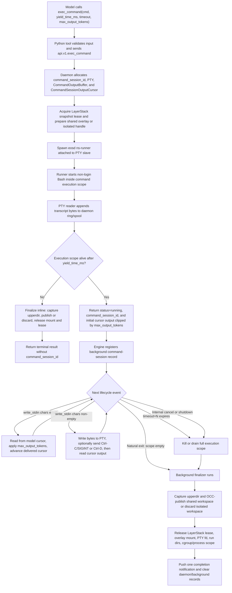

# Sandbox Command Session TTY-Default Implementation Plan

**Status:** Draft.
**Date:** 2026-06-02.
**Parent scope:** Phase 3T sandbox command/session cleanup.
**Supersedes:** The model-facing `tty`, `pty_session_id`,
`write_pty_command_stdin`, `check_pty_command_progress`, and
`cancel_pty_command` contract in
`docs/plans/sandbox-rust-external-migration-PHASE-3T-PTY-COMMAND-DESIGN.md`.

This plan keeps the working PTY-backed daemon lifecycle, but removes PTY from
the model-facing abstraction. The public contract is a managed command session:
`exec_command` starts a command and yields quickly; `write_stdin` writes input or
polls progress for the returned `command_session_id`.

The most important correctness rule is that command-session liveness is based on
the whole execution scope, not only the direct shell process. If the root shell
returns while a child process is still alive, the command session remains
running, stays registered as background work, and keeps its LayerStack lease,
overlay mount, upperdir/workdir, and finalization path alive until the execution
scope is empty, cancelled, or timed out.

## Decisions

- Remove the model-facing `tty` parameter from `exec_command`.
- Use the existing Linux PTY-backed execution path as the default internal
  command-session engine.
- Rename the public session id from `pty_session_id` to `command_session_id`.
- Replace `write_pty_command_stdin` with `write_stdin`.
- Replace `check_pty_command_progress` with
  `write_stdin(command_session_id, chars="")`.
- Remove model-facing `cancel_pty_command`. Keep an internal command-session
  cancellation path for timeout, query cleanup, isolated-workspace teardown, and
  forced lifecycle cleanup.
- Make `timeout` optional. `timeout=None` means no command wall-clock timeout.
- Keep `yield_time_ms` as the tool-call wait window only; it is not a command
  timeout.

## Tool Contracts

The public model-facing tool surface has exactly two command-session tools.

```text
exec_command
write_stdin
```

There is no public `tty`, `pty_session_id`, `check_pty_command_progress`,
`write_pty_command_stdin`, or `cancel_pty_command` contract. PTY remains an
internal Linux implementation detail for the default command-session engine.

### `exec_command`

```text
exec_command(
  cmd: str,
  yield_time_ms: int = 1000,
  timeout: int | None = None,
  max_output_tokens: int | None = None
)
```

`exec_command` runs a shell-format command string through non-login Bash:

```text
/bin/bash --noprofile --norc -c <cmd>
```

If the command execution scope finishes within `yield_time_ms`, return the
terminal result inline:

```json
{
  "status": "ok | error | timed_out | cancelled",
  "exit_code": 0,
  "output": {
    "stdout": "...",
    "stderr": ""
  }
}
```

If the command execution scope is still alive after `yield_time_ms`, return:

```json
{
  "status": "running",
  "exit_code": null,
  "command_session_id": "cmd_1",
  "output": {
    "stdout": "new output produced before the yield returned",
    "stderr": ""
  }
}
```

Because the default engine is PTY-backed, command output is a terminal
transcript. stdout/stderr are not reliably separable. `output.stdout` is the
transcript; `output.stderr` is reserved for daemon/tool errors.

The command execution wait budget is exactly the `yield_time_ms` cycle. The
tool may perform bounded setup before the command is spawned, but once the
command starts, `exec_command` must not wait for command completion beyond the
yield window. If any process in the execution scope is still alive when the
yield window expires, the command is returned as `status="running"` and is
tracked as a background command session.

### `write_stdin`

```text
write_stdin(
  command_session_id: str,
  chars: str = "",
  yield_time_ms: int = 1000,
  max_output_tokens: int | None = None
)
```

Semantics:

- `chars=""` polls progress without sending input.
- non-empty `chars` writes literal bytes to the session, then waits up to
  `yield_time_ms` and returns new output/status.
- `chars="\u0003"` is Ctrl-C. The daemon should write the control byte and send
  SIGINT to the command execution scope. If the session exits from that
  interrupt, report `status="cancelled"` and `exit_code=130`.
- `chars="\u0004"` is Ctrl-D/input EOF. It may close the foreground shell/REPL
  input, but descendants in the execution scope keep the command session
  running until they exit, timeout, or are cancelled by lifecycle cleanup.
- `max_output_tokens` limits only the output returned by this tool call. It
  does not advance or truncate daemon transcript storage beyond the normal
  cursor and ring/spool retention behavior.

### Internal-Only Daemon Controls

The implementation still needs non-model-facing daemon controls:

```text
api.v1.command.cancel(command_session_id)
api.v1.command.collect_completed(command_session_ids?)
api.v1.command_session_count(agent_id)
```

These are used by the engine background manager, query shutdown, isolated
workspace force-exit, timeout cleanup, and daemon teardown. They are not exposed
as model tools.

### Timeout Contract

`timeout` is optional and independent from `yield_time_ms`.

- `yield_time_ms` controls how long the current tool call waits before returning
  control to the agent.
- `timeout=N` sets a command wall-clock deadline. When it expires, the daemon
  kills/drains the full execution scope, finalizes capture/publish/release, and
  reports `status="timed_out"`.
- `timeout=None` sets no command wall-clock deadline. The command session may
  run forever as a background command session until natural exit, Ctrl-C/input
  causes it to exit, internal cancellation runs, isolated force-exit cancels it,
  query shutdown cancels it, or daemon teardown reaps it.
- `timeout=None` never means the RPC blocks forever. `exec_command` still
  returns after the `yield_time_ms` cycle when the execution scope is alive.
- While a `timeout=None` command is running, it holds its command-session
  resources: background-manager record, daemon registry entry, PTY fd/output
  buffers, execution scope, LayerStack lease, overlay mount, upperdir/workdir,
  and finalizer ownership.

### Output Limit Contract

Use `max_output_tokens` on both `exec_command` and `write_stdin`, matching the
Codex command-tool naming. Do not expose `max_tokens` in the public
command-session tools.

`max_output_tokens` is a response-size control, not a lifecycle or retention
control:

- it limits the amount of transcript returned in the current tool response;
- it must not skip unread output for the model-facing cursor;
- if the returned response is clipped, the cursor advances only over bytes that
  were actually delivered unless the daemon reports an explicit truncation
  warning;
- the daemon's bounded ring/spool retention policy is separate and may still
  evict old output if the session exceeds retention limits.

## Output Cursor Contract

Progress must be cursor-based, not time-window based.

- `exec_command` returns initial output and advances the model-facing cursor.
- Each `write_stdin` returns only output produced since the previous
  model-facing cursor for that `command_session_id`, then advances the cursor.
- Output produced between `exec_command` returning and the first `write_stdin`
  call must be returned by that first `write_stdin` call.
- Output produced between two consecutive `write_stdin` calls must be returned
  by the later call.
- Completion notifications must not consume the model-facing cursor.
- Final completion returned by `write_stdin` must include any unread output
  before marking the session delivered.
- The daemon may keep a bounded in-memory ring plus spool file, but cursor
  reads must not duplicate or skip bytes within retained data.

The daemon-side cursor tracker should be an explicit per-session type:

```rust
struct CommandSessionOutputCursor {
    next_seq: u64,
    next_byte_offset: u64,
}
```

Session state should separate model-facing reads from notification reads:

```rust
struct CommandSession {
    id: CommandSessionId,
    output: CommandOutputBuffer,
    model_cursor: Mutex<CommandSessionOutputCursor>,
    notification_cursor: Mutex<CommandSessionOutputCursor>,
}
```

`CommandOutputBuffer::read_since(cursor, max_output_tokens)` returns the text
to deliver, the next cursor, and truncation metadata. `exec_command` and
`write_stdin` advance only `model_cursor`; completion notification collection
uses `notification_cursor` so it never consumes progress intended for the model.

## Execution-Scope Lifecycle

The daemon must treat a command session as running while any process in the
execution scope is alive.

Execution scope should be tracked by cgroup when available and process group as
fallback:

- create a per-command execution scope before spawning the command;
- ensure root shell and descendants enter that scope;
- keep the session running if the root shell exits but descendants remain;
- finalize only when the execution scope is empty, timeout fires, or cancellation
  kills the scope;
- on finalization, capture upperdir changes, publish through OCC when in shared
  ephemeral workspace, release the LayerStack lease, remove run dirs, close PTY
  fds, and clear background/session records exactly once.

Required behavior:

- `python -m http.server 3000` returns `status=running` after
  `yield_time_ms`, stays registered as a command session, and exits on natural
  process exit, timeout, or cancellation.
- `nohup <command> >out.log 2>&1 &` returns `status=running` when the detached
  child remains alive after the shell exits. The child remains inside the
  command execution scope. The LayerStack lease and overlay mount remain held
  until that child exits, times out, or is cancelled.
- A command that exits quickly with no live descendants returns inline and does
  not create a `command_session_id`.
- `timeout=None` permits an indefinitely running command session. The RPC still
  returns after `yield_time_ms`.
- `timeout=N` kills the full execution scope after `N` seconds and finalizes as
  `status="timed_out"`.

## PTY-Backed Lifecycle Workflow



Lifecycle invariant:

```text
command_session is running while any process in its execution scope is alive.
LayerStack and overlay resources are released only after finalization.
```

With `timeout=None`, the timeout branch in the diagram is absent. The session
continues through the same background path until natural exit or cancellation.

## Resulting File And Folder Structure

Target public Python tool layout:

```text
backend/src/tools/sandbox/
  exec_command/
    __init__.py
    exec_command.py
  write_stdin/
    __init__.py
    write_stdin.py
  _lib/
    command_session_tool.py
    context.py
    file_payloads.py
    mutation_result.py
    registry.py
    tool_context.py
```

Removed model-facing Python tool folders:

```text
backend/src/tools/sandbox/write_pty_command_stdin/
backend/src/tools/sandbox/check_pty_command_progress/
backend/src/tools/sandbox/cancel_pty_command/
```

Target Python API/model surfaces:

```text
backend/src/sandbox/shared/models.py
  ExecCommandRequest(timeout: int | None, max_output_tokens: int | None, no tty)
  ExecCommandResult(command_session_id: str | None)
  CommandSessionWriteRequest(max_output_tokens: int | None)
  CommandSessionCancelRequest      # internal only

backend/src/sandbox/api/tool/command.py
  exec_command(...)
  write_stdin(...)
  collect_command_completions(...) # internal only
  cancel_command_session(...)      # internal only

backend/src/sandbox/api/transport.py
  DAEMON_OP_EXEC_COMMAND
  DAEMON_OP_COMMAND_WRITE_STDIN
  DAEMON_OP_COMMAND_COLLECT_COMPLETED
  DAEMON_OP_COMMAND_CANCEL
  DAEMON_OP_COMMAND_SESSION_COUNT

backend/src/sandbox/api/daemon_invocations.py
  command_session_count(...)
  cancel_command_session(...)
```

Target engine/background surfaces:

```text
backend/src/engine/background/task_supervisor.py
  CommandSessionRecord
  register_command_session(...)
  collect_command_session_completion_notifications(...)
  cancel_command_sessions_by_agent(...)

backend/src/engine/background/policy.py
  COMMAND_SESSION_TOOL_NAMES = {"exec_command", "write_stdin"}

backend/src/tools/_hooks/require_no_inflight_background_tasks.py
  consult local command sessions and daemon command_session_count
```

Target Rust daemon/runner layout:

```text
sandbox/crates/eos-daemon/src/
  command.rs             # api.v1.exec_command entrypoint and response shaping
  command_session.rs     # registry, PTY engine, output buffer/cursors, finalizer, controls
  dispatcher.rs          # command-session op registration and audit mapping
  invocation_registry.rs # internal cancellation/process-group plumbing

sandbox/crates/eos-runner/src/
  fresh_ns.rs            # shell execution and PTY delegation
  setns.rs               # isolated command-session execution path
  command_scope.rs       # execution-scope liveness/kill helper if split out
```

`command_session.rs` and `command_scope.rs` are target split points, not
mandatory names if the final implementation is smaller without the split. The
final code should prefer the smaller shape, but the public folder/tool names
above are the intended contract.

Target Rust command-session types:

```text
CommandSession
CommandSessionId
CommandSessionRegistry
CommandOutputBuffer
CommandSessionOutputCursor
CommandSessionFinalizer
CommandExecutionScope
```

## Implementation Phases

### Phase 1 - Python Tool Surface

- Remove `tty` from `backend/src/tools/sandbox/exec_command/exec_command.py`.
- Change `timeout` to `int | None = None` in tool input and shared request
  models.
- Add `max_output_tokens` to `exec_command` and `write_stdin`; do not expose
  `max_tokens`.
- Rename `write_pty_command_stdin` to `write_stdin` and change input from
  `pty_session_id` to `command_session_id`.
- Remove `check_pty_command_progress` and `cancel_pty_command` from the
  model-facing sandbox registry.
- Replace `Pty*Request`/`pty_session_id` public types with command-session
  request/result names.
- Keep command result rendering centralized through the existing command-output
  helper, but update field names and descriptions.

### Phase 2 - Background Supervisor And Hooks

- Rename `PtyCommandRecord` and related methods to command-session terminology.
- Register `command_session_id` when `exec_command` returns `status=running`.
- Make natural exit, timeout, and cancellation notifications use
  command-session wording.
- Update `RequireNoInflightBackgroundTasks` to consult local command-session
  records and daemon `command_session_count`, not `pty_session_count`.
- Update isolated workspace enter/exit gates to block on active command
  sessions.
- Keep internal forced-cancel support for query shutdown, isolated force-exit,
  daemon teardown, and timeout cleanup.

### Phase 3 - Daemon Wire Surface

- Keep `api.v1.exec_command` as the command start op, but reject any incoming
  `tty` field in final behavior so callers cannot select a different lifecycle
  model.
- Replace daemon PTY control op names with command-session names:
  - `api.v1.command.write_stdin`
  - `api.v1.command.collect_completed`
  - `api.v1.command.cancel` for internal callers only
  - `api.v1.command_session_count`
- Rename daemon response fields from `pty_session_id` to
  `command_session_id`.
- Rename registry/audit/background event payload fields to
  `command_session_id` and `background_task.kind="command_session"`.
- Keep the PTY implementation as an internal engine detail; do not leak PTY
  names in model-facing tools or daemon audit intended for agents.

### Phase 4 - Execution-Scope Tracking

- Introduce a `CommandExecutionScope` abstraction in the runner/daemon boundary.
- Prefer cgroup membership for liveness and kill semantics when available.
- Use process group as fallback only where cgroup scope tracking is unavailable.
- Modify `eos-runner` PTY shell execution so direct child exit does not return
  while descendants in the execution scope are still alive.
- Make timeout and cancellation terminate the full execution scope.
- Ensure runner final output is written only after the execution scope is empty
  or has been killed.
- Ensure finalizers run capture/OCC/release after scope completion and never
  before live descendants are cleaned up.

### Phase 5 - Cursor-Based Output

- Replace time-window PTY reads with per-session byte/sequence cursors.
- Track one model-facing cursor per command session.
- Keep notification/collection reads independent from the model-facing cursor.
- Apply `max_output_tokens` to the returned response without consuming
  undelivered transcript bytes silently.
- Preserve bounded memory behavior through ring/spool retention.
- Return a clear truncation warning if a cursor points before retained output.

### Phase 6 - Docs, Profiles, And Compatibility Cleanup

- Remove model-facing references to `tty`, `pty_session_id`,
  `check_pty_command_progress`, `write_pty_command_stdin`, and
  `cancel_pty_command` from profiles, docs, tests, and architecture pages.
- Update `docs/architecture/tools/background.html`,
  `docs/architecture/tools/isolated-workspace.html`, and
  `docs/architecture/sandbox/daemon.html` after implementation.
- Keep the historical Phase 3T PTY plan as history, but mark the new command
  session plan as the active contract.

## Verification Checklist

### Static Contract

- [ ] Tool registry exposes `exec_command` and `write_stdin`.
- [ ] Tool registry does not expose `tty`, `write_pty_command_stdin`,
      `check_pty_command_progress`, or `cancel_pty_command`.
- [ ] Public output schema uses `command_session_id`, not `pty_session_id`.
- [ ] `timeout` accepts `None` and omits timeout from daemon payload.
- [ ] `exec_command` and `write_stdin` expose `max_output_tokens`, not
      `max_tokens`.
- [ ] Old PTY names are absent from model profiles and active architecture
      pages, except historical notes.

### Exec/Yield Behavior

- [ ] A quick command returns inline with no `command_session_id`.
- [ ] A long foreground command returns `status=running` and
      `command_session_id` within `yield_time_ms` plus bounded setup overhead.
- [ ] `exec_command` never waits for long-running command completion after the
      yield window expires.
- [ ] `timeout=None` returns after `yield_time_ms` and leaves the session
      running.
- [ ] `timeout=N` returns running after `yield_time_ms`, later finalizes as
      `timed_out`, and kills the full execution scope.

### Background Process Handling

- [ ] `python -m http.server 3000` becomes a background command session after
      `yield_time_ms`.
- [ ] The server remains reachable while the command session is running.
- [ ] Cancelling the server session terminates the server process and releases
      LayerStack/overlay resources.
- [ ] A `nohup ... >out.log 2>&1 &` command with a live child becomes a
      background command session even after the root shell exits.
- [ ] A `nohup` child writing a workspace file publishes that file only after
      natural session completion.
- [ ] A `nohup` child with `timeout=N` is killed on timeout, finalizes once, and
      releases LayerStack/overlay resources.
- [ ] A `nohup` child cancelled through internal cleanup is killed and leaves no
      live process in the execution scope.
- [ ] Direct shell exit with no live descendants finalizes inline and does not
      create a background command session.

### `write_stdin` And Cursor Semantics

- [ ] `write_stdin(command_session_id, chars="")` returns output produced after
      the prior model-facing read.
- [ ] Output produced between `exec_command` and first `write_stdin` is returned
      by the first `write_stdin`.
- [ ] Output produced between two `write_stdin` calls is returned exactly once.
- [ ] `max_output_tokens` clips only the current response and does not silently
      advance past undelivered output.
- [ ] `CommandSessionOutputCursor` state is separate for model-facing reads and
      completion notifications.
- [ ] Natural completion returns remaining unread output and terminal status.
- [ ] Completion notification polling does not consume model-facing output.
- [ ] `chars="\u0003"` interrupts the execution scope and reports cancellation
      when the command exits from SIGINT.
- [ ] `chars="\u0004"` closes input/EOF for foreground readers without
      prematurely finalizing live descendants.

### LayerStack, OCC, And Cleanup

- [ ] Running command sessions keep the snapshot lease active.
- [ ] Running command sessions keep the overlay mount and upperdir/workdir
      alive.
- [ ] Natural exit captures upperdir changes and OCC-publishes exactly once in
      shared ephemeral workspace.
- [ ] Timeout captures/kills/releases exactly once and reports deterministic
      status.
- [ ] Cancellation captures/kills/releases exactly once and reports deterministic
      status.
- [ ] After natural exit, timeout, or cancellation, active lease count returns to
      the pre-session value.
- [ ] After finalization, no mountinfo entry references the session run dir.
- [ ] After finalization, no process remains in the session cgroup/process
      group.
- [ ] Daemon session registry and engine background manager counts return to
      zero.

### Isolated Workspace

- [ ] Command sessions in isolated workspace use the active agent handle.
- [ ] Isolated command sessions do not OCC-publish.
- [ ] Active isolated command sessions block non-forced
      `exit_isolated_workspace`.
- [ ] Forced isolated exit cancels active command sessions, kills execution
      scopes, releases leases, removes scratch state, and clears daemon maps.
- [ ] Two isolated agents can both run `python -m http.server 3000` without port
      conflict.
- [ ] Shared ephemeral workspace server behavior remains explicit and does not
      claim per-agent port isolation.

### Notifications And Lifecycle Gates

- [ ] Natural command-session exit injects one completion notification.
- [ ] Timeout injects one timeout notification.
- [ ] Cancellation injects one cancellation notification or suppresses duplicate
      delivery when the model-facing `write_stdin` call already returned the
      terminal result.
- [ ] Terminal submission tools are blocked while command sessions are running.
- [ ] Query shutdown and parent abandonment cancel active command sessions.
- [ ] Daemon restart/startup cleanup reaps orphan session directories, stale
      mounts, and stale cgroups where possible.

### Performance And Load

- [ ] `exec_command` p50/p95 for long-running command start is measured with
      `yield_time_ms=1000` and a smaller `yield_time_ms=50` smoke case.
- [ ] `write_stdin(chars="")` p95 remains low enough for progress polling and
      does not sleep unconditionally longer than requested.
- [ ] Cursor reads do not duplicate large transcript payloads.
- [ ] Concurrent command sessions keep lease/mount/cgroup cleanup bounded.
- [ ] `bench_rust_*.py` coverage includes foreground server, `nohup`, timeout,
      cancellation, natural exit, cursor progress, shared workspace, isolated
      workspace, and LayerStack release assertions.

## Acceptance Criteria

Phase completion requires all of the following:

- The public model-facing command API is only `exec_command` plus `write_stdin`.
- No model-facing `tty` or PTY-named control remains.
- `python -m http.server 3000` and `nohup ... >out.log 2>&1 &` both become
  managed command sessions after `yield_time_ms`.
- The command session remains background-managed until all child/descendant
  processes in the execution scope are gone.
- Natural exit, timeout, Ctrl-C/internal cancel, query shutdown, and isolated
  force-exit all kill or drain the execution scope and free LayerStack/overlay
  resources.
- Output progress is cursor-based with no gaps or duplicates across
  `exec_command` and consecutive `write_stdin` calls.
- Shared ephemeral workspace publishes exactly once on session finalization;
  isolated workspace discards/audits without OCC publish.
