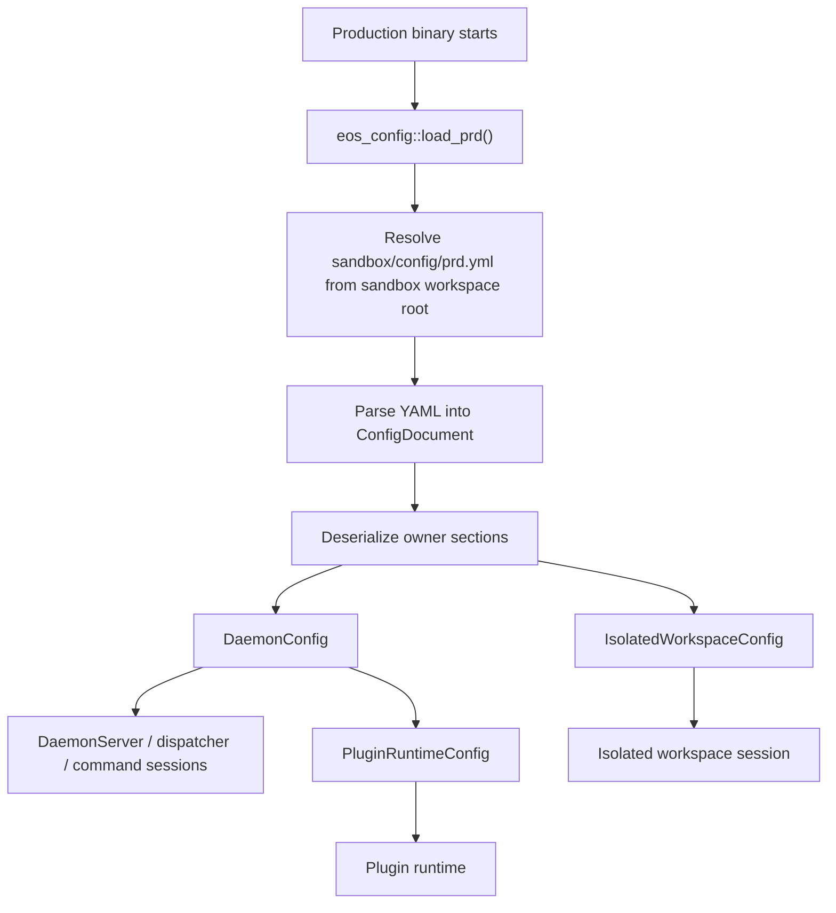
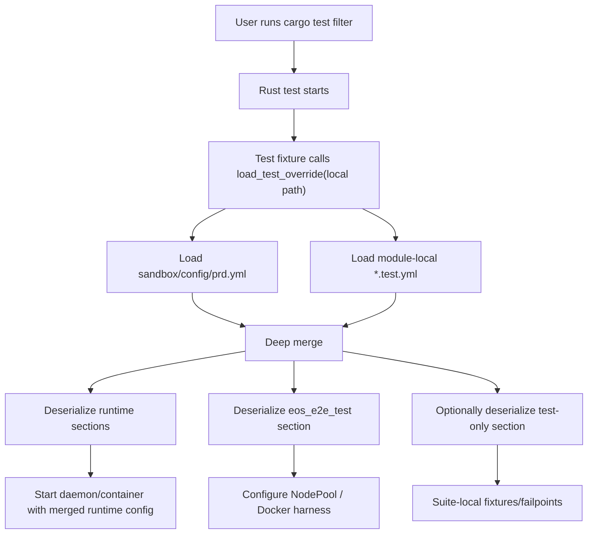

# SPEC: Sandbox Config Infrastructure

Status: DRAFT
Date: 2026-06-05
Owner workspace: `sandbox/`
Scope: `sandbox/config`, `sandbox/crates/eos-config`, sandbox runtime crates,
and `sandbox/crates/eos-e2e-test` test configuration.

This spec defines the sandbox configuration system discussed for the Rust
sandbox workspace:

- One production baseline file: `sandbox/config/prd.yml`.
- No CLI or environment variable config path selection.
- Production code always auto-loads `sandbox/config/prd.yml`.
- Test code may load at most one local `*.test.yml` override per test.
- Users only choose which tests to run. Test code chooses its config.
- Static protocol, storage, kernel, and wire contracts stay in Rust code.
- Config schema is parent-owned: a crate may define `src/config.rs`, but child
  modules such as `eos-daemon/src/plugin` must not define their own `config.rs`.

The implementation must proceed phase by phase. Do not start a later phase until
the previous phase's acceptance criteria have passed.

---

## Progress

| Phase | Status | Notes |
|---|---|---|
| Phase 0: Spec and inventory | Complete | Planning artifact updated with parent-only config ownership; spec diff check passed before Phase 1 edits. |
| Phase 1: Add config file layout | Complete | Added `sandbox/config/prd.yml` and README only; config-selection scan recorded below. |
| Phase 2: Add `eos-config` loader crate | Complete | Added generic loader crate; `cargo test -p eos-config` and `cargo check -p eos-config --all-targets` passed. |
| Phase 3: Add typed runtime schemas | Not started | Crate-root config modules define typed schemas and validation. |
| Phase 4: Wire production loading | Not started | Replace scattered env/default reads with injected config. |
| Phase 5: Wire E2E test local overrides | Not started | Test modules load hardcoded local `*.test.yml`. |
| Phase 6: Remove CLI/env config setup | Not started | Config path selection via CLI/env is forbidden. |
| Phase 7: Static contract cleanup | Not started | Confirm static constants remain out of YAML. |
| Phase 8: Documentation and full verification | Not started | README, examples, full targeted checks. |

Progress update rules:

- Mark a phase `Complete` only after all acceptance criteria pass.
- If a phase uncovers a design conflict, update this spec before coding around
  it.
- Keep implementation commits scoped to one phase where possible.

Phase 1 review notes:

- `rg -n "EOS_E2E_CONFIG|--config|EOS_CONFIG" sandbox/crates` was reviewed on
  2026-06-05.
- The only config path selection hits are
  `sandbox/crates/eos-e2e-test/src/config.rs:222` and
  `sandbox/crates/eos-e2e-test/e2e.toml:4`; both are Phase 6 removal targets.
- `--configure-dns` hits in `eosd/src/runner.rs` and
  `eos-daemon/src/isolated/runtime.rs` are namespace runner action flags, not
  config file selection.

---

## 1. Goals

1. Make sandbox configuration deterministic and reviewable.
2. Move runtime tunables out of scattered env/default parsing into typed config
   structs.
3. Keep `prd.yml` as the single baseline for production runtime and E2E
   harness defaults.
4. Let each E2E test module own local, partial `*.test.yml` overrides.
5. Prevent users from changing config source through CLI flags or environment
   variables.
6. Preserve crate ownership: each runtime crate owns its schema and validation.
7. Keep static contracts near their owning Rust modules instead of moving them
   into YAML.
8. Keep config ownership at crate boundaries, not child module boundaries.

## 2. Non-Goals

- No model-facing tool rename.
- No daemon protocol op rename.
- No global profile registry.
- No user-selected config file path.
- No CLI `--config`, `--profile`, or config override flag.
- No `EOS_CONFIG`, `EOS_CONFIG_OVERRIDE`, `EOS_E2E_CONFIG`, or equivalent
  config path override.
- No attempt to make protocol op names, schema versions, netlink constants, or
  kernel constants configurable.
- No dependency back-edge from `eos-config` into `eos-daemon` or other runtime
  crates.

## 3. Key Rules

| Rule | Meaning |
|---|---|
| Production loads exactly one file | Production always calls `eos_config::load_prd()` and loads `sandbox/config/prd.yml`. |
| Tests load at most one override | A test may call `load_test_override(path)` with one hardcoded local `*.test.yml`. |
| Users only select tests | Users can filter tests with `cargo test` names, but cannot choose config files. |
| `prd.yml` is complete | It contains all baseline runtime and E2E harness defaults. |
| Test YAML is partial | `*.test.yml` files contain only deltas from `prd.yml`. |
| Config is crate-level | Only crate root config modules such as `eos-daemon/src/config.rs` define schema. |
| Child modules do not own config files | Child module folders such as `eos-daemon/src/plugin` consume typed sub-configs from the parent crate. |
| Static contracts stay in Rust | YAML contains operational policy, not wire or kernel contracts. |
| Unknown fields fail | Typos in YAML must fail during typed deserialization. |
| Arrays replace | Array/list overrides replace the baseline list; they do not append. |

---

## 4. Target File and Folder Structure

```text
sandbox/
  config/
    prd.yml
    README.md

  crates/
    eos-config/
      Cargo.toml
      src/
        lib.rs
        document.rs
        error.rs
        merge.rs
        paths.rs

    eos-daemon/
      src/
        config.rs
        plugin/
          ...              # no config.rs; consumes crate::config subtypes

    eos-isolated-workspace/
      src/
        config.rs

    eos-runner/
      src/
        config.rs

    eos-e2e-test/
      src/
        config.rs
      tests/
        ephemeral_workspace/
          config/
            default.test.yml
            command-session-fast.test.yml
        isolated_workspace/
          config/
            default.test.yml
            rfc1918-deny.test.yml
            low-memory.test.yml
        layerstack/
          config/
            deep-squash.test.yml
        occ/
          config/
            conflict-race.test.yml
        plugin/
          config/
            lsp.test.yml
        pressure/
          config/
            concurrency.test.yml
```

Notes:

- `sandbox/config/prd.yml` is committed and unique.
- `sandbox/config/README.md` documents policy, not every field.
- `src/config.rs` is allowed only at crate roots. Child modules may define
  ordinary domain types, but not `config.rs`.
- Child modules receive typed sub-configs from their parent crate, for example
  `crate::config::PluginRuntimeConfig`.
- Test config folders stay local to the test module that uses them.
- If the legacy Python `backend/tests/live_e2e_test` remains active during
  migration, it may use the same local `config/*.test.yml` pattern, but it must
  not become the source of truth for Rust `eos-e2e-test`.

---

## 5. Loading Workflow

### 5.1 Production workflow



Production code must not accept a config path from CLI or env.

### 5.2 Test workflow



Test code chooses the override path inline:

```rust
#[test]
fn rfc1918_deny_blocks_private_egress() -> anyhow::Result<()> {
    let cfg = eos_config::load_test_override(
        "crates/eos-e2e-test/tests/isolated_workspace/config/rfc1918-deny.test.yml",
    )?;

    let fixture = E2eFixture::start(cfg)?;
    // test body
    Ok(())
}
```

### 5.3 User workflow

Allowed:

```bash
cd /Users/yifanxu/machine_learning/LoVC/EphemeralOS/sandbox
cargo test -p eos-e2e-test --features e2e -- --nocapture
cargo test -p eos-e2e-test --features e2e isolated_workspace -- --nocapture
cargo test -p eos-e2e-test --features e2e rfc1918 -- --nocapture
```

Forbidden:

```bash
eosd daemon --config foo.yml
cargo test -p eos-e2e-test --features e2e -- --config foo.yml
EOS_CONFIG=foo.yml cargo test ...
EOS_CONFIG_OVERRIDE=foo.test.yml cargo test ...
EOS_E2E_CONFIG=foo.yml cargo test ...
```

---

## 6. Merge Semantics

`eos-config` deep-merges a test override into `prd.yml` before typed
deserialization.

| Baseline value | Override value | Result |
|---|---|---|
| object | object | Recursive merge |
| scalar | scalar | Override replaces baseline |
| array | array | Override replaces entire array |
| missing key | any | Baseline is inherited |
| any | wrong type | Error during deserialize |
| unknown key | any | Error during deserialize |
| optional value | null | Allowed only if the typed target is `Option<T>` |
| required value | null | Error |

Example:

```yaml
# sandbox/config/prd.yml
daemon:
  command_sessions:
    default_yield_time_ms: 1000
    quiet_ms: 50
    max_session_s: 21600

eos_e2e_test:
  pool:
    mode: pool
    sandboxes: 2
    keep_container: true
```

```yaml
# crates/eos-e2e-test/tests/isolated_workspace/config/fast.test.yml
daemon:
  command_sessions:
    max_session_s: 2

eos_e2e_test:
  pool:
    keep_container: false
```

Merged result:

```yaml
daemon:
  command_sessions:
    default_yield_time_ms: 1000
    quiet_ms: 50
    max_session_s: 2

eos_e2e_test:
  pool:
    mode: pool
    sandboxes: 2
    keep_container: false
```

---

## 7. `eos-config` Loader Classes

`eos-config` is a generic loader crate. It must not depend on runtime crates.

### 7.1 Public API

```rust
pub fn load_prd() -> Result<ConfigDocument, ConfigError>;

pub fn load_test_override(path: impl AsRef<Path>) -> Result<ConfigDocument, ConfigError>;

impl ConfigDocument {
    pub fn section<T>(&self, name: &str) -> Result<T, ConfigError>
    where
        T: serde::de::DeserializeOwned;
}
```

### 7.2 Types

| Type | Owner | Responsibility |
|---|---|---|
| `ConfigDocument` | `eos-config::document` | Holds merged YAML value and typed section deserialization. |
| `ConfigError` | `eos-config::error` | Missing file, path escape, YAML parse, merge error, unknown field, type validation context. |
| `ConfigPath` | `eos-config::paths` | Resolves `sandbox/config/prd.yml` from the sandbox workspace root. |
| `MergeConflict` | `eos-config::merge` | Internal error for unsupported merge cases. |

### 7.3 Path rules

`load_prd()` resolves the baseline from the `sandbox` workspace root:

```text
sandbox/config/prd.yml
```

`load_test_override(path)` accepts a test-code supplied path, but validation must
enforce:

- path ends with `.test.yml`;
- path is inside the `sandbox/` workspace;
- path is not `sandbox/config/prd.yml`;
- path is not user supplied by CLI/env;
- path is resolved and canonicalized before reading when possible.

The path parameter exists for test code only. It is not a user configuration
interface.

### 7.4 Dependency policy

Allowed `eos-config` dependencies:

| Crate | Use |
|---|---|
| `serde` | Typed deserialization. |
| `serde_yaml` or equivalent | YAML parsing. |
| `serde_path_to_error` | Helpful typed field errors. |
| `thiserror` | `ConfigError`. |

Forbidden:

- `eos-daemon`
- `eos-isolated-workspace`
- `eos-runner`
- `eos-e2e-test`
- `agent-core` crates

---

## 8. Root `prd.yml` Schema

`prd.yml` is a full baseline. It should contain all runtime and E2E harness
defaults, even values primarily used by tests.

```yaml
version: 1

daemon:
  server:
    socket_path: /eos/runtime/daemon/runtime.sock
    pid_path: /eos/runtime/daemon/runtime.pid
    max_worker_threads: 4

  inflight:
    ttl_s: 300
    reaper_interval_s: 30

  audit:
    allow_floor_reset: false
    pull_limit_default: 1000
    ring_max_events: 50000
    ring_max_bytes: 8388608
    pressure_threshold: 0.8

  command_sessions:
    scratch_root: /eos/scratch/command-sessions
    default_yield_time_ms: 1000
    quiet_ms: 50
    cancel_wait_ms: 500
    output_drain_grace_ms: 500
    max_session_s: 21600
    output_ring_max_bytes: 1048576
    output_spool_max_bytes: 33554432

  isolated_sweeper:
    ttl_sweep_interval_ms: 500

  plugin:
    ppc_root: /eos/plugin/ppc
    ppc_timeout_ms: 5000
    service_probe_timeout_ms: 5000
    max_response_bytes: 8388608

isolated_workspace:
  enabled: false
  scratch_root: /eos/scratch/isolated
  audit_jsonl_path: /eos/scratch/isolated/audit.jsonl
  ttl_s: 1800
  total_cap: 5
  upperdir_bytes: 1073741824
  memavail_fraction: 0.5
  setup_timeout_s: 30
  exit_grace_s: 0.25
  rfc1918_egress: allow
  fallback_dns: 1.1.1.1
  workspace_root: /testbed
  sample_interval_s: 0.5

runner:
  child_wait_poll_ms: 5
  env:
    inherit_keys: [PATH, HOME, USER, LANG, LC_ALL, TERM, TZ]
    restricted_keys:
      - LD_PRELOAD
      - LD_LIBRARY_PATH
      - LD_AUDIT
      - DYLD_INSERT_LIBRARIES
      - DYLD_LIBRARY_PATH
      - PATH
      - PYTHONPATH
      - BASH_ENV
      - ENV
    default_path: /usr/local/sbin:/usr/local/bin:/usr/sbin:/usr/bin:/sbin:/bin
    testbed_path_prefix:
      - /opt/miniconda3/envs/testbed/bin
      - /opt/miniconda3/bin
    git_optional_locks: false

eos_e2e_test:
  docker:
    image: sweevo-dask__dask-10042:latest
    platform: linux/amd64
    eosd_path: dist/eosd-linux-amd64
    remote_daemon_dir: /eos/runtime/daemon
    remote_eosd_path: /eos/runtime/daemon/eosd
    root_dir: /eos/state/e2e
    cap_add: [SYS_ADMIN, NET_ADMIN]
    security_opt:
      - seccomp=unconfined
      - apparmor=unconfined
    tmpfs:
      - /eos/state:rw,exec,size=2g,mode=1777
      - /eos/scratch:rw,exec,size=2g,mode=1777
    tcp_port: 37657
    non_kept_container_ttl_s: 1800

  pool:
    mode: pool
    sandboxes: 2
    recycle_after: 50
    keep_container: true

  timeouts:
    ready_s: 60
    request_s: 30
    base_build_s: 180

  audit:
    pull_limit: 2000

  isolated_workspace_overrides:
    enabled: true
    upperdir_bytes: 67108864
    memavail_fraction: 0.9
```

Notes:

- `eos_e2e_test.isolated_workspace_overrides` is harness-owned sugar. The
  harness may merge it into the daemon process environment or generated daemon
  runtime config when launching E2E containers.
- Production daemon startup should ignore `eos_e2e_test`.
- The E2E harness may read `daemon`, `isolated_workspace`, and
  `eos_e2e_test`.

---

## 9. Typed Schema Details

All public config structs should derive:

```rust
#[derive(Debug, Clone, PartialEq, serde::Deserialize)]
#[serde(deny_unknown_fields)]
```

Use explicit validation methods for semantic constraints that serde cannot
express.

### 9.1 `eos-daemon/src/config.rs`

```rust
pub struct DaemonConfig {
    pub server: DaemonServerConfig,
    pub inflight: InflightConfig,
    pub audit: AuditConfig,
    pub command_sessions: CommandSessionConfig,
    pub isolated_sweeper: IsolatedSweeperConfig,
    pub plugin: PluginRuntimeConfig,
}

pub struct DaemonServerConfig {
    pub socket_path: PathBuf,
    pub pid_path: PathBuf,
    pub max_worker_threads: usize,
}

pub struct InflightConfig {
    pub ttl_s: f64,
    pub reaper_interval_s: f64,
}

pub struct AuditConfig {
    pub allow_floor_reset: bool,
    pub pull_limit_default: usize,
    pub ring_max_events: u64,
    pub ring_max_bytes: u64,
    pub pressure_threshold: f64,
}

pub struct CommandSessionConfig {
    pub scratch_root: PathBuf,
    pub default_yield_time_ms: u64,
    pub quiet_ms: u64,
    pub cancel_wait_ms: u64,
    pub output_drain_grace_ms: u64,
    pub max_session_s: u64,
    pub output_ring_max_bytes: usize,
    pub output_spool_max_bytes: u64,
}

pub struct IsolatedSweeperConfig {
    pub ttl_sweep_interval_ms: u64,
}

pub struct PluginRuntimeConfig {
    pub ppc_root: PathBuf,
    pub ppc_timeout_ms: u64,
    pub service_probe_timeout_ms: u64,
    pub max_response_bytes: usize,
}
```

Validation:

| Field | Constraint |
|---|---|
| `server.socket_path` | absolute path |
| `server.pid_path` | absolute path |
| `server.max_worker_threads` | `>= 1` |
| `inflight.ttl_s` | `> 0.0` |
| `inflight.reaper_interval_s` | `> 0.0` |
| `audit.pull_limit_default` | `>= 1` |
| `audit.ring_max_events` | `>= 1` |
| `audit.ring_max_bytes` | `>= 1` |
| `audit.pressure_threshold` | `0.0 < value <= 1.0` |
| command-session millisecond fields | `>= 1` except explicit zero fields if later allowed |
| `command_sessions.max_session_s` | `>= 1` |
| output caps | `>= 1` |
| `plugin.ppc_root` | absolute path |
| `plugin` timeout fields | `>= 1` |
| `plugin.max_response_bytes` | `>= 1` |

Current values replaced:

| Current location | Target field |
|---|---|
| `eosd/src/daemon.rs` worker thread cap | `daemon.server.max_worker_threads` |
| `eos-daemon/src/invocation_registry.rs` TTL/reaper | `daemon.inflight.*` |
| `eos-daemon/src/audit_ops.rs` pull default | `daemon.audit.pull_limit_default` |
| `eos-daemon/src/dispatcher.rs` audit reset env gate | `daemon.audit.allow_floor_reset` |
| `eos-daemon/src/command.rs` scratch root/cancel/max session | `daemon.command_sessions.*` |
| `eos-daemon/src/command/session.rs` quiet/drain values | `daemon.command_sessions.*` |
| `eos-daemon/src/command/output.rs` ring/spool caps | `daemon.command_sessions.*` |
| `eos-daemon/src/plugin/*` PPC root/timeouts/caps | `daemon.plugin.*` |

Do not put TCP auth token in `prd.yml`. Auth tokens are secrets and should be
runtime-generated or passed through a secret path outside this spec.

### 9.2 `eos-isolated-workspace/src/config.rs`

```rust
pub struct IsolatedWorkspaceConfig {
    pub enabled: bool,
    pub scratch_root: PathBuf,
    pub audit_jsonl_path: PathBuf,
    pub ttl_s: f64,
    pub total_cap: u32,
    pub upperdir_bytes: u64,
    pub memavail_fraction: f64,
    pub setup_timeout_s: f64,
    pub exit_grace_s: f64,
    pub rfc1918_egress: Rfc1918Egress,
    pub fallback_dns: String,
    pub workspace_root: PathBuf,
    pub sample_interval_s: f64,
}

#[derive(Debug, Clone, Copy, PartialEq, Eq, serde::Deserialize)]
#[serde(rename_all = "snake_case")]
pub enum Rfc1918Egress {
    Allow,
    Deny,
}
```

Validation:

| Field | Constraint |
|---|---|
| `scratch_root` | absolute path |
| `audit_jsonl_path` | absolute path |
| `ttl_s` | `> 0.0` |
| `total_cap` | `>= 1` when `enabled=true` |
| `upperdir_bytes` | `> 0` |
| `memavail_fraction` | `0.0 < value <= 1.0` |
| `setup_timeout_s` | `> 0.0` |
| `exit_grace_s` | `>= 0.0` |
| `fallback_dns` | non-empty |
| `workspace_root` | absolute path |
| `sample_interval_s` | `>= 0.01` |

Important behavior:

- `workspace_root` is a fallback only.
- Existing `workspace.json` bindings should still win when present.
- `/testbed` belongs in `prd.yml`, not scattered production code.

### 9.3 Plugin runtime config under `eos-daemon/src/config.rs`

Plugin runtime configuration is intentionally nested under `DaemonConfig`.
`eos-daemon/src/plugin` must not define `config.rs`; plugin code receives
`crate::config::PluginRuntimeConfig` from daemon startup or the dispatcher path.

This keeps plugin runtime policy near the daemon lifecycle that owns PPC process
setup, service probing, and response caps.

Do not move plugin manifest contract defaults here. These stay in `eos-plugin`:

- package marker filenames;
- setup marker filenames;
- `package.runtime_dir = "runtime"`;
- `ppc_protocol_version = 1`;
- `auto_workspace_overlay = true`;
- manifest validation rules.

### 9.4 `eos-runner/src/config.rs`

```rust
pub struct RunnerConfig {
    pub child_wait_poll_ms: u64,
    pub env: RunnerEnvConfig,
}

pub struct RunnerEnvConfig {
    pub inherit_keys: Vec<String>,
    pub restricted_keys: Vec<String>,
    pub default_path: String,
    pub testbed_path_prefix: Vec<String>,
    pub git_optional_locks: bool,
}
```

Validation:

| Field | Constraint |
|---|---|
| `child_wait_poll_ms` | `>= 1` |
| `inherit_keys` | no empty strings |
| `restricted_keys` | no empty strings |
| `default_path` | non-empty |
| `testbed_path_prefix` | no empty strings |

If the team decides runner env policy should remain static, keep this section out
of `prd.yml` and leave the constants in `eos-runner`. Do not partly configure
the list from multiple places.

### 9.5 `eos-e2e-test/src/config.rs`

```rust
pub struct EosE2eTestConfig {
    pub docker: E2eDockerConfig,
    pub pool: E2ePoolConfig,
    pub timeouts: E2eTimeoutConfig,
    pub audit: E2eAuditConfig,
    pub isolated_workspace_overrides: Option<E2eIsolatedWorkspaceOverrides>,
}

pub struct E2eDockerConfig {
    pub image: String,
    pub platform: Option<String>,
    pub eosd_path: PathBuf,
    pub remote_daemon_dir: PathBuf,
    pub remote_eosd_path: PathBuf,
    pub root_dir: PathBuf,
    pub cap_add: Vec<String>,
    pub security_opt: Vec<String>,
    pub tmpfs: Vec<String>,
    pub tcp_port: u16,
    pub non_kept_container_ttl_s: u64,
}

pub struct E2ePoolConfig {
    pub mode: E2eNodeMode,
    pub sandboxes: usize,
    pub recycle_after: usize,
    pub keep_container: bool,
}

#[derive(Debug, Clone, Copy, PartialEq, Eq, serde::Deserialize)]
#[serde(rename_all = "kebab-case")]
pub enum E2eNodeMode {
    Shared,
    Pool,
    PerFile,
    PerTest,
}

pub struct E2eTimeoutConfig {
    pub ready_s: u64,
    pub request_s: u64,
    pub base_build_s: u64,
}

pub struct E2eAuditConfig {
    pub pull_limit: u64,
}

pub struct E2eIsolatedWorkspaceOverrides {
    pub enabled: Option<bool>,
    pub upperdir_bytes: Option<u64>,
    pub memavail_fraction: Option<f64>,
}
```

Validation:

| Field | Constraint |
|---|---|
| `docker.image` | non-empty |
| `docker.eosd_path` | non-empty; relative paths resolved from `sandbox/` |
| `docker.remote_*` | absolute container paths |
| `docker.root_dir` | absolute container path |
| `cap_add/security_opt/tmpfs` | no empty strings |
| `tcp_port` | non-zero |
| `non_kept_container_ttl_s` | `>= 1` |
| `pool.sandboxes` | `>= 1` |
| `pool.recycle_after` | `>= 1` |
| timeouts | `>= 1` |
| `audit.pull_limit` | `>= 1` |

Current values replaced:

| Current location | Target field |
|---|---|
| `eos-e2e-test/e2e.toml` | `sandbox/config/prd.yml::eos_e2e_test` |
| `EOS_E2E_*` env overrides | Removed |
| `EOS_LIVE_E2E_IMAGE` fallback | Removed for Rust E2E; default image comes from `prd.yml` |

---

## 10. Local Test YAML Layout

Each test maps to at most one test YAML file. Shared test module fixtures may
choose a module default.

Example layout:

```text
sandbox/crates/eos-e2e-test/tests/isolated_workspace/
  lifecycle.rs
  no_publish.rs
  tool_routing.rs
  config/
    default.test.yml
    rfc1918-deny.test.yml
    low-memory.test.yml
```

Example module helper:

```rust
fn config(name: &str) -> anyhow::Result<ConfigDocument> {
    eos_config::load_test_override(
        Path::new("crates/eos-e2e-test/tests/isolated_workspace/config").join(name),
    )
}
```

Example test:

```rust
#[test]
fn no_publish_discards_upperdir() -> anyhow::Result<()> {
    let doc = config("default.test.yml")?;
    let fixture = E2eFixture::start(doc)?;
    // test body
    Ok(())
}
```

Example local override:

```yaml
isolated_workspace:
  enabled: true
  upperdir_bytes: 67108864

eos_e2e_test:
  pool:
    mode: per-test
    keep_container: false
```

Optional suite-local `test` section:

```yaml
test:
  failpoints:
    isolated_workspace:
      fail_at: mount_overlay
      phase_delay:
        spawn_holder_ms: 50
```

Production code must never deserialize or act on `test`.

---

## 11. Static Config Boundary

Keep these in code:

| Static cluster | Owner |
|---|---|
| Protocol op names | `eos-protocol/src/ops.rs` |
| Protocol/schema versions and wire field names | `eos-protocol/src/version.rs` |
| Request byte caps if treated as wire contract | `eos-protocol` |
| LayerStack layout names | `eos-layerstack` |
| `AUTO_SQUASH_MAX_DEPTH` | `eos-layerstack` |
| Overlay whiteout markers | `eos-overlay` / `eos-layerstack` |
| Kernel/netlink/nft numeric constants | exact networking module using them |
| Namespace holder handshake tokens and exit codes | `eos-ns-holder` |
| Plugin manifest defaults | `eos-plugin` |

Do not reintroduce a runtime `OVL_MAX_STACK_GUARD`. Current behavior keeps
`AUTO_SQUASH_MAX_DEPTH = 100` as the operational target and relies on the kernel
for the real overlayfs hard ceiling.

---

## 12. Diff and Comparison Tables

### 12.1 Current vs target behavior

| Area | Current | Target |
|---|---|---|
| Production defaults | Scattered Rust constants and env parsing | `sandbox/config/prd.yml` plus typed owner schemas |
| E2E defaults | `eos-e2e-test/e2e.toml` and `EOS_E2E_*` | `prd.yml::eos_e2e_test` |
| Test overrides | Env, TOML profile, ad hoc helper behavior | Hardcoded local `*.test.yml` per test/module |
| Config path selection | Possible via env/TOML loader patterns | Forbidden |
| User role | Can influence config through env | Can only choose tests to run |
| Loader ownership | E2E-specific loader | Generic `eos-config` loader |
| Schema ownership | Mixed with parsing/default logic | Crate-root `src/config.rs` files define typed schemas; child modules consume sub-configs |
| Static values | Some mixed with "configurable" inventory | Static contract modules stay in code |

### 12.2 Config source comparison

| Source | Allowed? | Reason |
|---|---|---|
| `sandbox/config/prd.yml` | Yes | Single baseline |
| module-local `*.test.yml` | Yes | Reviewable test-owned override |
| CLI `--config` | No | Lets users select config |
| env `EOS_CONFIG` | No | Process-global and non-reviewable |
| env `EOS_E2E_CONFIG` | No | Replaced by inline test path |
| hardcoded Rust constants for static contracts | Yes | Correct for protocol/kernel/layout |
| hardcoded Rust defaults for runtime tunables | No long-term | Move to `prd.yml` |

### 12.3 Simplicity decisions

| Potential feature | Decision | Reason |
|---|---|---|
| Named profile system | Do not add | Local test files are enough |
| Multiple override files per test | Do not add | Each test maps to at most one override |
| Env override stack | Do not add | Breaks determinism and parallel tests |
| CLI config selection | Do not add | User should only choose tests |
| Global test config registry | Do not add | Test modules should own local files |
| Child-module `config.rs` | Do not add | Parent crate schema is easier to audit and prevents config ownership drift |
| Runtime config crate aware of all schemas | Do not add | Would create dependency back-edges |

---

## 13. Proposed `sandbox/config/README.md`

Create this file during Phase 1:

```md
# Sandbox Config

`prd.yml` is the single baseline config for the sandbox runtime and sandbox test
harness defaults.

Production code always loads:

```text
sandbox/config/prd.yml
```

Tests may load one local override in addition to `prd.yml`:

```text
sandbox/config/prd.yml
  -> crates/<crate>/tests/**/<name>.test.yml
```

Users do not choose config files through CLI flags or environment variables.
Users only choose which tests to run; test code chooses its local override file.

## Merge Rules

- Objects merge recursively.
- Scalars replace the baseline value.
- Arrays replace the baseline array.
- Missing keys inherit from `prd.yml`.
- Unknown keys are errors.
- Wrong types are errors.
- `null` is allowed only for optional typed fields.

## Static Values

Do not move protocol op names, schema versions, file layout names, kernel
constants, netlink constants, nft constants, wire field names, namespace
handshake tokens, or plugin manifest contract defaults into YAML.

Runtime and test harness policy belongs in YAML. Static contracts belong in Rust
code near their owner.

## Schema Ownership

Runtime schema lives in crate-root `src/config.rs` files only. Child modules
consume typed sub-configs from their parent crate, for example
`crate::config::PluginRuntimeConfig`.

Local test `config/` folders are YAML-only override folders. They do not define
Rust schema.
```

---

## 14. Phase Plan and Acceptance Criteria

### Phase 0: Spec and inventory

Work:

- Confirm current configurable values in `sandbox/crates`.
- Confirm `prd.yml` baseline scope includes `eos_e2e_test`.
- Confirm no CLI/env config path selection is desired.
- Add this spec.

Acceptance criteria:

- This spec exists under `docs/plans/`.
- It documents schema, class/API shape, workflow, folder layout, README content,
  comparison tables, and phase gates.
- No runtime code is changed in this phase.
- `git diff --check -- docs/plans/sandbox-config-infra_SPEC.md` passes.

### Phase 1: Add config file layout

Work:

- Add `sandbox/config/prd.yml`.
- Add `sandbox/config/README.md`.
- Move current `eos-e2e-test/e2e.toml` values into
  `prd.yml::eos_e2e_test`.
- Keep existing code reading `e2e.toml` until later phases, or add temporary
  tests that only validate the new YAML file exists and parses.

Acceptance criteria:

- `sandbox/config/prd.yml` exists and is complete.
- `sandbox/config/README.md` exists and matches the policy in this spec.
- No runtime behavior changes yet unless explicitly scoped.
- `rg -n "EOS_E2E_CONFIG|--config|EOS_CONFIG" sandbox/crates` output is
  reviewed and documented for later removal.
- `git diff --check -- sandbox/config docs/plans/sandbox-config-infra_SPEC.md`
  passes.

Gate:

- Do not start Phase 2 until the baseline file and README are committed or
  otherwise accepted by the user.

### Phase 2: Add `eos-config` loader crate

Work:

- Add `sandbox/crates/eos-config`.
- Add it to `sandbox/Cargo.toml` workspace members.
- Implement `load_prd()`.
- Implement `load_test_override(path)`.
- Implement deep merge.
- Implement `ConfigDocument::section<T>()`.
- Add unit tests for merge semantics and path validation.

Acceptance criteria:

- `cargo test -p eos-config` passes.
- Tests cover object merge, scalar replace, array replace, unknown field
  propagation, wrong type propagation, and `.test.yml` path enforcement.
- `eos-config` has no dependencies on runtime crates.
- Public API exposes no CLI/env config path selection.
- `cargo check -p eos-config --all-targets` passes.

Gate:

- Do not start Phase 3 until `eos-config` tests and check pass.

### Phase 3: Add typed runtime schemas

Work:

- Add `eos-daemon/src/config.rs`.
- Add `PluginRuntimeConfig` inside `eos-daemon/src/config.rs` as
  `DaemonConfig::plugin`.
- Add a guard test or review check that `eos-daemon/src/plugin/config.rs` does
  not exist.
- Add `eos-isolated-workspace/src/config.rs`.
- Add `eos-runner/src/config.rs` only if runner env policy is made runtime
  configurable.
- Update `eos-e2e-test/src/config.rs` to deserialize from `ConfigDocument`
  sections instead of `e2e.toml`.

Acceptance criteria:

- Each config struct uses `#[serde(deny_unknown_fields)]`.
- No child module directory owns a `config.rs`; crate-level `src/config.rs`
  files are the only schema definition points.
- Each owner crate has validation tests for invalid values.
- `cargo test -p eos-daemon config` passes.
- `cargo test -p eos-isolated-workspace config` passes.
- `cargo test -p eos-e2e-test config --features e2e` or equivalent config-only
  tests pass without launching Docker.
- No runtime call sites are rewired yet unless the schema tests require a pure
  constructor.

Gate:

- Do not start Phase 4 until owner schemas compile and validation tests pass.

### Phase 4: Wire production loading

Work:

- Replace `ResourceCaps::from_env()` production path with typed config
  construction.
- Replace in-flight registry env parsing with `InflightConfig`.
- Replace command-session max/default constants that are policy values with
  `CommandSessionConfig`.
- Replace audit reset env gate with `AuditConfig::allow_floor_reset`.
- Ensure production startup calls `eos_config::load_prd()`.

Acceptance criteria:

- Production code has no config path CLI/env input.
- `rg -n "EOS_CONFIG|EOS_CONFIG_OVERRIDE|EOS_E2E_CONFIG|--config" sandbox/crates`
  finds no live config selection path.
- Remaining env reads are either non-config process data, secrets/auth, or
  explicitly documented exceptions.
- `cargo check -p eos-daemon --all-targets` passes.
- `cargo test -p eos-daemon config command isolated audit --all-targets` passes
  with targeted names adjusted to real tests.

Gate:

- Do not start Phase 5 until daemon production config wiring is green.

### Phase 5: Wire E2E test local overrides

Work:

- Move Rust E2E harness defaults from `e2e.toml` into `prd.yml`.
- Delete or retire `e2e.toml` after equivalent typed load is proven.
- Add module-local `config/*.test.yml` files where tests need deltas.
- Update each test or module fixture to call `load_test_override()` inline.
- Ensure each test maps to at most one local `*.test.yml`.

Acceptance criteria:

- `cargo test -p eos-e2e-test config --features e2e` passes without Docker if
  config-only tests exist.
- `cargo test -p eos-e2e-test --features e2e <one focused smoke test> -- --nocapture`
  passes in a Docker-capable environment.
- No E2E test requires a config CLI flag or config env var.
- `rg -n "EOS_E2E_CONFIG|EOS_LIVE_E2E_IMAGE|EOS_E2E_IMAGE|EOS_E2E_PROFILE" sandbox/crates/eos-e2e-test`
  is either empty or only in deletion notes/tests proving removal.
- Existing Docker-only policy is preserved.

Gate:

- Do not start Phase 6 until E2E config loading works for at least one focused
  live smoke test or the environment blocker is explicitly documented.

### Phase 6: Remove CLI/env config setup

Work:

- Delete CLI config flags if any were introduced or already exist.
- Delete config path env variables and test harness override env paths.
- Update docs and usage examples to show test selection only.
- Remove stale `e2e.toml` profile selection code.

Acceptance criteria:

- `rg -n "config.*path|--config|EOS_CONFIG|EOS_CONFIG_OVERRIDE|EOS_E2E_CONFIG|EOS_E2E_PROFILE" sandbox/crates`
  has no live config setup path.
- Users can still run focused tests by test name.
- `cargo test -p eos-config` passes.
- `cargo check -p eos-e2e-test --all-targets --features e2e` passes.

Gate:

- Do not start Phase 7 until config setup cannot be selected from CLI/env.

### Phase 7: Static contract cleanup

Work:

- Audit all values proposed for YAML.
- Move only operational tunables.
- Keep static contracts in owner modules.
- Add comments near static modules explaining why they are not config.

Acceptance criteria:

- `prd.yml` contains no protocol op names.
- `prd.yml` contains no schema version numbers except `version: 1` for the
  config document itself.
- `prd.yml` contains no netlink/nft numeric constants.
- `prd.yml` contains no whiteout marker constants.
- `prd.yml` does not define `OVL_MAX_STACK_GUARD`.
- `AUTO_SQUASH_MAX_DEPTH` remains in Rust code.

Gate:

- Do not start Phase 8 until static/runtime split is reviewed.

### Phase 8: Documentation and full verification

Work:

- Update `sandbox/config/README.md` if implementation differs from this spec.
- Update any architecture docs that describe sandbox config.
- Add a short migration note for removed env/CLI config selection.
- Run final checks.

Acceptance criteria:

- `cargo test -p eos-config` passes.
- `cargo check -p eos-daemon --all-targets` passes.
- `cargo check -p eos-isolated-workspace --all-targets` passes.
- `cargo check -p eos-e2e-test --all-targets --features e2e` passes.
- A focused Docker E2E smoke run is attempted with:

```bash
cd sandbox
cargo test -p eos-e2e-test --features e2e -- --nocapture
```

  If the environment blocks Docker proof, the blocker is recorded with the
  exact failing command and error.
- `git diff --check` passes.

---

## 15. Open Questions

| Question | Recommendation |
|---|---|
| Should `runner.env` be configurable? | Only if tests need to vary it. Otherwise keep it static in `eos-runner`. |
| Should `MAX_REQUEST_BYTES` be YAML config? | No. Treat it as protocol/wire contract. |
| Should E2E image be in `prd.yml`? | Yes, under `eos_e2e_test.docker.image`, because `prd.yml` is the baseline for all runnable profiles. |
| Should CI choose config by env? | No. CI should choose which tests to run. Test code chooses config. |
| Should a test combine multiple override files? | No. Each test maps to at most one local override. |
| Should production load `eos_e2e_test`? | No. The section exists in `prd.yml`, but production crates deserialize only their owned sections. |

---

## 16. Final Target Summary

The final system should be small:

```rust
// Production
let doc = eos_config::load_prd()?;
let daemon = doc.section::<DaemonConfig>("daemon")?;

// Test
let doc = eos_config::load_test_override(
    "crates/eos-e2e-test/tests/isolated_workspace/config/rfc1918-deny.test.yml",
)?;
```

Everything else is typed crate ownership:

- `eos-config` loads and merges.
- `eos-daemon` owns daemon schema.
- `eos-isolated-workspace` owns isolated schema.
- `eos-e2e-test` owns live E2E harness schema.
- local tests own local `*.test.yml`.
- users only choose tests.
