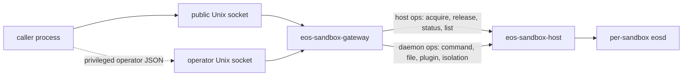

# eos-sandbox-gateway Consolidation

Status: **Proposed**
Date: 2026-06-11
Owner: `sandbox/crates`
Scope: rename and compact the current `sandbox/crates/eos-api` gateway crate,
remove the confusing `eos-api admin <op>` CLI, keep the socket-level operator
boundary, and make the final implementation binary-only and LOC-negative.

The current crate name and file shape make the component look like a public API
library or command interface. It is neither. Its real job is a host-side
gateway process:



## 1. Diagnosis

Current source tree:

```text
sandbox/crates/eos-api/
├── Cargo.toml
├── src/
│   ├── admin.rs
│   ├── lib.rs
│   ├── main.rs
│   ├── public.rs
│   ├── router.rs
│   ├── server.rs
│   └── wire.rs
└── tests/
    └── contract.rs
```

Current Rust LOC:

| File | LOC | Diagnosis |
| --- | ---: | --- |
| `src/admin.rs` | 105 | CLI wrapper around the operator socket; creates the false impression that callers use commands. |
| `src/lib.rs` | 65 | Public library facade, but no other crate imports `eos_api`; only the binary and its tests use it. |
| `src/main.rs` | 121 | Thin entry plus `serve` config parsing; should stay binary-owned. |
| `src/public.rs` | 147 | Catalog parsing; only used by the gateway and its contract tests. |
| `src/router.rs` | 145 | Visibility gate and host/daemon route selection; only used by the gateway and tests. |
| `src/server.rs` | 94 | Socket listener; operator socket is real, but the `admin` naming is misleading. |
| `src/wire.rs` | 144 | Client-hop JSON framing; only used by the gateway and tests. |
| `tests/contract.rs` | 258 | Good coverage, but it forces a public lib target today. |
| **Total** | **1,079** | Seven source files plus one integration test for one small binary. |

The confusing parts are separate:

| Surface | Keep? | Reason |
| --- | --- | --- |
| `eos-api admin <op>` CLI | **No** | It is a convenience wrapper, not the caller API; it obscures the JSON-over-socket contract. |
| Operator socket | **Yes** | The contract has privileged `visibility: operator` ops that must remain unavailable on the public client socket. |
| `Visibility::Operator` | **Yes** | It is the explicit policy boundary for checkpoint, isolation-list, and whole-sandbox cancel operations. |
| Public lib target `eos_api` | **No** | There are no external crate consumers; keeping it widens API surface for tests only. |
| Name `eos-api` | **No** | Too generic; sounds like shared API/DTOs rather than a gateway process. |

## 2. Target

Rename the package and binary to `eos-sandbox-gateway`.

Target tree:

```text
sandbox/crates/eos-sandbox-gateway/
├── Cargo.toml
├── src/
│   ├── main.rs
│   ├── serve.rs
│   └── gateway.rs
└── tests/
    └── contract/
        └── mod.rs
```

Target LOC budget:

| Area | Target LOC |
| --- | ---: |
| `src/main.rs` | <= 30 |
| `src/serve.rs` | <= 115 |
| `src/gateway.rs` | <= 560 |
| `tests/contract/mod.rs` | <= 235 |
| **Total Rust** | **<= 940** |

Expected reduction: at least 139 LOC, preferably 150+ LOC:

- delete `src/admin.rs` entirely (105 LOC);
- delete `src/lib.rs` as a public library facade (65 LOC);
- remove admin subcommand and admin-client docs;
- consolidate repeated module docs/import glue while preserving behavior.

`gateway.rs` may be roughly 500-560 LOC. That is acceptable here because it is a
single cohesive gateway boundary: catalog load, frame decode, socket accept,
visibility gate, host call, and daemon forward. Splitting it into `api/`,
`wire/`, `server/`, and `router/` reintroduces small-file scattering without an
ownership benefit.

## 3. Public Contract

The process entry point becomes:

```sh
cargo run -p eos-sandbox-gateway -- serve \
  --listen /tmp/eos-sandbox.sock \
  --image <docker-image> \
  --platform linux/amd64
```

Normal callers send one compact JSON line to the public socket:

```sh
printf '%s\n' '{"op":"sandbox.command.exec","sandbox_id":"<sb-id>","invocation_id":"i1","args":{"cmd":"pwd","layer_stack_root":"/eos/layer-stack","caller_id":"run-1","yield_time_ms":1000}}' \
  | socat - UNIX-CONNECT:/tmp/eos-sandbox.sock
```

Privileged operator callers send the same JSON envelope to the operator socket:

```text
/tmp/eos-sandbox.sock.operator
```

There is no `operator` CLI wrapper in this spec. If a human wants to invoke an
operator op, they use the same socket protocol as every other caller. This keeps
the architecture honest: the transport is the API.

## 4. Rename and Compatibility

Rename set:

| Current | Target |
| --- | --- |
| package `eos-api` | package `eos-sandbox-gateway` |
| binary `eos-api` | binary `eos-sandbox-gateway` |
| crate directory `sandbox/crates/eos-api` | `sandbox/crates/eos-sandbox-gateway` |
| Rust lib crate `eos_api` | deleted |
| `Surface::Admin` | `Surface::Operator` |
| `admin_socket_path` | `operator_socket_path` |
| `<listen>.admin` | `<listen>.operator` |

No compatibility alias is planned. This is an internal sandbox workspace crate,
and the old name is actively misleading. Update workspace members, dependency
keys if any appear, docs, generated API headings, and contract tests in the same
change.

## 5. Implementation Plan

### Phase 1: baseline and rename

1. Confirm no external Rust imports of `eos_api::`.
2. Move `sandbox/crates/eos-api` to `sandbox/crates/eos-sandbox-gateway`.
3. Update `sandbox/Cargo.toml`, package metadata, binary name, and lockfile.
4. Replace text references in live docs from `eos-api` to
   `eos-sandbox-gateway` where they describe the process.

Verification:

```sh
cargo metadata --manifest-path sandbox/Cargo.toml --format-version 1 --no-deps
cargo check --manifest-path sandbox/Cargo.toml -p eos-sandbox-gateway --all-targets
```

### Phase 2: remove the admin CLI

1. Delete `src/admin.rs`.
2. Remove `Some("admin")` from `main.rs`.
3. Make accepted subcommands only `serve`, `--version`, and `-V`.
4. Remove README/spec examples using `eos-api admin <op>`.
5. Keep operator ops documented as socket-only.

Expected user-facing behavior:

```text
old: eos-api admin sandbox.checkpoint.layer_metrics ...
new: send {"op":"sandbox.checkpoint.layer_metrics", ...} to <listen>.operator
```

### Phase 3: collapse to binary-only modules

1. Remove `[lib]` from `Cargo.toml`.
2. Delete `src/lib.rs`.
3. Move the `SandboxHost` `Engine` implementation into `gateway.rs`.
4. Merge `public.rs`, `router.rs`, `server.rs`, and `wire.rs` into
   `gateway.rs`, keeping helper visibility private unless tests need it.
5. Move `ServeArgs` and serve startup into `serve.rs`.
6. Keep `main.rs` as a thin command dispatcher only.

### Phase 4: preserve contract tests without a public lib

Move the integration test to a crate-local private test module:

```text
tests/contract/mod.rs
```

Wire it from `src/main.rs`:

```rust
#[cfg(test)]
#[path = "../tests/contract/mod.rs"]
mod contract;
```

The tests may use `crate::gateway::{...}` directly. Do not keep a public
library target only for tests.

### Phase 5: regenerate docs if needed

`sandbox/docs/API.md` is generated from `contract/ops.json` by `xtask`; if the
generator text still says `eos-api admin`, update `sandbox/xtask/src/main.rs`
and regenerate:

```sh
cargo run --manifest-path sandbox/Cargo.toml -p xtask -- gen-docs
```

Do not hand-edit generated inventory HTML/JSON in this change. If inventory
refresh is required, do it as a separate generated-artifact step.

## 6. Final Structure Contract

`main.rs`:

- owns `#![forbid(unsafe_code)]`;
- parses only top-level `serve`, `--version`, and `-V`;
- includes contract tests with `#[path]`;
- contains no routing, socket, catalog, or host config logic.

`serve.rs`:

- parses `serve` flags;
- derives default workspace paths;
- builds `eos_sandbox_host::HostConfig`;
- opens `SandboxHost`;
- calls `gateway::serve`.

`gateway.rs`:

- embeds and parses `contract/ops.json`;
- owns `Catalog`, `Visibility`, `Route`, `Surface::Client`,
  `Surface::Operator`, and `HostVerb`;
- owns the client and operator Unix socket listeners;
- owns request line framing, envelope decode, and API error envelopes;
- routes host ops directly to `SandboxHost`;
- forwards daemon ops through `SandboxHost::forward`;
- has no command-line parsing.

`tests/contract/mod.rs`:

- proves every catalog entry routes;
- proves operator ops fail on the public socket and pass on the operator socket;
- proves internal/test ops are refused from both public and operator sockets;
- proves daemon-bound errors still map to the documented API error kinds;
- proves the Unix socket round trip remains one request per connection.

## 7. Verification Gate

Run these after implementation:

```sh
cargo metadata --manifest-path sandbox/Cargo.toml --format-version 1 --no-deps
cargo fmt --manifest-path sandbox/Cargo.toml -p eos-sandbox-gateway -- --check
cargo check --manifest-path sandbox/Cargo.toml -p eos-sandbox-gateway --all-targets
cargo test --manifest-path sandbox/Cargo.toml -p eos-sandbox-gateway --all-targets
cargo clippy --manifest-path sandbox/Cargo.toml -p eos-sandbox-gateway --all-targets -- -D warnings
git diff --check
```

If downstream packaging or docs refer to `eos-api`, also run the narrow stale
reference scan:

```sh
rg -n "eos-api|eos_api|eos-api admin|\\.admin" sandbox docs/plans -S
```

Any remaining match must be one of:

- historical docs intentionally left unchanged;
- generated inventory waiting for a separate refresh;
- migration notes explicitly naming the old package.

## 8. Risks

| Risk | Mitigation |
| --- | --- |
| Removing the CLI makes manual operator probes less convenient. | Use the same JSON-line socket protocol against `<listen>.operator`; document one `socat` example. |
| Collapsing integration tests into private unit tests changes test execution shape. | Keep the same assertions and run `cargo test -p eos-sandbox-gateway --all-targets`; no public API should exist solely for tests. |
| Renaming while adjacent sandbox crates are changing causes stale lockfile or workspace-member drift. | Run `cargo metadata --no-deps` before broader checks and keep this patch scoped to gateway/docs references. |
| Generated docs still say `eos-api admin`. | Update `xtask` generator text and regenerate `sandbox/docs/API.md`; leave class inventory refresh separate unless explicitly requested. |

## 9. Acceptance Criteria

- `sandbox/crates/eos-api` no longer exists.
- `sandbox/crates/eos-sandbox-gateway` exists and has exactly three source
  files: `main.rs`, `serve.rs`, and `gateway.rs`.
- The package and binary are both named `eos-sandbox-gateway`.
- There is no `admin` subcommand and no `src/admin.rs`.
- There is no public `eos_api` library target.
- Operator ops remain impossible on the public socket and possible on the
  operator socket.
- Total Rust LOC for the crate is `<= 940`.
- The verification gate in §7 passes, except for clearly identified unrelated
  concurrent workspace failures.
