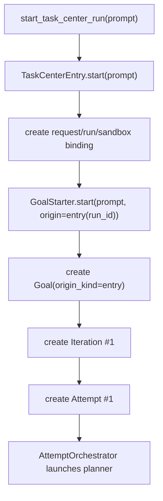
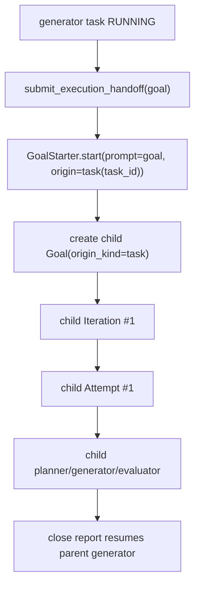

# Task Center Pipeline

## Hierarchy

The runtime tree is:

```text
TaskCenter run
  Goal
    Iteration
      Attempt
        planner task
        generator DAG tasks
        evaluator task
```

- **Goal** — a normal unit of requested work. `origin_kind="entry"` means it came from `TaskCenterEntry.start(prompt)`; `origin_kind="task"` means it came from a generator task calling `submit_execution_handoff(goal=...)`.
- **Iteration** — one goal statement within a Goal. Iteration 1 is created from the incoming prompt. Later iterations are continuations created from deferred planner output.
- **Attempt** — one planner -> generator DAG -> evaluator execution for an Iteration.
- **Tasks** — per-role rows in `TaskCenterStore`: `planner`, `generator`, and `evaluator`.

There is no top-level agent role before the first Goal. The entry layer is a service boundary that prepares the request/run/sandbox and starts the normal Goal lifecycle.

## Entry Flow

`start_task_center_run(...)` delegates to `TaskCenterEntry.start(prompt)`.



Entry-origin Goal closure routes to the run itself: success marks the run `done`, failure marks it `failed`.

## Recursive Handoff

Generator agents can still create nested work by calling `submit_execution_handoff(goal=...)`.



The parent generator task is parked in `WAITING_GOAL` while the child Goal is open. When the child Goal closes, `GoalClosureReportRouter` routes the close report back to the parent attempt orchestrator, which marks the parent generator task `DONE` or `FAILED` and dispatches any newly ready work.

## Roles

| Role | Agent name | What it does | Terminal submission tool |
|---|---|---|---|
| `planner` | `planner` | Plans one Attempt: generator DAG, task specification, evaluation criteria, optional deferred continuation goal. | `submit_plan_closes_goal` / `submit_plan_defers_goal` |
| `generator` (executor) | `executor` or other dispatchable executor | Executes one DAG task. May hand off to a child Goal before completing. | `submit_execution_success` / `submit_execution_blocker` / `submit_execution_handoff` |
| `generator` (verifier) | `verifier` | Verifies work produced by an executor. | `submit_verification_success` / `submit_verification_failure` |
| `evaluator` | `evaluator` | Evaluates the full Attempt outcome. | `submit_evaluation_success` / `submit_evaluation_failure` |

## Terminal Submission Events

| Tool | Handler | State transition |
|---|---|---|
| `submit_plan_closes_goal` | `AttemptOrchestrator.apply_plan_submission` | Planner done; generator task rows are created; ready generator work launches. |
| `submit_plan_defers_goal` | `AttemptOrchestrator.apply_plan_submission` | Same, plus records `deferred_goal_for_next_iteration`. |
| `submit_execution_success` | `AttemptOrchestrator.apply_generator_submission` | Generator task done; dispatcher checks ready siblings or attempt quiescence. |
| `submit_execution_blocker` | `AttemptOrchestrator.apply_generator_submission` | Generator task blocked; unreachable dependents stay pending and the attempt fails after runnable work quiesces. |
| `submit_verification_*` | `AttemptOrchestrator.apply_generator_submission` | Same generator path, with verifier-specific summary shape. |
| `submit_evaluation_success` | `AttemptOrchestrator.apply_evaluator_submission` | Attempt passes; iteration either closes succeeded or continues if a deferred goal exists. |
| `submit_evaluation_failure` | `AttemptOrchestrator.apply_evaluator_submission` | Attempt fails; iteration retries if budget remains. |
| `submit_execution_handoff` | `GoalStarter.start(prompt, origin=GoalOrigin.task(task_id))` | Creates a child Goal and parks the parent generator task in `WAITING_GOAL`. |

## Extension Point

If a real entry agent is introduced later, keep it outside `Goal` semantics. Add a dedicated entry adapter that receives the user prompt and chooses whether to call `GoalStarter.start(...)`; do not create root-goal or root-planner special cases inside the Goal/Iteration/Attempt lifecycle.
