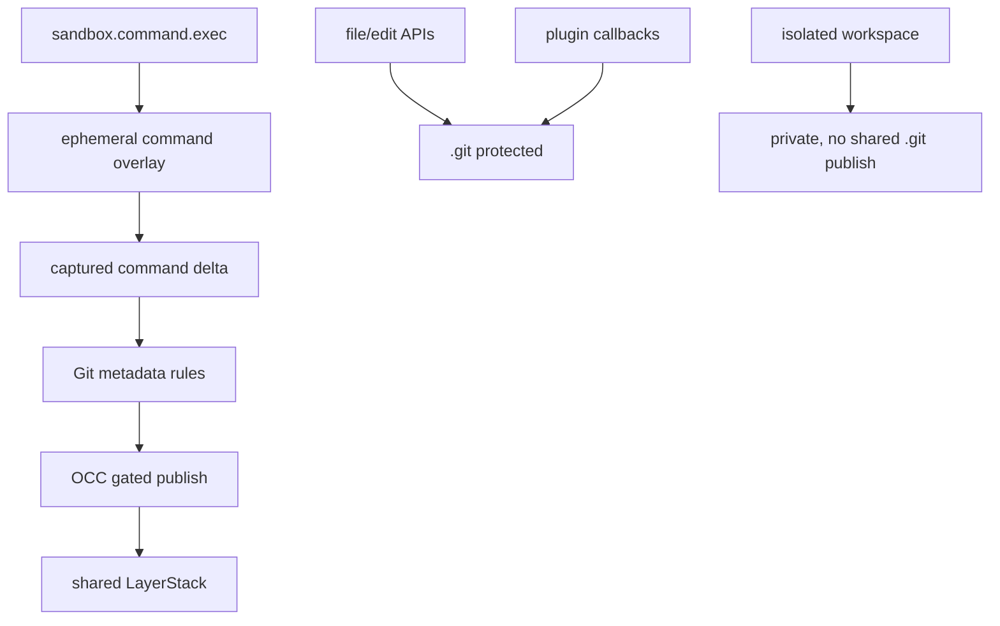

# Command Git Metadata OCC Rules

## Purpose

Define the architecture rules for Git metadata changes produced by
`sandbox.command.exec`.

Agents must be able to use normal Git commands from the command surface:
`git add`, `git commit`, `git commit --amend`, clean `git revert`, clean
`git cherry-pick`, clean squash commits, and clean completed rebase/squash
flows. These workflows are valid when the final repository state is complete and
healthy.

The architecture does not make `.git` generally mutable. It creates one narrow
rule: command-produced Git metadata may publish through OCC only when it is
non-destructive, complete, and conflict-checked.

## Architecture Boundary

The command surface is the only shared publish source that may carry `.git`
metadata. Direct file/edit APIs, plugin callbacks, and isolated workspaces do not
gain a general `.git` write capability.

## Core Invariants

1. `.git` is repository state, not ordinary workspace content.
2. Command Git metadata is allowed only when the final repository is healthy.
3. Destructive Git metadata changes are forbidden.
4. All accepted `.git` changes publish through OCC as gated paths.
5. `.gitignore` never makes `.git` direct or ungated.
6. A command publishes normal files and Git metadata atomically.
7. A rejected command publishes nothing; rollback is the discarded overlay.
8. Half-completed Git operations are not durable shared state.

## Source Policy

| Source | `.git` rule |
| --- | --- |
| `sandbox.command.exec` in ephemeral mode | May publish validated `.git` metadata through gated OCC. |
| `sandbox.file.write` and `sandbox.file.edit` | Must reject or drop `.git` paths. |
| Plugin OCC callbacks | Must reject or drop `.git` paths unless a future explicit plugin contract opts in. |
| Isolated workspace commands | Keep `.git` changes private; do not publish to the shared LayerStack. |
| `sandbox.checkpoint.commit_to_git` | Separate operator checkpoint path; not the command Git architecture. |

## Ignore Rule Architecture

OCC routing has an ignore-rule lane for ordinary non-Git workspace paths. That
lane is based on `.gitignore` pattern semantics, but it is not based on Git
repository state.

| Question | Rule |
| --- | --- |
| Are nested `.gitignore` files considered? | Yes. `.gitignore` files under workspace subdirectories apply to their own subtree. |
| Are `.gitignore` files from newer LayerStack layers considered? | Yes. The active merged LayerStack view is the source of truth. |
| Does OCC shell out to `git check-ignore`? | No. OCC routing must not depend on a Git subprocess. |
| Does OCC use the Git index, tracked/untracked state, or `git status`? | No. OCC routing is independent of Git repository state. |
| Does OCC use `.gitignore` syntax? | Yes. The route oracle uses `.gitignore` pattern semantics for non-`.git` paths. |
| Can `.gitignore` affect `.git` metadata? | No. `.git` metadata is handled by the Git metadata rules before ordinary ignore routing. |

The architecture is therefore a LayerStack-aware ignore oracle: it reads
`.gitignore` content from the active LayerStack view, including ancestor and
nested subtree rules, and applies those rules without invoking Git. This preserves
Git-compatible ignore behavior for generated/cache paths while keeping OCC
independent from local checkout state and Git index state.

## Git State Lanes

| Lane | Examples | Rule |
| --- | --- | --- |
| Repository identity | `.git/HEAD`, `.git/config`, `.git/commondir`, `.git/gitdir` | Writes are allowed only if final repo health passes; deletes are forbidden. |
| Index state | `.git/index` | Writes are allowed; deletes and lock leftovers are forbidden. |
| Object database | `.git/objects/**` | New object writes are allowed; object deletion is forbidden. |
| References | `.git/refs/**`, `.git/packed-refs` | Writes are allowed; deletes are forbidden unless a future rule explicitly supports ref deletion safely. |
| Reflogs | `.git/logs/**` | Writes are allowed; destructive replacement is forbidden. |
| Operation messages | `.git/COMMIT_EDITMSG`, `.git/MERGE_MSG` | Allowed when no incomplete operation markers remain. |
| Operation control state | `.git/CHERRY_PICK_HEAD`, `.git/REVERT_HEAD`, `.git/MERGE_HEAD`, `.git/sequencer/**`, `.git/rebase-merge/**`, `.git/rebase-apply/**` | Must not remain after a published command. |
| Locks | `.git/**/*.lock` | Must not remain after a published command. |
| Hooks | `.git/hooks/**` | Forbidden for shared publish. |

## Allowed Final States

These command outcomes are valid when the command exits successfully, no
incomplete operation markers remain, no lock files remain, and repository health
checks pass:

| Workflow | Shared-state interpretation |
| --- | --- |
| `git add . && git commit -m ...` | Normal commit: object, index, ref, HEAD/log updates are allowed. |
| `git commit --amend` | Ref/log rewrite with a new commit object is allowed. |
| clean `git revert --no-edit <sha>` | A new commit that reverses content is allowed. |
| clean `git cherry-pick <sha>` | A new commit from another history point is allowed. |
| `git merge --squash ... && git commit -m ...` | Squash result is allowed as a normal final commit. |
| clean completed rebase/squash inside one command | Allowed only if no rebase or sequencer state remains. |

The contract allows Git history-changing workflows when they end in a coherent
repository. It does not require the sandbox to understand Git intent; it requires
the final metadata state to be non-destructive and healthy.

## Forbidden Final States

The shared LayerStack must not accept a command result containing:

| State | Reason |
| --- | --- |
| `.git` root deletion or opaque replacement | Destroys repository identity. |
| Deleted Git objects | Can corrupt reachable history. |
| Deleted refs, `HEAD`, index, config, packed refs, shallow metadata, or commondir/gitdir files | Can orphan history or break repository resolution. |
| Lock files | Indicates interrupted Git mutation. |
| Remaining merge, revert, cherry-pick, bisect, sequencer, or rebase state | Requires a later human or agent continuation and is not an atomic final state. |
| Hook writes | Adds hidden future command execution behavior. |
| Devices, sockets, FIFOs, or unsupported special files under `.git` | Not normal Git metadata. |
| A repository that fails Git health validation | Would publish broken shared state. |

## OCC Rules

All accepted `.git` paths use the gated OCC lane.

| Rule | Consequence |
| --- | --- |
| `.git` is never direct | `.gitignore` cannot bypass conflict checks for Git metadata. |
| command publish is atomic | normal file changes and Git metadata publish together or not at all. |
| same ref/index/control-file races conflict | two agents cannot last-writer-wins the same branch or index state. |
| new object paths may start absent | object creation is valid when the base path did not exist. |
| same object path with different content is invalid | Git object identity makes this a hard corruption signal. |
| validation failure rejects the whole command publish | partial normal-file publish is not allowed after Git metadata failure. |

## Rollback Rule

Rejected Git metadata is not repaired in place.

When a command produces destructive or incomplete Git state:

1. The shared LayerStack remains unchanged.
2. The command response reports a Git metadata conflict or protection failure.
3. The ephemeral overlay is discarded.
4. Later commands observe the previous healthy shared repository.

This is the restore model: transaction rollback, not automatic repair layers.

## Architectural Ownership

| Owner | Responsibility |
| --- | --- |
| Command finalization | Classifies command-produced Git metadata and rejects destructive or incomplete final states. |
| OCC publish path | Enforces gated conflict checking and atomic publish. |
| LayerStack | Stores accepted layers and projects healthy state; it does not infer Git intent. |
| File/edit APIs | Preserve `.git` protection outside command capture. |
| Plugin callbacks | Preserve `.git` protection unless a future contract explicitly adds a Git-aware mode. |
| Isolated workspaces | Keep private Git mutations private. |

## Acceptance Criteria

A conforming implementation must satisfy these externally visible rules:

- command `git add . && git commit -m ...` creates a durable commit visible to a
  later command.
- command `git commit --amend` creates a durable amended commit when clean.
- command clean `git revert` publishes when clean.
- command clean `git cherry-pick` publishes when clean.
- command clean squash flow publishes when clean.
- command conflicting cherry-pick or revert does not publish shared state.
- command `rm -rf .git` does not damage the shared repository.
- command leaving `.git/**/*.lock` does not publish shared state.
- command writing Git hooks does not publish shared state.
- direct file/edit writes to `.git` remain rejected or dropped.
- `.gitignore` never causes `.git` metadata to bypass OCC.
- nested `.gitignore` files under subdirectories affect only their subtree.
- `.gitignore` files published in newer LayerStack layers affect later OCC
  routing.
- OCC ignore routing does not call `git`, read the Git index, or depend on
  tracked/untracked state.
- concurrent command commits against the same ref produce conflict behavior, not
  last-writer-wins shared metadata.

## Open Policy Decisions

- Durable staged-only state: decide whether `git add` without a commit should be
  valid shared state or rejected as an incomplete workflow.
- Ref deletion: decide whether deliberate branch/tag deletion should ever be
  supported, and if so under which explicit command contract.
- Git GC and pruning: keep object deletion forbidden until a separate rule proves
  reachable object safety.
- Multi-command conflict resolution: use isolated workspaces or a future explicit
  Git transaction/session model if durable incomplete Git operations become
  required.
